# 바이브 코딩 1인 창업 3시간 통합본 — 실전 가이드

> **영상 제목**: 이 영상이 당신 인생을 바꿉니다. 바이브 코딩 1인 창업 3시간 통합본  
> **채널**: 조코딩 JoCoding (유튜버 조동근)  
> **YouTube**: https://www.youtube.com/watch?v=P3jFI-VpyLg  
> **관련 도서**: 조코딩의 바이브 코딩 1인 창업 with 클로드 코드, 수파베이스, 스트라이프 (한빛미디어, 2026.05.25)

---

## 0. 페르소나 설정

바이브 코딩 1인 창업에 도전하기 전, **"나는 누구이고 누구를 위해 만드는가"** 를 먼저 정의해야 한다.

### 0-1. 창업자 페르소나 (나 자신)

| 항목 | 질문 | 작성 예시 |
|------|------|-----------|
| **배경** | 현재 직업/전공은? | 마케팅 직장인, 비개발자 |
| **기술 수준** | 코딩 경험이 있는가? | HTML 약간 / 전혀 없음 |
| **목표** | 왜 1인 창업을 하려는가? | 월 $1,000 사이드 수익 / 퇴사 후 독립 |
| **시간** | 하루 투입 가능 시간? | 평일 2시간, 주말 5시간 |
| **자금** | 초기 투자 가능 금액? | 0원(무료 도구만) / 월 $50 이내 |
| **강점** | 남들보다 잘 아는 분야? | 패션, 요리, 여행, 영어교육 등 |

### 0-2. 사용자 페르소나 (고객)

> **프롬프트 예시** — AI에게 페르소나 생성 요청:
> ```
> 나는 AI 패션 추천 서비스를 만들려고 합니다.
> 이 서비스의 타겟 사용자 페르소나를 3개 만들어주세요.
> 각 페르소나에 이름, 나이, 직업, 고민, 원하는 해결책,
> 기꺼이 지불할 금액을 포함해주세요.
> ```

**결과 예시:**

| 페르소나 | 이름 | 나이 | 직업 | 핵심 고민 | 지불 의향 |
|----------|------|------|------|-----------|-----------|
| A | 민지 | 28 | 신입사원 | 출근룩 매일 고민 | 월 $5~10 |
| B | James | 35 | 원격근무 개발자 | 소개팅 옷 추천 | 건당 $3 |
| C | Yuki | 22 | 대학생 | 저예산 트렌드 | 광고 시청(무료) |

### 0-3. 페르소나 공감 지도 (Empathy Map)

각 사용자 페르소나에 대해 **공감 지도**를 작성하면 서비스 설계 방향이 명확해진다.

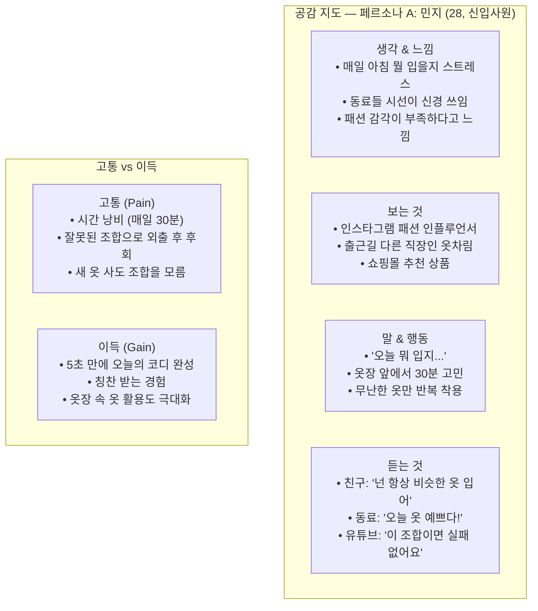

> **프롬프트 예시** — 공감 지도 생성:
> ```
> 다음 페르소나에 대한 공감 지도(Empathy Map)를 만들어주세요.
> 
> 페르소나: 민지, 28세, 신입사원
> 고민: 매일 아침 출근 옷 고르기가 스트레스
>
> 아래 4가지 영역으로 정리해주세요:
> 1. 생각 & 느낌 (Think & Feel)
> 2. 보는 것 (See)
> 3. 말 & 행동 (Say & Do)
> 4. 듣는 것 (Hear)
> 그리고 Pain(고통)과 Gain(이득)도 3가지씩 정리해주세요.
> ```

### 0-4. 페르소나 기반 서비스 방향 결정

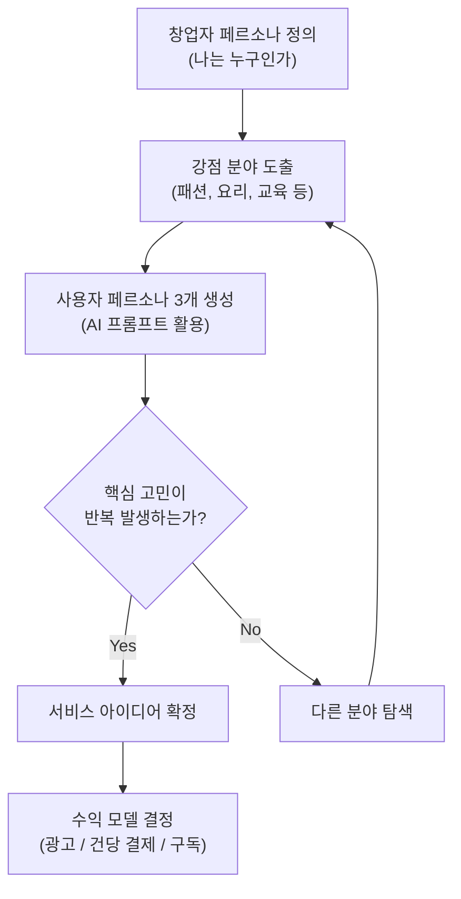

---

## 1. 벤치마킹 — 성공 사례 분석

### 1-1. 1인 바이브 코딩 창업 성공 사례

| 서비스 | 창업자 | 사용 기술 | 수익 모델 | 성과 |
|--------|--------|-----------|-----------|------|
| **PhotoAI** | Pieter Levels | AI + 웹 | 구독 | 월 $100K+ |
| **RemoteOK** | Pieter Levels | HTML/JS | 채용광고 | 월 $50K+ |
| **Carrd** | AJ | 정적 사이트 | 프리미엄 구독 | 월 $1M+ ARR |
| **Tally** | Marie & Filip | 노코드+코드 | 프리미엄 | 수만 고객 |
| **TypingMind** | Tony Dinh | React | 일회성 결제 | 월 $30K+ |

### 1-2. 벤치마킹 분석 프레임워크

> **프롬프트 예시** — 벤치마킹 분석 요청:
> ```
> [서비스명]을 벤치마킹 분석해주세요.
> 아래 항목을 표로 정리해주세요:
> 1. 핵심 가치 제안 (어떤 문제를 해결하는가)
> 2. 수익 모델 (어떻게 돈을 버는가)
> 3. 기술 스택 (무엇으로 만들었는가)
> 4. 마케팅 채널 (어떻게 사용자를 모으는가)
> 5. 차별화 포인트 (경쟁자 대비 강점)
> 6. 내가 따라할 수 있는 요소
> 7. 내가 다르게 할 요소
> ```

### 1-3. 벤치마킹 분석 구체 예시 — AI 패션 추천 서비스

> 아래는 "AI 패션 추천 서비스"를 만들 때 실제 경쟁 서비스를 분석한 예시이다.

| 분석 항목 | **Stitch Fix** | **Lookiero** | **Acloset** | **내 서비스 (계획)** |
|-----------|---------------|-------------|------------|---------------------|
| 핵심 가치 | AI + 스타일리스트 추천 | 유럽 타겟 박스 배송 | 옷장 관리 앱 | AI 즉시 코디 추천 |
| 수익 모델 | 스타일링 수수료 $20 | 박스 구독 | 프리미엄 구독 | 월 $9.99 구독 |
| 기술 스택 | 자체 ML 플랫폼 | Python + ML | React Native | React + OpenAI API |
| 약점 | 비싸다, 미국 중심 | 배송 필요, 느림 | AI 추천 없음 | 실물 옷 없음 |
| 내가 따라할 점 | AI 추천 알고리즘 | 유럽 시장 관점 | 옷장 관리 UX | - |
| 내가 다르게 할 점 | 실물 배송 불필요 | 즉시 결과 | AI 추천 추가 | - |

#### 차별화 포인트 도출 알고리즘

```
Step 1. 경쟁 서비스 3~5개의 리뷰/평점 분석
  → 1점 리뷰에서 반복되는 불만 키워드 추출
  → 예: "느리다", "비싸다", "한국 스타일 없다"

Step 2. 불만 키워드를 내 서비스의 강점으로 변환
  → "느리다" → 즉시 AI 추천 (5초 이내)
  → "비싸다" → 무료 체험 + 저가 구독 ($9.99/월)
  → "한국 스타일 없다" → K-패션 특화

Step 3. 킬러 피처 1개 선정
  → "사진 찍으면 3초 만에 코디 완성" 
  → 이것이 랜딩 페이지 헤드라인이 된다
```

### 1-4. 벤치마킹 → 차별화 전략 도출

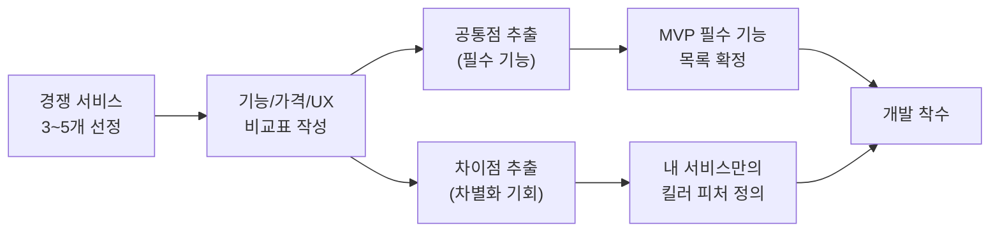

---

## 2. 전체 개발 플로우 — 개발-테스트 반복 사이클

### 2-1. 5주 전체 로드맵

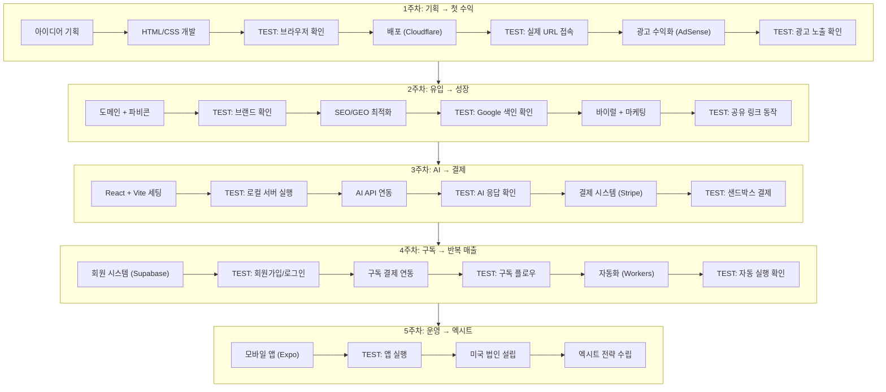

### 2-2. 개발-테스트 반복 원칙

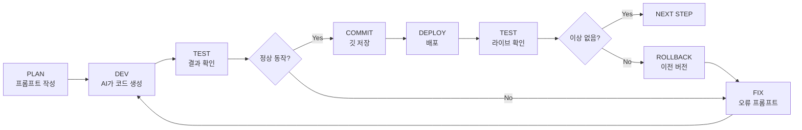

**핵심 규칙:**
- 한 번에 하나의 기능만 개발
- 기능 완성 즉시 테스트
- 테스트 통과 후 즉시 커밋
- 배포 후 라이브에서 재확인
- 문제 발생 시 이전 커밋으로 롤백

---

## 3. STEP 1 — 웹 기초 & 첫 수익 (1주차)

### 3-1. 아이디어 기획

#### 프롬프트 ① 아이디어 브레인스토밍

```
나는 [본인 강점 분야]에 관심이 많은 1인 창업자입니다.
바이브 코딩으로 만들 수 있는 웹 서비스 아이디어를 10개 제안해주세요.
각 아이디어에 대해:
- 서비스 한 줄 설명
- 타겟 사용자
- 수익 모델 (광고/결제/구독)
- 난이도 (상/중/하)
- 예상 월 수익 범위
를 표로 정리해주세요.
```

#### 프롬프트 ② 아이디어 검증

```
[선택한 아이디어]에 대해 다음을 분석해주세요:
1. 이미 존재하는 유사 서비스 5개와 비교
2. 내 서비스가 가질 수 있는 차별점
3. MVP에 반드시 필요한 핵심 기능 3가지
4. 있으면 좋지만 나중에 추가할 기능 3가지
5. 예상되는 가장 큰 리스크와 대응 방안
```

### 3-2. HTML/CSS 웹 페이지 개발

#### 개발-테스트 사이클 ①: 기본 페이지 생성

| 단계 | 행동 | 확인 사항 |
|------|------|-----------|
| **DEV** | AI에게 프롬프트로 코드 생성 | index.html 파일 생성됨 |
| **TEST** | 브라우저에서 파일 열기 | 레이아웃, 텍스트, 이미지 정상 |
| **FIX** | 수정 프롬프트 전달 | 변경사항 반영됨 |
| **TEST** | 새로고침 | 수정 반영 확인 |

#### 프롬프트 ③ 로또 번호 추첨 사이트 생성

```
로또 번호 추첨 웹사이트를 HTML, CSS, JavaScript로 만들어주세요.

요구사항:
- 1~45 중 랜덤 6개 번호 + 보너스 1개 표시
- 번호를 동그란 공 모양으로 표시 (번호 범위별 색상 다르게)
- "추첨하기" 버튼 클릭 시 애니메이션과 함께 번호 표시
- 이전 추첨 기록 5개까지 보여주기
- 반응형 디자인 (모바일 대응)
- 단일 index.html 파일로 작성
```

**예상 결과:**
- `index.html` 파일 1개 생성
- 브라우저에서 바로 실행 가능
- 번호 범위별 색상 구분 (1~10 노랑, 11~20 파랑 등)

#### 코드 예시 — 로또 번호 추첨 알고리즘 (JavaScript)

```javascript
// 로또 번호 추첨 핵심 알고리즘
function drawLotto() {
  const numbers = [];
  
  // 1~45에서 중복 없이 7개 뽑기 (6개 + 보너스 1개)
  while (numbers.length < 7) {
    const num = Math.floor(Math.random() * 45) + 1;
    if (!numbers.includes(num)) {
      numbers.push(num);
    }
  }
  
  // 앞 6개는 정렬, 마지막 1개는 보너스
  const main = numbers.slice(0, 6).sort((a, b) => a - b);
  const bonus = numbers[6];
  
  return { main, bonus };
}

// 번호 범위별 색상 매핑
function getColor(num) {
  if (num <= 10) return '#FBC400'; // 노랑
  if (num <= 20) return '#69C8F2'; // 파랑
  if (num <= 30) return '#FF7272'; // 빨강
  if (num <= 40) return '#AAAAAA'; // 회색
  return '#B0D840';                // 초록
}

// 추첨 기록 관리 (최대 5개)
const history = [];
function addToHistory(result) {
  history.unshift(result);        // 앞에 추가
  if (history.length > 5) {
    history.pop();                // 5개 초과 시 마지막 제거
  }
}
```

#### 코드 예시 — 기본 HTML 구조

```html
<!DOCTYPE html>
<html lang="ko">
<head>
  <meta charset="UTF-8">
  <meta name="viewport" content="width=device-width, initial-scale=1.0">
  <title>AI 로또 번호 추첨기</title>
  <style>
    * { margin: 0; padding: 0; box-sizing: border-box; }
    body { font-family: 'Pretendard', sans-serif; background: #f5f5f5; 
           display: flex; justify-content: center; min-height: 100vh; }
    .container { max-width: 480px; width: 100%; padding: 20px; }
    .ball { width: 48px; height: 48px; border-radius: 50%; 
            display: inline-flex; align-items: center; justify-content: center;
            color: white; font-weight: bold; margin: 4px;
            box-shadow: 0 2px 8px rgba(0,0,0,0.2); }
    button { background: #4CAF50; color: white; border: none;
             padding: 16px 32px; font-size: 18px; border-radius: 8px;
             cursor: pointer; width: 100%; margin: 20px 0; }
    button:hover { background: #45a049; }
    .history { margin-top: 20px; }
    .history-item { background: white; padding: 12px; 
                    border-radius: 8px; margin: 8px 0; }
  </style>
</head>
<body>
  <div class="container">
    <h1>로또 번호 추첨기</h1>
    <div id="result"></div>
    <button onclick="draw()">추첨하기</button>
    <div class="history" id="history"></div>
  </div>
  <script>
    // 위의 JavaScript 알고리즘이 여기에 들어간다
  </script>
</body>
</html>
```

> **바이브 코딩 핵심**: 위 코드를 직접 작성할 필요 없다. 
> 프롬프트 ③을 AI에게 전달하면 이런 구조의 완성된 코드가 생성된다.
> 생성된 코드를 브라우저에서 열어 테스트하고, 마음에 안 드는 부분만 
> 추가 프롬프트로 수정 요청하면 된다.

#### 테스트 체크리스트

- [ ] 버튼 클릭 시 6개 번호 + 보너스 번호 표시
- [ ] 번호가 1~45 범위 내인지 확인
- [ ] 중복 번호 없는지 확인
- [ ] 모바일 화면에서 레이아웃 깨지지 않는지 확인
- [ ] 추첨 기록이 5개까지 쌓이는지 확인

### 3-3. 배포 (Cloudflare Pages)

#### 개발-테스트 사이클 ②: 배포

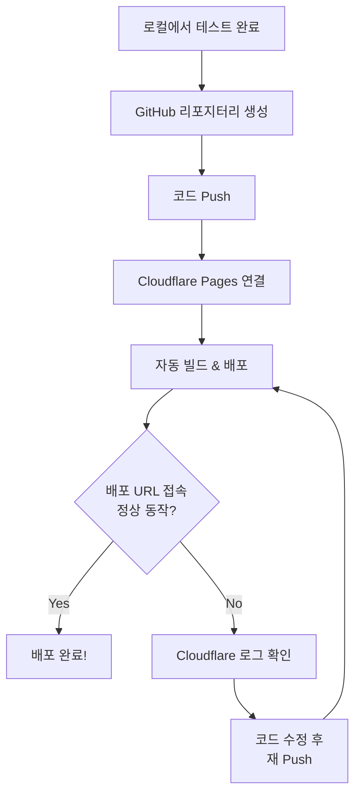

#### 프롬프트 ④ 배포 트러블슈팅

```
Cloudflare Pages에 HTML 사이트를 배포했는데 [에러 메시지]가 발생합니다.
프로젝트 구조는 다음과 같습니다:
/
├── index.html
├── style.css
└── script.js

원인과 해결 방법을 단계별로 알려주세요.
```

#### 배포 명령어 실전 예시

```bash
# 1. GitHub 리포지터리 생성 및 코드 push
git init
git add .
git commit -m "Initial commit: 로또 번호 추첨기"
git branch -M main
git remote add origin https://github.com/[유저명]/lotto-app.git
git push -u origin main

# 2. Cloudflare Pages에서 연결 (웹 대시보드에서 수행)
#    - dash.cloudflare.com → Pages → Create a project
#    - Connect to Git → GitHub 리포지터리 선택
#    - Build settings: 
#      Framework preset: None
#      Build command: (비워두기)
#      Build output directory: /
#    - Save and Deploy 클릭

# 3. 배포 완료 후 확인
curl -I https://lotto-app.pages.dev
# HTTP/2 200 이 나오면 성공
```

#### 배포 후 수정 → 재배포 사이클

```bash
# 코드 수정 후 재배포 (이 3줄이 전부)
git add .
git commit -m "버튼 색상 변경 및 모바일 반응형 수정"
git push

# Cloudflare Pages가 자동으로 감지하여 재배포
# 보통 30초~1분 내 반영
```

#### 배포 테스트 체크리스트

- [ ] `https://[프로젝트명].pages.dev` 접속 가능
- [ ] HTTPS 정상 작동 (자물쇠 아이콘)
- [ ] 모든 리소스 (CSS, JS, 이미지) 로딩 완료
- [ ] 모바일 브라우저에서도 정상 표시
- [ ] 404 에러 페이지 없음

### 3-4. 광고 수익화 (Google AdSense)

#### 프롬프트 ⑤ 애드센스 코드 삽입

```
내 웹사이트에 Google AdSense를 적용하려고 합니다.
현재 index.html 코드는 아래와 같습니다:
[현재 코드 붙여넣기]

다음을 수행해주세요:
1. AdSense 스크립트 태그를 올바른 위치에 삽입
2. 광고 영역을 본문 상단과 하단에 배치
3. 광고가 모바일에서도 깨지지 않도록 반응형 처리
4. 사용자 경험을 해치지 않는 광고 배치 가이드라인 준수
```

#### 애드센스 승인 요건 분석

| 요건 | 세부 내용 | 체크 |
|------|-----------|------|
| **콘텐츠 품질** | 유용하고 독창적인 콘텐츠 10페이지 이상 | [ ] |
| **사이트 네비게이션** | 메뉴, 사이트맵, 검색 기능 | [ ] |
| **필수 페이지** | About, Contact, Privacy Policy | [ ] |
| **도메인 나이** | 최소 1~3개월 운영 권장 | [ ] |
| **트래픽** | 최소 일일 30+ 방문자 권장 | [ ] |
| **디자인** | 전문적이고 깔끔한 레이아웃 | [ ] |

#### 프롬프트 ⑥ 애드센스 승인용 사이트 개선

```
내 웹사이트의 Google AdSense 승인 확률을 높이고 싶습니다.
현재 사이트: [URL]

다음을 만들어주세요:
1. About 페이지 (사이트 소개)
2. Contact 페이지 (문의 폼)
3. Privacy Policy 페이지 (개인정보처리방침)
4. 사이트맵 (sitemap.xml)
5. 헤더 네비게이션 메뉴

모두 한국어와 영어 병기로 작성해주세요.
```

---

## 4. STEP 2 — 유입 & 성장 (2주차)

### 4-1. 데이터 분석 도구 연동

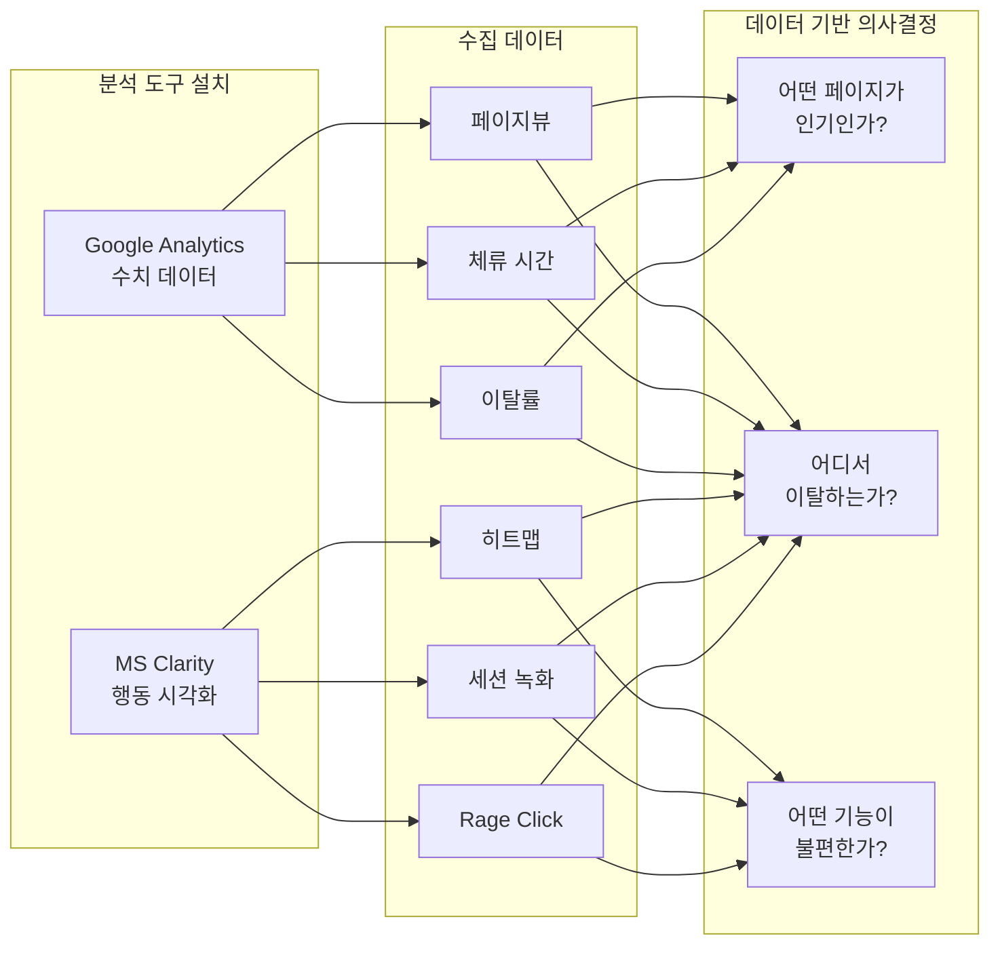

#### 개발-테스트 사이클 ③: GA + Clarity 연동

| 단계 | 행동 | 프롬프트/도구 | 테스트 |
|------|------|---------------|--------|
| **DEV-1** | GA 계정 생성 | Google Analytics 콘솔 | 측정 ID 발급 확인 |
| **DEV-2** | GA 태그 삽입 | 아래 프롬프트 ⑦ | - |
| **TEST-1** | 실시간 보고서 확인 | GA → 실시간 → 개요 | 내 방문 기록 표시 |
| **DEV-3** | Clarity 설치 | clarity.microsoft.com | 프로젝트 생성 확인 |
| **DEV-4** | Clarity 코드 삽입 | `<head>` 내 스크립트 | - |
| **TEST-2** | Clarity 대시보드 | 세션 녹화 재생 | 내 행동 녹화 표시 |
| **DEV-5** | GA-Clarity 연동 | Clarity 설정 | - |
| **TEST-3** | 연동 데이터 확인 | Clarity에서 GA 데이터 | 수치 일치 |

#### 프롬프트 ⑦ 분석 도구 코드 삽입

```
내 웹사이트에 Google Analytics(측정 ID: G-XXXXXXXXXX)와
Microsoft Clarity(프로젝트 ID: XXXXXXXXXX)를 설치하려고 합니다.

현재 index.html의 <head> 부분:
[현재 head 코드]

두 도구의 스크립트를 올바른 순서와 위치에 삽입해주세요.
성능에 영향을 최소화하는 방식으로 작성해주세요.
```

### 4-2. AARRR 퍼널 & PMF

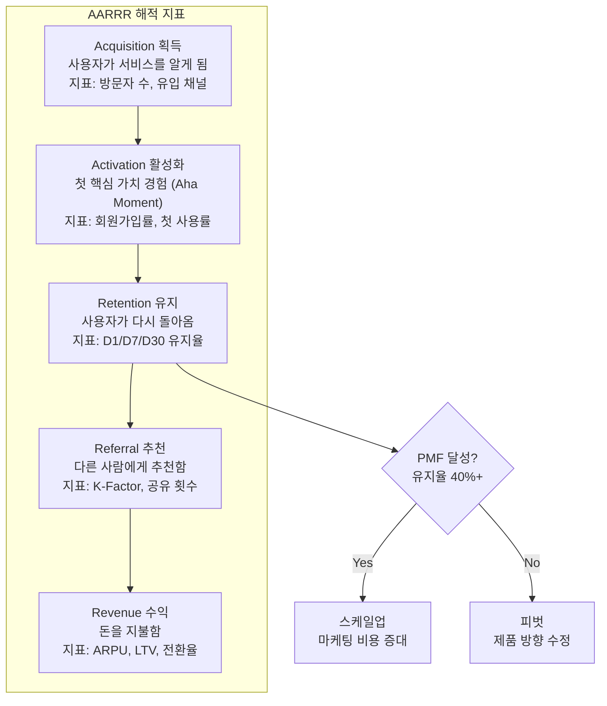

#### Carrying Capacity 계산

```
Carrying Capacity = 일일 신규 유입 / 일일 이탈률

예시:
- 일일 신규 유입: 100명
- 일일 이탈률: 5%
- Carrying Capacity = 100 / 0.05 = 2,000명

→ 아무리 마케팅해도 최대 동시 사용자는 2,000명
→ 성장하려면: 유입을 늘리거나 이탈을 줄여야 함
```

#### Carrying Capacity 시뮬레이션 — 시나리오별 비교

| 시나리오 | 일일 유입 | 이탈률 | Carrying Capacity | 전략 |
|----------|-----------|--------|-------------------|------|
| **현재** | 50명 | 10% | 500명 | 기준선 |
| **마케팅 강화** | 200명 | 10% | 2,000명 | 유입 4x 증가 |
| **이탈 개선** | 50명 | 3% | 1,667명 | 이탈률 1/3 감소 |
| **동시 적용** | 200명 | 3% | 6,667명 | 유입+이탈 동시 개선 |

> 핵심 인사이트: 이탈률 개선이 유입 증가보다 비용 대비 효과가 크다.
> 이탈률 10% → 3%는 UX 개선만으로 가능하지만,
> 유입 50명 → 200명은 마케팅 예산이 4배 필요하다.

#### 성장 시뮬레이션 알고리즘

```javascript
// 서비스 성장 시뮬레이션 (30일)
function simulateGrowth(dailyAcquisition, dailyChurnRate, days = 30) {
  let users = 0;
  const log = [];
  
  for (let day = 1; day <= days; day++) {
    const churned = Math.floor(users * dailyChurnRate);
    users = users - churned + dailyAcquisition;
    log.push({ day, users, churned, acquired: dailyAcquisition });
  }
  
  const carryingCapacity = Math.floor(dailyAcquisition / dailyChurnRate);
  return { log, carryingCapacity, finalUsers: users };
}

// 실행 예시
const result = simulateGrowth(100, 0.05, 30);
// Day 1:  100명 → Day 7:  523명 → Day 30: 1,785명
// Carrying Capacity: 2,000명 (30일 후에도 아직 도달 못 함)
// → 약 60일 후 2,000명 근처에서 안정화
```

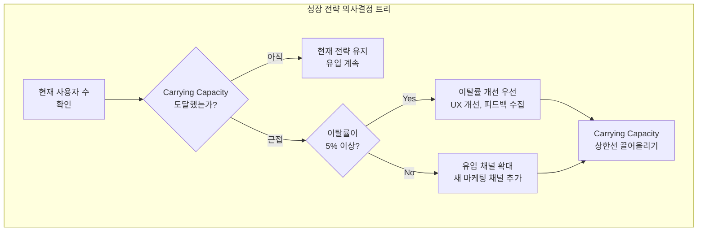

### 4-3. SEO & GEO 최적화

#### 개발-테스트 사이클 ④: SEO 적용

| 단계 | 행동 | 테스트 |
|------|------|--------|
| **DEV** | robots.txt 생성 | 파일 존재 확인 |
| **TEST** | `사이트URL/robots.txt` 접속 | 내용 표시 |
| **DEV** | sitemap.xml 생성 | 파일 존재 확인 |
| **TEST** | `사이트URL/sitemap.xml` 접속 | XML 구조 표시 |
| **DEV** | Google Search Console 등록 | 소유권 인증 |
| **TEST** | URL 검사 도구 | "URL이 Google에 등록됨" |
| **DEV** | 메타 태그 최적화 | 코드 삽입 |
| **TEST** | 소셜 미리보기 테스트 | 카카오톡 공유 시 미리보기 표시 |

#### 프롬프트 ⑧ SEO 최적화

```
내 웹사이트의 SEO를 최적화해주세요.
서비스명: [서비스명]
서비스 설명: [한 줄 설명]
타겟 키워드: [키워드 3~5개]

다음 파일을 생성하거나 수정해주세요:
1. robots.txt
2. sitemap.xml
3. 각 페이지의 meta 태그 (title, description, og:tags)
4. 구조화된 데이터 (JSON-LD)
5. canonical URL 설정
```

#### 프롬프트 ⑨ GEO (생성형 AI 검색 최적화)

```
내 웹사이트가 ChatGPT, Perplexity 등 AI 검색에서
잘 노출되도록 GEO 최적화를 해주세요.

다음을 수행해주세요:
1. llms.txt 파일 생성 (AI 크롤러용 안내 파일)
2. FAQ 섹션을 Q&A 형태로 구조화
3. 명확한 정의와 설명이 포함된 콘텐츠 구조
4. 인용 가능한 통계/데이터 포함
5. 전문가 신뢰도를 높이는 About 페이지 보강
```

#### 코드 예시 — robots.txt

```
# robots.txt
User-agent: *
Allow: /
Disallow: /api/
Disallow: /admin/

Sitemap: https://my-fashion-ai.com/sitemap.xml
```

#### 코드 예시 — sitemap.xml

```xml
<?xml version="1.0" encoding="UTF-8"?>
<urlset xmlns="http://www.sitemaps.org/schemas/sitemap/0.9">
  <url>
    <loc>https://my-fashion-ai.com/</loc>
    <lastmod>2026-07-20</lastmod>
    <changefreq>weekly</changefreq>
    <priority>1.0</priority>
  </url>
  <url>
    <loc>https://my-fashion-ai.com/pricing</loc>
    <lastmod>2026-07-15</lastmod>
    <changefreq>monthly</changefreq>
    <priority>0.8</priority>
  </url>
  <url>
    <loc>https://my-fashion-ai.com/about</loc>
    <lastmod>2026-07-01</lastmod>
    <changefreq>monthly</changefreq>
    <priority>0.5</priority>
  </url>
</urlset>
```

#### 코드 예시 — OG 메타 태그 + 구조화 데이터

```html
<head>
  <!-- 기본 메타 -->
  <title>AI 패션 추천 - 3초 만에 오늘의 코디 완성</title>
  <meta name="description" content="AI가 당신의 체형, 상황, 취향을 분석하여 
    최적의 코디를 추천합니다. 매일 아침 옷 고르는 스트레스에서 해방되세요.">
  
  <!-- Open Graph (소셜 미리보기) -->
  <meta property="og:title" content="AI 패션 추천 - 3초 코디 완성">
  <meta property="og:description" content="AI가 분석한 나만의 코디 추천">
  <meta property="og:image" content="https://my-fashion-ai.com/og-image.png">
  <meta property="og:url" content="https://my-fashion-ai.com">
  <meta property="og:type" content="website">
  
  <!-- Twitter Card -->
  <meta name="twitter:card" content="summary_large_image">
  <meta name="twitter:title" content="AI 패션 추천 - 3초 코디 완성">
  <meta name="twitter:image" content="https://my-fashion-ai.com/og-image.png">
  
  <!-- 구조화 데이터 (JSON-LD) -->
  <script type="application/ld+json">
  {
    "@context": "https://schema.org",
    "@type": "WebApplication",
    "name": "AI 패션 추천",
    "description": "AI 기반 개인 맞춤 패션 코디 추천 서비스",
    "url": "https://my-fashion-ai.com",
    "applicationCategory": "LifestyleApplication",
    "offers": {
      "@type": "Offer",
      "price": "0",
      "priceCurrency": "USD",
      "description": "무료 체험 가능 (일 3회)"
    }
  }
  </script>
</head>
```

#### 코드 예시 — llms.txt (GEO 최적화)

```
# AI Fashion Recommender

## About
AI Fashion Recommender is a web service that provides personalized 
outfit recommendations using artificial intelligence. Users input 
their gender, age, occasion, and style preference to receive 
3 curated outfit suggestions in under 5 seconds.

## Key Features
- Instant AI-powered outfit recommendations
- Support for multiple occasions (work, date, casual, formal)
- Personalized to user's age, gender, and style preference
- Available in Korean, English, and Japanese

## Pricing
- Free: 3 recommendations per day
- Pro ($9.99/month): Unlimited recommendations
- Premium ($19.99/month): Unlimited + saved history

## Technical Details
- Built with React, Cloudflare Workers, and OpenAI API
- Available at: https://my-fashion-ai.com
- API documentation: https://my-fashion-ai.com/docs
```

#### SEO vs GEO 비교

| 항목 | SEO | GEO |
|------|-----|-----|
| **대상** | Google, Bing 등 검색 엔진 | ChatGPT, Perplexity 등 AI |
| **목표** | 검색 결과 상위 노출 | AI 답변에 인용/추천 |
| **핵심 전략** | 키워드, 백링크, 메타 태그 | 구조화된 정보, 명확한 답변 |
| **핵심 파일** | robots.txt, sitemap.xml | llms.txt |
| **성과 측정** | Search Console 순위 | AI 검색에서 직접 확인 |
| **시간 프레임** | 2~6개월 | 즉시~2주 |

### 4-4. 바이럴 구조 & 마케팅

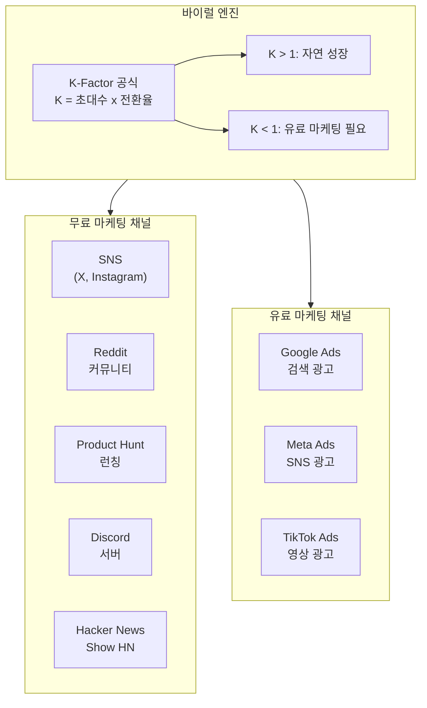

#### 프롬프트 ⑩ 공유 기능 구현

```
내 웹사이트에 소셜 미디어 공유 기능을 추가해주세요.

요구사항:
1. 결과 페이지에 "공유하기" 버튼 추가
2. 지원 플랫폼: 카카오톡, X(트위터), Facebook, 링크 복사
3. 공유 시 미리보기 이미지와 설명이 포함되도록 OG 태그 설정
4. 공유 횟수를 카운트하는 기능 (선택)
5. 모바일에서 네이티브 공유 시트 활용 (Web Share API)
```

#### 마케팅 런칭 실전 시나리오 — 30일 플랜

| 일차 | 채널 | 행동 | 예상 유입 | 비용 |
|------|------|------|-----------|------|
| **D-7** | 사전 준비 | 랜딩 페이지 완성, OG 태그 설정 | - | $0 |
| **D-1** | X(트위터) | 티저 게시글 + 스크린샷 | 50명 | $0 |
| **D-Day** | Product Hunt | 런칭 게시 | 200~500명 | $0 |
| **D-Day** | Reddit | r/SideProject, r/webdev 게시 | 100~300명 | $0 |
| **D+1** | Hacker News | Show HN 게시 | 50~1,000명 | $0 |
| **D+3** | Discord | 관련 서버 소개 | 30~50명 | $0 |
| **D+7** | X(트위터) | 사용자 후기 리트윗 | 20~50명 | $0 |
| **D+14** | Google Ads | 검색 광고 시작 (테스트) | 50~100명/일 | $5~10/일 |
| **D+21** | 블로그/SEO | SEO 콘텐츠 3개 발행 | 점진적 증가 | $0 |
| **D+30** | 분석 | GA 데이터 기반 전략 조정 | - | - |

#### Product Hunt 런칭 프롬프트

```
Product Hunt에 런칭할 때 필요한 자료를 만들어주세요.

서비스명: AI Fashion Recommender
한 줄 소개: Get AI-powered outfit recommendations in 3 seconds

다음을 작성해주세요:
1. Tagline (60자 이내, 영어)
2. Description (300자, 영어)
3. 첫 번째 코멘트 (Maker Comment, 자기소개 + 개발 비하인드)
4. 스크린샷 구성 가이드 (3~5장, 어떤 화면을 캡처할지)
5. 업보트를 유도하는 X(트위터) 게시글
```

#### 수익 시뮬레이션 — 6개월 프로젝션

```
가정:
- 런칭 후 일일 방문자: 100명 (점진적 증가)
- 무료→유료 전환율: 3%
- 월 구독료: $9.99
- 이탈률: 월 8%
- API 비용: 요청당 $0.001

월별 예측:
┌────────┬────────┬─────────┬──────────┬──────────┬──────────┐
│  월    │ MAU    │ 유료    │ 월 매출  │ API 비용 │ 순이익   │
├────────┼────────┼─────────┼──────────┼──────────┼──────────┤
│ 1개월  │   800  │    24   │  $239.76 │   $7.20  │ $212.56  │
│ 2개월  │  1,500 │    52   │  $519.48 │  $15.60  │ $473.88  │
│ 3개월  │  2,500 │    89   │  $889.11 │  $26.70  │ $822.41  │
│ 4개월  │  3,800 │   138   │ $1,378.6 │  $41.40  │ $1,277.2 │
│ 5개월  │  5,000 │   192   │ $1,918.1 │  $57.60  │ $1,780.5 │
│ 6개월  │  6,500 │   251   │ $2,507.5 │  $75.30  │ $2,332.2 │
└────────┴────────┴─────────┴──────────┴──────────┴──────────┘

6개월 누적 순이익: ~$6,898
손익분기점: 약 1개월차 (Claude Code $20/월 + 도메인 $10/년)
```

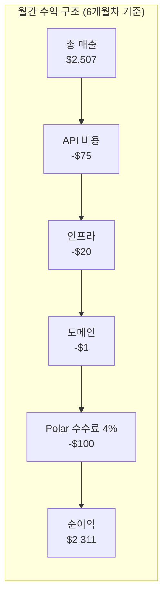

---

## 5. STEP 3 — AI 서비스 & 결제 (3주차)

### 5-1. 기술 아키텍처

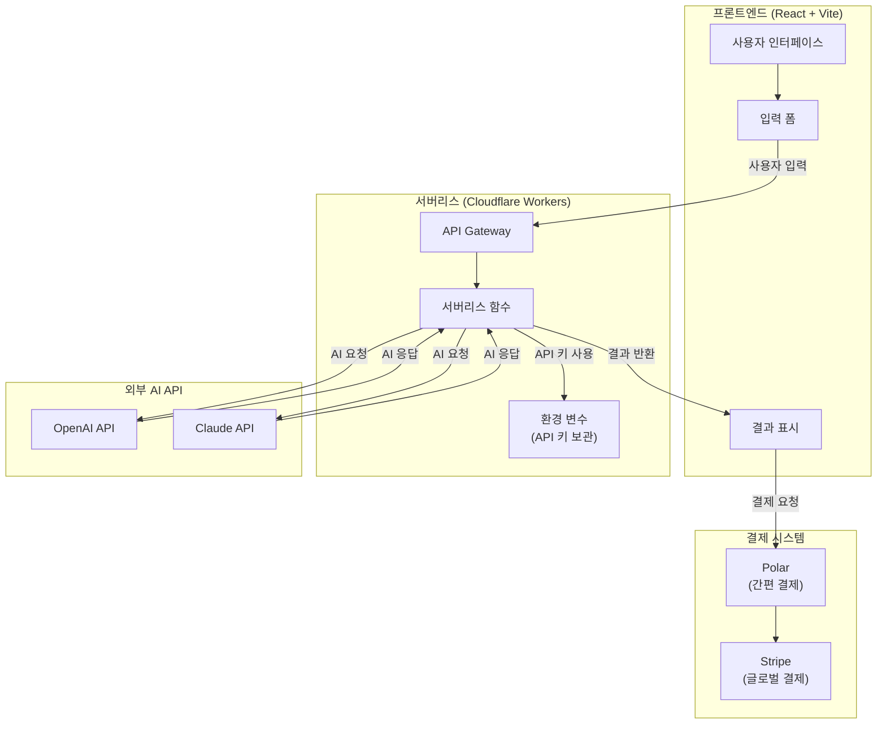

### 5-2. React + Vite 프로젝트 세팅

#### 개발-테스트 사이클 ⑤: 프로젝트 초기화

| 단계 | 명령어/프롬프트 | 테스트 |
|------|-----------------|--------|
| **DEV-1** | `npm create vite@latest my-app -- --template react` | 폴더 생성 확인 |
| **TEST-1** | `cd my-app && npm install && npm run dev` | `localhost:5173` 접속 → React 로고 표시 |
| **DEV-2** | Claude Code 설치: `npm install -g @anthropic-ai/claude-code` | 설치 완료 |
| **TEST-2** | `claude` 명령어 실행 | Claude Code 인터페이스 표시 |
| **DEV-3** | GitHub 리포지터리 연결 | 원격 저장소 push 완료 |
| **TEST-3** | GitHub 페이지에서 코드 확인 | 파일 목록 표시 |

#### 프롬프트 ⑪ React 프로젝트 구조 생성

```
AI 패션 추천 서비스의 React 프로젝트를 만들어주세요.

프로젝트 구조:
src/
├── components/
│   ├── Header.jsx        (네비게이션)
│   ├── ImageUpload.jsx   (사진 업로드)
│   ├── StyleResult.jsx   (추천 결과)
│   └── PricingCard.jsx   (요금제)
├── pages/
│   ├── Home.jsx          (랜딩 페이지)
│   ├── Analyze.jsx       (분석 페이지)
│   └── Pricing.jsx       (요금제 페이지)
├── App.jsx
└── main.jsx

각 컴포넌트에 기본 UI와 라우팅을 설정해주세요.
react-router-dom을 사용해주세요.
```

### 5-3. AI API 연동

#### 개발-테스트 사이클 ⑥: AI 기능 구현

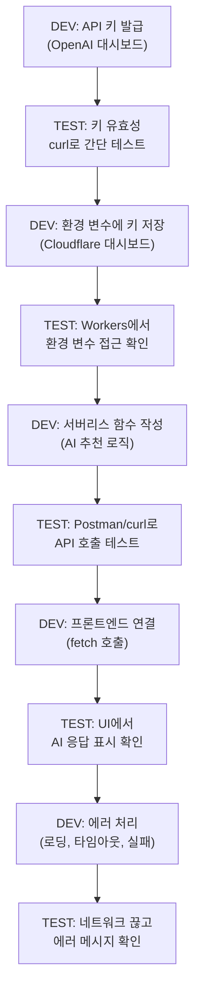

#### 프롬프트 ⑫ AI 추천 서버리스 함수

```
Cloudflare Workers로 AI 패션 추천 API를 만들어주세요.

기능:
1. POST 요청으로 사용자 정보 수신 (성별, 나이, 상황, 선호 스타일)
2. OpenAI API를 호출하여 패션 추천 생성
3. 추천 결과를 JSON으로 반환

요구사항:
- API 키는 환경 변수에서 가져오기
- CORS 설정 포함
- 에러 처리 (API 키 없음, OpenAI 오류, 잘못된 요청)
- 응답 시간 최적화 (스트리밍 고려)
- 요청 제한 (IP당 분당 10회)
```

#### 코드 예시 — Cloudflare Workers AI 추천 함수

```javascript
// functions/api/recommend.js (Cloudflare Pages Functions)
export async function onRequestPost(context) {
  // CORS 헤더 설정
  const corsHeaders = {
    'Access-Control-Allow-Origin': '*',
    'Access-Control-Allow-Methods': 'POST',
    'Access-Control-Allow-Headers': 'Content-Type',
    'Content-Type': 'application/json',
  };

  try {
    // 1. 요청 데이터 파싱
    const { gender, age, occasion, style } = await context.request.json();

    // 2. 입력값 검증
    if (!gender || !age || !occasion) {
      return new Response(
        JSON.stringify({ error: '필수 항목을 모두 입력해주세요.' }),
        { status: 400, headers: corsHeaders }
      );
    }

    // 3. AI 프롬프트 구성
    const prompt = `당신은 전문 패션 스타일리스트입니다.
    다음 조건에 맞는 코디를 3가지 추천해주세요.
    
    - 성별: ${gender}
    - 나이: ${age}세
    - 상황: ${occasion}
    - 선호 스타일: ${style || '특별히 없음'}
    
    각 코디에 대해 다음 형식의 JSON으로 응답해주세요:
    [
      {
        "name": "코디 이름",
        "items": ["상의", "하의", "신발", "액세서리"],
        "reason": "추천 이유 (1~2문장)",
        "budget": "예상 가격대"
      }
    ]`;

    // 4. OpenAI API 호출
    const aiResponse = await fetch('https://api.openai.com/v1/chat/completions', {
      method: 'POST',
      headers: {
        'Authorization': `Bearer ${context.env.OPENAI_API_KEY}`,
        'Content-Type': 'application/json',
      },
      body: JSON.stringify({
        model: 'gpt-4o-mini',
        messages: [{ role: 'user', content: prompt }],
        temperature: 0.8,
        max_tokens: 1000,
      }),
    });

    const data = await aiResponse.json();
    const recommendations = JSON.parse(data.choices[0].message.content);

    // 5. 결과 반환
    return new Response(
      JSON.stringify({ success: true, recommendations }),
      { status: 200, headers: corsHeaders }
    );

  } catch (error) {
    return new Response(
      JSON.stringify({ error: 'AI 추천 생성 중 오류가 발생했습니다.' }),
      { status: 500, headers: corsHeaders }
    );
  }
}
```

#### 코드 예시 — 프론트엔드에서 API 호출

```javascript
// src/pages/Analyze.jsx (React 컴포넌트)
import { useState } from 'react';

export default function Analyze() {
  const [loading, setLoading] = useState(false);
  const [results, setResults] = useState(null);
  const [formData, setFormData] = useState({
    gender: '', age: '', occasion: '', style: ''
  });

  const handleSubmit = async (e) => {
    e.preventDefault();
    setLoading(true);
    
    try {
      const response = await fetch('/api/recommend', {
        method: 'POST',
        headers: { 'Content-Type': 'application/json' },
        body: JSON.stringify(formData),
      });
      
      const data = await response.json();
      
      if (data.success) {
        setResults(data.recommendations);
      } else {
        alert(data.error);
      }
    } catch (err) {
      alert('네트워크 오류가 발생했습니다.');
    } finally {
      setLoading(false);
    }
  };

  return (
    <div>
      <h1>AI 패션 추천</h1>
      <form onSubmit={handleSubmit}>
        {/* 폼 필드들 */}
      </form>
      
      {loading && <p>AI가 코디를 고르고 있어요...</p>}
      
      {results && results.map((item, i) => (
        <div key={i} className="result-card">
          <h3>{item.name}</h3>
          <ul>{item.items.map((piece, j) => <li key={j}>{piece}</li>)}</ul>
          <p>{item.reason}</p>
          <p>예상 가격: {item.budget}</p>
        </div>
      ))}
    </div>
  );
}
```

#### AI API 요청 흐름 알고리즘

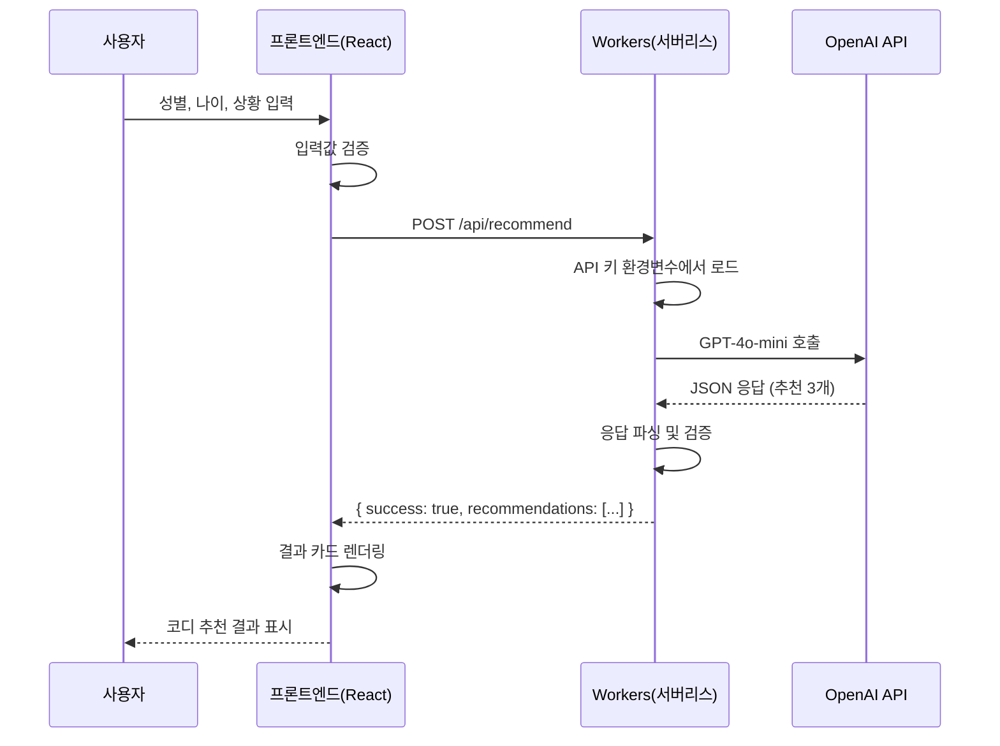

#### API 에러 처리 알고리즘

```
1. 프론트엔드 검증 (요청 전)
   ├─ 필수 필드 누락 → "모든 항목을 입력해주세요" 표시
   └─ 통과 → API 호출

2. 네트워크 에러 (요청 중)
   ├─ fetch 실패 → "인터넷 연결을 확인해주세요" 표시
   └─ 통과 → 응답 확인

3. 서버 에러 (Workers)
   ├─ 400: 잘못된 요청 → 에러 메시지 그대로 표시
   ├─ 429: 요청 한도 초과 → "잠시 후 다시 시도해주세요" 표시
   ├─ 500: 서버 내부 오류 → "일시적 오류" 표시 + 재시도 버튼
   └─ 200: 성공 → 결과 표시

4. AI API 에러 (OpenAI)
   ├─ 401: API 키 만료 → 관리자 알림 전송
   ├─ 429: Rate Limit → 지수 백오프 후 재시도
   ├─ JSON 파싱 실패 → 기본 추천 표시 (폴백)
   └─ 성공 → 정상 응답
```

#### AI API 비용 계산표

| API | 모델 | 입력 토큰 | 출력 토큰 | 요청당 예상 비용 |
|-----|------|-----------|-----------|-----------------|
| OpenAI | gpt-4o-mini | $0.15/1M | $0.60/1M | ~$0.001 |
| OpenAI | gpt-4o | $2.50/1M | $10.00/1M | ~$0.01 |
| Claude | claude-sonnet-5 | $3.00/1M | $15.00/1M | ~$0.02 |
| Claude | claude-haiku-4-5 | $0.80/1M | $4.00/1M | ~$0.005 |

> 월 1,000명이 각 3회 사용 시 (gpt-4o-mini 기준): 3,000 x $0.001 = **월 $3**

### 5-4. 결제 시스템 구축

#### 개발-테스트 사이클 ⑦: 결제 연동

| 단계 | 행동 | 테스트 |
|------|------|--------|
| **DEV-1** | Polar 계정 생성 | 대시보드 접속 확인 |
| **DEV-2** | 샌드박스 모드 활성화 | "Test Mode" 표시 확인 |
| **DEV-3** | 상품 생성 (일회성/구독) | 상품 목록에 표시 |
| **TEST-1** | 테스트 카드로 결제 | 결제 성공 화면 |
| **DEV-4** | 결제 버튼 프론트엔드 연동 | - |
| **TEST-2** | UI에서 결제 버튼 클릭 | Polar 결제창 열림 |
| **TEST-3** | 테스트 결제 완료 | 성공 콜백 호출됨 |
| **DEV-5** | 결제 후 서비스 잠금 해제 로직 | - |
| **TEST-4** | 결제 후 AI 추천 사용 가능 | 프리미엄 기능 활성화 |

#### 프롬프트 ⑬ 결제 페이지 구현

```
React로 결제 페이지를 만들어주세요.

요구사항:
1. 3단계 요금제 카드 (Free / Pro / Premium)
   - Free: 일 3회, 무료
   - Pro: 무제한, 월 $9.99
   - Premium: 무제한 + 히스토리, 월 $19.99
2. Polar Checkout 연동
3. 결제 완료 후 대시보드로 리다이렉트
4. 현재 구독 상태 표시
5. 모바일 반응형 디자인

Polar JavaScript SDK를 사용해주세요.
```

#### 글로벌 서비스 필수 문서 체크리스트

| 문서 | 필수 여부 | 용도 |
|------|-----------|------|
| **Privacy Policy** | 필수 | 개인정보 처리 방침 |
| **Terms of Service** | 필수 | 이용 약관 |
| **Refund Policy** | 권장 | 환불 정책 |
| **Cookie Policy** | EU 대상 필수 | 쿠키 사용 고지 |
| **DMCA / Copyright** | 권장 | 저작권 침해 대응 |

---

## 6. STEP 4 — 구독 & 반복 매출 (4주차)

### 6-1. 회원 시스템 아키텍처

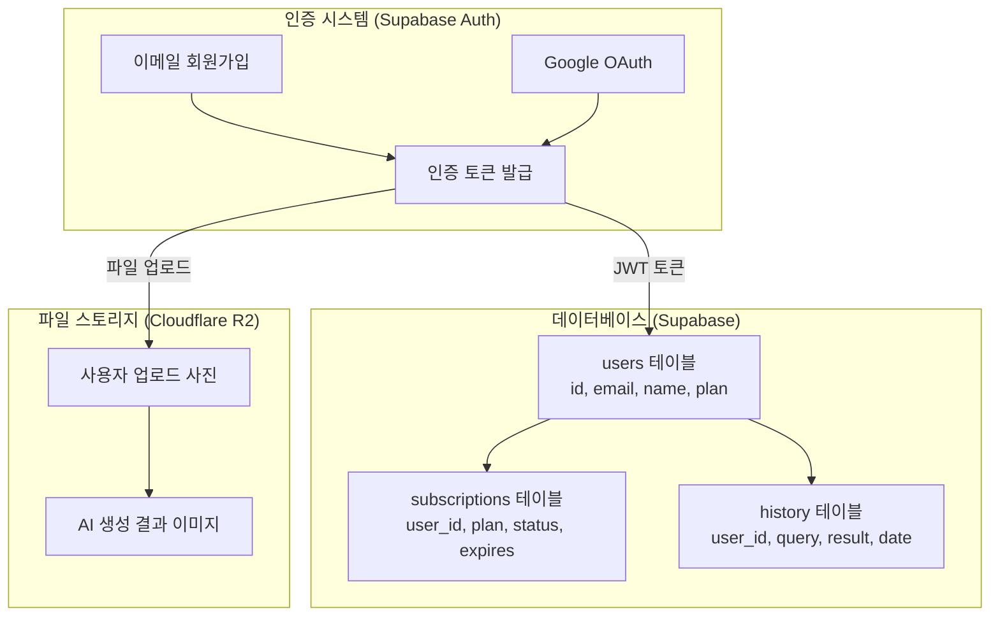

#### 개발-테스트 사이클 ⑧: 회원 시스템

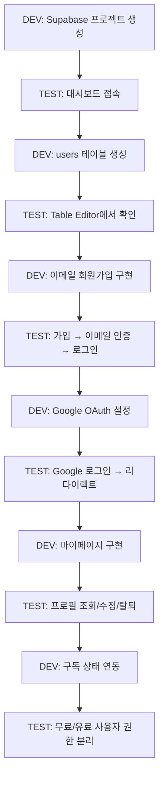

#### 코드 예시 — Supabase 테이블 스키마 (SQL)

```sql
-- 1. 사용자 프로필 테이블
CREATE TABLE profiles (
  id UUID REFERENCES auth.users(id) PRIMARY KEY,
  email TEXT NOT NULL,
  display_name TEXT,
  avatar_url TEXT,
  plan TEXT DEFAULT 'free' CHECK (plan IN ('free', 'pro', 'premium')),
  usage_count INT DEFAULT 0,
  usage_reset_date DATE DEFAULT CURRENT_DATE,
  created_at TIMESTAMPTZ DEFAULT NOW(),
  updated_at TIMESTAMPTZ DEFAULT NOW()
);

-- 2. 구독 테이블
CREATE TABLE subscriptions (
  id UUID DEFAULT gen_random_uuid() PRIMARY KEY,
  user_id UUID REFERENCES profiles(id) ON DELETE CASCADE,
  polar_subscription_id TEXT UNIQUE,
  plan TEXT NOT NULL CHECK (plan IN ('pro', 'premium')),
  status TEXT DEFAULT 'active' CHECK (status IN ('active', 'canceled', 'expired', 'past_due')),
  current_period_start TIMESTAMPTZ,
  current_period_end TIMESTAMPTZ,
  created_at TIMESTAMPTZ DEFAULT NOW()
);

-- 3. AI 추천 히스토리 테이블
CREATE TABLE recommendations (
  id UUID DEFAULT gen_random_uuid() PRIMARY KEY,
  user_id UUID REFERENCES profiles(id) ON DELETE CASCADE,
  input_data JSONB NOT NULL,    -- { gender, age, occasion, style }
  output_data JSONB NOT NULL,   -- AI 추천 결과
  model_used TEXT DEFAULT 'gpt-4o-mini',
  tokens_used INT,
  created_at TIMESTAMPTZ DEFAULT NOW()
);

-- 4. Row Level Security (RLS) 정책
ALTER TABLE profiles ENABLE ROW LEVEL SECURITY;
ALTER TABLE subscriptions ENABLE ROW LEVEL SECURITY;
ALTER TABLE recommendations ENABLE ROW LEVEL SECURITY;

-- 사용자는 자기 데이터만 조회/수정 가능
CREATE POLICY "Users can view own profile"
  ON profiles FOR SELECT USING (auth.uid() = id);
CREATE POLICY "Users can update own profile"
  ON profiles FOR UPDATE USING (auth.uid() = id);

CREATE POLICY "Users can view own subscriptions"
  ON subscriptions FOR SELECT USING (auth.uid() = user_id);

CREATE POLICY "Users can view own recommendations"
  ON recommendations FOR SELECT USING (auth.uid() = user_id);
CREATE POLICY "Users can insert own recommendations"
  ON recommendations FOR INSERT WITH CHECK (auth.uid() = user_id);
```

#### DB 스키마 관계도

```mermaid
erDiagram
    AUTH_USERS ||--|| PROFILES : "1:1"
    PROFILES ||--o{ SUBSCRIPTIONS : "1:N"
    PROFILES ||--o{ RECOMMENDATIONS : "1:N"

    AUTH_USERS {
        uuid id PK
        text email
        text encrypted_password
    }

    PROFILES {
        uuid id PK_FK
        text email
        text display_name
        text avatar_url
        text plan
        int usage_count
        date usage_reset_date
    }

    SUBSCRIPTIONS {
        uuid id PK
        uuid user_id FK
        text polar_subscription_id
        text plan
        text status
        timestamptz current_period_end
    }

    RECOMMENDATIONS {
        uuid id PK
        uuid user_id FK
        jsonb input_data
        jsonb output_data
        text model_used
        int tokens_used
    }
```

#### 사용량 제한 알고리즘

```javascript
// 무료 사용자: 일 3회 제한 / Pro: 무제한
async function checkUsageLimit(userId, supabase) {
  const { data: profile } = await supabase
    .from('profiles')
    .select('plan, usage_count, usage_reset_date')
    .eq('id', userId)
    .single();

  // 날짜가 바뀌면 카운터 리셋
  const today = new Date().toISOString().split('T')[0];
  if (profile.usage_reset_date !== today) {
    await supabase
      .from('profiles')
      .update({ usage_count: 0, usage_reset_date: today })
      .eq('id', userId);
    profile.usage_count = 0;
  }

  // 플랜별 제한 확인
  const limits = { free: 3, pro: Infinity, premium: Infinity };
  const limit = limits[profile.plan];

  if (profile.usage_count >= limit) {
    return { allowed: false, remaining: 0, limit };
  }

  // 사용 카운트 증가
  await supabase
    .from('profiles')
    .update({ usage_count: profile.usage_count + 1 })
    .eq('id', userId);

  return { 
    allowed: true, 
    remaining: limit - profile.usage_count - 1, 
    limit 
  };
}
```

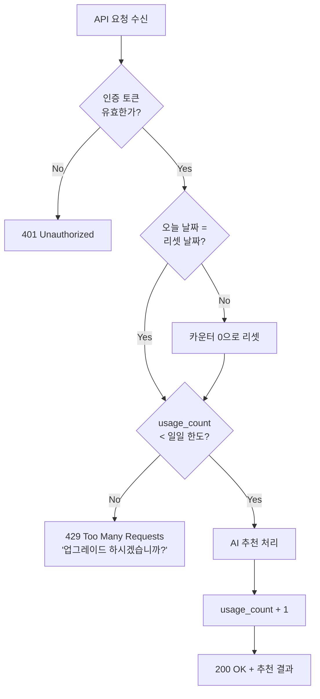

#### 프롬프트 ⑭ Supabase 회원 시스템

```
React + Supabase로 회원 가입/로그인 시스템을 만들어주세요.

요구사항:
1. 이메일/비밀번호 회원가입 (이메일 인증 포함)
2. Google OAuth 소셜 로그인
3. 로그인 상태 유지 (세션 관리)
4. 마이페이지 (프로필 수정, 구독 상태 표시, 계정 삭제)
5. 비로그인 사용자 → 로그인 페이지 리다이렉트
6. Supabase Row Level Security(RLS) 정책 설정

Supabase 프로젝트 URL: [URL]
Supabase Anon Key: [KEY]

보안 주의사항도 함께 알려주세요.
```

### 6-2. 구독 모델 설계

#### 비즈니스 모델 공식

```
월 매출 = 유료 사용자 수 x ARPU(사용자당 평균 매출)
LTV = ARPU x 평균 구독 개월 수
CAC = 총 마케팅 비용 / 신규 유료 사용자 수

지속 가능 조건: LTV > 3 x CAC

예시:
- 유료 사용자: 200명
- ARPU: $9.99/월
- 월 매출: $1,998
- 평균 구독: 6개월
- LTV: $59.94
- 월 마케팅비: $500 → CAC: $500/50명 = $10
- LTV($59.94) > 3 x CAC($30) ✅ 지속 가능
```

#### 코드 예시 — Polar Webhook 처리 (결제 이벤트 동기화)

```javascript
// functions/api/webhook/polar.js
export async function onRequestPost(context) {
  const payload = await context.request.json();
  const signature = context.request.headers.get('x-polar-signature');

  // 1. Webhook 서명 검증 (보안)
  const isValid = verifyWebhookSignature(
    payload, signature, context.env.POLAR_WEBHOOK_SECRET
  );
  if (!isValid) {
    return new Response('Invalid signature', { status: 401 });
  }

  // 2. 이벤트 타입별 처리
  const { type, data } = payload;
  const supabase = createClient(context.env.SUPABASE_URL, context.env.SUPABASE_KEY);

  switch (type) {
    case 'subscription.created':
      await supabase.from('subscriptions').insert({
        user_id: data.metadata.user_id,
        polar_subscription_id: data.id,
        plan: data.product.name.toLowerCase(),
        status: 'active',
        current_period_start: data.current_period_start,
        current_period_end: data.current_period_end,
      });
      await supabase.from('profiles')
        .update({ plan: data.product.name.toLowerCase() })
        .eq('id', data.metadata.user_id);
      break;

    case 'subscription.updated':
      await supabase.from('subscriptions')
        .update({
          status: data.status,
          current_period_end: data.current_period_end,
        })
        .eq('polar_subscription_id', data.id);
      break;

    case 'subscription.canceled':
      await supabase.from('subscriptions')
        .update({ status: 'canceled' })
        .eq('polar_subscription_id', data.id);
      // 구독 기간 남아있으면 plan은 유지 (만료일까지 사용 가능)
      break;

    case 'subscription.revoked':
      const sub = await supabase.from('subscriptions')
        .select('user_id')
        .eq('polar_subscription_id', data.id)
        .single();
      await supabase.from('profiles')
        .update({ plan: 'free' })
        .eq('id', sub.data.user_id);
      await supabase.from('subscriptions')
        .update({ status: 'expired' })
        .eq('polar_subscription_id', data.id);
      break;
  }

  return new Response('OK', { status: 200 });
}
```

#### Webhook 이벤트 처리 흐름

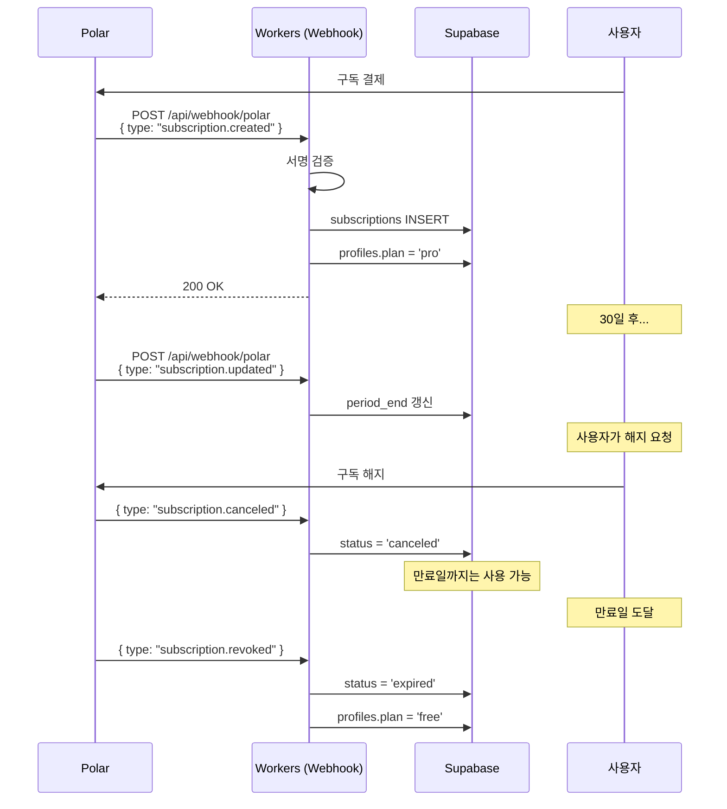

#### 코드 예시 — Cron 자동화 (만료 알림)

```javascript
// functions/_scheduled.js (Cloudflare Workers Cron Trigger)
export default {
  async scheduled(event, env, ctx) {
    const supabase = createClient(env.SUPABASE_URL, env.SUPABASE_KEY);

    // 3일 후 만료되는 구독 조회
    const threeDaysLater = new Date();
    threeDaysLater.setDate(threeDaysLater.getDate() + 3);
    const targetDate = threeDaysLater.toISOString().split('T')[0];

    const { data: expiringSubs } = await supabase
      .from('subscriptions')
      .select('user_id, profiles(email, display_name)')
      .eq('status', 'active')
      .gte('current_period_end', targetDate + 'T00:00:00')
      .lt('current_period_end', targetDate + 'T23:59:59');

    // 각 사용자에게 만료 알림 이메일 전송
    for (const sub of expiringSubs || []) {
      await sendEmail({
        to: sub.profiles.email,
        subject: '구독이 3일 후 만료됩니다',
        body: `${sub.profiles.display_name}님, 구독을 갱신하세요!`,
      });
    }

    // 이미 만료된 구독 상태 업데이트
    const now = new Date().toISOString();
    await supabase
      .from('subscriptions')
      .update({ status: 'expired' })
      .eq('status', 'active')
      .lt('current_period_end', now);
  }
};

// wrangler.toml 설정
// [triggers]
// crons = ["0 0 * * *"]  # 매일 자정 실행
```

#### 프롬프트 ⑮ 구독 자동화

```
Cloudflare Workers로 구독 자동화 시스템을 만들어주세요.

기능:
1. Cron Trigger로 매일 자정에 실행
2. 구독 만료 3일 전 사용자에게 이메일 알림
3. 만료된 구독의 상태를 자동으로 'expired'로 변경
4. Polar Webhook으로 결제 상태 실시간 동기화
5. 일일 매출 리포트를 관리자에게 전송

Supabase와 연동해주세요.
```

---

## 7. STEP 5 — 운영 & 엑시트 (5주차)

### 7-1. 앱 배포 (Expo)

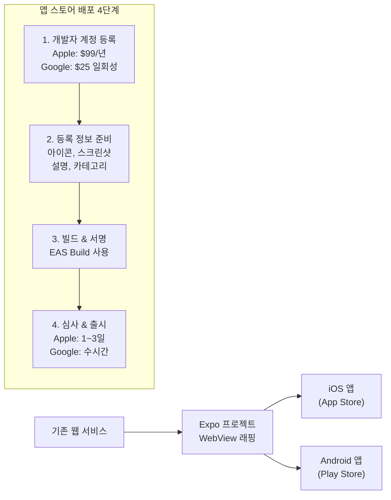

#### 프롬프트 ⑯ Expo 앱 변환

```
내 React 웹 서비스를 Expo로 모바일 앱으로 변환해주세요.
웹 서비스 URL: [URL]

요구사항:
1. WebView로 기존 웹 서비스 래핑
2. 스플래시 스크린 설정
3. 앱 아이콘 설정
4. 푸시 알림 기본 설정
5. 딥 링크 설정
6. EAS Build 설정 (app.json / eas.json)

iOS와 Android 모두 지원해야 합니다.
```

### 7-2. 엑시트 전략 로드맵

```mermaid
flowchart TD
    START["서비스 런칭"] --> GROWTH["성장 단계<br/>MAU 1,000+"]
    GROWTH --> REVENUE["수익화 단계<br/>월 매출 $1,000+"]

    REVENUE --> EXIT{"엑시트 전략 선택"}

    EXIT --> E1["현금 흐름 유지<br/>월 수익 계속 수령<br/>개인사업자/법인"]
    EXIT --> E2["매각<br/>서비스 통째로 매각<br/>연 매출의 3~5배"]
    EXIT --> E3["Acqui-hire<br/>팀/인력 인수<br/>기술력 가치"]
    EXIT --> E4["IPO<br/>기업 공개<br/>대규모 자본 조달"]

    E1 --> TAX["세금 최적화<br/>개인 vs 법인"]
    E2 --> PLATFORM["매각 플랫폼<br/>Acquire.com<br/>MicroAcquire"]
    E3 --> CORP["대기업 제안<br/>네트워킹"]
    E4 --> VC["투자 유치<br/>시드 → 시리즈A"]
```

### 7-3. 미국 법인 설립 비용 분석

| 항목 | 초기 비용 | 연간 유지 비용 |
|------|-----------|----------------|
| **Stripe Atlas 법인 설립** | $500 | - |
| **등록 대행 (Registered Agent)** | - | $100~300 |
| **가상 오피스** | - | $100~200 |
| **세무/법률 (CPA)** | - | $500~2,000 |
| **Delaware Franchise Tax** | - | $400+ |
| **은행 계좌 (Mercury 등)** | $0 | $0 |
| **총합** | **~$500** | **~$1,100~2,900** |

---

## 8. 전체 기술 스택 아키텍처

```mermaid
flowchart TB
    subgraph 사용자["사용자 접점"]
        BROWSER["웹 브라우저"]
        MOBILE["모바일 앱<br/>(Expo)"]
    end

    subgraph 프론트엔드["프론트엔드"]
        REACT["React + Vite"]
        DESIGN["바이브 디자인<br/>Stitch / Nano Banana"]
    end

    subgraph CDN["CDN & 배포"]
        CF_PAGES["Cloudflare Pages<br/>(정적 호스팅)"]
        DOMAIN["커스텀 도메인<br/>(.ai / .com)"]
    end

    subgraph 백엔드["서버리스 백엔드"]
        CF_WORKERS["Cloudflare Workers<br/>(API + Cron)"]
        CF_R2["Cloudflare R2<br/>(파일 스토리지)"]
    end

    subgraph 데이터["데이터 계층"]
        SUPABASE["Supabase<br/>(DB + Auth)"]
        SUPABASE_AUTH["Auth<br/>(회원/OAuth)"]
        SUPABASE_DB["PostgreSQL<br/>(데이터)"]
    end

    subgraph 외부서비스["외부 서비스"]
        AI_API["AI API<br/>(OpenAI / Claude)"]
        PAYMENT["결제<br/>(Polar + Stripe)"]
        ANALYTICS["분석<br/>(GA + Clarity)"]
        ADS["광고<br/>(AdSense)"]
    end

    BROWSER --> CF_PAGES
    MOBILE --> CF_PAGES
    CF_PAGES --> REACT
    REACT --> DESIGN
    CF_PAGES --> DOMAIN

    REACT -->|"API 호출"| CF_WORKERS
    CF_WORKERS --> AI_API
    CF_WORKERS --> CF_R2
    CF_WORKERS --> SUPABASE

    SUPABASE --> SUPABASE_AUTH
    SUPABASE --> SUPABASE_DB

    REACT --> PAYMENT
    REACT --> ANALYTICS
    REACT --> ADS
```

### 도구별 비용 분석

| 도구 | 무료 범위 | 유료 시작 | 비고 |
|------|-----------|-----------|------|
| **Cloudflare Pages** | 무제한 정적 사이트 | - | 완전 무료 |
| **Cloudflare Workers** | 일 100,000 요청 | $5/월 | 소규모 충분 |
| **Cloudflare R2** | 10GB 저장, 월 1M 읽기 | $0.015/GB | 소규모 충분 |
| **Supabase** | 500MB DB, 50K MAU | $25/월 | 무료 충분 |
| **GitHub** | 무제한 공개 저장소 | $4/월 | 무료 충분 |
| **Codespaces** | 월 60시간 | $0.18/시간 | 무료 충분 |
| **OpenAI API** | - | 사용량 비례 | 월 $3~50 예상 |
| **Polar** | 수수료 4% | - | 매출 비례 |
| **Google Analytics** | 무제한 | - | 완전 무료 |
| **MS Clarity** | 무제한 | - | 완전 무료 |
| **Claude Code** | - | $20/월 | 개발 핵심 도구 |

> 예상 월 운영비 (초기): **$20~50** (Claude Code + API 비용)

---

## 9. 프롬프트 마스터 가이드

### 9-1. 효과적인 프롬프트 작성 공식

```mermaid
flowchart LR
    A["역할 지정<br/>(Role)"] --> B["맥락 설명<br/>(Context)"]
    B --> C["구체적 요구<br/>(Task)"]
    C --> D["출력 형식<br/>(Format)"]
    D --> E["제약 조건<br/>(Constraints)"]
```

#### 프롬프트 템플릿

```
[역할] 너는 시니어 풀스택 개발자이자 스타트업 CTO야.
[맥락] 나는 비개발자이고, AI 패션 추천 서비스를 바이브 코딩으로 만들고 있어.
[작업] 다음 기능을 구현해줘: [구체적 기능 설명]
[형식] 코드는 주석을 포함하고, 파일별로 분리해서 보여줘.
[제약] React + Vite 환경이고, 외부 라이브러리는 최소화해줘.
```

### 9-2. 상황별 프롬프트 사전

| 상황 | 프롬프트 시작 패턴 | 예시 |
|------|---------------------|------|
| **새 기능 개발** | "~기능을 구현해줘" | "사진 업로드 기능을 구현해줘" |
| **버그 수정** | "~에서 ~에러가 발생해" | "버튼 클릭 시 TypeError가 발생해" |
| **디자인 수정** | "~의 디자인을 ~로 변경해줘" | "카드 레이아웃을 그리드로 변경해줘" |
| **성능 개선** | "~가 느려. 최적화해줘" | "페이지 로딩이 5초 걸려. 최적화해줘" |
| **코드 설명** | "이 코드가 무슨 역할인지 설명해줘" | "[코드 붙여넣기] 이게 뭐하는 코드야?" |
| **에러 해석** | "[에러 메시지] 이 에러 해결해줘" | "CORS 에러가 나와. 해결해줘" |
| **리팩토링** | "이 코드를 더 깔끔하게 정리해줘" | "컴포넌트가 500줄이야. 분리해줘" |
| **보안 점검** | "이 코드의 보안 취약점을 찾아줘" | "API 키가 노출될 수 있는 부분 체크해줘" |

### 9-3. 프롬프트 실패 시 디버깅

```mermaid
flowchart TD
    A["프롬프트 전송"] --> B{"원하는 결과?"}
    B -->|Yes| C["완료"]
    B -->|No| D{"에러 유형?"}

    D -->|"코드 에러"| E["에러 메시지 전체를<br/>복사하여 전달"]
    D -->|"원하는 것과 다름"| F["구체적 예시와<br/>기대 결과 제시"]
    D -->|"불완전한 코드"| G["빠진 부분을<br/>명시적으로 요청"]
    D -->|"너무 복잡"| H["작은 단위로<br/>쪼개서 요청"]

    E --> I["수정된 결과"]
    F --> I
    G --> I
    H --> I
    I --> B
```

---

## 10. 주차별 체크리스트

### 1주차 완료 체크리스트

- [ ] 아이디어 확정 및 페르소나 작성
- [ ] 벤치마킹 분석 완료
- [ ] HTML/CSS/JS 웹 페이지 개발
- [ ] 로컬 테스트 통과
- [ ] GitHub 리포지터리 생성 및 코드 push
- [ ] Cloudflare Pages 배포 완료
- [ ] 배포된 URL 접속 테스트
- [ ] AdSense 신청 (승인 대기)

### 2주차 완료 체크리스트

- [ ] Google Analytics 연동 및 데이터 확인
- [ ] MS Clarity 설치 및 세션 녹화 확인
- [ ] 커스텀 도메인 구매 및 연결
- [ ] 파비콘 적용
- [ ] robots.txt, sitemap.xml 생성
- [ ] Google Search Console 등록
- [ ] 소셜 공유 기능 구현 및 테스트
- [ ] OG 태그 설정 및 미리보기 확인

### 3주차 완료 체크리스트

- [ ] React + Vite 프로젝트 생성
- [ ] 컴포넌트 구조 설계 및 기본 UI 구현
- [ ] AI API 연동 및 추천 결과 표시
- [ ] 서버리스 함수 배포 및 API 테스트
- [ ] 결제 시스템 (Polar) 연동
- [ ] 샌드박스 결제 테스트 통과
- [ ] 필수 법률 문서 페이지 생성
- [ ] 프로덕션 배포 및 라이브 테스트

### 4주차 완료 체크리스트

- [ ] Supabase 프로젝트 생성 및 테이블 설계
- [ ] 이메일 회원가입/로그인 구현
- [ ] Google OAuth 소셜 로그인 구현
- [ ] 마이페이지 구현 (프로필, 구독 상태)
- [ ] 구독 결제 플로우 완성
- [ ] 구독 자동화 (Cron, Webhook)
- [ ] R2 파일 업로드/관리
- [ ] 전체 플로우 E2E 테스트

### 5주차 완료 체크리스트

- [ ] Expo 프로젝트 생성 및 WebView 연결
- [ ] 앱 아이콘, 스플래시 스크린 설정
- [ ] iOS / Android 빌드 테스트
- [ ] 앱 스토어 심사 제출
- [ ] 미국 법인 설립 검토 (필요 시)
- [ ] 엑시트 전략 수립
- [ ] 최종 성과 측정 및 분석

---

## 11. 용어 해설집 (A-Z)

### A

| 용어 | 영문 | 설명 |
|------|------|------|
| **AARRR** | Acquisition, Activation, Retention, Referral, Revenue | 스타트업 성장 단계를 5가지로 나눈 프레임워크. "해적 지표"라고도 부른다. 각 단계의 전환율을 측정하여 병목을 찾는다. |
| **Aha Moment** | Aha Moment | 사용자가 서비스의 핵심 가치를 처음 깨닫는 순간. 예: Facebook의 "10일 안에 7명 친구 추가" |
| **API** | Application Programming Interface | 서로 다른 소프트웨어가 데이터를 주고받기 위한 규격화된 인터페이스. 레스토랑에서 웨이터가 주방과 손님을 연결하는 역할과 유사하다. |
| **API 키** | API Key | API에 접근하기 위한 고유한 인증 문자열. 비밀번호처럼 절대 공개하면 안 된다. 환경 변수에 저장한다. |
| **ARPU** | Average Revenue Per User | 사용자당 평균 매출. 총 매출을 전체 사용자 수로 나눈 값. |
| **ARR** | Annual Recurring Revenue | 연간 반복 매출. MRR x 12. SaaS 기업의 규모를 측정하는 핵심 지표. |
| **AdSense** | Google AdSense | Google의 광고 플랫폼. 웹사이트에 광고를 게재하고 클릭/노출 수에 따라 수익을 얻는다. |
| **Acqui-hire** | Acquisition + Hire | 서비스보다 팀의 기술력/인력을 목적으로 회사를 인수하는 것. |

### B

| 용어 | 영문 | 설명 |
|------|------|------|
| **백엔드** | Backend | 사용자에게 보이지 않는 서버 측 로직. 데이터 처리, 인증, API 등을 담당한다. |
| **배포** | Deploy / Deployment | 개발한 코드를 서버에 올려 전 세계 누구나 접속할 수 있도록 공개하는 과정. |
| **바이브 코딩** | Vibe Coding | AI에게 자연어(일상 말)로 원하는 기능을 설명하면 AI가 코드를 생성하는 새로운 개발 방식. 코딩 지식 없이도 소프트웨어를 만들 수 있다. |
| **바이브 디자인** | Vibe Design | AI 도구(Stitch, Nano Banana 등)를 활용하여 자연어 설명만으로 UX/UI 디자인을 자동 생성하는 방식. |
| **바이럴** | Viral | 사용자가 자발적으로 다른 사람에게 서비스를 공유하여 확산되는 성장 방식. |
| **빌드** | Build | 소스 코드를 브라우저가 실행할 수 있는 형태로 변환하는 과정. Vite가 이 역할을 담당한다. |

### C

| 용어 | 영문 | 설명 |
|------|------|------|
| **CAC** | Customer Acquisition Cost | 고객 획득 비용. 신규 유료 사용자 1명을 확보하는 데 드는 평균 마케팅 비용. |
| **C-Corporation** | C-Corp | 미국의 법인 형태 중 하나. 주식 발행이 가능하고 투자 유치에 유리하다. |
| **CDN** | Content Delivery Network | 전 세계에 분산된 서버에서 콘텐츠를 전달하는 네트워크. 가까운 서버에서 전송하므로 속도가 빠르다. Cloudflare가 대표적. |
| **CLI** | Command Line Interface | 터미널(명령 프롬프트)에서 텍스트 명령어로 조작하는 인터페이스. |
| **CORS** | Cross-Origin Resource Sharing | 다른 도메인 간 데이터 요청을 허용/차단하는 브라우저 보안 정책. 서버리스 함수에 CORS 설정이 필요하다. |
| **CPA** | Cost Per Action | 행동당 비용. 사용자가 특정 행동(가입, 결제 등)을 하는 데 드는 광고 비용. |
| **Cron** | Cron Job / Cron Trigger | 정해진 시간에 자동으로 실행되는 예약 작업. "매일 자정에 데이터 정리" 같은 자동화에 사용. |
| **CSS** | Cascading Style Sheets | 웹 페이지의 시각적 스타일(색상, 크기, 레이아웃)을 정의하는 언어. HTML이 뼈대라면 CSS는 옷이다. |
| **Carrying Capacity** | Carrying Capacity | 서비스가 유지할 수 있는 최대 사용자 수. (일일 신규 유입) / (일일 이탈률)로 계산한다. |
| **Clarity** | Microsoft Clarity | Microsoft의 무료 사용자 행동 분석 도구. 히트맵, 세션 녹화, Rage Click 감지 등을 제공한다. |
| **Cloudflare** | Cloudflare | CDN, 보안, 서버리스 컴퓨팅을 제공하는 클라우드 플랫폼. Pages, Workers, R2 등 다양한 서비스를 무료로 제공한다. |

### D~E

| 용어 | 영문 | 설명 |
|------|------|------|
| **Dead Click** | Dead Click | 사용자가 클릭했지만 아무 반응이 없는 클릭. UX 문제의 신호. Clarity에서 감지 가능. |
| **도메인** | Domain | 웹사이트의 고유한 주소. `myservice.com` 같은 형태. 브랜드 신뢰도를 높인다. |
| **EAS Build** | Expo Application Services Build | Expo에서 제공하는 클라우드 빌드 서비스. iOS/Android 앱을 클라우드에서 빌드한다. |
| **엑시트** | Exit | 창업자가 회사의 지분을 현금화하는 방법. 매각, IPO, Acqui-hire 등이 있다. |
| **엑스포** | Expo | React Native 기반의 모바일 앱 개발 프레임워크. 웹 서비스를 앱으로 손쉽게 변환할 수 있다. |
| **환경 변수** | Environment Variable | API 키, 비밀번호 등 민감한 정보를 코드에 직접 쓰지 않고 별도로 관리하는 설정값. |

### F~G

| 용어 | 영문 | 설명 |
|------|------|------|
| **파비콘** | Favicon | 브라우저 탭에 표시되는 작은 아이콘(16x16 또는 32x32). 브랜드 인식에 중요하다. |
| **프런트엔드** | Frontend | 사용자가 직접 보고 상호작용하는 부분. HTML, CSS, JavaScript, React 등으로 구현한다. |
| **GA** | Google Analytics | Google의 무료 웹 분석 도구. 방문자 수, 체류 시간, 유입 경로 등을 추적한다. |
| **GEO** | Generative Engine Optimization | 생성형 AI 검색 최적화. ChatGPT, Perplexity 등의 AI가 내 서비스를 추천하도록 최적화하는 전략. |
| **Git** | Git | 코드의 변경 이력을 추적하고 관리하는 분산 버전 관리 시스템. |
| **GitHub** | GitHub | Git 기반의 코드 저장소 호스팅 서비스. 전 세계 개발자들의 코드 공유 플랫폼. |

### H~J

| 용어 | 영문 | 설명 |
|------|------|------|
| **HTML** | HyperText Markup Language | 웹 페이지의 구조와 내용을 정의하는 마크업 언어. 웹의 뼈대에 해당한다. |
| **HTTPS** | HyperText Transfer Protocol Secure | HTTP에 보안(SSL/TLS)이 추가된 프로토콜. 자물쇠 아이콘이 표시되며, Cloudflare가 자동 제공한다. |
| **IPO** | Initial Public Offering | 기업 공개. 주식을 증권 거래소에 상장하여 대중에게 판매하는 것. 대규모 자본 조달이 가능하다. |
| **JavaScript** | JavaScript | 웹 페이지에 동적 기능(클릭 반응, 데이터 처리, 애니메이션)을 추가하는 프로그래밍 언어. |
| **JSON** | JavaScript Object Notation | 데이터를 주고받기 위한 경량 텍스트 형식. API 응답에 가장 널리 사용된다. `{"name": "홍길동", "age": 30}` 형태. |
| **JWT** | JSON Web Token | 인증 정보를 안전하게 전달하기 위한 토큰 표준. 로그인 후 서버가 발급하며, 이후 요청 시 신원 증명에 사용한다. |

### K~L

| 용어 | 영문 | 설명 |
|------|------|------|
| **K-Factor** | K-Factor | 바이럴 계수. K = (사용자당 초대 수) x (초대받은 사람의 가입 전환율). K > 1이면 사용자가 자연 증가한다. |
| **LTV** | Lifetime Value | 고객 생애 가치. 한 고객이 서비스를 사용하는 전체 기간 동안 발생시키는 총 매출. LTV > 3 x CAC가 건강한 비즈니스의 기준. |
| **llms.txt** | llms.txt | AI 크롤러에게 사이트 정보를 구조화하여 제공하는 파일. GEO(생성형 엔진 최적화)의 핵심 요소. |

### M~N

| 용어 | 영문 | 설명 |
|------|------|------|
| **MAU** | Monthly Active Users | 월간 활성 사용자 수. 한 달간 서비스를 1회 이상 사용한 고유 사용자 수. |
| **MOR** | Merchant of Record | 결제 대행자. 판매자 대신 세금 처리, 환불, 분쟁 해결 등을 담당한다. Polar, Stripe 등이 해당. |
| **MRR** | Monthly Recurring Revenue | 월간 반복 매출. 구독 기반 서비스에서 매월 반복적으로 발생하는 매출. SaaS 핵심 지표. |
| **MVP** | Minimum Viable Product | 최소 기능 제품. 핵심 기능만 넣어 빠르게 출시하고, 사용자 반응을 보며 발전시키는 전략. 완벽한 제품이 아닌 "학습을 위한 제품"이다. |
| **나노 바나나** | Nano Banana | AI 이미지 생성 도구. 텍스트 설명으로 로고, 일러스트, 배경 이미지 등을 생성한다. |
| **Node.js** | Node.js | JavaScript를 서버 측에서 실행할 수 있게 해주는 런타임 환경. npm 패키지 관리자를 포함한다. |

### O~P

| 용어 | 영문 | 설명 |
|------|------|------|
| **OAuth** | Open Authorization | 제3자 서비스(Google, Facebook 등)의 계정으로 로그인할 수 있도록 하는 인증 표준. "Google로 로그인" 버튼이 대표적. |
| **OG 태그** | Open Graph Tags | 소셜 미디어에서 링크 공유 시 표시되는 미리보기(제목, 설명, 이미지)를 정의하는 메타 태그. |
| **PMF** | Product-Market Fit | 제품-시장 적합성. 내 제품이 시장의 수요와 잘 맞는지를 나타내는 개념. 유지율 40% 이상이면 PMF 달성으로 본다. |
| **PWA** | Progressive Web App | 웹 기술로 만든 앱처럼 동작하는 웹사이트. 오프라인 지원, 홈 화면 추가, 푸시 알림이 가능하다. |
| **Polar** | Polar | SaaS/디지털 제품 판매를 위한 결제 플랫폼. 구독 관리, 인보이스, 세금 처리를 대행(MOR)한다. |

### R

| 용어 | 영문 | 설명 |
|------|------|------|
| **R2** | Cloudflare R2 | Cloudflare의 오브젝트 스토리지. AWS S3와 호환되며, 이미지/파일 저장에 사용한다. 송신 비용이 없다. |
| **Rage Click** | Rage Click | 사용자가 분노하여 같은 곳을 빠르게 반복 클릭하는 행동. UX 불만의 강력한 신호. Clarity에서 감지. |
| **React** | React | Meta(Facebook)가 만든 UI 라이브러리. 컴포넌트 기반으로 웹 인터페이스를 구축한다. 재사용 가능한 부품(컴포넌트)을 조립하여 화면을 만든다. |
| **RLS** | Row Level Security | 수파베이스/PostgreSQL의 행 수준 보안. "자기 데이터만 볼 수 있다"는 규칙을 DB 수준에서 강제한다. |
| **ROAS** | Return On Ad Spend | 광고 수익률. 광고에 투자한 비용 대비 얻은 매출의 비율. ROAS 300% = 1만 원 광고 → 3만 원 매출. |
| **robots.txt** | robots.txt | 검색 엔진 크롤러에게 접근 가능/불가능한 페이지를 알려주는 텍스트 파일. 사이트 최상위에 위치한다. |

### S

| 용어 | 영문 | 설명 |
|------|------|------|
| **SaaS** | Software as a Service | 소프트웨어를 설치하지 않고 인터넷으로 접속하여 사용하는 서비스 모델. Gmail, Notion 등이 대표적. 구독형 수익 모델이 일반적. |
| **SEO** | Search Engine Optimization | 검색 엔진 최적화. Google 등에서 내 사이트가 검색 결과 상위에 노출되도록 하는 전략과 기술의 총칭. |
| **Sitemap** | sitemap.xml | 사이트의 모든 페이지 목록을 검색 엔진에 알려주는 XML 파일. 크롤링 효율을 높인다. |
| **Stripe** | Stripe | 글로벌 온라인 결제 플랫폼. 190개국 이상 지원. 한국 사업자는 직접 사용이 어려워 Polar를 경유하거나 미국 법인을 설립한다. |
| **Stripe Atlas** | Stripe Atlas | Stripe이 제공하는 미국 법인 설립 서비스. $500에 Delaware C-Corp 설립, 은행 계좌 개설, 세무 설정을 대행한다. |
| **스티치** | Stitch | AI UI 디자인 생성 도구. 텍스트 설명으로 UI 디자인을 생성하고, 이를 실제 코드로 변환한다. |
| **수파베이스** | Supabase | 오픈소스 Firebase 대안. PostgreSQL 데이터베이스, 인증, 스토리지, 실시간 기능을 제공한다. 무료 티어가 넉넉하다. |
| **서버리스** | Serverless | 서버를 직접 관리하지 않고, 코드만 작성하면 클라우드가 자동으로 실행/확장하는 방식. Cloudflare Workers가 대표적. |

### T~U

| 용어 | 영문 | 설명 |
|------|------|------|
| **토큰** | Token | AI API에서 텍스트를 처리하는 기본 단위. 한국어 1글자는 대략 2~3토큰. API 비용은 토큰 수에 비례한다. |
| **Userback** | Userback | 사용자 피드백 수집 도구. 스크린샷과 함께 버그 리포트, 기능 요청을 수집할 수 있다. |
| **UX/UI** | User Experience / User Interface | UX는 사용자 경험(서비스 사용의 전체적 느낌), UI는 사용자 인터페이스(버튼, 메뉴 등 시각 요소). |

### V~W

| 용어 | 영문 | 설명 |
|------|------|------|
| **Vite** | Vite | 프랑스어로 "빠르다"는 뜻. 차세대 프론트엔드 빌드 도구. Create React App보다 10~100배 빠른 개발 서버를 제공한다. |
| **Webhook** | Webhook | 특정 이벤트 발생 시 외부 서버에 자동으로 HTTP 요청을 보내는 메커니즘. "결제 완료 시 내 서버에 알림"에 사용. |
| **Workers** | Cloudflare Workers | Cloudflare의 서버리스 함수 실행 환경. 전 세계 엣지에서 실행되어 응답 속도가 빠르다. Cron Trigger로 예약 작업도 가능. |

---

## 12. 참고 링크

| 구분 | 링크 |
|------|------|
| **YouTube 영상** | https://www.youtube.com/watch?v=P3jFI-VpyLg |
| **조코딩 공식 사이트** | https://jocoding.net/ |
| **부트캠프 강의 페이지** | https://jocoding.net/courses/ai-product-builder/ |
| **YouTube 재생목록 (편집본)** | https://www.youtube.com/playlist?list=PLU9-uwewPMe27GtNWsIorePtRO_3vwidD |
| **관련 도서 (한빛미디어)** | https://www.hanbit.co.kr/store/books/look.php?p_code=B2047363015 |
| **Cloudflare 대시보드** | https://dash.cloudflare.com/ |
| **Supabase 대시보드** | https://supabase.com/dashboard |
| **Polar 대시보드** | https://polar.sh/ |
| **Google Analytics** | https://analytics.google.com/ |
| **MS Clarity** | https://clarity.microsoft.com/ |
| **Google Search Console** | https://search.google.com/search-console |
| **Google AdSense** | https://www.google.com/adsense |
