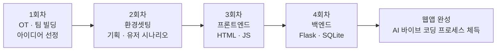

# 프로젝트 활동 계획서 (요약본)

## 1. 프로젝트 정보

| 구분 | 내용 |
| --- | --- |
| 프로젝트명 | Python + AI 바이브 코딩으로 나만의 웹앱 만들기 (코딩 기초) |
| 팀장명 | (미정) |
| 팀장 연락처 | (미정) |
| 길잡이교사명 | 김종필 |
| 길잡이교사 연락처 | 010-2708-0051 |
| 프로젝트 목표 | Python(Flask) + HTML + DB(SQLite)로 웹앱을 완성하며, 코드를 직접 짜기보다 **수정하고 개선하는 AI 바이브 코딩 방식**을 익힌다. AI 바이브 코딩 개발 프로세스를 직접 경험하고 이해하는 과정이다. |

## 2. 활동 세부계획

| 회차 | 일정 | 활동 주제 | 세부 내용 및 준비사항 |
| --- | --- | --- | --- |
| 1회차 | 7월 22일 | 왜 만드는가 – OT + 팀 빌딩 | 4명이 한 팀을 이루고, 현재의 코딩 교육 방식과 AI 바이브 코딩의 차이를 비교하며 어디까지 팀으로 개발할 수 있는지 범위를 함께 논의한다. AI가 코드를 생성하고 사람이 수정·검토하는 바이브 코딩 데모를 직접 시연하여 개발 흐름을 체험한다. 10가지 앱 아이디어(공부 타이머, 할 일 관리, 가계부 등) 중 하나를 팀원 투표로 선정하고, 왜 이 아이디어를 골랐는지 이유를 함께 정리한다. **준비물:** 노트북, 개인 GitHub 계정 생성, Claude AI 가입 |
| 2회차 | 7월 24일 | 환경셋팅 – 설계 + 첫 Python 코딩 | Python, Flask, VS Code 등 개발 환경을 설치·설정하고, GitHub 저장소를 생성하여 팀원 간 협업 환경을 구축한다. 바이브 코딩에 들어가기 전에 기획과 유저 시나리오를 먼저 설정한다: **누가 쓸까?**(대상 사용자 구체화) → **뭐가 불편할까?**(기존 불편 사항 정리) → **비슷한 건 뭐가 있을까?**(기존 앱 대비 차별점 도출). 유저 시나리오 문서를 작성하고, 이를 바탕으로 첫 번째 Python 코드를 Claude에게 프롬프트로 요청하여 생성해 본다. **준비물:** Python 3.x 설치, VS Code 설치, 팀별 아이디어 정리 문서 |
| 3회차 | 7월 29일 | 만들기 – 프론트엔드 개발 (HTML, JS) | Claude 바이브 코딩을 활용하여 Flask 기반의 HTML 프론트엔드 페이지(메인 화면, 입력 폼, 결과 표시 등)를 설계하고 제작한다. 프롬프트를 어떻게 작성하면 원하는 UI가 나오는지 팀원들과 함께 실험하며, 효과적인 프롬프트 작성법을 논의한다. CSS 스타일링과 JavaScript 동적 기능(버튼 클릭, 타이머 동작 등)을 추가하여 사용자 인터랙션을 구현한다. **준비물:** 유저 시나리오 문서, 화면 설계 스케치(손그림 가능), 2회차 코드 |
| 4회차 | 7월 31일 | 만들기 – 백엔드 개발 (Flask, SQLite) | Flask 라우팅과 SQLite 데이터베이스를 연동하여 데이터 저장·조회·수정·삭제(CRUD) 기능을 구현한다. Claude에게 백엔드 로직을 프롬프트로 요청하고, 생성된 코드를 읽고 이해한 뒤 팀 프로젝트에 맞게 수정·개선하는 과정을 실습한다. 프론트엔드와 백엔드를 연결하여 완성된 웹앱을 로컬 서버에서 실행하고, 팀원들과 함께 테스트하며 버그를 수정한다. **준비물:** 3회차 프론트엔드 코드, DB 테이블 설계(어떤 데이터를 저장할지 목록 정리) |

## 3. 산출물

| 회차 | 산출 자료 |
| --- | --- |
| 1일차 | OT_바이브_코딩_Python_1교시 / 2교시, 지식 생산자로 가는 방법 |
| 2일차 | (이론) 바이브 코딩에서 AI 오케스트라까지, (실습) 공부 타이머를 만들자! |
| 3일차 | AI 공부 매니저 개발 시나리오, 유저 시나리오 |
| 4일차 | AI 공부 매니저 개발 시나리오 (최종본) |

## 4. 진행 흐름

## 5. 기대 효과

- 코드를 처음부터 작성하지 않고도 **읽고·수정·개선**하는 실전 개발 역량 확보
- 기획 → 시나리오 → 프론트 → 백엔드로 이어지는 **전체 개발 프로세스** 경험
- 프롬프트 설계와 AI 협업 방식을 익혀 **지식 소비자에서 생산자로** 전환
