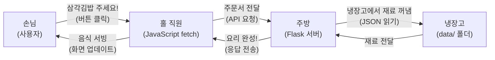
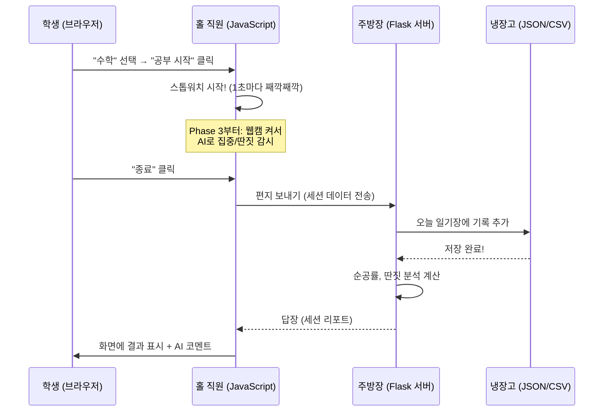
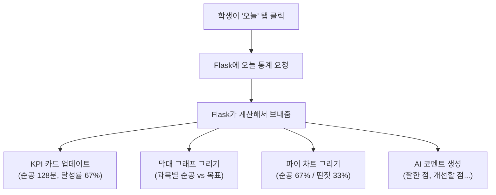
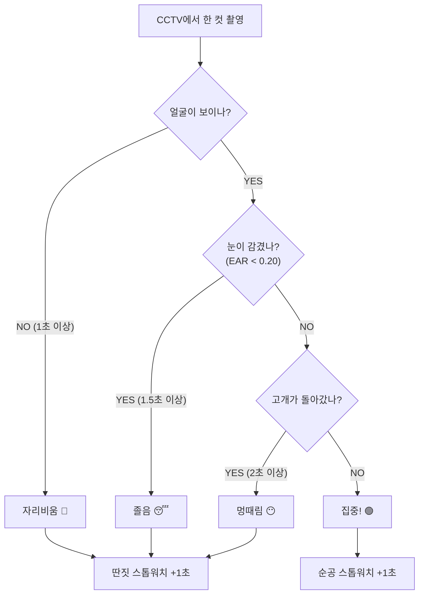
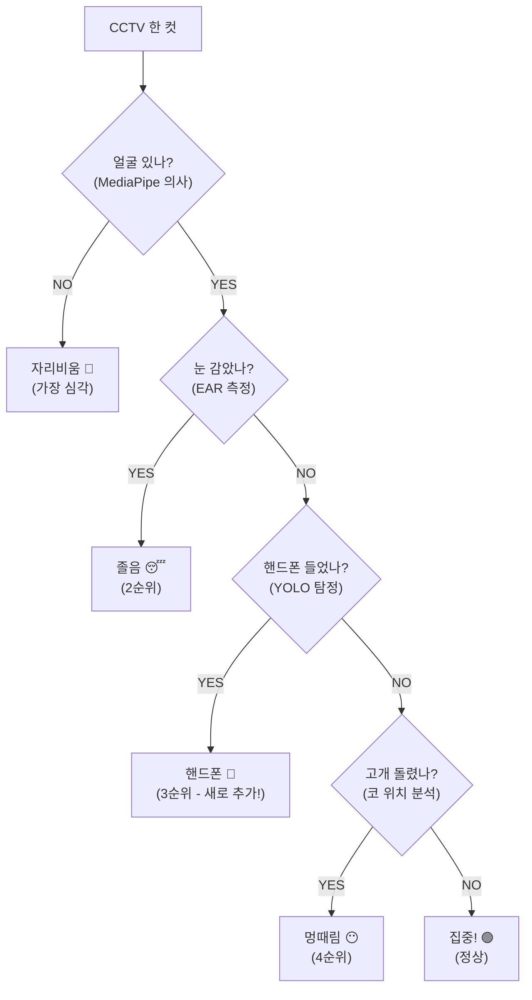

# AI 공부 매니저 - 개발 시나리오

> 이 문서는 AI 공부 매니저를 **처음부터 끝까지 만드는 과정**을 설명합니다.
> 중학교 2학년도 이해할 수 있도록 **비유와 쉬운 말**로 작성했습니다.

---

## 목차

0. [기본 용어 사전](#0-기본-용어-사전)
1. [전체 구조 이해하기](#1-전체-구조-이해하기)
2. [개발 환경 준비하기](#2-개발-환경-준비하기)
3. [Phase 1 - 기본 타이머 만들기](#3-phase-1---기본-타이머-만들기)
4. [Phase 2 - 대시보드 & 통계 만들기](#4-phase-2---대시보드--통계-만들기)
5. [Phase 3 - MediaPipe AI 자동 감지](#5-phase-3---mediapipe-ai-자동-감지)
6. [Phase 4 - YOLO 핸드폰 감지 (추후 개발)](#6-phase-4---yolo-핸드폰-감지-추후-개발)

---

# 0. 기본 용어 사전

> 이 문서에서 사용하는 용어들을 **일상 비유**와 함께 정리했습니다.
> 모르는 단어가 나오면 여기로 돌아와서 확인하세요!

## 0.1 프로그래밍 기본 용어

| 용어 | 뜻 | 비유 |
|------|-----|------|
| **변수 (Variable)** | 데이터를 담는 이름 붙은 상자 | 이름표가 붙은 서랍. "수학점수"라는 서랍에 85를 넣어두면, 나중에 꺼내 쓸 수 있다 |
| **함수 (Function)** | 특정 작업을 묶어놓은 레시피 | 라면 끓이기 레시피. "물 넣기 → 끓이기 → 면 넣기 → 3분 대기"를 한 묶음으로 만들어, "라면끓이기()" 한 마디로 실행 |
| **배열 / 리스트 (Array / List)** | 여러 데이터를 순서대로 나열한 것 | 출석부. 1번 김서준, 2번 이하은, 3번 박지민... 순서가 있고, 번호로 찾을 수 있다 |
| **딕셔너리 / 객체 (Dictionary / Object)** | "이름: 값" 쌍으로 데이터를 묶은 것 | 학생증. 이름: 김서준, 학년: 2, 반: 3, 번호: 15 처럼 항목별로 정리된 카드 |
| **조건문 (IF / ELSE)** | "만약 ~이면 A하고, 아니면 B해라" | 우산 규칙. "만약 비가 오면 우산을 가져가고, 아니면 그냥 가라" |
| **반복문 (Loop)** | 같은 작업을 여러 번 반복하기 | 체력 운동. "팔굽혀펴기 10번 반복" → 1번, 2번, 3번... 10번까지 같은 동작 |
| **라이브러리 (Library)** | 다른 사람이 미리 만들어놓은 코드 도구 상자 | 레고 세트. 바닥부터 블록을 만들 필요 없이, 완성된 블록 세트를 가져다 조립하면 된다 |
| **import** | 라이브러리를 가져다 쓰겠다고 선언하는 것 | 도서관에서 책을 빌려오는 것. "이 책(라이브러리) 쓸게요!" |
| **에러 (Error)** | 코드가 잘못되어 실행이 안 되는 것 | 요리하다 소금을 설탕으로 잘못 넣은 것. 결과가 이상하거나 아예 망한다 |
| **디버깅 (Debugging)** | 에러를 찾아서 고치는 것 | 요리 실패 원인 찾기. "아, 소금 대신 설탕을 넣었구나!" → 소금으로 바꾸기 |
| **주석 (Comment)** | 코드 옆에 적는 메모. 실행되지 않는다 | 교과서 여백에 적는 필기. 내용은 아니지만 이해를 돕는다 |

## 0.2 웹 개발 용어

| 용어 | 뜻 | 비유 |
|------|-----|------|
| **서버 (Server)** | 요청을 받고 응답을 주는 컴퓨터/프로그램 | 편의점 직원. 손님이 "삼각김밥 주세요"하면 찾아서 건네주고, 계산해준다 |
| **클라이언트 (Client)** | 서버에 요청을 보내는 쪽 (브라우저) | 편의점 손님. "삼각김밥 주세요"라고 요청하는 사람 |
| **프론트엔드 (Frontend)** | 사용자가 직접 보고 만지는 화면 | 식당의 홀. 메뉴판(화면), 테이블(레이아웃), 인테리어(디자인) |
| **백엔드 (Backend)** | 화면 뒤에서 데이터를 처리하는 서버 | 식당의 주방. 손님 눈에 안 보이지만, 요리(데이터 처리)를 하는 곳 |
| **API** | 프론트엔드와 백엔드가 대화하는 전화선 | 홀 직원과 주방 사이의 주문서. "2번 테이블, 된장찌개 1개요!" 하면 주방이 만들어서 내보내준다 |
| **URL** | 웹 페이지의 주소 | 집 주소. "서울시 강남구 역삼로 123번길"처럼 찾아갈 수 있는 위치 |
| **라우트 (Route)** | 특정 URL이 어떤 페이지/기능과 연결되는지 정하는 것 | 건물 안내판. "1층 → 로비, 2층 → 식당, 3층 → 사무실" |
| **포트 (Port)** | 서버가 듣고 있는 문 번호 (5000번 등) | 아파트 동 번호. 같은 건물(컴퓨터)이지만 101동(5000번), 102동(3000번) 다른 곳 |
| **렌더링 (Rendering)** | 코드를 화면에 그려서 보여주는 것 | 밀키트를 요리해서 접시에 담아내는 것. 재료(코드) → 완성된 요리(화면) |
| **CDN** | 인터넷에서 바로 가져다 쓸 수 있는 코드 저장소 | 인터넷 도서관. 책(라이브러리)을 다운로드 안 해도 바로 빌려 읽을 수 있다 |
| **fetch** | JavaScript가 서버에 "이거 줘!" 또는 "이거 저장해!" 하는 함수 | 카카오톡. 친구(서버)에게 메시지를 보내면 답장이 온다. 보내기 = 요청, 답장 = 응답 |

## 0.3 데이터 저장 용어

| 용어 | 뜻 | 비유 |
|------|-----|------|
| **JSON** | 데이터를 `{"이름": "값"}` 형태로 저장하는 텍스트 파일 | 자기소개 카드. 이름: 김서준, 나이: 14, 취미: 게임 형태로 정리 |
| **CSV** | 쉼표로 구분한 데이터 파일. 엑셀로 열 수 있다 | 출석부 엑셀. 이름, 출석, 점수가 쉼표로 나눠져 있다 |
| **CRUD** | Create(만들기), Read(읽기), Update(수정), Delete(삭제) | 연락처 앱. 연락처 추가/조회/수정/삭제 — 데이터를 다루는 4가지 기본 동작 |
| **세션 (Session)** | 한 번의 공부 시작~종료까지의 기록 단위 | 수업 1교시. 시작 종이 울리고 끝 종이 울릴 때까지가 1세션 |
| **base64** | 이미지를 글자(텍스트)로 변환한 것 | 모스 부호. 사진을 못 보내는 곳에서, 사진을 글자로 바꿔서 전송 |

## 0.4 AI / 컴퓨터 비전 용어

| 용어 | 뜻 | 비유 |
|------|-----|------|
| **AI (인공지능)** | 컴퓨터가 사람처럼 판단하는 기술 | 자동 채점기. 사람 대신 답안지를 읽고 점수를 매겨준다 |
| **컴퓨터 비전 (CV)** | 컴퓨터가 "눈"처럼 영상/사진을 분석하는 기술 | 감시 카메라 + 두뇌. 영상을 보고 "사람이 있다", "핸드폰을 들었다" 판단 |
| **MediaPipe** | 구글이 만든 얼굴/손/몸 인식 AI 라이브러리 | 만능 돋보기. 카메라에 비친 얼굴을 보고 468개 점을 찍어서 분석 |
| **Face Mesh** | MediaPipe의 얼굴 점 찍기 기능 (468개 점) | 얼굴에 468개 스티커를 붙이는 것. 눈, 코, 입, 이마 위치를 정밀하게 파악 |
| **랜드마크 (Landmark)** | Face Mesh가 찍는 얼굴 위의 점 하나하나 | 지도의 명소 표시. "여기가 왼쪽 눈 끝 (33번 점), 여기가 코 끝 (1번 점)" |
| **EAR (Eye Aspect Ratio)** | 눈의 세로÷가로 비율. 졸음 감지에 사용 | 눈 크기 측정. 눈이 열려 있으면 비율이 크고, 감기면 비율이 0에 가까워진다 |
| **YOLO** | "You Only Look Once". 사진에서 물체를 찾는 AI | 감시 요원. 사진 한 장을 딱 보고 "핸드폰 발견! 위치: 오른쪽 아래!" 보고 |
| **YOLO Tiny / Nano** | YOLO의 경량 버전. 속도가 빠르지만 정확도는 약간 낮음 | 미니 감시 요원. 덩치 큰 요원보다 속도는 빠르지만, 가끔 놓칠 수 있다 |
| **프레임 (Frame)** | 영상의 한 장면 (사진 1장) | 애니메이션 한 컷. 1초에 10~30장의 사진이 이어져서 영상이 된다 |
| **fps** | Frames Per Second. 1초에 처리하는 프레임 수 | 만화책 넘기기 속도. 10fps = 1초에 10장 넘기기 |
| **임계값 (Threshold)** | "이 이상이면 A, 이하면 B"를 나누는 기준선 | 합격선. 60점 이상이면 합격, 미만이면 불합격. 이 60점이 임계값 |
| **디바운싱 (Debouncing)** | 짧은 시간 안에 연속 발생하는 것을 무시하고, 확실할 때만 반응하기 | 엘리베이터 버튼. 연타해도 1번만 인식한다. 실수를 걸러내는 장치 |
| **모델 (Model)** | AI가 학습한 결과물. 판단의 기준이 되는 파일 | 경험 많은 선생님의 뇌. 수천 장의 사진을 보고 배워서, 새 사진도 판단할 수 있다 |
| **confidence (신뢰도)** | AI가 "이거 맞아!"라고 확신하는 정도 (0~1) | 시험 답안 확신도. 0.9 = "90% 확신해!", 0.3 = "글쎄... 아닌 것 같기도" |

## 0.5 HTML / CSS / JavaScript 용어

| 용어 | 뜻 | 비유 |
|------|-----|------|
| **HTML** | 웹 페이지의 구조를 만드는 언어 | 집의 뼈대(골조). 벽, 방, 창문의 위치를 정한다 |
| **태그 (Tag)** | HTML의 기본 단위. `<div>`, `<button>` 등 | 레고 블록 종류. 벽돌 블록, 창문 블록, 문 블록 등 |
| **CSS** | 웹 페이지의 디자인을 꾸미는 언어 | 집의 인테리어. 벽지 색, 가구 크기, 조명 배치를 정한다 |
| **JavaScript** | 웹 페이지에 동작(반응)을 추가하는 언어 | 집의 전기 배선. 스위치를 누르면 불이 켜지고, 벨을 누르면 소리가 나게 만든다 |
| **DOM** | 브라우저가 HTML을 메모리에 올린 구조 | 건물 모형. 실제 건물(화면)과 똑같은 미니어처(DOM)를 만들어두고, 미니어처를 바꾸면 실제 건물도 바뀐다 |
| **이벤트 (Event)** | 사용자 동작 (클릭, 키보드 입력, 스크롤 등) | 초인종. 누군가 버튼(이벤트)을 누르면, 그에 맞는 반응이 일어난다 |
| **setInterval** | 정해진 시간마다 함수를 반복 실행하는 것 | 알람 시계. "1초마다 삐삐!" 하고 정해진 간격으로 울린다 |
| **clearInterval** | setInterval을 멈추는 것 | 알람 시계 끄기. "이제 그만 울려!" |
| **canvas** | HTML에서 그림을 그릴 수 있는 도화지 영역 | 스케치북. 차트, 그래프, 얼굴 점 등을 자유롭게 그릴 수 있다 |
| **반응형 디자인** | 화면 크기에 따라 레이아웃이 자동으로 바뀌는 것 | 변신 로봇. 큰 TV에서는 펼쳐지고, 작은 폰에서는 접혀서 알맞게 변한다 |

## 0.6 Flask / Python 용어

| 용어 | 뜻 | 비유 |
|------|-----|------|
| **Flask** | Python으로 웹 서버를 만드는 경량 라이브러리 | 미니 주방 세트. 큰 식당(Django) 대신, 작지만 필요한 것은 다 있는 주방 |
| **pip** | Python 패키지(라이브러리)를 설치하는 명령어 | 앱스토어. `pip install flask` = 앱스토어에서 Flask 앱 다운로드 |
| **requirements.txt** | 이 프로젝트에 필요한 Python 패키지 목록 파일 | 장보기 리스트. "밀가루, 계란, 우유" 처럼 필요한 재료를 적어둔다 |
| **@app.route** | "이 URL로 접속하면 이 함수를 실행해라"라는 표시 | 건물 층수 안내판. "/timer = 3층" 처럼 URL과 기능을 연결 |
| **render_template** | HTML 파일을 찾아서 화면에 보여주는 Flask 함수 | 종이에 인쇄하기. 원본(HTML 파일)을 복사해서 손님(브라우저)에게 건네준다 |
| **json.load / json.dump** | JSON 파일 읽기 / 쓰기 함수 | 책장에서 책 꺼내기(load) / 책을 책장에 꽂기(dump) |
| **try / except** | "해보고, 실패하면 대신 이걸 해라" | 우비 없이 나갔다가 비 오면 편의점 가서 우산 사기. 일단 시도하고, 실패하면 대비책 실행 |
| **디버그 모드** | 코드를 수정하면 서버가 자동으로 재시작하는 모드 | 연습 모드. 실수해도 바로 고쳐서 다시 할 수 있다 |

---

# 1. 전체 구조 이해하기

## 1.1 웹 앱이 작동하는 원리 — "식당" 비유

우리가 만들 AI 공부 매니저는 **웹 앱**입니다. 앱스토어에서 설치하는 게 아니라, **브라우저(크롬, 엣지 등)에서 바로 실행**됩니다.

웹 앱은 **식당**과 같습니다:

| 구분 | 역할 | 식당 비유 | 사용 기술 |
|------|------|----------|-----------|
| **프론트엔드** | 사용자가 보는 화면 | **홀 (손님이 앉는 곳)** — 메뉴판, 테이블, 인테리어 | HTML, CSS, JavaScript |
| **백엔드** | 데이터 처리, 저장 | **주방 (요리하는 곳)** — 재료 보관, 요리, 레시피 | Python Flask |
| **API** | 프론트-백 사이 소통 | **홀 직원 (주문 전달)** — 손님 주문을 주방에 전달, 요리를 손님에게 서빙 | fetch, JSON |
| **JSON/CSV** | 데이터 저장 | **냉장고 (재료 보관)** — 오늘 쓸 재료(JSON), 재고 장부(CSV) | 파일 시스템 |



**좀 더 구체적으로:**
1. 손님(사용자)이 메뉴판(화면)을 보고 "수학 공부 시작!"을 주문(클릭)합니다
2. 홀 직원(JavaScript)이 주문서(데이터)를 들고 주방(Flask)에 전달합니다
3. 주방(Flask)이 냉장고(JSON 파일)에서 재료(데이터)를 꺼내 요리(처리)합니다
4. 완성된 요리(결과 데이터)를 홀 직원이 다시 손님에게 가져다줍니다
5. 손님은 맛있게 먹습니다(화면에서 결과를 확인합니다)

## 1.2 우리가 사용하는 기술 5가지 — "집 짓기" 비유

웹 앱을 만드는 것은 **집을 짓는 것**과 같습니다:

| 기술 | 집 짓기로 비유하면? | 실제로 하는 일 |
|------|-------------------|---------------|
| **HTML** | **골조 (뼈대)** — 방이 몇 개인지, 문과 창문은 어디에 있는지 | 버튼, 글자, 입력칸 등 화면 요소의 위치와 구조를 잡는다 |
| **CSS** | **인테리어 (꾸미기)** — 벽지 색, 가구 크기, 조명 분위기 | 색상, 크기, 둥근 모서리, 그림자 등 디자인을 입힌다 |
| **JavaScript** | **전기 배선 (동작)** — 스위치 누르면 불 켜지고, 초인종 누르면 소리 남 | 버튼 클릭 시 반응, 타이머 작동, 서버 통신 등 동작을 만든다 |
| **Python Flask** | **관리실 (뒤에서 관리)** — 택배 접수, 관리비 계산, 입주민 정보 관리 | 데이터를 받아서 저장하고, 통계를 계산하고, 요청에 응답한다 |
| **JSON / CSV** | **서류함 (기록 보관)** — 입주민 명단(JSON), 관리비 장부(CSV) | 과목 목록, 공부 기록, 통계 데이터를 파일로 저장한다 |

## 1.3 폴더 구조 — "서랍장" 비유

우리 프로젝트 폴더를 **서랍장**에 비유하면:

```
study-timer/  ← 서랍장 전체
│
├── app.py                    ← 관리실 열쇠 (Flask 서버의 메인 파일)
├── requirements.txt          ← 장보기 리스트 (필요한 도구 목록)
│
├── static/                   ← "꾸미기 도구" 서랍
│   ├── css/
│   │   └── style.css         ← 인테리어 설계도 (디자인)
│   ├── js/
│   │   ├── timer.js          ← 스톱워치 전기 회로 (타이머 동작)
│   │   ├── dashboard.js      ← 전광판 회로 (차트 그리기)
│   │   ├── webcam.js         ← CCTV 회로 (웹캠+AI, Phase 3)
│   │   └── yolo.js           ← 탐지기 회로 (핸드폰 감지, Phase 4)
│   └── sounds/
│       └── alert.mp3         ← 알림 벨소리
│
├── templates/                ← "화면 도면" 서랍
│   ├── index.html            ← 현관문 (메인 페이지)
│   ├── timer.html            ← 공부방 (타이머 화면)
│   ├── dashboard.html        ← 성적 게시판 (통계 화면)
│   └── settings.html         ← 설정 판넬 (과목 관리)
│
└── data/                     ← "기록 보관함" 서랍
    ├── subjects.json         ← 시간표 (과목 목록 + 목표)
    ├── sessions/             ← 일기장 폴더 (날짜별 공부 기록)
    │   ├── 2026-07-28.json   ← 7월 28일의 일기
    │   └── 2026-07-29.json   ← 7월 29일의 일기
    ├── daily_stats.csv       ← 일간 성적표
    ├── weekly_stats.csv      ← 주간 성적표
    └── monthly_stats.csv     ← 월간 성적표
```

## 1.4 데이터 흐름 (전체 그림) — "편지 왕복" 비유

사용자가 "공부 시작"을 누르면 데이터가 어떻게 흘러가는지:



---

# 2. 개발 환경 준비하기

## 2.1 필요한 프로그램 설치 — "요리 전에 도구 준비하기"

요리를 시작하려면 칼, 도마, 냄비가 필요하듯, 코딩을 시작하려면 도구가 필요합니다:

| 도구 | 요리로 비유하면? | 왜 필요한지 | 설치 방법 |
|------|-----------------|------------|-----------|
| **Python 3.10+** | 가스레인지 — 불이 없으면 요리를 못 한다 | Flask 서버 실행의 근본 | python.org에서 다운로드 |
| **VS Code** | 도마 — 재료를 올려놓고 손질하는 곳 | 코드를 쓰고 편집하는 편집기 | code.visualstudio.com에서 다운로드 |
| **Chrome** | 접시 — 완성된 요리를 담아 확인하는 것 | 웹 앱 실행 + 개발자 도구 | 이미 설치되어 있을 것 |
| **Git** (선택) | 요리 일기장 — 실수하면 어제 레시피로 되돌리기 | 코드 버전 관리, 되돌리기 | git-scm.com에서 다운로드 |

## 2.2 Python 패키지 설치 — "장보기"

**마트(인터넷)에서 재료(라이브러리) 사 오기:**

```
pip install flask
```

> `pip`은 Python의 **앱스토어** 같은 것. "pip install flask" = "Flask 앱 다운로드해 줘!"

**requirements.txt** = 장보기 리스트:

```
flask==3.0.0
```

지금은 Flask 하나만 사면 됩니다. MediaPipe와 YOLO는 나중에(Phase 3, 4) 추가로 장 봅니다.

## 2.3 프로젝트 시작하기 — "서랍장 만들기"

```
mkdir study-timer
cd study-timer
mkdir static static/css static/js static/sounds templates data data/sessions
```

> `mkdir` = "Make Directory" = 서랍 만들기. 빈 서랍장의 칸을 하나씩 만드는 것.

---

# 3. Phase 1 - 기본 타이머 만들기

> **목표**: 과목을 선택하고, 시작/정지 버튼으로 공부 시간을 기록하는 기본 타이머
>
> 이 단계는 AI 없이, **수동 스톱워치**를 만드는 것입니다.
> "달리기를 시작할 때 체육 선생님이 스톱워치를 누르는 것"과 같습니다.

---

## 3.1 섹션: Flask (백엔드) — "주방 만들기"

### 3.1.1 Flask란?

Flask는 Python으로 만든 **미니 주방 세트**입니다.

- 큰 식당(Django)은 거대하고 복잡하지만, 우리는 작은 분식집 수준이면 충분합니다
- Flask = 작지만 필요한 건 다 있는 이동식 주방
- 손님(브라우저)이 "과목 목록 줘!" 하면, Flask가 냉장고(subjects.json)를 열어서 건네줍니다

### 3.1.2 app.py의 역할 — "주방장의 업무 목록"

app.py는 Flask 서버의 **메인 파일**입니다. 주방장이 하루에 하는 일을 정리한 것:

| 주문 (URL 주소) | 주방장이 하는 일 | 요리로 비유하면 |
|----------------|-----------------|----------------|
| `/` | index.html 화면 표시 | 메뉴판을 손님에게 보여줌 |
| `/timer` | timer.html 화면 표시 | 요리 도구(타이머)를 내어줌 |
| `/api/subjects` | subjects.json 읽어서 보내줌 | 냉장고에서 재료 목록 꺼내줌 |
| `/api/subjects/add` | 새 과목을 JSON에 저장 | 새 재료를 냉장고에 넣음 |
| `/api/subjects/delete` | 과목을 JSON에서 삭제 | 상한 재료를 냉장고에서 빼냄 |
| `/api/sessions/save` | 공부 기록을 JSON에 저장 | 오늘의 매출(공부 기록)을 장부에 적음 |
| `/api/sessions/today` | 오늘 기록 읽어서 보내줌 | 오늘 장부를 복사해서 내어줌 |

### 3.1.3 app.py 구조 설명 — "주방 설치 순서"

app.py 파일은 이런 구조로 작성합니다:

**① Flask 앱 만들기 — "주방 오픈 준비"**

```
Flask를 불러온다 (import)
앱을 만든다 (app = Flask)
```

> `import`는 **도서관에서 요리책을 빌려오는 것**. Flask 요리책을 빌려와야 요리(서버 운영)를 할 수 있다.
> `app = Flask(__name__)`은 **가게 문을 여는 것**. 이 한 줄로 주방(서버)이 세팅된다.

**② 라우트 — "건물 안내판 세우기"**

```
"/" 주소로 접속하면 → index.html을 보여준다
"/timer" 주소로 접속하면 → timer.html을 보여준다
"/dashboard" 주소로 접속하면 → dashboard.html을 보여준다
```

> `@app.route("/")`는 **건물 1층 안내판**. "1층(/) → 로비(index.html), 2층(/timer) → 공부방(timer.html)"처럼 URL 주소와 화면을 연결하는 이정표.

**③ API 만들기 — "주문서 시스템 만들기"**

API = 손님(JavaScript)과 주방(Flask)이 **주문서를 주고받는 시스템**

```
"/api/subjects" 주문이 들어오면:
    1. 냉장고(data/subjects.json)를 연다
    2. 재료 목록을 주문서에 적어서 손님에게 보낸다

"/api/subjects/add" 주문이 들어오면:
    1. 손님이 적어온 주문서(과목명, 목표시간)를 받는다
    2. 냉장고를 열어 현재 재료 목록을 확인한다
    3. 새 재료(과목)를 냉장고에 넣는다
    4. 냉장고 문을 닫는다 (파일 저장)
    5. "넣었습니다!" 라고 손님에게 말한다
```

**④ 세션 저장 API — "오늘 일기 쓰기"**

```
"/api/sessions/save" 주문이 들어오면:
    1. 손님이 적어온 일기(세션 데이터)를 받는다
       (과목명, 시작시각, 종료시각, 순공시간, 딴짓시간)
    2. 오늘 날짜로 일기장 이름을 정한다 (예: 2026-07-28.json)
    3. 일기장 서랍(data/sessions/)을 열어본다:
       → 오늘 일기장이 이미 있으면, 기존 내용 뒤에 추가
       → 없으면, 새 일기장을 만든다
    4. 일기를 적고 서랍에 넣는다 (파일 저장)
    5. "기록했습니다!" 라고 손님에게 말한다
```

**⑤ 서버 실행 — "가게 오픈!"**

```
이 파일을 직접 실행하면:
    가게 문을 연다 (서버 시작, 포트 5000번)
    연습 모드 켜기 (코드 수정하면 자동 재시작)
```

> **포트 5000번**은 **아파트 101동**과 같다. 같은 컴퓨터(아파트)에서 여러 서버(세대)를 운영할 때, 동 번호(포트)로 구분한다.
>
> 터미널에서 `python app.py` 실행 → 브라우저에서 `http://localhost:5000` 접속 → 우리 가게가 열린다!

### 3.1.4 Flask에서 JSON 파일 다루기 — "냉장고 사용법"

**JSON 파일 읽기 = 냉장고에서 재료 꺼내기:**

```
1. 냉장고 칸을 정한다 (파일 경로: "data/subjects.json")
2. 냉장고 문을 연다 (open)
3. 재료를 꺼내서 도마 위에 올린다 (json.load → 딕셔너리로 변환)
4. 냉장고 문을 닫는다
5. 재료를 요리에 사용한다
```

**JSON 파일 쓰기 = 냉장고에 재료 넣기:**

```
1. 넣을 재료(데이터)를 준비한다
2. 냉장고 문을 연다 (open, 쓰기 모드 "w")
3. 재료를 보관 용기에 담아서 냉장고에 넣는다 (json.dump)
4. 냉장고 문을 닫는다
```

**냉장고가 비어있을 때 = 파일이 없을 때:**

```
냉장고를 열어본다 (try)
    → 재료가 있으면 꺼낸다 ✅
냉장고가 아예 없으면 (except FileNotFoundError)
    → 빈 냉장고를 하나 사 온다 (빈 파일 생성)
    → 빈 바구니를 넣어둔다 (빈 목록 [])
```

> **try/except**는 **우비 없이 외출한 상황**. "일단 나가보고(try), 비가 오면(except) 편의점에서 우산을 산다." 실패할 수도 있는 일을 시도하고, 실패 시 대비책을 실행하는 것.

---

## 3.2 섹션: HTML (화면 구조) — "집의 골조 세우기"

### 3.2.1 HTML이란?

HTML은 웹 페이지의 **뼈대**입니다.

> 집을 지을 때 먼저 **골조(뼈대)**를 세우죠? 방이 몇 개인지, 문은 어디에 있는지, 창문은 어디에 있는지를 정합니다. HTML이 바로 그 골조입니다. 아직 예쁘지는 않지만, 구조가 잡힙니다.

### 3.2.2 index.html (메인 페이지) — "현관 로비"

앱을 켜면 맨 처음 보이는 화면. 건물의 **로비**입니다:

```
[상단 간판]
    ← 앱 이름: "AI 공부 매니저"  (가게 간판)
    ← 오늘 날짜 표시             (달력)

[엘리베이터 버튼 4개]
    ← 📖 공부 시작  → 공부방(timer.html)으로 이동
    ← 📊 통계 보기  → 성적 게시판(dashboard.html)으로 이동
    ← ✅ 체크리스트  → 체크리스트(checklist.html)로 이동
    ← ⚙️ 설정       → 관리실(settings.html)로 이동

[오늘 요약 전광판]
    ← 오늘 순공 시간: 0h 00m    (오늘 몇 시간 일했는지)
    ← 오늘 목표 달성률: 0%       (100%가 되면 퇴근!)
```

### 3.2.3 timer.html (타이머 페이지) — "공부방"

타이머가 있는 방. **시험장의 시계**가 걸려 있는 곳:

```
[상단]
    ← ◀ 뒤로 가기 버튼           (복도로 나가기)
    ← 현재 과목: "수학"          (지금 시험 과목)
    ← 과목 선택 드롭다운          (과목 바꾸기)

[중앙 - 대형 시계 영역]
    ← 🟢 순공 시간: 00:00:00    (큰 글씨, 초록색 — 신호등의 파란불)
    ← 🔴 딴짓 시간: 00:00:00    (작은 글씨, 빨간색 — 신호등의 빨간불)
    ← 현재 상태: "⏸ 시작 전"     (지금 뭘 하고 있는지)

[하단 - 조종 패널]
    ← [공부 시작] 버튼            (큰 초록 버튼 — 출발 신호)
    ← [과목 변경] 버튼            (교시 변경)
    ← [종료] 버튼                 (빨간 버튼 — 비상 정지)

[웹캠 모니터] (Phase 3에서 추가)
    ← 웹캠 미리보기              (CCTV 화면)
    ← AI 판정 메시지             ("집중 중!" / "졸음 감지!")
```

### 3.2.4 settings.html (설정 - 과목 관리) — "관리실"

과목을 추가/삭제하는 **관리자 방**:

```
[새 입주자 등록 양식]                       ← 새 과목 추가
    ← 과목명 입력칸: [        ]            ← "누가 이사 오나요?"
    ← 일일 목표 입력칸: [  ] 분            ← "하루에 몇 시간?"
    ← 주간 목표 입력칸: [  ] 분            ← "한 주에 몇 시간?"
    ← [추가] 버튼

[입주민 명단]                               ← 등록된 과목 목록
    ← 수학 | 일 60분 | 주 300분 | [퇴거]   ← [삭제] 버튼
    ← 영어 | 일 40분 | 주 180분 | [퇴거]
    ← 국어 | 일 30분 | 주 150분 | [퇴거]
    ← 과학 | 일 30분 | 주 150분 | [퇴거]
    ← 사회 | 일 20분 | 주  90분 | [퇴거]
```

### 3.2.5 HTML 태그 — "레고 블록 종류"

| 태그 | 레고 비유 | 실제 역할 |
|------|----------|----------|
| `<div>` | 빈 상자 블록 — 다른 블록을 담는 용도 | 영역(구역) 나누기 |
| `<h1>`, `<h2>` | 이름표 블록 — 크고 눈에 띔 | 제목 ("AI 공부 매니저") |
| `<p>` | 설명서 블록 — 일반적인 글 | 일반 텍스트 |
| `<button>` | 스위치 블록 — 누르면 반응함 | 버튼 ("공부 시작") |
| `<select>` | 자판기 선택 버튼 — 여러 개 중 하나 고르기 | 드롭다운 (과목 선택) |
| `<input>` | 편지 투입구 — 뭔가를 넣을 수 있음 | 입력칸 (과목명 입력) |
| `<span>` | 형광펜 — 글자 일부만 색칠 | 글자 일부 강조 |
| `<table>` | 바둑판 블록 — 가로세로 칸이 있음 | 표 만들기 |
| `<canvas>` | 스케치북 — 자유롭게 그림 그리기 | 차트, 얼굴 점 그리기 |
| `<video>` | 미니 TV — 영상을 보여줌 | 웹캠 영상 표시 |

---

## 3.3 섹션: CSS (디자인) — "인테리어 하기"

### 3.3.1 CSS란?

CSS는 HTML에 **옷을 입히는 것**입니다.

> 골조(HTML)만 세우면 콘크리트 벽만 보이는 집. CSS는 **벽지, 바닥재, 가구, 조명**을 설치해서 살고 싶은 집으로 만드는 것.

### 3.3.2 style.css 디자인 가이드 — "인테리어 설계도"

| 꾸밀 곳 | 어떻게? | 이유 (왜 이렇게?) |
|---------|---------|-------------------|
| 전체 배경 | 밝은 회색 (#f5f5f5) | 카페 같은 분위기 — 눈이 편안하게 |
| 카드 | 흰색 + 둥근 모서리 + 그림자 | 포스트잇처럼 — 깔끔하고 구분이 쉽게 |
| 순공 시간 | 초록, 48px 대형 | 신호등 파란불처럼 — "지금 잘 하고 있어!" |
| 딴짓 시간 | 빨간, 24px 소형 | 경고등처럼 — "이건 줄여야 해" |
| 시작 버튼 | 초록, 크고 둥글게 | 게임 시작 버튼처럼 — "누르고 싶은" 디자인 |
| 종료 버튼 | 빨간, 보통 크기 | 비상 정지 버튼처럼 — 실수로 안 누르게 작게 |
| 알림 메시지 | 노란 배경, 가운데 | 공사장 경고 표지판처럼 — 눈에 확 띄게 |

**색상 규칙 — "신호등 체계":**

| 의미 | 색상 | 비유 |
|------|------|------|
| 집중 / 순공 / 성공 | 초록 #4CAF50 | 파란불 — "가도 좋다!" |
| 딴짓 / 경고 / 정지 | 빨강 #F44336 | 빨간불 — "멈춰!" |
| 주의 / 알림 | 노랑 #FFC107 | 노란불 — "조심해!" |
| 보통 / 중립 | 파랑 #2196F3 | 바다색 — 평범한 정보 |
| 비활성 / 자리비움 | 회색 #9E9E9E | 꺼진 전등 — 비활성 상태 |

### 3.3.3 반응형 디자인 — "변신 로봇"

```
큰 화면 (PC): 넓게 펼쳐서 보여주기
    ┌─────────────────────────────────────┐
    │  타이머          │    과목 선택      │
    │  00:00:00        │    수학/영어...   │
    └─────────────────────────────────────┘

작은 화면 (태블릿): 세로로 쌓아서 보여주기
    ┌──────────────┐
    │   타이머      │
    │  00:00:00    │
    ├──────────────┤
    │  과목 선택    │
    │  수학/영어... │
    └──────────────┘
```

> **변신 로봇**처럼, 같은 로봇이지만 상황에 따라 형태가 바뀝니다. 넓은 곳에서는 펼치고, 좁은 곳에서는 접는다!

---

## 3.4 섹션: JavaScript (프론트엔드 로직) — "전기 배선 하기"

### 3.4.1 JavaScript란?

JavaScript는 웹 페이지에 **생명을 불어넣는** 언어입니다.

> HTML이 집의 골조, CSS가 인테리어라면, JavaScript는 **전기 배선**. 스위치를 누르면 불이 켜지고, 초인종을 누르면 소리가 나고, 타이머를 누르면 숫자가 올라가게 만드는 것.

### 3.4.2 timer.js의 역할 — "스톱워치의 내부 회로"

timer.js는 타이머의 **모든 동작을 제어하는 회로판**입니다:

**① 변수 — "스톱워치의 기억 칩"**

스톱워치가 기억하고 있어야 하는 것들:

```
필요한 기억 목록:
- 현재 과목명           → "수학"           (지금 무슨 시험인지)
- 작동 중인가?          → true / false     (스톱워치 버튼 눌렸는지)
- 순공 시간 (초)        → 0부터 1씩 증가    (진짜 공부한 시간)
- 딴짓 시간 (초)        → 0부터 시작        (딴짓한 시간)
- 세션 시작 시각         → "16:00:00"       (시작 버튼 누른 시각)
- 현재 상태             → "집중" / "졸음"   (지금 뭘 하는 중인지)
- 행동 로그             → [...]            (매 순간을 기록한 일기)
```

> 변수 = **이름표 붙은 서랍**. "순공시간"이라는 서랍에 0을 넣어두고, 1초마다 꺼내서 +1 하고 다시 넣는 것.

**② 타이머 시작 함수 — "출발 총소리!"**

```
"공부 시작" 버튼을 클릭하면:
    1. 현재 시각을 메모한다 (출발 시각 기록)
    2. 스톱워치를 "작동 중"으로 표시한다
    3. 1초마다 째깍거리는 알람 시계를 켠다 (setInterval)
    4. 버튼 글자를 "일시정지"로 바꾼다
    5. 상태를 "🟢 집중 중!"으로 표시한다
```

> **setInterval** = **알람 시계**. "1000밀리초(=1초)마다 이 함수를 실행해!" 1초마다 째깍째깍 순공 시간이 올라가는 것.

**③ 1초마다 실행되는 함수 — "째깍째깍"**

```
매 1초마다 (째깍):
    IF 지금 "집중" 상태이면:
        순공 서랍에서 숫자를 꺼내서 +1 하고 다시 넣는다
        화면의 초록 시계 숫자를 업데이트한다
    ELSE (딴짓 중이면):
        딴짓 서랍에서 숫자를 꺼내서 +1 하고 다시 넣는다
        화면의 빨간 시계 숫자를 업데이트한다
```

**④ 시간 변환 함수 — "초를 시:분:초로 번역하기"**

```
3725초를 받으면:
    시간 = 3725 ÷ 3600 = 1시간 (나머지 125초)
    분 = 125 ÷ 60 = 2분 (나머지 5초)
    초 = 5초
    결과: "01:02:05"
```

> 초(3725)는 **외국어**, "01:02:05"는 **한국어**. 컴퓨터가 이해하는 초를 사람이 읽기 쉬운 형태로 **통역**하는 함수.

**⑤ 종료 함수 — "끝! 점수 계산!"**

```
"종료" 버튼을 클릭하면:
    1. 알람 시계를 끈다 (clearInterval = 째깍째깍 멈춤)
    2. 현재 시각을 기록한다 (도착 시각)
    3. 성적표(세션 데이터)를 만든다:
       - 학번: "s_20260728_001"
       - 과목: "수학"
       - 시작: "16:00:00" (출발 시각)
       - 종료: "17:15:00" (도착 시각)
       - 총 경과: 75분 (시작~종료)
       - 순공: 48분 (진짜 공부한 시간)
       - 딴짓: 27분 (딴짓한 시간)
       - 순공률: 64% (48 ÷ 75 × 100)
    4. 성적표를 주방(Flask)에 보낸다 (fetch로 배달)
    5. 주방에서 보내준 리포트를 화면에 표시한다
```

**⑥ fetch — "카카오톡으로 주방에 메시지 보내기"**

```
서버에 데이터 보내기:
    fetch("/api/sessions/save", {
        method: "POST",                    ← 보내기 (편지 발송)
        headers: {"Content-Type": "application/json"},
        body: JSON.stringify(세션데이터)     ← 성적표를 봉투에 넣기
    })
    .then(response => response.json())     ← 답장 봉투 열기
    .then(data => {
        리포트 화면 표시(data)               ← 답장 내용 읽기
    })
```

> **fetch** = **카카오톡**.
> - 메시지 보내기: "야, 이거 저장해줘!" (요청)
> - 답장 기다리기: ...
> - 답장 도착: "저장했어! 결과는 이거야!" (응답)
> - 답장 읽기: 결과를 화면에 표시

### 3.4.3 과목 관리 JavaScript — "관리실 전기 배선"

**과목 목록 불러오기 — "입주민 명단 가져오기":**

```
관리실 문을 열면 (페이지 로드):
    1. 주방에 "입주민 명단 줘!" 요청 (fetch GET)
    2. 주방이 명단(subjects.json)을 복사해서 보내줌
    3. 명단을 게시판(화면)에 표처럼 예쁘게 붙임
       - 한 줄에 한 입주민(과목)
       - 각 줄 끝에 [퇴거(삭제)] 버튼 붙이기
```

**과목 추가 — "새 입주민 등록":**

```
[추가] 버튼을 클릭하면:
    1. 등록 양식에서 이름, 일일/주간 목표를 읽는다
    2. 빈 칸이 있으면 "이름을 써 주세요!" 알림 (빈 집에 못 들어감)
    3. 입주 신청서를 만든다: {name: "수학", daily: 60, weekly: 300}
    4. 주방에 보낸다: "새 입주민이요!" (fetch POST)
    5. 성공하면 게시판을 다시 불러와서 업데이트
    6. 등록 양식을 비운다 (다음 사람 입력 준비)
```

**과목 삭제 — "퇴거 절차":**

```
[퇴거] 버튼을 클릭하면:
    1. "정말 내보내시겠습니까?" 확인 (실수 방지 — 자물쇠)
    2. 확인하면 주방에 "퇴거시켜줘!" 요청
    3. 성공하면 게시판 업데이트
```

---

## 3.5 섹션: JSON 파일 (데이터 저장) — "일기장과 시간표"

### 3.5.1 JSON이란? — "자기소개 카드"

JSON은 데이터를 저장하는 **텍스트 형식**입니다.

> **자기소개 카드**를 떠올려 보세요:
> - 이름: 김서준
> - 나이: 14
> - 취미: ["게임", "농구", "만화"]
>
> JSON도 이렇게 "항목: 값" 형태로 데이터를 정리합니다. 메모장으로 열어볼 수 있고, 사람도 읽을 수 있습니다.

규칙 3가지:
- `{ }` = 한 묶음 (**학생증 한 장** — 이름, 나이, 반이 한 묶음)
- `[ ]` = 여러 개의 목록 (**출석부** — 학생증 여러 장이 순서대로)
- `"키": "값"` = 항목과 내용 (**이름: 김서준**)

### 3.5.2 subjects.json — "시간표"

과목 목록과 목표를 저장하는 파일:

```
파일 구조 (시간표):

subjects 배열 (모든 과목의 목록):
  - 1교시:
      id: "sub_001"           ← 학번 (겹치지 않는 고유 번호)
      name: "수학"             ← 과목명
      daily_goal: 60          ← 하루 목표 (분) — "오늘 1시간!"
      weekly_goal: 300        ← 주간 목표 (분) — "이번 주 5시간!"
      monthly_goal: 1200      ← 월간 목표 (분) — "이번 달 20시간!"
      color: "#4CAF50"        ← 차트에서 쓸 색상 (초록)
      created_at: "2026-07-28" ← 등록 날짜

  - 2교시:
      id: "sub_002"
      name: "영어"
      daily_goal: 40
      ... (이하 동일)
```

| 항목 | 시간표로 비유하면? | 예시 |
|------|-------------------|------|
| id | 학번 — 김서준이 두 명이어도 학번이 다르면 구분 가능 | "sub_001" |
| name | 과목명 | "수학" |
| daily_goal | 오늘의 할당량 | 60분 (= 1시간) |
| weekly_goal | 이번 주 할당량 | 300분 (= 5시간) |
| color | 차트에서 이 과목의 유니폼 색 | "#4CAF50" (초록) |

### 3.5.3 세션 JSON — "공부 일기장"

`data/sessions/2026-07-28.json` = **7월 28일의 공부 일기**:

```
파일 구조 (오늘의 일기):

date: "2026-07-28"           ← 일기 날짜
sessions 배열 (오늘 쓴 일기들):

  - 1교시 일기:
      session_id: "s_20260728_001"     ← 일기 번호
      subject: "수학"                   ← 뭘 공부했는지
      start_time: "16:00:00"           ← 시작 시각
      end_time: "17:15:00"             ← 끝난 시각
      total_seconds: 4500              ← 총 경과 시간 (초)
      focus_seconds: 2880              ← 진짜 공부한 시간 = 48분
      distraction_seconds: 1620        ← 딴짓한 시간 = 27분
      focus_rate: 64.0                 ← 순공률 = "100점 만점에 64점"

      distractions:                    ← 딴짓 성적표
        phone: {seconds: 720, count: 4}       ← 핸드폰 12분, 4번
        drowsy: {seconds: 120, count: 1}      ← 졸음 2분, 1번
        spacing_out: {seconds: 480, count: 6} ← 멍때림 8분, 6번
        away: {seconds: 300, count: 1}        ← 자리비움 5분, 1번

      behavior_log 배열:               ← 초 단위 행동 녹화 테이프
        - {start: "16:00:00", end: "16:23:15", type: "focus",   seconds: 1395}
        - {start: "16:23:15", end: "16:26:10", type: "phone",   seconds: 175}
        - {start: "16:26:10", end: "16:45:40", type: "focus",   seconds: 1170}
        - ...

  - 2교시 일기: (영어 공부 기록...)
  - 3교시 일기: (과학 공부 기록...)
```

> **Phase 1에서는**: behavior_log와 distractions는 **빈 칸**으로 둡니다 (AI가 아직 없으니까). 전체 시간 = 순공 시간으로 기록.
> **Phase 3부터**: AI가 자동으로 딴짓을 분류해서 빈 칸을 채워줍니다!

---

## 3.6 Phase 1 개발 순서 — "집 짓기 공정표"

| 순서 | 공사 내용 | 파일 | 비유 |
|:----:|----------|------|------|
| 1 | Flask 서버 기본 틀 | app.py | 주방 설치 + 가스 연결 |
| 2 | 메인 페이지 | index.html + style.css | 로비 만들기 + 인테리어 |
| 3 | 과목 설정 화면 | settings.html | 관리실 만들기 |
| 4 | 과목 API | app.py | 주문서 시스템 설치 |
| 5 | subjects.json | data/ | 냉장고 설치 + 시간표 넣기 |
| 6 | 과목 JS | static/js/settings.js | 관리실 전기 배선 |
| 7 | 타이머 화면 | timer.html | 공부방 벽에 시계 설치 |
| 8 | 타이머 JS | static/js/timer.js | 시계에 건전지 넣기 |
| 9 | 세션 저장 API | app.py | 일기장 서랍 설치 |
| 10 | 세션 리포트 | timer.html 하단 | 성적표 출력기 설치 |

---

# 4. Phase 2 - 대시보드 & 통계 만들기

> **목표**: 기록된 데이터를 차트로 시각화하고, 일/주/월 통계와 AI 코멘트를 제공
>
> Phase 1이 **일기장 쓰기**였다면, Phase 2는 **일기장을 분석해서 성적표를 만드는 것**입니다.
> 선생님이 시험지를 걷고 → 채점하고 → 석차를 내는 것과 비슷합니다.

---

## 4.1 섹션: CSV 파일 (통계 데이터) — "성적 장부"

### 4.1.1 CSV란? — "엑셀의 간단한 버전"

CSV는 **쉼표로 구분된 데이터** 파일입니다.

> **출석부**를 생각해 보세요. 가로줄에 학생 이름들, 세로줄에 날짜들이 있고, 칸마다 O/X가 적혀 있습니다. CSV도 이렇게 **가로/세로 칸**으로 데이터를 정리하는 파일인데, 칸을 나누는 구분선이 **쉼표(,)**입니다.

```
예시: daily_stats.csv (일간 성적부)

날짜, 총순공, 총딴짓, 핸드폰, 졸음, 멍때림, 자리비움, 수학, 영어, 국어, 과학, 사회
2026-07-28, 128, 62, 25, 7, 15, 10, 48, 30, 22, 28, 0
2026-07-27, 115, 70, 30, 10, 18, 8, 40, 25, 20, 15, 15
```

- 첫 줄 = **과목명** (header — 시험지 상단의 과목명)
- 두 번째 줄부터 = **점수** (하루에 한 줄, 매일 새 시험)
- 쉼표(,) = **칸 구분선** (표의 세로줄)

### 4.1.2 daily_stats.csv — "일일 성적표"

하루에 한 줄씩 추가되는 일간 성적표:

| 칸 이름 | 성적표로 비유하면? | 단위 | 예시 |
|---------|-------------------|:----:|:----:|
| date | 시험 날짜 | - | 2026-07-28 |
| total_focus | 총 순공 = "진짜 공부한 시간" | 분 | 128 |
| total_distraction | 총 딴짓 = "딴짓한 시간" | 분 | 62 |
| phone | 핸드폰 = "수업 중 폰 보기" | 분 | 25 |
| drowsy | 졸음 = "수업 중 졸기" | 분 | 7 |
| spacing_out | 멍때림 = "창밖 보기" | 분 | 15 |
| away | 자리 비움 = "화장실 가기" | 분 | 10 |
| other | 기타 | 분 | 5 |
| math ~ social | 과목별 순공 | 분 | 48, 30, 22, 28, 0 |
| focus_rate | 순공률 = "집중 점수" | % | 67.4 |
| sessions | 세션 수 = "오늘 몇 교시 했는지" | 회 | 4 |

### 4.1.3 weekly_stats.csv — "주간 성적표"

> 담임선생님이 매주 금요일에 나눠주는 **주간 평가서**와 같습니다.

| 칸 이름 | 비유 | 예시 |
|---------|------|:----:|
| week_start ~ week_end | 이번 주 기간 | 7/21 ~ 7/27 |
| total_focus | 주간 총 순공 | 750분 |
| daily_avg_focus | 일평균 = "하루 평균 몇 분?" | 107분 |
| best_day | 최고의 날 = "집중 왕 요일" | 수요일 |
| worst_day | 최악의 날 = "딴짓 왕 요일" | 금요일 |
| focus_rate | 평균 순공률 | 70.1% |

### 4.1.4 monthly_stats.csv — "월간 성적표"

> 학교 가정통신문처럼, 한 달의 전체 성적을 요약합니다.

| 칸 이름 | 비유 | 예시 |
|---------|------|:----:|
| month | 해당 월 | 2026-07 |
| total_focus | 월간 총 순공 | 3150분 |
| daily_avg_focus | 일평균 순공 | 113분 |
| focus_rate | 평균 순공률 | 70.3% |
| week1 ~ week4 | 주차별 순공 (추이 그래프용) | 620, 710, 720, 750 |

### 4.1.5 Flask에서 CSV 다루기 — "장부 관리"

**CSV에 한 줄 추가 = "오늘 매출을 장부에 적기":**

```
하루가 끝나면 (또는 마지막 교시 종료 시):
    1. 오늘의 일기장(세션 JSON)을 꺼낸다
    2. 모든 교시의 순공/딴짓 시간을 합산한다 (덧셈 계산기 돌리기)
    3. 과목별 순공 시간도 합산한다
    4. 딴짓 종류별로도 합산한다
    5. 장부(daily_stats.csv)를 펼쳐서
    6. 맨 아래 한 줄을 적어 넣는다 (append = 뒤에 추가)
```

**CSV에서 최근 7일 읽기 = "이번 주 매출 확인":**

```
주간 통계를 요청하면:
    1. 장부(daily_stats.csv)를 펼친다
    2. 마지막 7줄(7일)을 읽는다
    3. 7일의 합계, 평균 등을 계산한다 (계산기)
    4. 결과를 주문서(JSON)에 적어서 보내준다
```

---

## 4.2 섹션: JavaScript - Chart.js — "전광판 만들기"

### 4.2.1 Chart.js란? — "자동 그래프 그리기 기계"

Chart.js는 JavaScript로 **예쁜 차트를 그리는 도구**입니다.

> 수학 시간에 그래프 그릴 때, 모눈종이에 점을 찍고 선을 잇죠? Chart.js는 이걸 **자동으로 해 주는 기계**입니다. 데이터만 넣으면 막대, 파이, 선 그래프가 뿅! 하고 나타납니다.

### 4.2.2 우리가 사용할 차트 — "전광판 종류"

| 차트 | 모양 | 비유 | 용도 |
|------|------|------|------|
| 가로 막대 (bar) | ████████ | **체력 게이지** | 과목별 순공 vs 목표 비교 |
| 도넛 (doughnut) | ◐ | **피자 조각** | 순공 vs 딴짓 비율 |
| 선 그래프 (line) | /\\/\\ | **주식 차트** | 일별 순공 추이 |
| 세로 막대 (bar) | ▐▐▐ | **빗자루 세우기** | 요일별 순공 비교 |

### 4.2.3 dashboard.js의 역할 — "전광판 제어실"



### 4.2.4 AI 코멘트 생성 — "자동 생활기록부 코멘트"

> 담임선생님이 학기 말에 써주는 **생활기록부 코멘트**와 같습니다.
> 하지만 우리 AI 선생님은 **매일** 코멘트를 써줍니다!
>
> 진짜 AI가 아니라, **IF-ELSE 규칙으로 만든 자동 코멘트 생성기**입니다.
> 점수(데이터)에 따라 미리 정해진 문장을 골라서 보여주는 **자판기**와 같습니다.

**5가지 고정 코멘트 — "담임 선생님의 5줄 평가":**

| # | 항목 | 비유 | 규칙 |
|:-:|------|------|------|
| 1 | 잘한 점 | 칭찬 스티커 | 순공률 80% 이상 → "집중력 최고!" / 어제보다 늘었으면 → "발전하고 있어요!" |
| 2 | 개선할 점 | 고쳐야 할 점 메모 | 0분인 과목 → "이 과목을 안 했어요" / 가장 부족한 과목 알려주기 |
| 3 | 딴짓 분석 | 행동 관찰 기록 | 핸드폰 30분 이상 → "다른 방에 두세요" / 졸음 → "스트레칭 하세요" |
| 4 | 추천 | 공부 팁 | 순공률 낮으면 → "25분 집중 + 5분 휴식 해보세요" (뽀모도로 기법) |
| 5 | 다음 목표 | 내일 할당량 | 오늘 미달 → "내일은 10분 더 해볼까요?" |

**코멘트 자동 생성 알고리즘:**

```
코멘트 1 — 칭찬 스티커 자판기:
    [동전 넣기 = 순공률 확인]
    IF 순공률 >= 80%:
        → "오늘 집중력 최고였어요!" 스티커 뽑기
    ELSE IF 어제보다 순공 시간이 늘었으면:
        → "어제보다 {차이}분 더 공부했어요!" 스티커 뽑기
    ELSE IF 목표 달성한 과목이 있으면:
        → "{과목명} 목표 달성! 잘했어요!" 스티커 뽑기
    ELSE:
        → "오늘도 공부를 시작한 것 자체가 대단해요!" 기본 스티커

코멘트 3 — 딴짓 분석 리포트:
    IF 핸드폰 시간 > 30분:
        → "핸드폰을 {시간}분 사용. 다른 방에 두고 공부해 보세요"
           (처방전: 핸드폰 격리!)
    IF 졸음 > 0:
        → "졸음 {횟수}회. 스트레칭하고 오세요"
           (처방전: 체조!)
    IF 멍때림 > 15분:
        → "멍때림 {시간}분. 짧은 휴식을 자주 가져보세요"
           (처방전: 5분 산책!)
```

---

## 4.3 섹션: Flask - 통계 API — "주방의 계산 코너"

### 4.3.1 통계 계산 API 목록

| 주문서 (API) | 주방장이 하는 일 | 비유 |
|-------------|-----------------|------|
| `/api/stats/daily?date=2026-07-28` | 오늘의 성적표 계산 | 오늘 시험 채점 |
| `/api/stats/weekly?date=2026-07-28` | 이번 주 성적표 계산 | 주간 테스트 채점 |
| `/api/stats/monthly?month=2026-07` | 이번 달 성적표 계산 | 월말고사 채점 |
| `/api/stats/comments` | AI 코멘트 5개 생성 | 생활기록부 작성 |

### 4.3.2 일간 통계 계산 — "오늘 시험 채점"

```
오늘 시험 채점 과정:

1. 오늘의 일기장(세션 JSON)을 꺼낸다
2. 각 교시(세션)의 시험지를 모은다:
   - 1교시 수학: 순공 48분 + 딴짓 27분
   - 2교시 영어: 순공 30분 + 딴짓 15분
   - 3교시 과학: 순공 28분 + 딴짓 12분
   - 4교시 국어: 순공 22분 + 딴짓 8분
3. 총점 계산:
   - 총 순공 = 48+30+28+22 = 128분
   - 총 딴짓 = 27+15+12+8 = 62분
   - 순공률 = 128 ÷ (128+62) × 100 = 67.4%
4. 과목별 달성률:
   - 수학: 48 ÷ 60(목표) × 100 = 80% ✅
   - 영어: 30 ÷ 40(목표) × 100 = 75%
   - ...
5. 성적표를 만들어서 보내준다
```

### 4.3.3 주간 통계 — "주간 테스트 채점"

```
주간 테스트 채점 과정:

1. 이번 주 월~일 7일의 일기장을 다 꺼낸다
   (출석부 7장을 나란히 펼치는 것)
2. 요일별로 점수를 정리한다:
   - 월: 순공 120분
   - 화: 순공 95분
   - ...
3. 주간 성적 계산:
   - 총합, 평균, 최고/최저 요일
4. 전주(지난주)와 비교:
   - "이번 주가 전주보다 50분 더 했네!"
5. 결과를 보내준다
```

---

## 4.4 Phase 2 개발 순서 — "전광판 설치 공정표"

| 순서 | 공사 내용 | 비유 |
|:----:|----------|------|
| 1 | 대시보드 HTML | 전광판 틀 만들기 |
| 2 | Chart.js 연결 | 전광판에 LED 모듈 설치 |
| 3 | 일간 통계 API | 채점 계산기 만들기 |
| 4 | 일간 차트 그리기 | 오늘 성적 전광판 켜기 |
| 5 | 코멘트 생성 로직 | 자동 코멘트 자판기 설치 |
| 6 | CSV 저장 로직 | 장부에 자동 기록 기능 추가 |
| 7 | 주간 통계 API | 주간 채점 계산기 |
| 8 | 주간 차트 | 주간 전광판 |
| 9 | 월간 통계 API | 월간 채점 계산기 |
| 10 | 월간 차트 | 월간 전광판 |
| 11 | CSV 내보내기 | 성적표 출력(다운로드) 기능 |

---

# 5. Phase 3 - MediaPipe AI 자동 감지

> **목표**: PC 전면 웹캠 + MediaPipe로 졸음, 자리 이탈, 고개 돌림을 자동 감지
>
> Phase 1~2는 **스톱워치를 직접 누르는 수동 방식**.
> Phase 3부터는 **CCTV + AI가 자동으로 감시**합니다!
>
> 비유하면: Phase 1~2는 **자기가 직접 스톱워치를 누르는** 것,
> Phase 3는 **체육 선생님이 옆에서 지켜보면서 자동으로 스톱워치를 누르는** 것.

---

## 5.1 섹션: MediaPipe란? — "AI 돋보기"

### 5.1.1 MediaPipe 소개

MediaPipe는 구글이 만든 **AI 비전 라이브러리**입니다.

> **만능 돋보기**를 상상해 보세요. 이 돋보기로 사람 얼굴을 보면, 자동으로 468개의 스티커가 딱딱딱 붙습니다. 눈, 코, 입, 이마, 턱 어디에나 작은 점이 찍혀서, 그 점들의 위치를 분석하면 "이 사람이 졸고 있는지, 딴 데를 보는지" 알 수 있습니다.

| 기능 | 하는 일 | 비유 |
|------|---------|------|
| **Face Mesh** | 얼굴에 468개 점 찍기 | 성형외과 상담 때 얼굴에 격자선 그리는 것. 각 점의 위치로 눈 크기, 코 방향 등을 분석 |
| **Face Detection** | 얼굴이 있는지 없는지 | 출석 체크. "자리에 앉아있으면 O, 없으면 X" |

**왜 MediaPipe가 좋은가?**

- 브라우저에서 바로 실행 → **주방(Flask)에 안 보내도 됨!** 홀(JavaScript)에서 바로 분석
- 무료! 돈 안 듦
- 빠름! 1초에 10번 이상 분석 가능

### 5.1.2 MediaPipe를 HTML에 추가하는 방법

```
설치할 장비:

1. MediaPipe 라이브러리 스크립트  ← AI 두뇌 다운로드
2. <video> 태그                  ← CCTV 모니터 (실시간 영상)
3. <canvas> 태그                 ← 투명 필름 (영상 위에 점 그리기)
```

> `<video>` = **CCTV 모니터 화면** (웹캠 영상이 여기에 나옴)
> `<canvas>` = **투명 필름** (모니터 위에 붙여서, 얼굴 점을 그리는 용도)

---

## 5.2 섹션: JavaScript - 웹캠 연결 — "CCTV 설치"

### 5.2.1 웹캠 켜기 — "CCTV 전원 켜기"

```
CCTV(웹캠) 설치 과정:

1. 건물 관리실(브라우저)에 "CCTV 쓸게요!" 허가 요청
   → navigator.mediaDevices.getUserMedia({video: true})

2. 관리실이 "허가합니다" 하면 (사용자가 "허용" 클릭)
   → 카메라 영상이 전달됨 (실시간 영상 스트림)

3. 영상을 모니터(video 태그)에 연결한다
   → video.srcObject = stream
   → 화면에 내 얼굴이 보이기 시작!

4. 만약 CCTV가 없거나, 거부당하면
   → "카메라를 사용할 수 없습니다" 에러 메시지 표시
```

### 5.2.2 웹캠 해상도 — "CCTV 화질 설정"

```
카메라 화질 설정:
    가로: 640 픽셀     ← 적당한 화질
    세로: 480 픽셀
    방향: 전면 카메라   ← 셀카 방향
```

> **왜 풀HD(1920×1080)로 안 하나요?** 고화질로 하면 컴퓨터가 **헐떡거리며** 느려집니다. 640×480이면 AI가 얼굴을 분석하기에 **충분하면서도 가벼운** 화질입니다. 시험지에 이름 쓸 때 4B 연필이면 충분한데, 굳이 붓펜을 쓸 필요 없는 것과 같아요.

---

## 5.3 섹션: JavaScript - 얼굴 감지 (자리 이탈) — "출석 체크"

### 5.3.1 동작 원리 — "자동 출석부"

```
매 프레임마다 (1초에 10번, 째깍째깍):

1. CCTV에서 한 컷(사진)을 찍는다
2. AI 돋보기(Face Mesh)로 들여다본다
3. 판정한다:

   IF 얼굴이 보이면:
       출석 카운터 = 0     ← "자리에 있구나!"
       → O 표시 (존재)

   ELSE IF 얼굴이 안 보이면:
       결석 카운터 += 1    ← "어디 갔지?"
       IF 결석 카운터 >= 10 (약 1초 동안 계속 안 보이면):
           → X 표시 (자리 이탈!) 🚶
           → 순공 스톱워치 일시정지
           → 딴짓 스톱워치(자리비움) 시작!
```

### 5.3.2 왜 1초를 기다리나? — "한 번 안 보인다고 결석 처리하면 억울하잖아요"

| 상황 | 걸린 시간 | 판정 |
|------|:---------:|------|
| 교재 보려고 잠깐 고개 숙임 | 0.3초 | ❌ 무시 — 공부하는 거니까! |
| 재채기 | 0.5초 | ❌ 무시 — 생리 현상 |
| **화장실 감** | **3초+** | ✅ 자리 이탈 — 진짜 나갔다 |
| **간식 가지러 감** | **10초+** | ✅ 자리 이탈 — 확실히 나갔다 |

> **디바운싱** = **엘리베이터 버튼**. 연타해도 한 번만 인식하듯, 0.3초만 안 보였다고 바로 "자리 이탈!"하지 않고, **1초 이상 연속**으로 안 보여야 판정합니다.

---

## 5.4 섹션: JavaScript - 졸음 감지 (EAR) — "눈 크기 측정기"

### 5.4.1 EAR 이해하기 — "눈이 얼마나 열려 있는지 점수 매기기"

**EAR (Eye Aspect Ratio)** = 눈의 세로 ÷ 가로 비율

> **만두** 를 생각해 보세요:
> - 눈이 크게 떠져 있을 때 = **통통한 만두** → EAR이 크다 (예: 0.30)
> - 눈이 감길 때 = **납작하게 눌린 만두** → EAR이 작다 (예: 0.10)
>
> EAR이 0.20 아래로 내려가면 = "눈을 거의 감았다" = **졸고 있다!**

```
눈이 열려있을 때 (통통한 만두):

  P2 ──────── P3      ← 위쪽 가장자리
  |              |
P1 ───────────── P4   ← 양쪽 끝 (가로)
  |              |
  P6 ──────── P5      ← 아래쪽 가장자리

EAR = (위-아래 거리 합) ÷ (2 × 가로 거리)
    = 크다! (0.30) → "깨어있다!"


눈이 감겼을 때 (눌린 만두):

P1 ──P2──P3──P4──P5──P6  ← 위아래가 거의 붙음

EAR = 매우 작다! (0.10) → "졸고 있다!"
```

### 5.4.2 눈 좌표 찾기 — "468개 스티커 중 눈에 붙은 것 찾기"

Face Mesh가 얼굴에 468개 점을 찍으면, 그 중 **눈에 해당하는 점 12개**를 골라냅니다:

| 눈 | 위치 | 점 번호 | 비유 |
|----|------|:-------:|------|
| 왼쪽 눈 | 안쪽 끝 (P1) | 33 | 만두 왼쪽 끝 |
| 왼쪽 눈 | 위쪽 1 (P2) | 160 | 만두 윗면 |
| 왼쪽 눈 | 위쪽 2 (P3) | 159 | 만두 윗면 |
| 왼쪽 눈 | 바깥 끝 (P4) | 133 | 만두 오른쪽 끝 |
| 왼쪽 눈 | 아래 1 (P5) | 144 | 만두 아랫면 |
| 왼쪽 눈 | 아래 2 (P6) | 145 | 만두 아랫면 |
| 오른쪽 눈 | (같은 구조) | 263,387,386,362,373,374 | 오른쪽 만두 |

### 5.4.3 EAR 계산 과정 — "만두 납작함 측정"

```
EAR 측정 과정 (webcam.js):

입력: 얼굴의 468개 스티커 좌표
출력: "졸고 있다!" 또는 "깨어있다!"

1단계: 왼쪽 눈의 6개 스티커 좌표를 꺼낸다
   P1 = 33번 스티커 좌표 {x: 0.35, y: 0.42}
   P2 = 160번, P3 = 159번, P4 = 133번, P5 = 144번, P6 = 145번

2단계: 만두 납작함 계산
   세로1 = P2와 P6 사이의 거리 (만두 위~아래 1)
   세로2 = P3와 P5 사이의 거리 (만두 위~아래 2)
   가로  = P1과 P4 사이의 거리 (만두 왼쪽~오른쪽)
   왼쪽_EAR = (세로1 + 세로2) / (2 × 가로)

3단계: 오른쪽 눈도 같은 방식으로 계산

4단계: 양쪽 눈 평균
   평균_EAR = (왼쪽_EAR + 오른쪽_EAR) / 2

5단계: 졸음 판정
   IF 평균_EAR < 0.20 (만두가 납작해졌다!):
       졸음_카운터 += 1
       IF 졸음_카운터 >= 15 (1.5초 동안 계속 감고 있으면):
           → "졸음 감지!" 😴
           → 알림: "졸리면 5분만 스트레칭 하고 와요!"
           → 🔔 알림음 재생!
   ELSE (만두가 통통하다 = 눈 떠있다):
       졸음_카운터 = 0  ← 리셋! (눈 뜨면 초기화)
```

> **왜 1.5초 기다리나?** 깜빡임은 0.1~0.4초. 일반적인 눈 깜빡임을 졸음으로 오인하면 안 되니까, **1.5초 이상** 눈을 감아야 졸음으로 판정합니다. 시험 감독이 "잠깐 눈 비빈 거야 아니면 진짜 자는 거야?" 지켜보는 것과 같아요.

**두 점 사이의 거리 = "두 점 사이에 자 대기":**

```
피타고라스 정리!

거리 = √((x2-x1)² + (y2-y1)²)

예: P2 = (0.35, 0.40), P6 = (0.35, 0.45)
거리 = √((0.35-0.35)² + (0.45-0.40)²)
     = √(0 + 0.0025)
     = 0.05
```

> 중학교 수학 시간에 배운 **피타고라스 정리**가 여기서 쓰입니다! "두 점 사이의 거리"를 구할 때 직각삼각형의 빗변을 구하는 공식을 사용합니다.

---

## 5.5 섹션: JavaScript - 고개 방향 감지 — "어디 보고 있니?"

### 5.5.1 고개 방향 판별 — "코가 얼굴 중앙에 있는지 확인"

> 정면을 보면 코가 얼굴 **한가운데** 있지만, 고개를 옆으로 돌리면 코가 얼굴의 **한쪽 끝**으로 쏠립니다.
>
> **시소**를 생각해 보세요. 정면을 볼 때 시소가 **수평**이면 정상. 한쪽으로 기울면 "고개를 돌렸다!"

```
고개 방향 판별 (간단한 방법):

1. 얼굴 양쪽 끝을 찾는다:
   왼쪽 끝 = 234번 스티커의 x좌표
   오른쪽 끝 = 454번 스티커의 x좌표
   얼굴 중앙 = (왼쪽 + 오른쪽) ÷ 2

2. 코 끝을 찾는다:
   코 끝 = 1번 스티커의 x좌표

3. 시소 기울기 체크:
   편차 = 코_위치 - 얼굴_중앙

   IF |편차|가 작으면:
       → 시소 수평 → "정면을 보고 있다!" → 집중 🟢
   IF |편차|가 크면:
       → 시소 기울어짐 → "옆을 보고 있다!" → 멍때림 😶

4. 위아래도 같은 방법으로 체크 (y좌표 사용)
```

### 5.5.2 고개 방향 + 알림 — "점점 강해지는 경고"

```
고개를 돌리고 있으면:

1. 0~2초: 아직 아무 말 안 함 (잠깐 돌린 거일 수 있으니까)

2. 2초 이상:
   → 상태 = "멍때림" 😶
   → 순공 스톱워치 멈춤 → 딴짓 스톱워치 시작

3. 10초 이상:
   → "집중해 주세요! 다시 교재를 봐볼까요?" 💬
   (선생님이 조용히 다가와서 어깨 두드리기)

4. 30초 이상:
   → "30초째 다른 곳을 보고 있어요!" 💬 + 🔔
   (선생님이 목소리 키우기)

5. 1분 이상:
   → "혹시 쉬는 시간인가요? 일시정지를 눌러주세요" 💬
   (선생님이 마지막 경고)
```

> **점점 강해지는 경고** = **선생님의 인내심**. 처음엔 참고, 조금 지나면 토닥토닥, 더 지나면 주의, 결국 경고. 한 번에 소리 지르지 않고 단계적으로!

---

## 5.6 섹션: JavaScript - 종합 상태 판별 — "최종 판정관"

### 5.6.1 매 프레임 처리 흐름 — "1초에 10번 채점하는 선생님"



> **판정 우선순위** = **병원 응급실 분류**
>
> 여러 증상이 동시에 있을 때, 가장 심각한 것부터:
> 1. 자리비움 (사라짐!) > 2. 졸음 (위험!) > 3. 멍때림 (주의) > 4. 집중 (정상)

### 5.6.2 행동 로그 — "블랙박스 녹화"

```
상태가 바뀔 때마다 블랙박스에 기록:

예시: 공부 시작 후 흐름

16:00:00 ~ 16:23:15  집중    (23분 15초) ← 열심히 공부!
16:23:15 ~ 16:26:10  핸드폰  (2분 55초)  ← 핸드폰 봄
16:26:10 ~ 16:45:40  집중    (19분 30초) ← 다시 공부!
16:45:40 ~ 16:47:20  졸음    (1분 40초)  ← 졸았다
16:47:20 ~ 17:00:00  집중    (12분 40초) ← 스트레칭 후 복귀
...
```

> **블랙박스** = 비행기나 자동차의 **사고 기록 장치**. 매 순간 뭘 했는지 정확하게 기록해서, 나중에 "아, 4시 23분에 핸드폰을 봤구나" 분석할 수 있습니다.

---

## 5.7 섹션: 실시간 알림 시스템 — "AI 선생님의 한마디"

### 5.7.1 알림 종류 — "선생님의 반응 모음"

**경고 알림 (잘못하고 있을 때):**

| 상황 | 시간 | 선생님 반응 | 강도 |
|------|:----:|------------|:----:|
| 고개 돌림 | 10초 | "집중해 주세요!" | 조용히 귓속말 |
| 고개 돌림 | 30초 | "30초째 다른 곳을 보고 있어요!" | 어깨 두드림 |
| 고개 돌림 | 1분 | "쉬는 시간인가요?" | 책상 앞에 서기 |
| 졸음 | 1.5초 | "졸리면 스트레칭!" + 🔔 | 교탁 치기 |
| 자리 비움 | 10분 | "돌아와서 마저 해볼까요?" | 칠판에 이름 쓰기 |

**응원 알림 (잘하고 있을 때):**

| 성취 | 조건 | 선생님 반응 |
|------|------|------------|
| 25분 연속 집중 | 1500초 연속 순공 | "25분 집중! 대단해요! 5분 쉬어도 돼요" |
| 50분 연속 집중 | 3000초 연속 순공 | "50분이나!! 10분 푹 쉬고 오세요" |
| 과목 목표 달성 | 과목 순공 >= 목표 | "{과목명} 목표 달성!" |
| 오늘 목표 완료 | 전체 순공 >= 목표 합 | "오늘 목표 완료!!" |

> 처벌만 하는 선생님은 나쁜 선생님. 잘할 때 **칭찬도 해야** 동기부여가 됩니다!

### 5.7.2 알림 표시 방식 — "알림장이 뿅! 하고 나타남"

```
알림 표시 과정:

1. 화면 위에서 알림 카드가 슬라이드로 내려온다
   (카카오톡 알림처럼 위에서 떨어지는 느낌)
2. 5초 동안 보여준다
3. 자동으로 사라진다 (귀찮지 않게)
4. 졸음 알림은 소리도 같이! (🔔 삐비비빅!)
```

---

## 5.8 Phase 3 개발 순서 — "CCTV + AI 설치 공정표"

| 순서 | 공사 내용 | 비유 |
|:----:|----------|------|
| 1 | MediaPipe 추가 | AI 두뇌 설치 |
| 2 | 웹캠 video 태그 | CCTV 모니터 벽에 걸기 |
| 3 | 웹캠 연결 | CCTV 전원 켜기 |
| 4 | Face Mesh 초기화 | AI 돋보기 부팅 |
| 5 | 얼굴 감지 | 출석 체크 기능 |
| 6 | EAR 졸음 감지 | 눈 크기 측정기 |
| 7 | 고개 방향 감지 | 시소 기울기 센서 |
| 8 | 종합 판별 | 최종 판정관 |
| 9 | 타이머 연동 | 판정에 따라 스톱워치 자동 전환 |
| 10 | 알림 시스템 | AI 선생님 말풍선 |
| 11 | 행동 로그 | 블랙박스 녹화 |
| 12 | 세션 저장 수정 | 일기장에 딴짓 상세 기록 포함 |

---

# 6. Phase 4 - YOLO 핸드폰 감지 (추후 개발)

> **목표**: YOLO Tiny 모델로 핸드폰을 감지하여 딴짓을 더 정확히 분류
>
> Phase 3까지는 **얼굴만 분석**했지만, Phase 4는 **물체도 인식**합니다.
> 비유하면: Phase 3의 AI는 **얼굴 전문 의사**, Phase 4의 AI는 **탐정**입니다.
> 의사가 "이 학생 졸려 보입니다"라고 진단하면, 탐정은 "이 학생 손에 핸드폰을 들고 있습니다!"라고 증거를 찾아냅니다.

---

## 6.1 YOLO란? — "한 눈에 모든 것을 찾는 감시 요원"

YOLO = **You Only Look Once** = "**한 번만 봐!**"

> **월리를 찾아라!** 놀이를 떠올려 보세요.
> - 사람: 그림을 구석구석 훑어보면서 "여기? 아니야... 여기? 아!" → **느림**
> - YOLO: 그림을 딱 한 번 보고 "월리는 왼쪽 위에 있어!" → **빠름!**
>
> YOLO는 사진을 **한 번만 스캔**해서 물체의 종류와 위치를 알아내는 AI입니다.

| 찾을 물체 | AI가 아는 이름 | 활용 |
|----------|--------------|------|
| 핸드폰 | "cell phone" | 📱 핸드폰 사용 시간 기록 |
| 컵/병 | "cup", "bottle" | ☕ 휴식 추정 |
| 사람 | "person" | 👤 다른 사람 = 대화 추정 |

## 6.2 YOLO를 웹에서 사용하는 방법 — "출장 요리 vs 밀키트"

두 가지 방법이 있습니다:

| 방법 | 비유 | 장점 | 단점 |
|------|------|------|------|
| **A: Flask 서버에서 실행** | **출장 요리** — CCTV 사진을 주방(서버)에 보내면 주방에서 분석 | Python 그대로 사용, GPU 활용 가능 | 왕복 시간 걸림 |
| **B: 브라우저에서 직접 실행** | **밀키트** — 재료(모델)를 미리 받아서 홀에서 직접 요리 | 서버 없이 작동, 지연 없음 | 모델 변환 필요, 브라우저 성능 의존 |

**추천**: 처음에는 **방법 A (출장 요리)**로 시작. 나중에 최적화할 때 방법 B로 전환.

## 6.3 Flask에서 YOLO 실행 — "출장 분석관"

### 6.3.1 추가 장보기 (패키지 설치)

```
pip install ultralytics    ← YOLO AI 엔진
pip install opencv-python  ← 이미지 분석 도구
```

> 마트에서 두 가지 더 사 오는 것. 새 레시피(YOLO)를 위한 **특수 재료**.

### 6.3.2 YOLO API — "탐정에게 사진 보내기"

```
"/api/detect" 주문이 들어오면 (사진 분석 요청):

1. CCTV(JavaScript)가 보낸 사진(base64)을 받는다
   (모스 부호로 된 사진을 원본으로 복원)

2. YOLO 탐정에게 사진을 건네준다
   (탐정: "어디 보자... 사진을 딱 한 번만 볼게!")

3. 탐정의 보고서를 확인한다:
   - "cell phone 발견! 오른쪽 아래, 확신도 85%"
   - 또는 "아무것도 못 찾았습니다"

4. 보고서를 홀(JavaScript)에 전달한다:
   핸드폰 발견 → {detected: true, confidence: 0.85}
   미발견     → {detected: false}
```

### 6.3.3 JavaScript에서 YOLO 호출 — "2초마다 탐정 파견"

```
YOLO 탐정 파견 (2초마다):

1. CCTV 화면을 캡처한다 (사진 한 장 찍기)
2. 사진을 모스 부호(base64)로 변환한다
3. 주방(Flask)의 탐정에게 보낸다 (fetch POST)
4. 탐정 보고서를 확인한다:
   IF 핸드폰 발견 (detected == true):
       감지_카운터 += 1
       IF 감지_카운터 >= 1 (2초 이상 연속 발견):
           → 상태 = "핸드폰 사용" 📱
   ELSE:
       감지_카운터 = 0 (오탐 방지)
```

> **왜 2초마다?** YOLO 탐정은 MediaPipe 의사보다 **덩치가 크고 느린** AI입니다. 매 초마다 부르면 **과로**(컴퓨터 느려짐). 핸드폰은 빨리 사라지지 않으니 2초면 충분합니다. 마치 경비 아저씨가 **2분마다 순찰**하는 것과 같아요.

## 6.4 최종 종합 판별 — "의사 + 탐정 합동 회의"



> **우선순위 = 병원 응급실 분류:**
> 사라짐(1순위) > 졸음(2순위) > 핸드폰(3순위) > 멍때림(4순위) > 집중(정상)

## 6.5 Phase 4 개발 순서 — "탐정 사무소 설치"

| 순서 | 공사 내용 | 비유 |
|:----:|----------|------|
| 1 | YOLO 설치 | 탐정 고용 (패키지 설치) |
| 2 | 모델 로드 | 탐정에게 매뉴얼 전달 (모델 파일) |
| 3 | 감지 API | 탐정 사무소 전화번호 개통 |
| 4 | 프레임 캡처 | CCTV에서 사진 뽑는 기능 |
| 5 | API 호출 | 2초마다 탐정에게 전화하기 |
| 6 | 핸드폰 판별 | 보고서 분석 + 확인 절차 |
| 7 | 종합 판별 수정 | 의사+탐정 합동 회의 시스템 |
| 8 | 핸드폰 알림 | "핸드폰 3분째예요!" 단계별 경고 |
| 9 | 딴짓 세분화 저장 | 일기장에 딴짓 5종 상세 기록 |
| 10 | 파이 차트 추가 | 딴짓 피자 차트 (핸드폰 몇 조각, 졸음 몇 조각) |

---

# 7. 전체 개발 일정 요약

## 7.1 Phase별 요약 — "건물 층수별 공사"

| Phase | 기간 | 뭘 만드나 | 비유 | 기술 |
|:-----:|:----:|----------|------|------|
| **1** | 2주 | 수동 타이머 + 과목 관리 | 1층: 로비 + 공부방 + 관리실 | Flask, HTML, JS, JSON |
| **2** | 4주 | 대시보드 + 통계 + AI 코멘트 | 2층: 성적 게시판 + 전광판 | Flask, Chart.js, CSV |
| **3** | 3주 | AI 자동 감지 + 실시간 알림 | 3층: CCTV + AI 감시실 | MediaPipe, JS |
| **4** | 5주 | 핸드폰 감지 + 딴짓 세분화 | 4층: 탐정 사무소 | YOLO, Flask, JS |

**총 약 14주 (3.5개월)**

## 7.2 비유로 정리하는 개발 진행

```
Phase 1: 🏠 1층 건설 ──────
         손으로 스톱워치 누르는 단계
         "나 스스로 시간 기록하기"
              ↓
Phase 2: 🏢 2층 건설 ────────────────
         성적표와 차트가 나오는 단계
         "내가 얼마나 공부하는지 보이기 시작"
              ↓
Phase 3: 🏨 3층 건설 ──────────
         AI가 자동으로 감시하는 단계
         "AI 선생님이 대신 스톱워치를 눌러줌"
              ↓
Phase 4: 🏰 4층 건설 ──────────────────────
         물체까지 인식하는 단계
         "AI 탐정이 핸드폰까지 잡아냄"
```

## 7.3 핵심 원칙 — "집 짓기의 순서"

1. **UI 먼저** → 벽과 문을 먼저 세운다 (보이는 것부터)
2. **데이터 다음** → 수도관과 전기 배선을 한다 (JSON/CSV 구조)
3. **로직 마지막** → 스위치에 전선을 연결한다 (JavaScript + Flask)
4. **AI는 나중에** → 스마트홈 시스템은 기본 집이 완성된 후에! (Phase 3~4)

> **왜 이 순서?** 벽도 없는데 스마트 도어락을 달 수 없듯이, 화면(UI)이 없으면 로직을 테스트할 수 없고, 기본 기능 없이 AI를 붙이면 복잡해서 다 무너집니다. **차근차근, 한 층씩!**

---

*본 문서는 AI 공부 매니저의 개발 시나리오를 Phase 1~4까지 단계별로 설명한 문서입니다.*
*대상: 중학교 2학년 수준의 코딩 수업*
*기술: Python Flask + HTML/CSS/JavaScript + JSON/CSV + MediaPipe + YOLO Tiny*
