# 스터디 타이머 - 유저 시나리오 & 알고리즘 설계

> **컨셉**: 스마트 안경에 장착된 웹캠으로 사용자의 모든 행동(시선, 집중도, 핸드폰 사용, 시선 강탈 등)을 실시간 감시하여, 진짜 순공 시간만을 추출하는 전일(全日) 행동 모니터링 학습 관리 시스템

---

## 1. 페르소나

### 페르소나 A: 수험생 김민수 (25세)

| 항목 | 내용 |
|------|------|
| 직업 | 공무원 시험 준비생 |
| 목표 | 하루 10시간 순공 달성 |
| 과목 | 국어, 영어, 한국사, 행정법, 행정학 |
| 고충 | 공부한다고 앉아있지만 실제 집중 시간을 모름, 핸드폰을 자주 봄 |
| 니즈 | 과목별 실제 집중 시간을 객관적으로 측정 + 핸드폰 사용 패턴 파악 |
| 환경 | 독서실, 노트북 내장 웹캠 사용 |

### 페르소나 B: 대학생 이서연 (22세)

| 항목 | 내용 |
|------|------|
| 직업 | 컴퓨터공학과 3학년 |
| 목표 | 기말고사 대비 과목별 균형 학습 |
| 과목 | 운영체제, 네트워크, 알고리즘, 데이터베이스 |
| 고충 | 좋아하는 과목만 편중, 주변 소리/사람에 시선 강탈 빈번 |
| 니즈 | 과목별 투자 시간 비율 + 시선 이탈 패턴 분석 |
| 환경 | 도서관/카페, 노트북 내장 웹캠 사용 |

### 페르소나 C: 직장인 박준혁 (30세)

| 항목 | 내용 |
|------|------|
| 직업 | IT 기업 재직, 퇴근 후 자격증 준비 |
| 목표 | 주당 15시간 순공 + 업무 효율 시간 별도 추적 |
| 과목 | 정보처리기사 실기 |
| 고충 | 제한된 시간, 퇴근 후 피로로 집중 저하 |
| 니즈 | 학습 외 목표(운동, 독서 등)도 함께 관리, 전체 시간 사용 리포트 |
| 환경 | 카페/집, 노트북 내장 웹캠 사용 |

---

## 2. 벤치마킹

### 2.1 기존 서비스 분석

| 서비스 | 강점 | 약점 |
|--------|------|------|
| **열품타** | 타이머 기반 순공 측정, 커뮤니티 | 수동 시작/정지, 실제 집중 여부 판단 불가 |
| **Forest** | 게이미피케이션, 스마트폰 잠금 | 과목별 관리 미흡, PC 미지원 |
| **Toggl** | 상세한 시간 추적, 리포트 | 학습 특화 아님, 순공 판별 불가 |
| **Focusmate** | 화상 감시 기반 집중 | 상대방 필요, 과목별 분석 없음 |
| **RescueTime** | PC/모바일 앱 사용 추적 | 물리적 집중도 판단 불가 |
| **Apple Vision Pro** | 시선 추적 기술 | 학습 특화 아님, 고가 |

### 2.2 차별화 포인트

| 기존 서비스 | 본 서비스 |
|-------------|-----------|
| 수동 타이머 (시작/정지) | **안경 웹캠 자동 감지** (착용만 하면 끝) |
| 책상 앞에서만 작동 | **이동 중에도 전일 모니터링** |
| 단순 시간 기록 | **시선 추적 + 행동 분류** 기반 순공 추출 |
| 학습만 추적 | **학습 + 생활 목표** 통합 관리 |
| 집중 여부 자기 판단 | **시선 초점화·핸드폰 감지·시선 강탈** 객관적 측정 |

---

## 3. 주요 목표

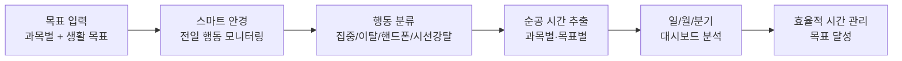

### 3.1 핵심 목표

| # | 목표 | 설명 |
|---|------|------|
| 1 | **목표 설정 & 추적** | 과목별 학습 목표 + 그 외 생활 목표(운동, 독서 등)를 등록하고 달성률 추적 |
| 2 | **순공 시간 자동 측정** | 안경 웹캠으로 시선·집중도를 분석하여 진짜 공부한 시간만 기록 |
| 3 | **전일 행동 감시** | 핸드폰 사용, 시선 강탈, 졸음, 자리 이탈 등 모든 비집중 행동 포착 |
| 4 | **다차원 대시보드** | 일간/월간/분기별 순공 시간·행동 패턴·목표 달성률 시각화 |
| 5 | **행동 리포트** | "오늘 핸드폰 47분 봄", "시선 강탈 23회" 등 정량적 피드백 |

---

## 4. 목표 관리 체계

### 4.1 목표 유형

| 유형 | 예시 | 측정 방식 |
|------|------|-----------|
| **과목 학습** | 행정법 하루 2시간 | 안경 시선 추적 → 순공 시간 |
| **기술 학습** | 코딩 실습 1시간 | 안경 시선 + 화면 응시 감지 |
| **독서** | 하루 30분 읽기 | 안경 시선 → 책/텍스트 응시 패턴 |
| **운동** | 주 3회 1시간 | 안경 자이로/가속도 + 자세 감지 |
| **명상/휴식** | 하루 15분 | 안경 눈 감김 + 안정 자세 감지 |
| **기타 목표** | 영상 시청 제한 등 | 시선 방향 + 화면 감지 |

### 4.2 목표 설정 구조

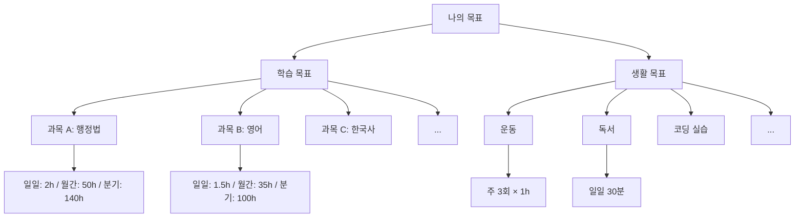

---

## 5. 유저 시나리오

### 시나리오 1: 첫 사용 - 목표 설정

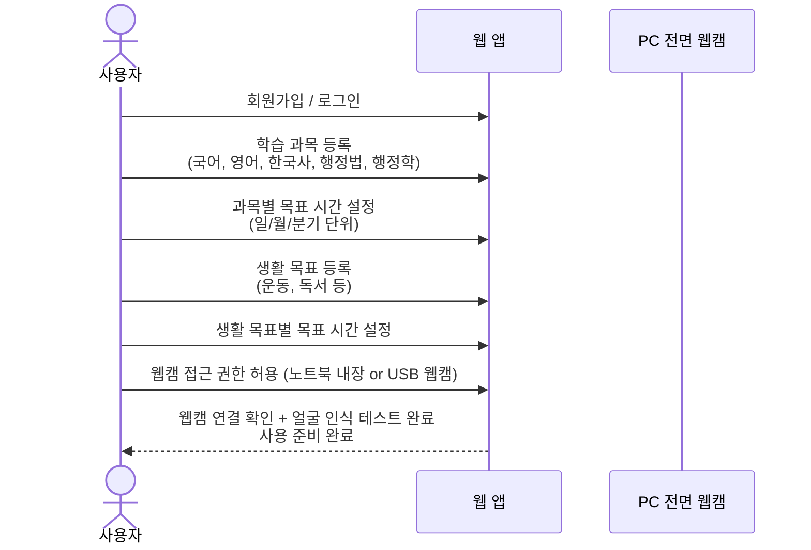

### 시나리오 2: 공부 시작 - 안경 기반 순공 측정

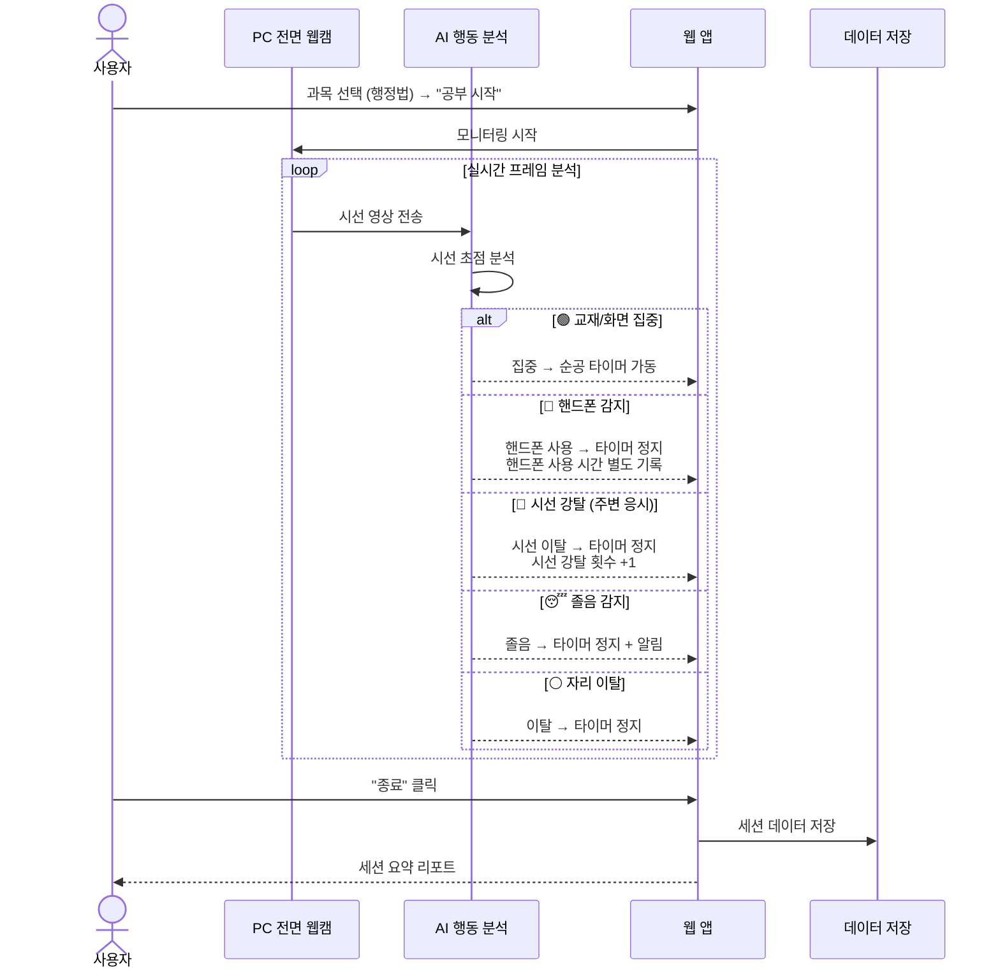

**세션 요약 리포트 예시:**

| 항목 | 값 |
|------|-----|
| 총 경과 시간 | 2시간 30분 |
| **순공 시간** | **1시간 52분** |
| 순공률 | 74.7% |
| 핸드폰 사용 | 18분 (7회) |
| 시선 강탈 | 12회 (총 8분) |
| 졸음 | 2회 (총 5분) |
| 자리 이탈 | 1회 (7분) |

### 시나리오 3: 하루 종일 행동 모니터링 (전일 모드)

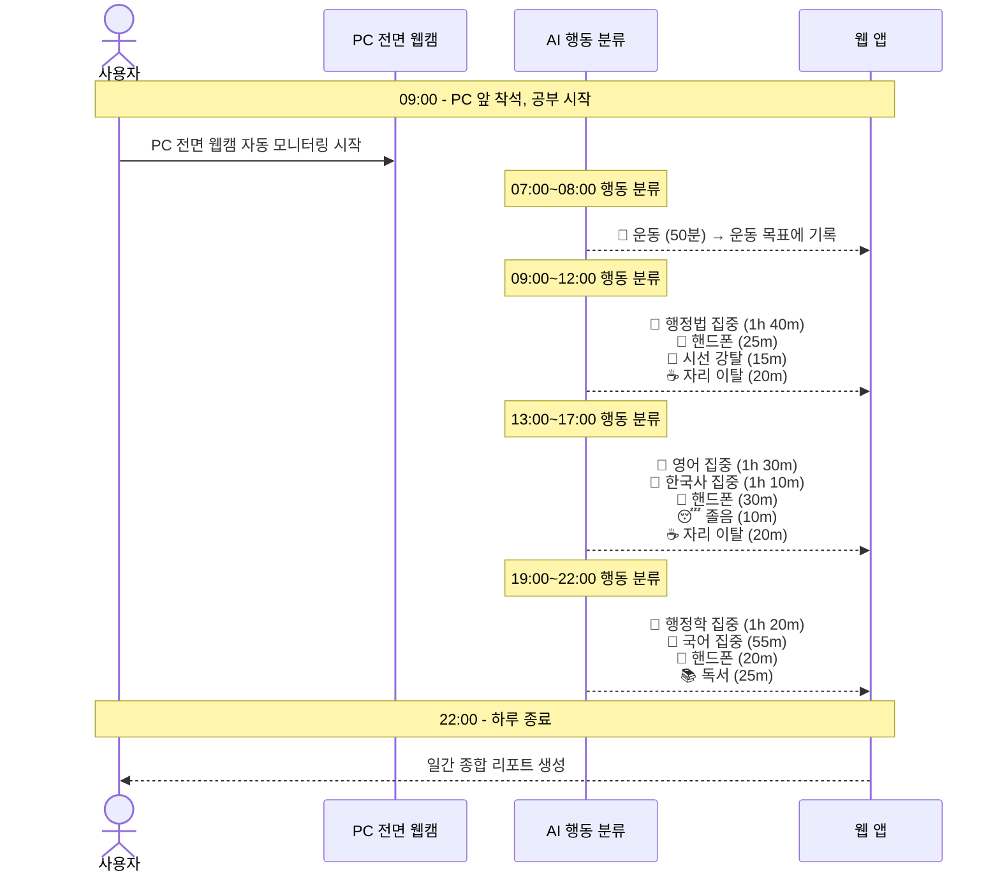

### 시나리오 4: 일간 대시보드 확인

사용자가 하루를 마치고 "대시보드 > 오늘" 탭을 열어 확인하는 화면:

**상단 KPI 카드**

| 총 순공 시간 | 순공률 | 핸드폰 사용 | 시선 강탈 | 졸음 |
|:---:|:---:|:---:|:---:|:---:|
| **6h 35m** | **71%** | **1h 15m** | **38회** | **10m** |
| 목표 10h 대비 66% | 전일 대비 +3% | 전일 대비 -10m | 전일 대비 -5회 | 전일 대비 동일 |

**과목별 순공 시간 vs 목표**

| 과목 | 순공 시간 | 일일 목표 | 달성률 | 상태 |
|------|-----------|-----------|--------|------|
| 행정법 | 1h 40m | 2h 00m | 83% | 🟡 거의 달성 |
| 영어 | 1h 30m | 1h 30m | 100% | 🟢 달성 |
| 한국사 | 1h 10m | 1h 00m | 110% | 🟢 초과 달성 |
| 행정학 | 1h 20m | 2h 00m | 65% | 🔴 부족 |
| 국어 | 0h 55m | 1h 30m | 61% | 🔴 부족 |

**생활 목표 달성**

| 목표 | 실적 | 달성 여부 |
|------|------|-----------|
| 운동 50분 | 50분 | 🟢 달성 |
| 독서 30분 | 25분 | 🟡 83% |

**비집중 행동 분석**

| 비집중 유형 | 총 시간 | 횟수 | 가장 빈번한 시간대 |
|-------------|---------|------|-------------------|
| 📱 핸드폰 사용 | 1h 15m | 22회 | 13~14시 (점심 후) |
| 👀 시선 강탈 | 32m | 38회 | 15~16시 |
| 😴 졸음 | 10m | 3회 | 14시 |
| ☕ 자리 이탈 | 40m | 5회 | 12시, 15시, 18시 |

**시간대별 집중도 히트맵**

| 시간 | 07 | 08 | 09 | 10 | 11 | 12 | 13 | 14 | 15 | 16 | 17 | 18 | 19 | 20 | 21 | 22 |
|------|:--:|:--:|:--:|:--:|:--:|:--:|:--:|:--:|:--:|:--:|:--:|:--:|:--:|:--:|:--:|:--:|
| 상태 | 🏃 | -- | 🟢 | 🟢 | 🟡 | ☕ | 🔴 | 🔴 | 🟡 | 🟢 | 🟢 | ☕ | 🟢 | 🟢 | 🟡 | -- |

### 시나리오 5: 월간/분기 리포트 확인

**월간 핵심 지표**

| 지표 | 값 | 전월 대비 |
|------|----|-----------|
| 월 누적 순공 | 168h 30m | +12h |
| 월 평균 일일 순공 | 6h 02m | +0h 25m |
| 월 평균 순공률 | 72% | +4% |
| 월 핸드폰 총 사용 | 32h | -5h |
| 월 시선 강탈 총 횟수 | 840회 | -120회 |

**분기 목표 달성 예측**

| 과목 | 분기 목표 | 현재 누적 | 달성 예측 | 비고 |
|------|-----------|-----------|-----------|------|
| 행정법 | 140h | 48h | 144h (달성 가능) | 현재 페이스 유지 시 |
| 영어 | 100h | 38h | 114h (달성 가능) | 여유 있음 |
| 한국사 | 80h | 30h | 90h (달성 가능) | 양호 |
| 행정학 | 120h | 35h | 105h (위험) | 일일 +15분 필요 |
| 국어 | 100h | 28h | 84h (위험) | 일일 +20분 필요 |

### 시나리오 6: 학습 체크리스트 + 효율 분석

```
행정법
├── ✅ 제1장 총론 (투자: 12h)
│   ├── ✅ 1절 행정의 의의
│   ├── ✅ 2절 행정법의 법원
│   └── ✅ 3절 행정법의 일반원칙
├── 🔲 제2장 행정작용법 (투자: 20h, 진행중)
│   ├── ✅ 1절 행정입법
│   ├── 🔲 2절 행정행위
│   └── 🔲 3절 기타 행정작용
└── 🔲 제3장 행정구제법 (투자: 0h)
    ├── 🔲 1절 행정심판
    └── 🔲 2절 행정소송

진도율: 4/8 (50%) | 투자 시간: 32h | 효율 점수: 1.56
```

**과목별 효율 분석 비교**

| 과목 | 투자 시간 | 투자 비율 | 진도율 | 효율 점수 | 진단 |
|------|-----------|-----------|--------|-----------|------|
| 한국사 | 28h | 17% | 70% | **4.12** | 매우 효율적 |
| 국어 | 42h | 25% | 65% | 2.60 | 효율적 |
| 영어 | 30h | 18% | 45% | 2.50 | 보통 |
| 행정학 | 30h | 18% | 50% | 2.78 | 보통 |
| 행정법 | 38h | 22% | 30% | **1.36** | 비효율 - 방법 점검 필요 |

---

## 6. 스마트 안경 하드웨어 구성

### 6.1 단계별 카메라 구성

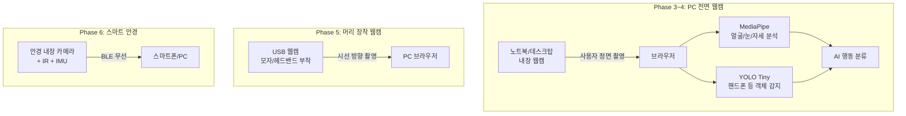

> **Phase 3~4에서는 추가 장비 없이**, 이미 있는 컴퓨터 전면 웹캠(노트북 내장 or USB 웹캠)으로 사용자 얼굴을 정면에서 촬영하여 분석합니다. 머리 장착이나 스마트 안경은 이후 단계에서 진행합니다.

### 6.2 PC 전면 웹캠으로 감지 가능한 항목

| 감지 항목 | 가능 여부 | 방법 |
|-----------|:---------:|------|
| 자리 이탈 | ✅ | 얼굴 미검출 → 이탈 판정 |
| 졸음 | ✅ | EAR (눈 감김 비율) 직접 측정 가능 |
| 고개 방향 (비집중) | ✅ | Face Mesh → solvePnP → pitch/yaw/roll |
| 핸드폰 사용 | ✅ | YOLO로 손에 든 핸드폰 객체 감지 |
| 하품 | ✅ | 입 벌림 비율 (MAR) 계산 |
| 시선 방향 (대략) | 🟡 부분적 | 동공 위치로 좌/우/정면 추정 (정밀도 제한) |
| 시선 강탈 (정밀) | ❌ 제한적 | 정면 카메라로는 "무엇을 보는지" 판별 어려움 → Phase 5에서 해결 |

> **전면 웹캠의 강점**: 졸음(EAR)과 얼굴 표정 분석은 정면 촬영이 오히려 최적. 머리 장착 웹캠보다 정확함.

---

## 7. 컴퓨터 비전 기반 행동 분류 알고리즘

### 7.1 전체 파이프라인

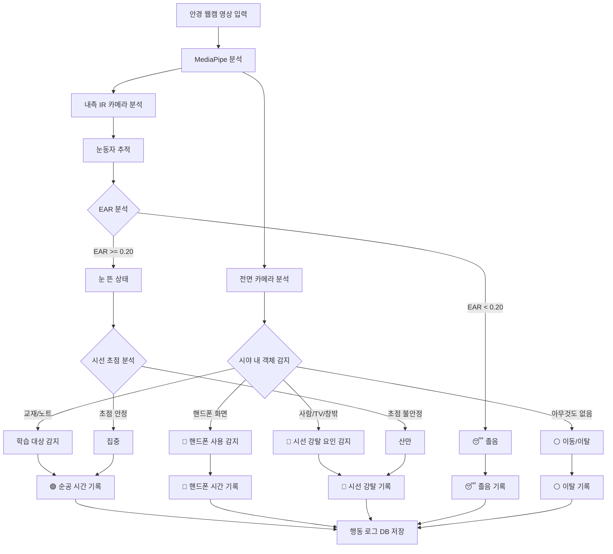

### 7.2 시선 초점 분석 알고리즘

```
알고리즘: 시선_초점_분석

입력: IR 카메라 눈동자 영상, 전면 카메라 시야 영상
출력: 초점 상태 (집중 / 산만 / 이탈)

1. IR 카메라에서 동공(pupil) 위치를 추출한다
   - MediaPipe Iris 모델 사용
   - 좌/우 동공 중심 좌표 (x, y) 획득

2. 동공 위치의 안정성을 계산한다
   - 최근 N프레임(약 1초)의 동공 좌표를 버퍼에 저장
   - 표준편차(SD)를 계산한다
     SD_x = stdev(최근 N프레임의 x좌표)
     SD_y = stdev(최근 N프레임의 y좌표)
   - 초점_안정도 = 1 / (SD_x + SD_y + epsilon)

3. 초점 상태를 판정한다
   IF 초점_안정도 > 높음_임계값 THEN
     → "집중" (한 곳을 응시하고 있음)
   ELSE IF 초점_안정도 > 낮음_임계값 THEN
     → "읽기" (시선이 규칙적으로 이동 = 텍스트 읽는 패턴)
   ELSE
     → "산만" (시선이 불규칙하게 흔들림)
   END IF

4. 읽기 패턴 별도 감지
   - 시선이 좌→우로 규칙적 수평 이동 후 좌측 아래로 복귀
   - 이 패턴이 반복되면 "텍스트 읽기 중" → 순공으로 판정
```

### 7.3 핸드폰 사용 감지 알고리즘

```
알고리즘: 핸드폰_사용_감지

입력: 전면 카메라 영상
출력: 핸드폰 사용 여부, 사용 시간

1. 전면 카메라 영상에서 객체 감지를 수행한다
   - MediaPipe Object Detection 또는 경량 모델 사용
   - "핸드폰 형태의 직사각형 발광체" 패턴 감지

2. 핸드폰 감지 조건:
   - 시야 하단~중앙에 직사각형 발광 영역 존재
   - 일정 크기 이상 (시야의 10% 이상 차지)
   - 지속 시간 2초 이상 (잠깐 시계 확인과 구분)

3. IF 핸드폰 감지 THEN
     3-1. 핸드폰_사용_카운터 시작
     3-2. 현재 과목 순공 타이머 정지
     3-3. "핸드폰 사용" 구간으로 기록
     3-4. IF 연속 사용 5분 이상 THEN
            알림: "핸드폰 5분째 사용 중입니다"
          END IF
   END IF

4. 핸드폰이 시야에서 사라지면:
   4-1. 핸드폰 사용 구간 종료
   4-2. 사용 시간, 시작/종료 시각 기록
   4-3. 디바운싱 1초 후 순공 타이머 재개
```

### 7.4 시선 강탈 감지 알고리즘

```
알고리즘: 시선_강탈_감지

입력: 전면 카메라 영상, IR 카메라 눈동자 데이터
출력: 시선 강탈 이벤트 (횟수, 지속 시간, 원인 추정)

1. 기준선 설정:
   - 공부 시작 시 "학습 대상 방향"을 기준선으로 저장
   - 교재 위치 = 시야 중앙~하단

2. 시선 이탈 감지:
   - 동공이 기준선에서 크게 벗어남 (좌/우/상방 이탈)
   - 고개 방향이 급격히 변경 (IMU 센서 + MediaPipe Pose)

3. 시선 강탈 판정:
   IF 시선이 기준선에서 이탈 AND 이탈 지속 > 1초 THEN
     시선_강탈_이벤트 기록 시작
     원인 추정:
       - 전면 카메라에 사람 감지 → "주변 사람"
       - 고개가 특정 방향으로 고정 → "TV/화면"
       - 시선이 창 방향 → "창밖"
       - 원인 불명 → "기타"
   END IF

4. 시선 복귀 시:
   4-1. 시선_강탈_이벤트 종료
   4-2. {시작시각, 종료시각, 지속시간, 추정원인} 기록

5. 연속 강탈 알림:
   IF 최근 10분 내 시선 강탈 5회 이상 THEN
     알림: "집중이 자주 흐트러지고 있어요. 환경을 바꿔볼까요?"
   END IF
```

### 7.5 졸음 감지 알고리즘 (EAR 기반)

```
알고리즘: 졸음_감지

입력: IR 카메라 눈 영상
출력: 졸음 여부

1. 눈 랜드마크에서 EAR(Eye Aspect Ratio) 계산
   EAR = (|P2-P6| + |P3-P5|) / (2 × |P1-P4|)

2. 양쪽 눈 평균 EAR 산출
   평균_EAR = (왼쪽_EAR + 오른쪽_EAR) / 2

3. 졸음 판정:
   IF 평균_EAR < 0.20 연속 1.5초 이상 THEN
     상태 = "졸음"
     순공 타이머 정지
     알림음 재생
     졸음 구간 기록
   END IF

4. 졸음 전조 감지:
   IF 평균_EAR이 최근 5분간 점진적 하락 추세 THEN
     알림: "졸음이 올 수 있어요. 잠깐 스트레칭 어때요?"
   END IF
```

### 7.6 종합 행동 분류 알고리즘

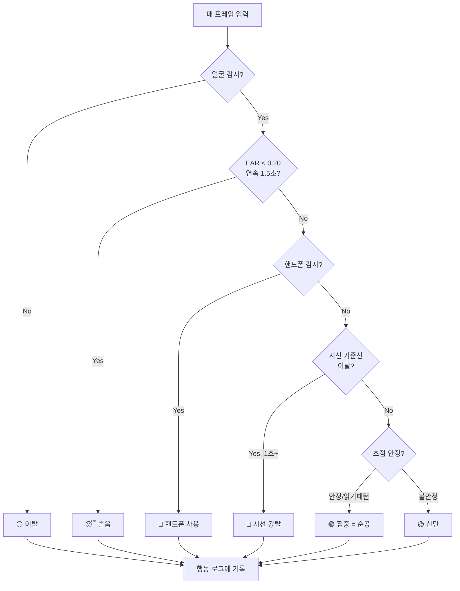

**우선순위**: 이탈 > 졸음 > 핸드폰 > 시선 강탈 > 산만 > 집중

### 7.7 성능 최적화

| 항목 | 설정 | 이유 |
|------|------|------|
| 비전 처리 FPS | 10fps (3프레임당 1회) | 안경 배터리 절약 + 처리 부하 감소 |
| 상태 전환 디바운싱 | 집중→비집중: 2초, 비집중→집중: 1초 | 눈 깜빡임·순간 시선 이동 오탐 방지 |
| 영상 해상도 | 640×480 | MediaPipe 분석에 충분 |
| 전송 방식 | PC 내장/USB 웹캠 → 브라우저 getUserMedia | 추가 장비 불필요 |

---

## 8. 대시보드 구성

### 8.1 대시보드 탭 구조

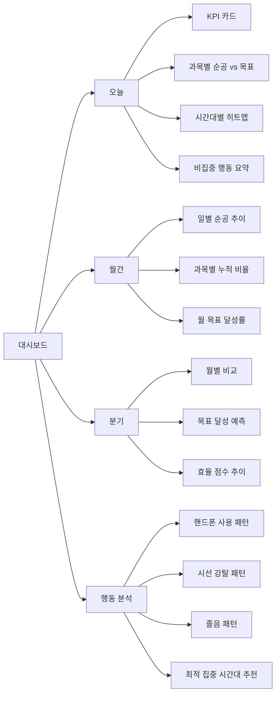

### 8.2 행동 분석 대시보드 (신규)

**핸드폰 사용 패턴 분석**

| 분석 항목 | 내용 |
|-----------|------|
| 일 평균 사용 시간 | 1h 15m |
| 가장 많이 사용하는 시간대 | 13~14시 (점심 직후) |
| 평균 1회 사용 시간 | 3분 24초 |
| 주간 추이 | 월 1h40m → 화 1h20m → 수 1h05m (감소 추세) |
| 핸드폰 사용 후 재집중까지 평균 | 2분 10초 |

**시선 강탈 패턴 분석**

| 분석 항목 | 내용 |
|-----------|------|
| 일 평균 시선 강탈 | 38회 |
| 주요 원인 | 주변 사람 45%, 소리 30%, 기타 25% |
| 가장 빈번한 시간대 | 15~16시 |
| 강탈 후 재집중까지 평균 | 45초 |
| 권장 | "15~16시에는 조용한 장소 추천" |

**최적 집중 시간대 추천**

| 순위 | 시간대 | 평균 순공률 | 평균 시선 강탈 | 추천 과목 |
|------|--------|-------------|----------------|-----------|
| 1 | 09~11시 | 88% | 2회/h | 어려운 과목 (행정법) |
| 2 | 19~21시 | 82% | 3회/h | 보통 과목 (영어) |
| 3 | 15~17시 | 65% | 8회/h | 쉬운 과목 (한국사 복습) |

---

## 9. 화면 흐름도

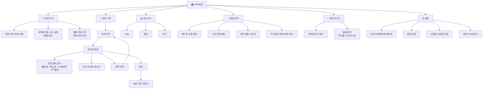

---

## 10. 데이터 모델

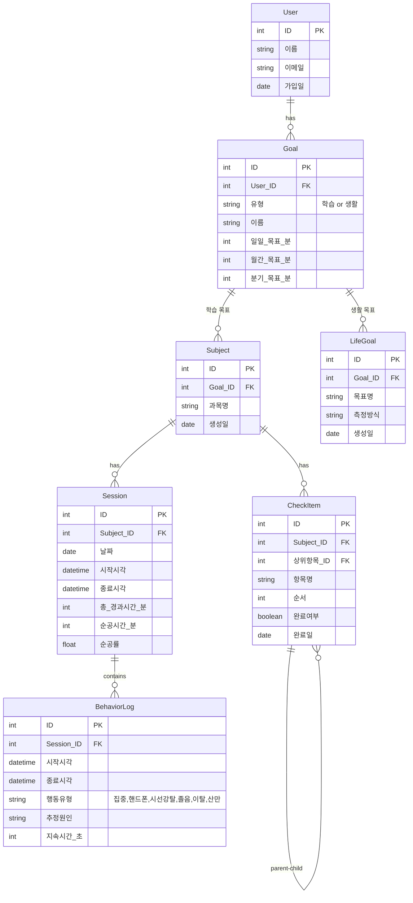

---

## 11. 알림 규칙

| 상황 | 조건 | 알림 내용 | 방식 |
|------|------|-----------|------|
| 핸드폰 사용 | 연속 5분 이상 | "핸드폰 5분째 사용 중입니다" | 안경 진동 + 앱 알림 |
| 핸드폰 빈번 | 10분 내 3회 이상 | "핸드폰을 자주 확인하고 있어요" | 앱 알림 |
| 시선 강탈 빈번 | 10분 내 5회 이상 | "집중이 자주 흐트러져요. 환경을 바꿔볼까요?" | 앱 알림 |
| 졸음 감지 | EAR < 0.20 연속 1.5초 | "잠깐! 졸고 있어요" | 안경 진동 + 알림음 |
| 졸음 전조 | EAR 5분간 하락 추세 | "졸음이 올 수 있어요. 스트레칭 어때요?" | 앱 알림 |
| 연속 집중 50분 | 순공 50분 연속 | "50분 집중했어요! 10분 휴식 권장" | 안경 진동 |
| 자리 이탈 10분+ | 미감지 10분 이상 | "오래 자리를 비웠어요" | 앱 알림 |
| 일일 목표 달성 | 과목 목표 100% | "행정법 목표 시간 달성!" | 앱 축하 알림 |
| 과목 3일 미학습 | 특정 과목 3일 0분 | "영어를 3일째 공부하지 않았어요" | 앱 알림 |
| 최적 시간대 알림 | 분석 기반 추천 | "지금은 행정법 집중하기 좋은 시간이에요" | 앱 알림 |

---

## 12. 기술 스택

| 영역 | 기술 | 역할 |
|------|------|------|
| 백엔드 | **Python + Flask** | API 서버, 데이터 처리, 행동 분석 집계 |
| 프론트엔드 | **HTML + JavaScript** | UI, 실시간 타이머, 대시보드 |
| 컴퓨터 비전 | **MediaPipe (JS/Python)** | 얼굴 감지, Iris 추적, 객체 감지 |
| 시선 추적 | **MediaPipe Iris + Face Mesh** | 동공 위치, EAR 계산, 시선 방향 |
| 객체 감지 | **MediaPipe Object Detection** | 핸드폰, 사람, 화면 등 감지 |
| 대시보드 | **Chart.js / JavaScript** | 시각화 차트, 히트맵 |
| 데이터 저장 | **SQLite / JSON** | 학습 기록, 행동 로그 저장 |
| 카메라 (Phase 3~4) | **PC 전면 웹캠** | 노트북 내장 or USB 웹캠, 브라우저 getUserMedia |
| (Phase 5) 안경 통신 | **Web Bluetooth API** | 안경-앱 BLE 연결 |

---

---

## 13. 단계별 개발 로드맵

### 13.1 개발 단계 개요

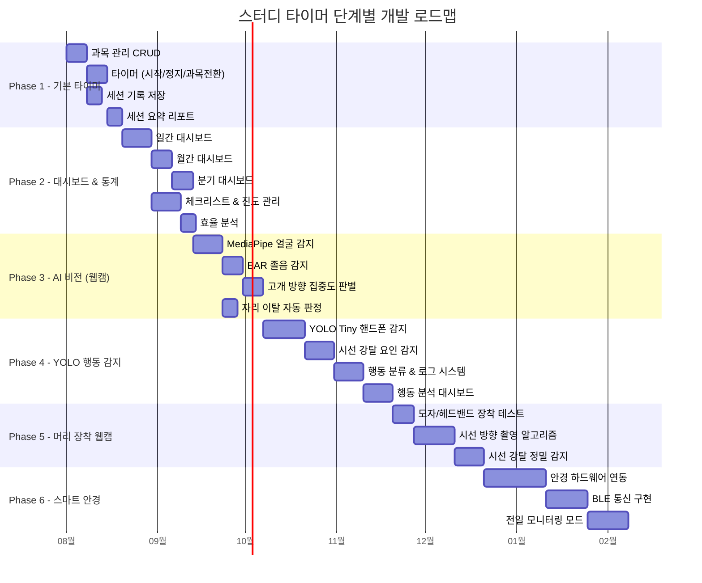

### 13.2 Phase 1: 기본 타이머 (MVP)

> **목표**: 과목별 수동 타이머로 학습 시간 기록의 기본 기능 완성

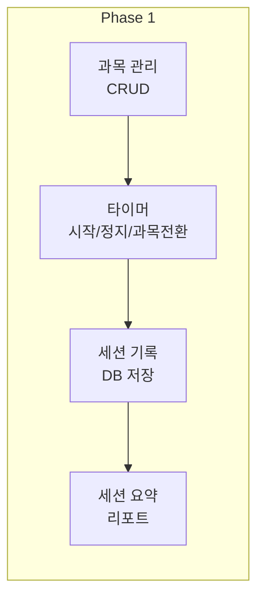

| 기능 | 상세 | 기술 |
|------|------|------|
| 과목 관리 | 과목 추가/수정/삭제, 목표 시간 설정 (일/월/분기) | Flask + SQLite |
| 타이머 | 시작/정지/일시정지, 과목 전환, 실시간 카운트 | JavaScript |
| 생활 목표 | 학습 외 목표(운동, 독서 등) 등록 및 수동 시간 기록 | Flask + SQLite |
| 세션 기록 | 과목명, 시작/종료 시각, 총 시간 저장 | SQLite |
| 세션 요약 | 종료 시 총 시간, 과목별 시간 표시 | HTML + JS |

**Phase 1 산출물:**
- 사용자가 과목을 선택하고 수동으로 시작/정지하여 학습 시간을 기록
- 아직 자동 순공 판별 없음 (수동 기록 = 순공으로 간주)

---

### 13.3 Phase 2: 대시보드 & 통계

> **목표**: 기록된 데이터를 다양한 관점으로 시각화하여 학습 관리 가능

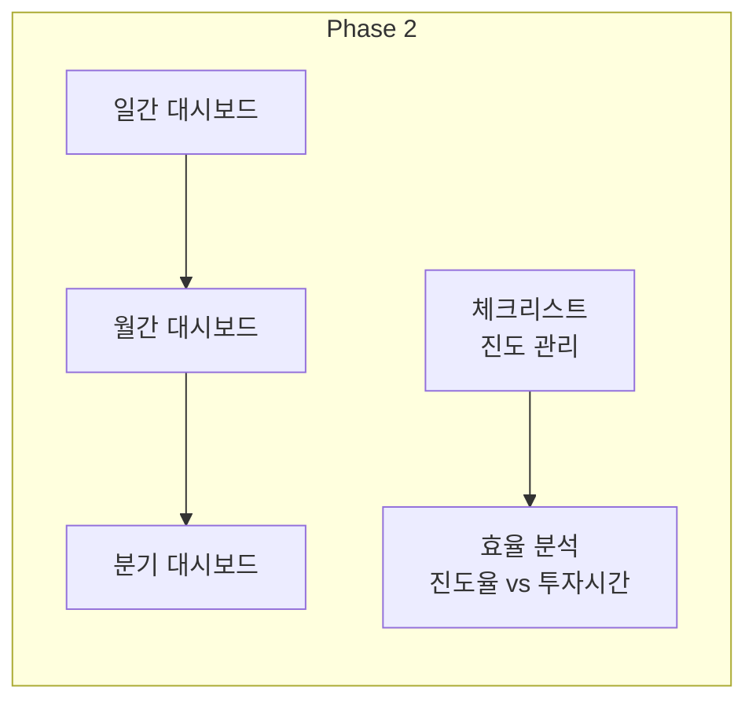

| 기능 | 상세 | 기술 |
|------|------|------|
| 일간 대시보드 | KPI 카드, 과목별 순공 vs 목표 막대그래프, 시간대별 히트맵 | Chart.js |
| 월간 대시보드 | 일별 추이 선 그래프, 과목별 비율 도넛 차트, 전월 대비 | Chart.js |
| 분기 대시보드 | 월별 비교, 목표 달성 예측, 효율 점수 추이 | Chart.js |
| 체크리스트 | 과목별 트리형 진도 체크, 진도율 자동 계산 | Flask + JS |
| 효율 분석 | 효율 점수 = 진도율 / 투자시간비율, 과목별 진단 | Python |
| 목표 달성률 | 일/월/분기 목표 대비 현재 달성 퍼센트 | Python + Chart.js |

**Phase 2 산출물:**
- 수동 타이머 기반이지만 풍부한 통계와 시각화 제공
- 과목별·기간별 학습 패턴 파악 가능

---

### 13.4 Phase 3: AI 비전 - MediaPipe (웹캠 자동 감지)

> **목표**: 웹캠 + MediaPipe로 자리 이탈, 졸음, 비집중을 자동 감지하여 **진짜 순공 시간** 추출

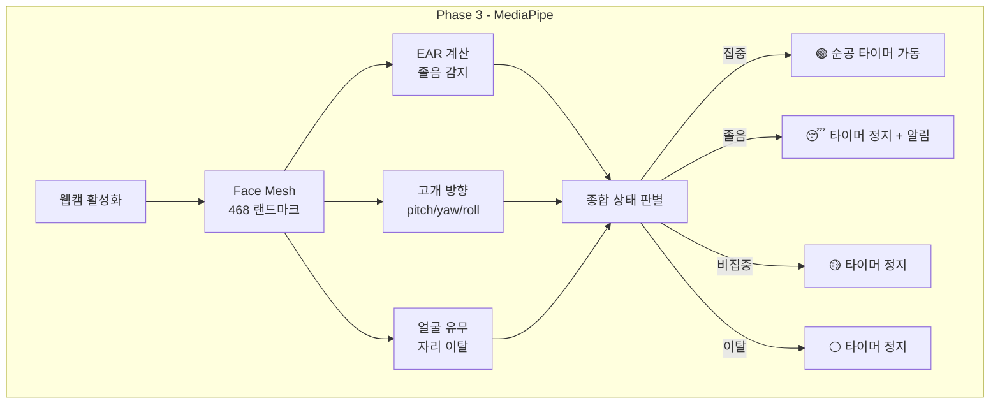

| 기능 | 알고리즘 | 임계값 |
|------|----------|--------|
| 얼굴 감지 (자리 이탈) | Face Mesh 랜드마크 검출 여부 | 미검출 30프레임(1초) 연속 → 이탈 |
| 졸음 감지 | EAR (Eye Aspect Ratio) | EAR < 0.20 연속 45프레임(1.5초) → 졸음 |
| 집중도 판별 | 고개 회전 각도 (solvePnP → 오일러 각) | yaw > 30도 or pitch 범위 이탈 → 비집중 |
| 상태 전환 디바운싱 | 집중→비집중 2초, 비집중→집중 1초 | 순간 오탐 방지 |

**Phase 3 산출물:**
- 수동 시작/정지 + 자동 일시정지가 결합
- "앉아있었지만 졸았던 시간"이 자동 차감됨
- Phase 2 대시보드의 "순공 시간"이 실질적으로 의미 있는 데이터로 전환

---

### 13.5 Phase 4: YOLO Tiny - 행동 감지 확장

> **목표**: YOLO Tiny 모델로 핸드폰, 주변 사람, 화면 등 객체를 감지하여 **비집중 행동을 세분화**

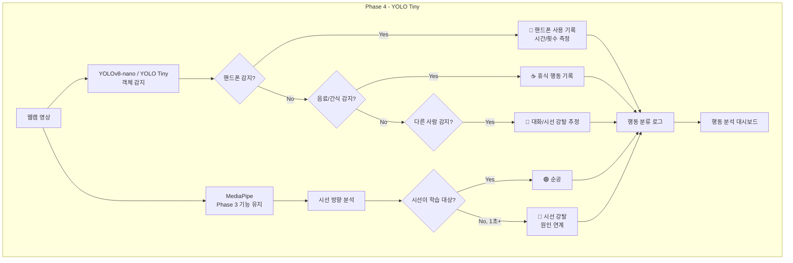

| 기능 | 모델 | 감지 대상 |
|------|------|-----------|
| 핸드폰 감지 | YOLOv8-nano (COCO 'cell phone') | 시야 내 핸드폰 → 사용 시간·횟수 기록 |
| 음료/간식 감지 | YOLOv8-nano (COCO 'cup', 'bottle') | 휴식 행동 추정 |
| 사람 감지 | YOLOv8-nano (COCO 'person') | 옆 사람과 대화 → 시선 강탈 원인 분류 |
| 화면/TV 감지 | YOLOv8-nano (COCO 'tv', 'laptop') | 비학습 화면 응시 감지 |
| 행동 분류 | MediaPipe + YOLO 결합 | 집중/핸드폰/시선강탈/졸음/이탈/휴식 6가지 분류 |
| 행동 분석 대시보드 | Chart.js | 핸드폰 패턴, 시선 강탈 패턴, 최적 집중 시간대 |

**YOLO Tiny vs MediaPipe 역할 분담:**

| 역할 | MediaPipe (Phase 3) | YOLO Tiny (Phase 4) |
|------|---------------------|---------------------|
| 얼굴/눈 분석 | ✅ Face Mesh, EAR | - |
| 고개 방향 | ✅ solvePnP | - |
| 핸드폰 감지 | - | ✅ Object Detection |
| 사람 감지 | - | ✅ Object Detection |
| 음료/물건 감지 | - | ✅ Object Detection |
| 실행 환경 | 브라우저 JS | Python (서버) 또는 ONNX (브라우저) |

**Phase 4 산출물:**
- "왜 집중을 못했는가"에 대한 정량적 답변 제공
- "핸드폰 47분, 시선 강탈 23회" 같은 구체적 행동 피드백
- 행동 개선을 위한 데이터 기반 추천

---

### 13.6 Phase 5: 머리 장착 USB 웹캠

> **목표**: 전면 웹캠의 한계(시선 강탈 시 "무엇을 보는지" 판별 불가)를 해결하기 위해 USB 웹캠을 모자/헤드밴드에 부착하여 시선 방향을 촬영

| 기능 | 상세 |
|------|------|
| 장착 테스트 | 모자/헤드밴드/안경 프레임에 USB 웹캠 클립 고정 |
| 시선 방향 촬영 | 사용자가 보는 방향의 영상 획득 |
| 시선 강탈 정밀 감지 | "교재 vs 핸드폰 vs TV vs 창밖" 등 응시 대상 분류 |
| 듀얼 카메라 | 전면 웹캠(얼굴) + 머리 웹캠(시선 방향) 병행 가능 |

---

### 13.7 Phase 6: 스마트 안경 (무선화) + 전일 모니터링

> **목표**: Phase 3~5에서 검증된 알고리즘을 스마트 안경(BLE 무선)으로 이식

| 기능 | 상세 |
|------|------|
| 유선 → 무선 전환 | USB 웹캠 → 안경 내장 카메라 + BLE |
| 안경 하드웨어 | 초소형 카메라 + IR 센서 + IMU + BLE |
| BLE 통신 | Web Bluetooth API로 앱-안경 연결 |
| 시선 추적 고도화 | IR 기반 정밀 동공 추적 |
| 전일 모니터링 | 학습 외 시간(운동, 이동 등)도 행동 분류 |
| 생활 목표 자동 추적 | 운동(IMU), 독서(시선패턴) 자동 감지 |

---

### 13.7 단계별 요약

| Phase | 이름 | 핵심 가치 | 카메라 | AI 수준 |
|-------|------|-----------|--------|---------|
| **1** | 기본 타이머 MVP | 과목별 시간 기록 시작 | 없음 (수동) | 없음 |
| **2** | 대시보드 & 통계 | 데이터 시각화로 패턴 파악 | 없음 (수동) | 없음 |
| **3** | MediaPipe 자동 감지 | **진짜 순공 시간** 측정 | **PC 전면 웹캠** | MediaPipe 얼굴/눈/자세 |
| **4** | YOLO 행동 감지 | 비집중 원인 분석 | **PC 전면 웹캠** | YOLO Tiny 객체감지 |
| **5** | 머리 장착 웹캠 | 시선 강탈 정밀 감지 | **USB 웹캠 (머리 부착)** | MediaPipe + YOLO |
| **6** | 스마트 안경 | 전일 행동 모니터링 | **안경 내장 (BLE 무선)** | MediaPipe + YOLO + IR |

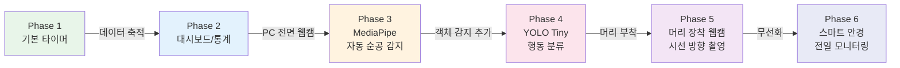

---

*본 문서는 스마트 안경 기반 전일 행동 모니터링 학습 관리 시스템의 유저 시나리오 및 알고리즘 설계 문서입니다.*
*기술 스택: Python (Flask) + HTML + JavaScript + MediaPipe + YOLO Tiny*
