# 2~4일차 — 바이브 코딩으로 프로젝트를 만든다

> **대상** : 중학교 2학년 (12세 눈높이)
> **구성** : 2시간 × 3일 = 총 6시간
> **전제** : 1일차에서 팀 구성 완료, 프로젝트 선택 완료, 한 줄 기획서 + 역할 분담 + 화면 흐름도 보유
> **도구** : Python + Streamlit + AI (Claude / ChatGPT)
> **핵심** : 코드를 외워서 치는 것이 아니라, AI에게 말해서 만든다 (바이브 코딩)

---

## 전체 3일 흐름 한눈에

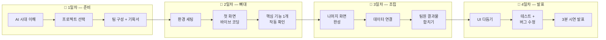

---

## 전체 개발 프로세스 로드맵

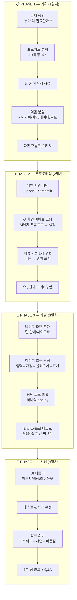

---

## 바이브 코딩 핵심 사이클

> 이 사이클이 2~4일차 내내 반복된다. 모든 기능은 이 루프로 만든다.

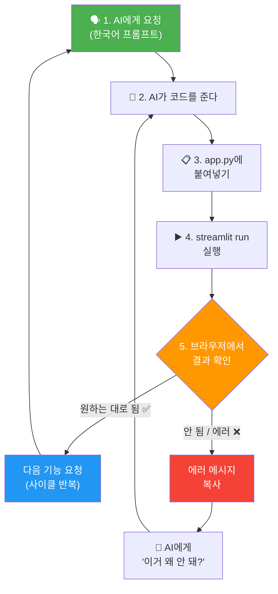

---

## 2~4일차 공통 원칙

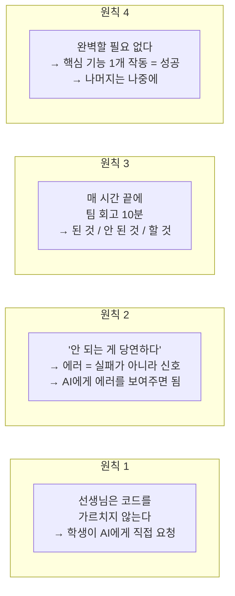

---

---

# 2일차 — 뼈대를 만든다

---

## 2일차 목표

```
오늘이 끝나면:
  ✅ 개발 환경이 세팅되어 있다
  ✅ 첫 번째 화면이 브라우저에 뜬다
  ✅ 핵심 기능 1개가 작동한다 (버튼 클릭 → 결과 표시 등)
  ✅ "와, 진짜 되네!" 경험을 한다
```

### 2일차 개발 프로세스

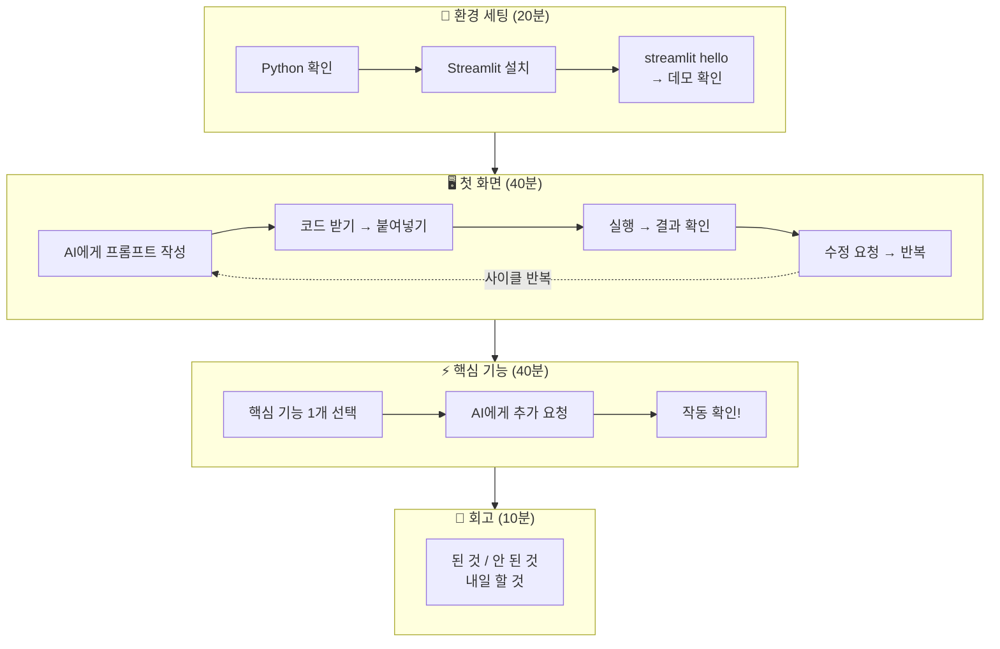

---

## 2일차 시간 배분

| 구간 | 시간 | 내용 |
|---|---|---|
| 환경 세팅 | 20분 | Python + Streamlit 설치 확인, 첫 실행 |
| 첫 화면 바이브 코딩 | 40분 | AI에게 첫 화면 요청 → 실행 → 수정 반복 |
| 핵심 기능 구현 | 40분 | 프로젝트의 핵심 로직 1개를 작동시킨다 |
| 팀 회고 | 10분 | 된 것 / 안 된 것 / 내일 할 것 |
| 정리 | 10분 | 코드 저장, 다음 시간 준비물 안내 |

---

## STEP 1. 환경 세팅 (20분)

### 환경 세팅 프로세스

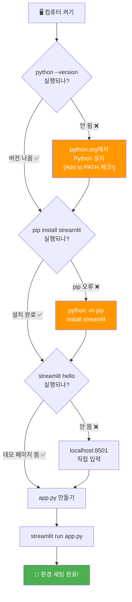

### 이미 설치되어 있는 경우 (학교 컴퓨터)

```
터미널(또는 명령 프롬프트)을 열고:

  streamlit hello

브라우저에 Streamlit 데모 페이지가 뜨면 → 준비 완료!
```

### 처음 설치하는 경우

```bash
# 1. 프로젝트 폴더 만들기
mkdir my_project
cd my_project

# 2. Streamlit 설치
pip install streamlit

# 3. 확인
streamlit hello
```

### 첫 앱 파일 만들기

```python
# app.py — 이 파일이 우리 프로젝트의 시작점
import streamlit as st

st.title("우리 팀 프로젝트")
st.write("여기에 앱이 만들어질 거야!")
```

```bash
# 실행
streamlit run app.py
```

> 브라우저에 "우리 팀 프로젝트"가 뜨면 → **환경 세팅 완료!**

### 환경 세팅이 안 될 때

| 문제 | 해결 |
|---|---|
| `pip` 명령어가 안 됨 | Python이 설치 안 된 것. python.org에서 다운로드 |
| `streamlit` 명령어가 안 됨 | `pip install streamlit` 다시 실행 |
| 브라우저가 안 열림 | 직접 `localhost:8501` 입력 |
| 학교에서 설치가 막혀 있음 | 선생님이 미리 설치해둬야 함 (부록 참고) |

---

## STEP 2. 첫 화면 바이브 코딩 (40분)

### 바이브 코딩 사이클 (2일차 핵심!)

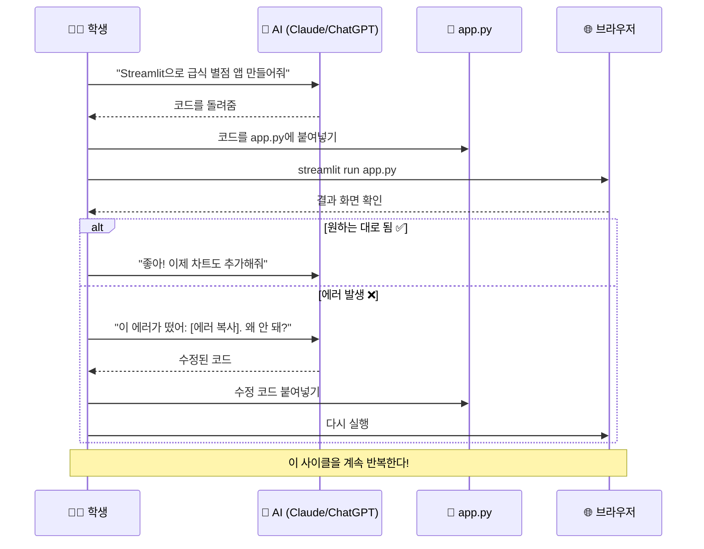

### 프로젝트별 첫 화면 바이브 코딩 가이드

---

#### ① 감정 방탈출 — 첫 화면: 인트로 + 감정 입력

**AI에게 보낼 프롬프트:**

```
Streamlit으로 감정 방탈출 게임의 시작 화면을 만들어줘.

화면 구성:
- 제목: "감정 방탈출"
- 설명 텍스트: "어두운 복도 끝에 세 개의 문이 있습니다..."
- 텍스트 입력칸: "지금 기분을 한 단어로 적어주세요"
- "입장하기" 버튼
- 버튼을 누르면 입력한 감정을 st.session_state에 저장하고
  "당신의 감정: [입력값]"을 표시해줘

Python Streamlit으로 만들어줘.
```

**기대 결과:**
```
┌────────────────────────────┐
│  감정 방탈출                │
│                            │
│  "어두운 복도 끝에          │
│   세 개의 문이 있습니다..." │
│                            │
│  지금 기분: [입력칸]       │
│                            │
│  [ 입장하기 ]              │
└────────────────────────────┘
```

**안 되면 이렇게 물어봐:**
```
"버튼을 눌러도 아무 반응이 없어. 
 st.session_state를 써서 버튼 클릭 후 다음 화면으로 넘어가게 해줘."
```

---

#### ③ 취향 추천 테스트 — 첫 화면: 시작 + 첫 번째 질문

**AI에게 보낼 프롬프트:**

```
Streamlit으로 취향 테스트 앱의 시작 화면을 만들어줘.

화면 구성:
- 제목: "나의 웹툰 취향 유형은?"
- 설명: "5개 질문에 답하면 딱 맞는 웹툰을 추천해드려요!"
- "시작하기" 버튼

버튼을 누르면 첫 번째 질문 화면으로 넘어가.
질문: "주말 오후, 이상적인 시간 보내기는?"
선택지 4개를 st.radio로 보여줘:
  1. 따뜻한 카페에서 음악 듣기
  2. 롤러코스터 타기
  3. 추리소설 읽기
  4. 친구랑 수다 떨기

st.session_state로 현재 단계를 관리해줘.
```

---

#### ④ 급식 별점 — 첫 화면: 오늘 메뉴 + 별점 입력

**AI에게 보낼 프롬프트:**

```
Streamlit으로 급식 별점 앱을 만들어줘.

화면 구성:
- 제목: "오늘의 급식"
- 오늘 메뉴를 리스트로 보여줘: ["비빔밥", "된장국", "깍두기", "요구르트"]
  (일단 하드코딩으로, 나중에 JSON으로 바꿀 거야)
- 별점: st.slider로 1~5점
- 한줄평: st.text_input
- "제출하기" 버튼
- 제출하면 "평가 완료! 비빔밥 4점"처럼 확인 메시지 표시

Python Streamlit으로 만들어줘.
```

---

#### ⑤ 공부 타이머 — 첫 화면: 과목 선택 + 타이머

**AI에게 보낼 프롬프트:**

```
Streamlit으로 공부 타이머 앱을 만들어줘.

화면 구성:
- 제목: "공부 타이머"
- 과목 선택: st.selectbox로 ["수학", "영어", "과학", "국어", "사회"]
- 타이머 시간 설정: st.number_input으로 분 단위 (기본값 25분)
- "시작" 버튼
- 시작하면 남은 시간을 카운트다운으로 표시
- 완료되면 "수학 25분 완료!" 메시지

Python Streamlit으로 만들어줘.
```

---

#### ⑦ 플레이리스트 추천 — 첫 화면: 무드 선택 + 추천

**AI에게 보낼 프롬프트:**

```
Streamlit으로 무드 기반 노래 추천 앱을 만들어줘.

화면 구성:
- 제목: "오늘의 플레이리스트"
- 무드 선택: 4개 컬럼으로 버튼 배치
  "😊 신남" / "😢 센치" / "😴 잔잔" / "🔥 에너지"
- 무드를 선택하면 아래에 추천 노래 5곡을 카드 형태로 표시
  (곡명, 아티스트, 추천 이유)
- 노래 데이터는 일단 딕셔너리로 하드코딩

Python Streamlit으로 만들어줘.
```

---

#### ⑧ 용돈 가계부 — 첫 화면: 예산 + 지출 입력

**AI에게 보낼 프롬프트:**

```
Streamlit으로 용돈 가계부 앱을 만들어줘.

화면 구성:
- 제목: "나의 용돈 가계부"
- 사이드바에 이번 달 용돈 입력: st.number_input (기본값 50000)
- 메인 화면에:
  - 지출 금액: st.number_input
  - 카테고리: st.selectbox ["편의점", "문구", "교통", "간식", "기타"]
  - 메모: st.text_input
  - "추가하기" 버튼
- 아래에 지출 내역 테이블 (st.dataframe)
- 남은 금액 표시 (st.metric)

Python Streamlit으로 만들어줘.
```

---

#### ⑨ 시간표 알리미 — 첫 화면: 오늘/내일 시간표

**AI에게 보낼 프롬프트:**

```
Streamlit으로 시간표 앱을 만들어줘.

화면 구성:
- 제목: "우리 반 시간표"
- 오늘 요일을 자동으로 인식해서 해당 시간표를 표시
- 시간표 데이터는 딕셔너리로:
  월: ["수학", "영어", "과학", "체육", "국어", "사회"]
  화: ["국어", "수학", "영어", "미술", "미술", "과학"]
  (나머지는 나중에 추가)
- 각 교시를 1교시, 2교시... 로 표로 보여줘
- "내일 보기" 버튼으로 내일 시간표로 전환

Python Streamlit으로 만들어줘.
```

---

#### ② 설문 리서치 툴 — 첫 화면: 설문 입력 폼

**AI에게 보낼 프롬프트:**

```
Streamlit으로 우리 학교 설문조사 앱을 만들어줘.

화면 구성:
- 제목: "우리 학교 급식 만족도 조사"
- 질문 1: "이번 주 급식 만족도" — st.slider (1~5점)
- 질문 2: "가장 좋았던 메뉴" — st.selectbox ["비빔밥", "카레", "돈까스", "제육볶음"]
- 질문 3: "개선할 점" — st.text_area
- "제출하기" 버튼
- 제출하면 "응답 완료! 감사합니다." 메시지 표시
- 응답 데이터를 st.session_state 리스트에 저장

Python Streamlit으로 만들어줘.
```

**기대 결과:**
```
┌────────────────────────────────┐
│  우리 학교 급식 만족도 조사     │
│                                │
│  Q1. 만족도: ●━━━━━━━○ 3점    │
│  Q2. 최고 메뉴: [비빔밥 ▼]    │
│  Q3. 개선할 점: [입력칸]       │
│                                │
│  [ 제출하기 ]                  │
│  ✅ 응답 완료! 감사합니다.      │
└────────────────────────────────┘
```

**안 되면 이렇게 물어봐:**
```
"제출한 응답이 저장이 안 되는 것 같아. 
 st.session_state.responses 리스트에 딕셔너리로 append하게 해줘.
 그리고 아래에 지금까지 응답 수를 보여줘."
```

---

#### ⑥ AI 과목 튜터 — 첫 화면: 과목 선택 + 질문 입력

**AI에게 보낼 프롬프트:**

```
Streamlit으로 AI 과목 튜터 앱을 만들어줘.

화면 구성:
- 제목: "AI 과목 튜터"
- 사이드바에 과목 선택: st.selectbox ["수학", "영어", "과학", "국어", "사회"]
- 메인 화면:
  - 선택한 과목에 따라 "수학 튜터입니다! 무엇이든 물어보세요" 텍스트 변경
  - 질문 입력: st.text_input("궁금한 것을 물어보세요")
  - "질문하기" 버튼
  - 버튼 클릭하면 아래에 "답변 준비 중..." 이라고 먼저 표시하고
  - 미리 만든 답변 딕셔너리에서 간단한 답변을 보여줘
    (나중에 AI API를 연결할 거니까, 일단은 하드코딩)

Python Streamlit으로 만들어줘.
```

**기대 결과:**
```
┌──────────┬──────────────────────────┐
│  과목    │  수학 튜터입니다!          │
│  ○ 수학  │  무엇이든 물어보세요       │
│  ○ 영어  │                          │
│  ○ 과학  │  Q: [분수 어떻게 더해요?] │
│  ○ 국어  │                          │
│  ○ 사회  │  [ 질문하기 ]            │
│          │                          │
│          │  💡 답변:                 │
│          │  분수의 덧셈은 통분을...   │
└──────────┴──────────────────────────┘
```

**수학 튜터 답변 딕셔너리 예시 (하드코딩용):**
```python
math_answers = {
    "분수": "분수의 덧셈은 통분이 핵심이에요! 분모를 같게 만들고 분자만 더하면 됩니다.",
    "방정식": "방정식은 미지수를 찾는 것! x가 뭔지 알아내려면 양쪽에 같은 걸 해주면 돼요.",
    "기본": "수학은 패턴을 찾는 학문이에요. 무엇이 궁금하세요?"
}
```

**안 되면 이렇게 물어봐:**
```
"질문에 대한 답변을 딕셔너리에서 못 찾아.
 키워드 매칭으로 질문에 '분수'가 포함되면 분수 답변을 보여주게 해줘.
 매칭되는 키워드가 없으면 '기본' 답변을 보여줘."
```

---

#### ⑩ 환경 대시보드 — 첫 화면: 지역 선택 + 차트

**AI에게 보낼 프롬프트:**

```
Streamlit으로 환경 데이터 대시보드를 만들어줘.

화면 구성:
- 제목: "우리 동네 환경 대시보드"
- 지역 선택: st.selectbox ["서울", "부산", "대구", "인천", "광주"]
- 선택한 지역의 환경 데이터를 표시:
  - 미세먼지 (PM2.5): st.metric으로 수치 + 좋음/보통/나쁨 표시
  - 기온: st.metric
  - 월별 미세먼지 변화: st.line_chart (1월~12월 샘플 데이터)
- 데이터는 딕셔너리로 하드코딩 (나중에 API 연결)

Python Streamlit으로 만들어줘.
```

**기대 결과:**
```
┌────────────────────────────────────┐
│  우리 동네 환경 대시보드            │
│  지역: [서울 ▼]                    │
│                                    │
│  PM2.5        기온         상태    │
│  35 μg/m³    24°C         보통    │
│   ▲5                              │
│                                    │
│  [월별 미세먼지 변화 차트~~~~~~~~]  │
│                                    │
└────────────────────────────────────┘
```

**환경 데이터 딕셔너리 예시:**
```python
env_data = {
    "서울": {"pm25": 35, "temp": 24, "status": "보통",
             "monthly": [45, 50, 40, 30, 25, 20, 18, 22, 28, 35, 42, 48]},
    "부산": {"pm25": 22, "temp": 26, "status": "좋음",
             "monthly": [30, 35, 28, 22, 18, 15, 12, 16, 20, 25, 30, 35]},
}
```

**안 되면 이렇게 물어봐:**
```
"st.metric에 delta 값을 추가해서 전월 대비 변화를 보여줘.
 그리고 PM2.5가 35 이상이면 st.warning으로 '외출 시 마스크 착용'을 표시해줘."
```

---

### 첫 화면이 떴을 때

```
축하! 🎉

첫 화면이 브라우저에 떴으면 → 일단 성공이다.
예쁘지 않아도 된다. 버그가 있어도 된다.
"내가 AI에게 말했더니 화면이 나왔다" — 이 경험이 중요하다.
```

---

### 첫 화면에서 자주 나는 에러와 대처

| 에러 상황 | AI에게 이렇게 물어봐 |
|---|---|
| 화면이 안 뜸 (빈 화면) | "코드를 실행했는데 빈 화면이야. 전체 코드 다시 보여줘" |
| 버튼을 눌러도 반응 없음 | "st.button 클릭 후 아무 반응이 없어. st.session_state를 써서 상태를 관리해줘" |
| 에러 메시지가 빨갛게 뜸 | "이 에러가 떴어: [에러 메시지 복사 붙여넣기]. 원인이 뭐야?" |
| 한글이 깨짐 | "한글이 깨져서 보여. UTF-8 인코딩 설정해줘" |
| 레이아웃이 이상함 | "화면이 너무 넓어. st.columns로 가운데 정렬해줘" |

### 에러 해결 프로세스 (디버깅 플로우)

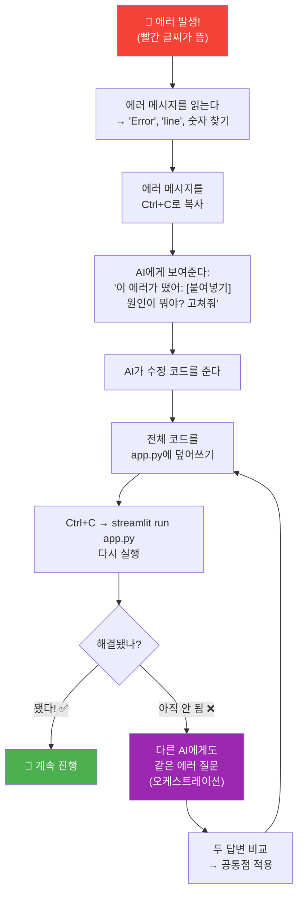

> **에러가 나면 당황하지 말고, 에러 메시지를 복사해서 AI에게 보여줘.**
> AI가 원인과 해결법을 알려준다.
> 이게 "디버깅"이고, 프로 개발자도 매일 하는 일이다.

---

## STEP 3. 핵심 기능 구현 (40분)

첫 화면이 떴으면, 이제 **핵심 기능 1개**를 작동시킨다.

### 프로젝트별 "핵심 기능 1개"

| 프로젝트 | 오늘 작동시킬 핵심 기능 1개 |
|---|---|
| ① 방탈출 | 감정 입력 → 다른 방으로 이동 (화면 전환) |
| ② 설문 | 질문에 답하면 → 응답이 저장됨 |
| ③ 취향 테스트 | 질문 5개 진행 → 다음 질문으로 넘어감 |
| ④ 급식 별점 | 별점 제출 → 제출 내역이 아래에 표시됨 |
| ⑤ 공부 타이머 | 타이머 시작 → 시간이 줄어듦 |
| ⑥ AI 튜터 | 질문 입력 → AI가 답변을 생성 |
| ⑦ 플레이리스트 | 무드 선택 → 추천 노래가 바뀜 |
| ⑧ 용돈 가계부 | 지출 추가 → 목록에 추가되고 남은 금액 변경 |
| ⑨ 시간표 | 요일 선택 → 시간표가 바뀜 |
| ⑩ 환경 대시보드 | 지역 선택 → 차트가 바뀜 |

### 핵심 기능 구현 흐름

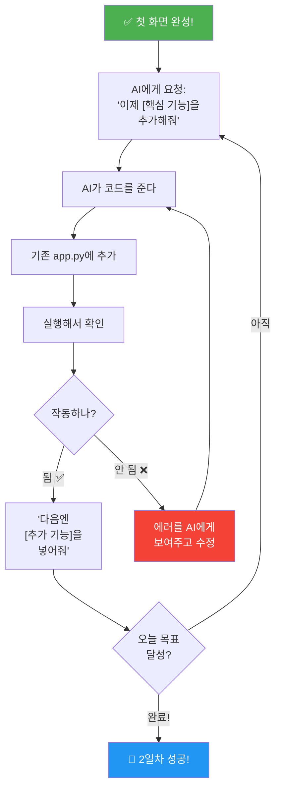

### 예시 — 급식 별점 앱의 핵심 기능 추가 요청

```
"좋아, 첫 화면은 됐어. 이제 이 기능을 추가해줘:

1. 제출 버튼을 누르면 별점과 한줄평이 리스트에 저장돼
2. 화면 아래에 지금까지 제출한 내역이 테이블로 보여
3. 메뉴별 평균 별점도 표시해줘
4. st.session_state로 데이터를 관리해줘

기존 코드에 이 기능을 추가한 전체 코드를 보여줘."
```

---

## STEP 4. 팀 회고 (10분)

### 회고 양식

```
┌─────────────────────────────────────────────────────┐
│  2일차 팀 회고                                       │
│                                                     │
│  팀명: _________________                             │
│                                                     │
│  ✅ 오늘 된 것:                                      │
│  1. ________________________________________         │
│  2. ________________________________________         │
│                                                     │
│  ❌ 안 된 것 (에러, 막힌 곳):                         │
│  1. ________________________________________         │
│  2. ________________________________________         │
│                                                     │
│  📋 내일 할 것:                                      │
│  1. ________________________________________         │
│  2. ________________________________________         │
│  3. ________________________________________         │
│                                                     │
└─────────────────────────────────────────────────────┘
```

### 2일차 성공 기준 체크리스트

```
☐ 환경 세팅 완료 (streamlit run이 작동)
☐ 첫 번째 화면이 브라우저에 뜸
☐ 핵심 기능 1개가 작동함 (버튼 → 결과 등)
☐ 코드가 app.py에 저장되어 있음
☐ 팀 회고를 작성함
```

> **오늘 핵심 기능 1개가 작동했으면 → 대성공이다.**
> 예쁘지 않아도 된다. 내일 다듬으면 된다.

---

---

# 3일차 — 살을 붙인다

---

## 3일차 목표

```
오늘이 끝나면:
  ✅ 화면이 2개 이상 있다 (탭 또는 페이지 전환)
  ✅ 데이터가 저장되고 불러와진다
  ✅ 처음부터 끝까지 한 번 쓸 수 있다 (End-to-End)
  ✅ "앱 같은 느낌"이 나기 시작한다
```

### 3일차 개발 프로세스

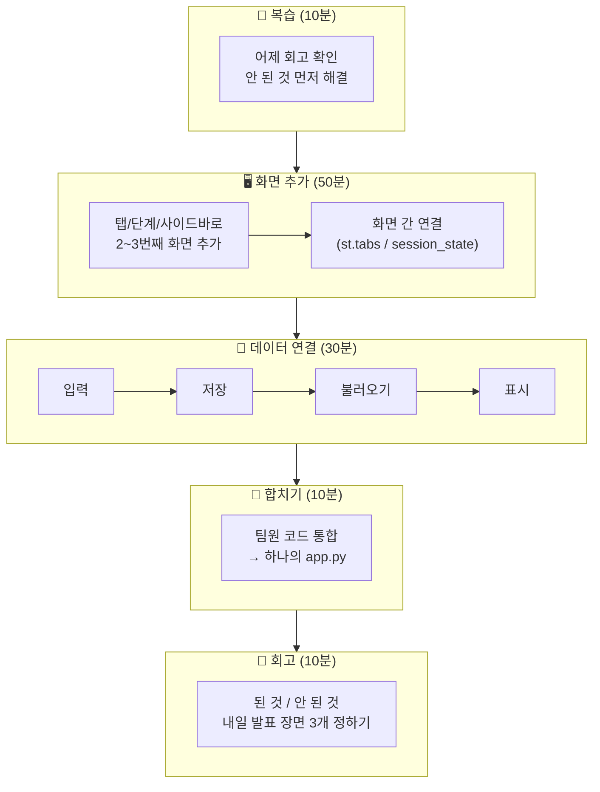

---

## 3일차 시간 배분

| 구간 | 시간 | 내용 |
|---|---|---|
| 어제 복습 + 오늘 계획 | 10분 | 회고 확인, 오늘 할 것 정리 |
| 나머지 화면 구현 | 50분 | 2번째·3번째 화면 바이브 코딩 |
| 데이터 연결 | 30분 | 입력 → 저장 → 불러오기 → 표시 흐름 완성 |
| 팀원 결과물 합치기 | 10분 | 각자 만든 부분을 하나의 app.py로 통합 |
| 팀 회고 | 10분 | 된 것 / 안 된 것 / 내일 할 것 |
| 정리 | 10분 | 코드 저장, 내일 발표 준비 안내 |

---

## STEP 1. 어제 복습 + 오늘 계획 (10분)

```
PM이 진행한다:

  "어제 회고에서 안 된 것이 [___]이었죠.
   오늘은 이걸 먼저 해결하고,
   나머지 화면을 만들고,
   데이터를 연결하겠습니다.
   
   역할별 오늘 할 일:
   - 기획: 콘텐츠 데이터 준비 (텍스트, 질문, 메뉴 등)
   - 화면: 2번째 화면 바이브 코딩
   - 데이터: 저장·불러오기 로직
   - 발표: 과정 기록 + 발표 자료 시작"
```

---

## STEP 2. 나머지 화면 구현 (50분)

### 프로젝트별 3일차 구현 목표

| 프로젝트 | 2일차에 만든 것 | 3일차에 추가할 것 |
|---|---|---|
| ① 방탈출 | 인트로 + 감정 입력 | 방 2~3개 + 선택지 → 엔딩 화면 |
| ② 설문 | 설문 응답 화면 | 결과 대시보드 (차트) |
| ③ 취향 테스트 | 시작 + 질문 진행 | 점수 계산 + 결과 카드 |
| ④ 급식 별점 | 별점 입력 | 대시보드 (TOP 랭킹 + 차트) |
| ⑤ 공부 타이머 | 타이머 작동 | 기록 저장 + 주간 차트 |
| ⑥ AI 튜터 | 채팅 UI + AI 응답 | 과목 선택 + 대화 이력 유지 |
| ⑦ 플레이리스트 | 무드 선택 + 추천 | 좋아요 기능 + 무드별 배경색 |
| ⑧ 용돈 가계부 | 지출 입력 + 목록 | 카테고리 파이 차트 + 잔액 경고 |
| ⑨ 시간표 | 시간표 표시 | 준비물 체크리스트 + 변경 알림 |
| ⑩ 환경 대시보드 | 지역 선택 + 차트 | 두 지역 비교 + AI 해석 |

### 화면 추가 바이브 코딩 예시

#### 급식 별점 → 대시보드 추가

```
"기존 급식 별점 앱에 대시보드 탭을 추가해줘.

st.tabs로 ["별점 입력", "대시보드"] 두 개 탭을 만들어줘.

대시보드 탭에서:
1. 지금까지 제출된 별점의 메뉴별 평균을 계산해서
2. st.bar_chart로 바 차트를 보여줘
3. 가장 높은 메뉴를 st.metric으로 "이달의 메뉴 1위"로 표시해줘
4. 총 평가 수도 보여줘

기존 코드에 이 기능을 추가한 전체 코드를 줘."
```

#### 방탈출 → 방 추가 + 엔딩

```
"기존 방탈출 게임에 방을 2개 더 추가하고 엔딩 화면을 만들어줘.

방 데이터를 딕셔너리로 관리해:
- room_bright: "따뜻한 빛의 방" → 선택지 2개 → room_bright_2
- room_dark: "어두운 그림자 방" → 선택지 2개 → room_dark_2
- room_bright_2, room_dark_2: 마지막 방 → 엔딩으로

엔딩 화면:
- 선택에 따른 유형 결과 ("용감한 탐험가" / "신중한 관찰자" 등)
- 클리어까지 걸린 시간 표시
- "다시 하기" 버튼
- "결과를 텍스트로 복사" 기능

기존 코드에 추가한 전체 코드를 줘."
```

#### 취향 테스트 → 결과 카드

```
"기존 취향 테스트에 결과 화면을 추가해줘.

질문 5개를 다 답하면:
1. 유형별 점수를 합산해
2. 가장 높은 유형을 결과로 보여줘
3. 결과 카드:
   - 유형 이름 (예: "감성 힐링형")
   - 이모지 (🌿)
   - 설명 (2~3문장)
   - 추천 웹툰 3개 (제목 + 추천 이유)
4. "다시 하기" 버튼
5. "결과 텍스트 복사" 버튼 (공유용)

유형 4가지:
- healing: 감성 힐링형 🌿
- action: 액션 스릴형 🔥
- mystery: 추리 미스터리형 🔍
- romance: 로맨스 설렘형 💕

기존 코드에 추가한 전체 코드를 줘."
```

---

### 화면 사이를 연결하는 패턴

Streamlit에서 화면을 전환하는 방법 3가지. AI에게 요청할 때 참고.

| 방법 | 언제 쓰나 | 프롬프트 예시 |
|---|---|---|
| **st.tabs** | 탭으로 화면 분리 | "입력 탭과 대시보드 탭을 st.tabs로 나눠줘" |
| **st.session_state** | 단계별 진행 (퀴즈, 게임) | "session_state['step']으로 현재 단계를 관리하고, 다음 버튼 누르면 step += 1" |
| **st.sidebar** | 설정/필터를 옆에 | "사이드바에 과목 선택, 메인에 결과 표시" |

---

## STEP 3. 데이터 연결 (30분)

### 데이터 흐름 완성하기

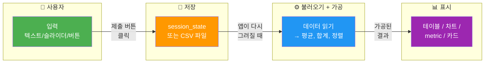

> **이 네 단계가 이어져야 "앱"이 된다.**
> 하나라도 끊기면 → 데이터가 사라지거나 표시가 안 된다.

### Streamlit에서 데이터 저장하는 방법

| 방법 | 난이도 | 적합한 프로젝트 | 특징 |
|---|---|---|---|
| **st.session_state** | 쉬움 | 모든 프로젝트 | 앱을 끄면 데이터 사라짐 |
| **CSV 파일** | 보통 | 설문, 급식 별점, 타이머 | 파일로 저장, 재시작해도 유지 |
| **JSON 파일** | 보통 | 방탈출, 시간표 | 구조화된 데이터 저장 |

### session_state 데이터 저장 패턴 (가장 많이 쓰는 패턴)

```python
# 초기화 (앱 처음 실행 시)
if 'ratings' not in st.session_state:
    st.session_state.ratings = []

# 저장 (제출 버튼 클릭 시)
if st.button("제출"):
    st.session_state.ratings.append({
        "menu": selected_menu,
        "score": score,
        "comment": comment
    })

# 불러오기 + 표시
if st.session_state.ratings:
    import pandas as pd
    df = pd.DataFrame(st.session_state.ratings)
    st.dataframe(df)
    st.bar_chart(df.groupby("menu")["score"].mean())
```

> **이 패턴을 외울 필요 없다.**
> AI에게 "session_state로 데이터를 저장하고 차트로 보여주게 해줘"라고 말하면 된다.

### CSV 저장 패턴 (데이터를 파일로 유지하고 싶을 때)

AI에게 이렇게 요청:

```
"제출한 데이터를 CSV 파일로 저장하고, 
 앱을 다시 실행해도 데이터가 남아있게 해줘.
 CSV 파일이 없으면 새로 만들고, 있으면 추가해줘."
```

---

### 프로젝트별 데이터 연결 체크리스트

| 프로젝트 | 입력 | 저장 | 불러오기 | 표시 |
|---|---|---|---|---|
| ① 방탈출 | 선택지 클릭 | session_state (현재 방, 선택 이력) | 현재 방 ID → 방 데이터 | 스토리 텍스트 + 선택지 |
| ③ 취향 테스트 | 라디오 선택 | session_state (유형별 점수) | 점수 합산 → 최고 유형 | 결과 카드 |
| ④ 급식 별점 | 슬라이더 + 텍스트 | session_state (평가 리스트) | 메뉴별 평균 | 테이블 + 바 차트 |
| ⑤ 공부 타이머 | 타이머 완료 | session_state (기록 리스트) | 요일별 합산 | 주간 차트 |
| ⑧ 용돈 가계부 | 금액 + 카테고리 | session_state (지출 리스트) | 카테고리별 합산 | 파이 차트 + 잔액 |

---

## STEP 4. 팀원 결과물 합치기 (10분)

팀원이 각자 만든 부분이 있다면, 하나의 app.py로 합친다.

### 팀 통합 프로세스

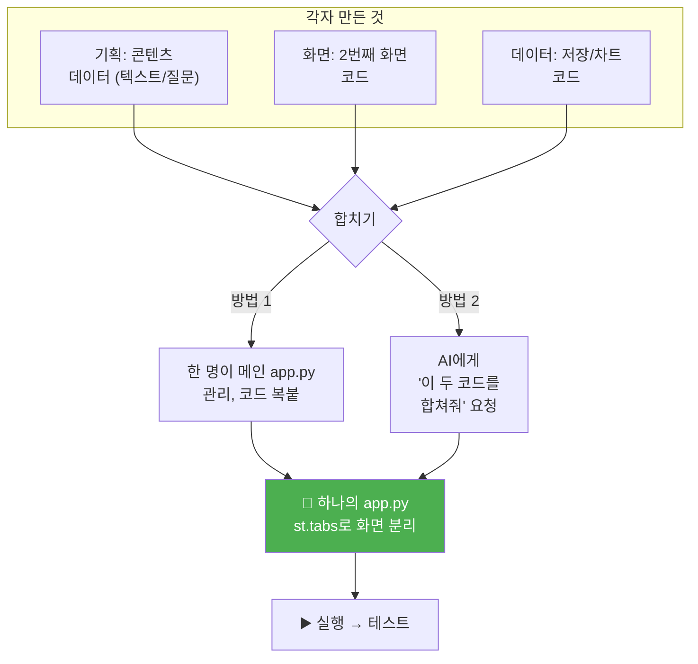

### AI에게 합치기 요청하는 프롬프트

```
"이 두 개의 Streamlit 코드를 하나의 app.py로 합쳐줘.

코드 A: [별점 입력 화면 코드 붙여넣기]
코드 B: [대시보드 화면 코드 붙여넣기]

st.tabs로 '별점 입력' 탭과 '대시보드' 탭으로 나눠줘.
데이터는 st.session_state로 공유해줘."
```

---

## STEP 5. 팀 회고 (10분)

### 3일차 회고 양식

```
┌─────────────────────────────────────────────────────┐
│  3일차 팀 회고                                       │
│                                                     │
│  팀명: _________________                             │
│                                                     │
│  ✅ 오늘 된 것:                                      │
│  1. ________________________________________         │
│  2. ________________________________________         │
│                                                     │
│  ❌ 안 된 것:                                        │
│  1. ________________________________________         │
│                                                     │
│  🎯 내일 발표 준비:                                   │
│  - 시연할 기능: _______________________________      │
│  - 발표 담당: _________________________________      │
│  - 발표에서 보여줄 핵심 장면 3개:                     │
│    1. ______________________________________         │
│    2. ______________________________________         │
│    3. ______________________________________         │
│                                                     │
└─────────────────────────────────────────────────────┘
```

### 3일차 성공 기준 체크리스트

```
☐ 화면이 2개 이상 있다 (탭 전환 또는 단계 진행)
☐ 데이터가 입력 → 저장 → 표시까지 이어진다
☐ 처음부터 끝까지 한 번 써볼 수 있다 (깨지더라도)
☐ 내일 발표에서 보여줄 장면 3개를 정했다
☐ 팀 회고를 작성했다
```

---

---

# 4일차 — 다듬고 보여준다

---

## 4일차 목표

```
오늘이 끝나면:
  ✅ UI가 다듬어져서 "앱 같은 느낌"이 난다
  ✅ 주요 버그가 수정되었다
  ✅ 3분 팀 발표를 완료했다
  ✅ "내가 만든 앱"이라는 자부심을 느낀다
```

### 4일차 프로세스 한눈에

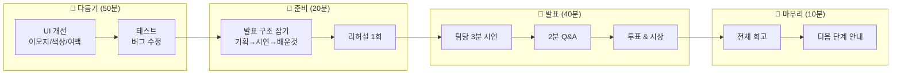

---

## 4일차 시간 배분

| 구간 | 시간 | 내용 |
|---|---|---|
| UI 다듬기 | 30분 | 색, 이모지, 레이아웃, 모바일 대응 |
| 테스트 & 버그 수정 | 20분 | 직접 써보고 깨지는 곳 고치기 |
| 발표 준비 | 20분 | 발표 구조 잡기 + 리허설 1회 |
| 팀 발표 | 40분 | 팀당 3분 시연 + 2분 Q&A |
| 수업 마무리 | 10분 | 전체 회고 + 다음 단계 안내 |

---

## STEP 1. UI 다듬기 (30분)

### "앱 같은 느낌"을 만드는 5가지

| 순서 | 요소 | AI에게 요청하는 프롬프트 |
|---|---|---|
| 1 | **이모지 추가** | "제목과 버튼에 적절한 이모지를 추가해줘" |
| 2 | **색상 통일** | "전체적으로 파란색 계열로 통일하고, 중요한 숫자는 빨간색으로 강조해줘" |
| 3 | **여백 정리** | "st.divider로 섹션을 구분하고, st.columns로 레이아웃을 정리해줘" |
| 4 | **로딩 표시** | "데이터 처리할 때 st.spinner로 로딩 표시 추가해줘" |
| 5 | **성공/에러 메시지** | "제출 성공 시 st.success, 입력 빠뜨리면 st.warning 표시해줘" |

### 프로젝트별 UI 다듬기 예시

#### 급식 별점 — UI 개선 요청

```
"급식 별점 앱의 UI를 예쁘게 다듬어줘.

1. 제목에 🍽️ 이모지 추가
2. 별점 슬라이더 위에 ⭐ 이모지로 현재 점수 표시
3. 대시보드의 1위 메뉴를 🏆 이모지와 함께 크게 표시
4. 평가 완료 시 st.success('평가 완료!') 표시
5. 전체 배경은 밝은 톤
6. st.metric으로 총 평가 수, 평균 점수 표시
7. 모바일에서도 깨지지 않게 st.columns 사용

기존 코드에 적용한 전체 코드를 줘."
```

#### 취향 테스트 — 결과 카드 꾸미기

```
"취향 테스트 결과 화면을 더 예쁘게 만들어줘.

1. 결과 유형 이름을 크게 (st.header)
2. 이모지를 크게 표시
3. 설명을 st.info 박스 안에
4. 추천 웹툰 3개를 카드 형태로 (st.columns 3개)
5. 각 카드에 번호 + 제목 + 추천 이유
6. '다시 하기' 버튼은 눈에 띄게
7. '결과 공유' 버튼: 결과를 텍스트로 복사할 수 있게

기존 코드에 적용한 전체 코드를 줘."
```

#### 방탈출 — 분위기 연출

```
"방탈출 게임의 분위기를 살려줘.

1. 밝은 방은 배경색 밝게, 어두운 방은 어둡게
2. 스토리 텍스트에 타이핑 효과 (한 글자씩 나오는 느낌)
3. 선택지 버튼에 이모지 추가
4. 진행률 바 (st.progress) 추가
5. 엔딩에서 결과 유형을 화려하게 표시
6. 클리어 시간 표시

기존 코드에 적용한 전체 코드를 줘."
```

---

## STEP 2. 테스트 & 버그 수정 (20분)

### 테스트 체크리스트

```
☐ 처음 화면에서 시작해서 끝까지 한 번 진행
  → 중간에 멈추거나 에러가 나는 곳이 있나?

☐ 빈 값으로 제출해보기
  → 아무것도 입력 안 하고 버튼을 누르면 어떻게 되나?

☐ 같은 동작을 3번 반복해보기
  → 데이터가 제대로 쌓이나? 꼬이지 않나?

☐ 다른 팀원 컴퓨터에서도 실행해보기
  → 내 컴퓨터에서만 되는 건 아닌지 확인

☐ 브라우저를 새로고침해보기
  → 데이터가 사라지나? (session_state는 사라짐 — 정상)
```

### 자주 나오는 버그와 해결

| 버그 | 원인 | AI에게 이렇게 요청 |
|---|---|---|
| 버튼 눌러도 반응 없음 | session_state 초기화 누락 | "st.session_state 초기화 코드를 앱 시작 부분에 추가해줘" |
| 차트가 안 뜸 | 데이터가 비어 있음 | "데이터가 없을 때 '아직 데이터가 없습니다' 메시지를 보여줘" |
| 에러: KeyError | 딕셔너리 키 오타 | "이 에러가 떴어: [에러 복사]. 키 이름을 확인해줘" |
| 숫자가 이상함 | 타입 오류 (문자열/숫자 혼동) | "점수 합산이 이상해. 타입을 확인하고 int로 변환해줘" |
| 화면이 계속 초기화됨 | st.rerun 위치 문제 | "st.rerun 없이 session_state만으로 화면 전환하게 바꿔줘" |

### 디버깅 오케스트레이션 — AI 2개 활용

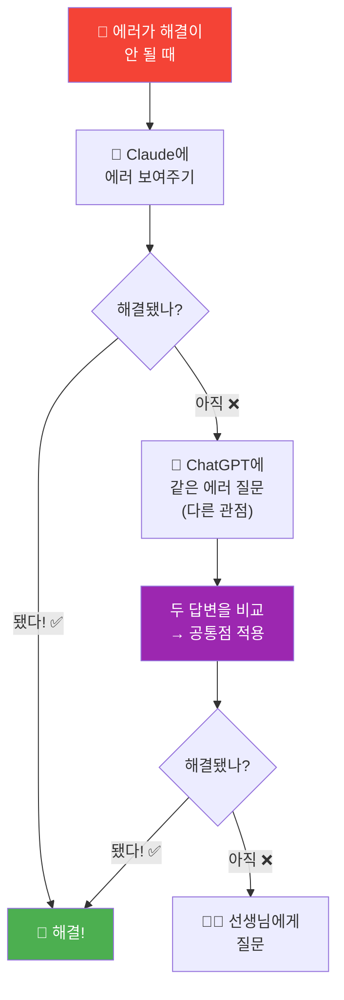

> **이게 "오케스트레이션"이다.** 여러 AI를 동시에 활용하는 것.

---

## STEP 3. 발표 준비 (20분)

### 발표 구조 — 3분

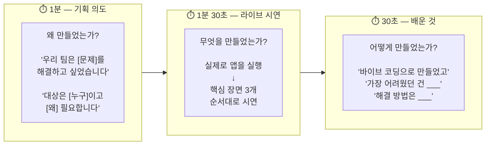

### 발표 대본 템플릿

```
[기획 의도] (발표자 1명)

"안녕하세요, ___팀입니다.
 우리 팀은 [프로젝트 이름]을 만들었습니다.
 이 앱은 [누가] [무엇을 할 수 있는] 앱입니다.
 왜 만들었냐면, [문제/불편함]이 있었기 때문입니다."


[라이브 시연] (화면 담당이 앱 실행, 발표자가 설명)

"지금 보시는 화면이 시작 화면입니다.
 여기서 [동작]을 하면...
 이렇게 [결과]가 나옵니다.
 [핵심 기능 2~3개 시연]"


[배운 것] (발표자 또는 다른 팀원)

"이 앱은 바이브 코딩으로 만들었습니다.
 코드를 직접 치지 않고, AI에게 한국어로 설명해서 만들었습니다.
 가장 어려웠던 건 [___]이었는데,
 AI에게 에러를 보여주고 고쳐서 해결했습니다.
 감사합니다."
```

### 발표 전 리허설 체크리스트

```
☐ 앱이 정상적으로 실행되는지 확인
☐ 시연할 장면 3개의 순서를 정했는지
☐ 발표 대본을 한 번 읽어봤는지
☐ 시간이 3분 안에 끝나는지
☐ 프로젝터/화면 공유가 되는지
```

---

## STEP 4. 팀 발표 (40분)

### 발표 운영

```
팀당 5분:
  · 발표 3분
  · Q&A 2분

5팀 기준 = 25분
6팀 기준 = 30분

나머지 시간: 투표 + 시상
```

### 청중 역할 — 다른 팀 발표 들을 때

```
듣는 팀원은 이것을 메모한다:

  1. 이 앱의 가장 좋은 점 1가지
  2. "이것도 있으면 좋겠다" 1가지
  3. 질문 1가지
```

### Q&A 질문 예시

| 질문 유형 | 예시 |
|---|---|
| 기획 관련 | "이 앱을 실제로 배포할 생각이 있어요?" |
| 기술 관련 | "그 기능은 AI에게 어떻게 요청해서 만들었어요?" |
| 사용자 관련 | "실제로 친구들한테 써보게 했어요? 반응이 어땠어요?" |
| 확장 관련 | "다음에 더 만든다면 어떤 기능을 추가하고 싶어요?" |

### 투표 & 시상 (선택)

```
투표 항목:

  🏆 가장 쓰고 싶은 앱 상    — 실용성
  🎨 가장 예쁜 앱 상         — UI/UX
  💡 가장 창의적인 앱 상     — 아이디어
  🔥 가장 열정적인 팀 상     — 발표+과정
  👏 피플즈 초이스 상        — 전체 투표 1위
```

---

## STEP 5. 수업 마무리 (10분)

### 전체 4일 돌아보기

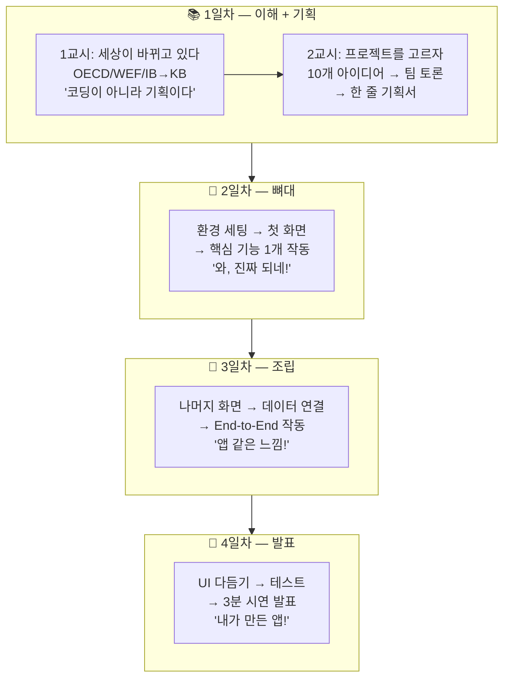

### 이 수업에서 학생이 경험한 것

```
✅ "뭘 만들지" 정하는 과정 (기획)
✅ 팀이 토론해서 결정하는 과정 (협업)
✅ AI에게 말해서 코드를 받는 과정 (바이브 코딩)
✅ 에러를 만나고 고치는 과정 (디버깅)
✅ 만든 것을 사람들 앞에서 보여주는 과정 (발표)
✅ "나도 앱을 만들 수 있다"는 자신감
```

### 구글 개발자도 같은 과정을 밟는다

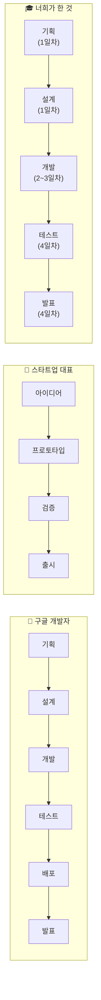

> **과정이 똑같다. 다른 건 규모뿐이다.**

### 수업 후 혼자서 할 수 있는 것

```
1. 같은 프로젝트를 더 발전시키기
   → "이 기능도 추가해줘"를 계속 AI에게 요청
   → Level 1 (수업) → Level 2 (방학 프로젝트) → Level 3 (대회)

2. 다른 아이디어로 새 프로젝트 도전
   → 10가지 중 안 해본 것, 또는 Two-Word Test로 새 아이디어

3. 배포해서 실제 사용자 모으기
   → Streamlit Cloud 무료 배포
   → QR코드 만들어서 친구에게 공유

4. 포트폴리오로 정리
   → GitHub에 올리기
   → "내가 만든 앱" 기록 → 대입 세특 소재
```

### 최종 한 마디

```
코딩을 잘하는 사람이 아니라,
"뭘 만들지 정하고, AI를 지휘해서, 실제로 만든 사람"이 이기는 시대다.

너희는 4일 동안 그 과정을 직접 해봤다.
이제 아무거나 만들 수 있다.
AI에게 말하면 된다.
```

---

---

# 부록 A. 교사용 운영 가이드 — 2~4일차

---

## 2일차 운영 핵심

### 가장 중요한 것: "첫 화면이 뜨는 경험"

```
2일차의 성패는 "학생이 자기 앱을 브라우저에서 보는 순간"에 달려 있다.
이 순간이 와야 나머지 3일이 작동한다.
이 순간이 안 오면 → 학생이 흥미를 잃는다.
```

### 환경 세팅 실패 대비

```
시나리오 1: Python이 안 깔려 있다
  → 선생님이 미리 설치해둬야 함 (수업 전 확인 필수)

시나리오 2: pip이 안 된다
  → python -m pip install streamlit 으로 시도

시나리오 3: 학교 네트워크에서 pip이 막혀 있다
  → 미리 오프라인 패키지 준비하거나, 학교 IT에 요청

시나리오 4: 컴퓨터가 너무 느리다
  → 팀 컴퓨터 1대를 기준으로 작업, 나머지 팀원은 기획/콘텐츠

최악의 경우: 아무것도 안 되면
  → 선생님 컴퓨터에서 학생 프롬프트를 받아 대신 실행 (라이브 데모 방식)
```

### 순회 코칭 포인트

| 관찰 | 개입 방법 |
|---|---|
| AI에게 "앱 만들어줘"만 쓴다 | "누가 쓰는 앱이야? 어떤 화면이 필요해?" 질문으로 유도 |
| 에러가 나서 멈춰 있다 | "에러 메시지를 복사해서 AI에게 보여줘" 가르쳐줌 |
| 한 명만 코딩하고 나머지는 구경 | "기획 담당은 콘텐츠 데이터를 준비해봐" 역할 부여 |
| 너무 많은 기능을 한 번에 | "핵심 1개만 먼저 작동시키자" 범위 좁히기 |
| 너무 빨리 끝난 팀 | "다른 팀이 만든 걸 써보고 피드백 줘" 상호 테스트 |

---

## 3일차 운영 핵심

### "합치기"가 가장 어렵다

```
3일차의 핵심 난관은 "각자 만든 코드를 하나로 합치는 것"이다.

대응:
1. 처음부터 app.py 하나를 같이 편집하는 게 가장 좋다
2. 불가능하면 → AI에게 "이 두 코드를 합쳐줘" 요청
3. 변수 이름이 겹치는 문제 → AI에게 "변수 이름을 정리해줘" 요청
```

### 데이터가 안 저장되는 문제

```
가장 흔한 문제:
"제출했는데 데이터가 안 보여요"

원인 90%: session_state 초기화를 안 했거나, 변수 이름 오타

해결: 
AI에게 "session_state 초기화 부분을 확인하고 전체 코드를 다시 보여줘" 요청
```

---

## 4일차 운영 핵심

### 발표는 "시연"이 핵심

```
PPT를 만들게 하지 마세요.
실제로 앱을 실행해서 보여주는 게 핵심입니다.

발표 = "앱 시연 + 기획 의도 + 배운 것"
PPT = 필요 없음
```

### 발표 시 흔한 문제와 대응

| 문제 | 대응 |
|---|---|
| 프로젝터 연결이 안 됨 | 선생님 노트북으로 학생 앱 실행 (URL 또는 코드 복사) |
| 발표 중 앱이 에러남 | "에러가 나는 것도 개발 과정이에요. 어떻게 고칠 건지 말해줘" |
| 3분 넘김 | PM에게 시간 관리 책임. 2분 30초에 신호 |
| 아무도 질문 안 함 | 선생님이 1개, 다른 팀이 1개씩 의무 질문 규칙 |
| 완성도가 낮은 팀 | "과정"을 칭찬. "에러를 만나고 고친 경험이 진짜 개발" |

### 발표 평가 기준 (선생님용)

| 항목 | 배점 | 기준 |
|---|---|---|
| 기획 의도 | 20점 | "누가 왜 쓰는지"가 명확한가 |
| 핵심 기능 작동 | 30점 | 시연 중 핵심 기능이 작동하는가 |
| UI/사용자 경험 | 20점 | 써보고 싶은 느낌이 드는가 |
| 팀워크/과정 | 20점 | 역할 분담, 회고, 협업 과정이 보이는가 |
| 발표/소통 | 10점 | 발표가 명확하고, Q&A에 잘 답하는가 |

> **완성도보다 과정을 평가한다.**
> "에러를 만났는데 AI한테 물어봐서 해결했어요"가
> "에러 없이 잘 됐어요"보다 높은 점수다.

---

# 부록 B. Streamlit 핵심 코드 패턴 — 자주 쓰는 것만

학생이 AI에게 요청할 때 참고할 수 있는 패턴.
외울 필요 없다. "이런 게 가능하구나" 정도만 알면 된다.

---

### 제목과 텍스트

```python
st.title("큰 제목")
st.header("중간 제목")
st.subheader("작은 제목")
st.write("일반 텍스트")
st.markdown("**굵게** *기울임* ~~취소선~~")
```

### 입력 받기

```python
name = st.text_input("이름을 입력하세요")
score = st.slider("별점", 1, 5, 3)
subject = st.selectbox("과목", ["수학", "영어", "과학"])
choice = st.radio("선택하세요", ["A", "B", "C"])
agree = st.checkbox("동의합니다")
```

### 버튼

```python
if st.button("클릭"):
    st.write("버튼이 눌렸다!")
```

### 화면 나누기

```python
# 탭
tab1, tab2 = st.tabs(["입력", "결과"])
with tab1:
    st.write("입력 화면")
with tab2:
    st.write("결과 화면")

# 열 나누기
col1, col2 = st.columns(2)
with col1:
    st.write("왼쪽")
with col2:
    st.write("오른쪽")

# 사이드바
with st.sidebar:
    st.write("사이드바 내용")
```

### 데이터 저장과 표시

```python
# 초기화
if 'data' not in st.session_state:
    st.session_state.data = []

# 추가
st.session_state.data.append({"이름": name, "점수": score})

# 테이블로 표시
import pandas as pd
df = pd.DataFrame(st.session_state.data)
st.dataframe(df)

# 차트
st.bar_chart(df.set_index("이름")["점수"])
```

### 꾸미기

```python
st.success("성공!")
st.warning("주의!")
st.error("에러!")
st.info("정보")
st.metric("평균 점수", "4.2", "+0.3")
st.progress(0.7)  # 70% 진행률 바
st.divider()  # 구분선
```

---

# 부록 C. 프로젝트별 완성 코드 구조 — 참고용

각 프로젝트의 **완성된 코드 구조**가 어떻게 생겼는지 개요만 보여준다.
(전체 코드가 아니라 구조만. AI에게 요청할 때 "이런 구조로 만들어줘"라고 참고.)

### ① 방탈출 게임 구조

```
app.py
├── rooms 딕셔너리 (방 ID → 텍스트, 선택지, 다음 방)
├── endings 딕셔너리 (유형 → 이름, 설명, 이모지)
├── session_state: current_room, history, scores, start_time
├── 화면 렌더링:
│   ├── intro → 감정 입력 → 방 배정
│   ├── room → 텍스트 + 선택지 버튼 → 다음 방
│   └── ending → 유형 결과 + 시간 + 공유
└── 다시 하기 → session_state 초기화
```

### ③ 취향 테스트 구조

```
app.py
├── questions 리스트 (질문 텍스트, 선택지, 유형별 점수)
├── types 딕셔너리 (유형 ID → 이름, 이모지, 설명, 추천)
├── session_state: step, scores
├── 화면 렌더링:
│   ├── step 0 → 시작 화면 + 시작 버튼
│   ├── step 1~5 → 질문 + 라디오 선택 + 다음 버튼
│   └── step 6 → 점수 합산 → 결과 카드 + 추천 + 공유
└── 다시 하기 → session_state 초기화
```

### ④ 급식 별점 구조

```
app.py
├── menu_data (오늘 메뉴 리스트)
├── session_state: ratings 리스트
├── 탭 1 — 별점 입력:
│   ├── 메뉴 표시
│   ├── 슬라이더 (1~5)
│   ├── 텍스트 입력 (한줄평)
│   └── 제출 → ratings에 append
├── 탭 2 — 대시보드:
│   ├── pandas로 메뉴별 평균
│   ├── bar_chart (메뉴별 별점)
│   ├── metric (1위 메뉴, 평균, 총 평가 수)
│   └── dataframe (전체 평가 내역)
```

### ⑤ 공부 타이머 구조

```
app.py
├── session_state: records, timer_running, current_subject
├── 탭 1 — 타이머:
│   ├── 과목 선택 (selectbox)
│   ├── 시간 설정 (number_input)
│   ├── 시작/정지 버튼
│   ├── 카운트다운 표시
│   └── 완료 → records에 기록 추가
├── 탭 2 — 주간 리포트:
│   ├── 요일별 bar_chart
│   ├── 과목별 비율
│   └── 스트릭 (연속 일수)
```

### ⑧ 용돈 가계부 구조

```
app.py
├── session_state: budget, expenses 리스트
├── 사이드바: 월 예산 설정
├── 메인 — 지출 입력:
│   ├── 금액, 카테고리, 메모
│   ├── 추가 버튼 → expenses에 append
│   └── 잔액 표시 (metric)
├── 메인 — 리포트:
│   ├── 지출 내역 테이블
│   ├── 카테고리별 파이 차트
│   ├── 일별 지출 bar_chart
│   └── 80% 초과 시 경고
```

---

# 부록 D. 수업 후 확장 가이드 — "이거 끝나고 뭐 하지?"

### Level 1 → Level 2 확장 (방학 프로젝트)

| 프로젝트 | Level 2에서 추가할 것 | AI에게 요청할 프롬프트 |
|---|---|---|
| ① 방탈출 | 새 시나리오 5개, 결과 통계 | "새로운 스토리 시나리오를 JSON으로 5개 만들어줘" |
| ③ 취향 테스트 | 테스트 3종류, 공유 이미지 생성 | "K-pop 아이돌 추천 테스트 질문 5개와 유형 4개 데이터 만들어줘" |
| ④ 급식 별점 | CSV 저장, 실시간 대시보드 | "평가 데이터를 CSV에 저장하고, 재시작해도 유지되게 해줘" |
| ⑤ 공부 타이머 | 월간 리포트, 알림 소리 | "30일간 데이터를 월간 히트맵으로 시각화해줘" |
| ⑧ 용돈 가계부 | 리포트 PDF 다운로드 | "월간 소비 리포트를 PDF로 다운로드하는 기능 추가해줘" |

### 배포하기 — Streamlit Cloud (무료)

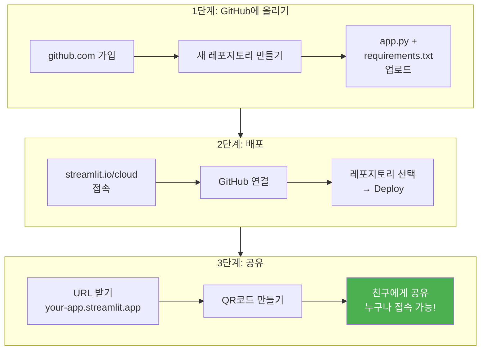

### 포트폴리오로 정리하기

```
GitHub README에 이렇게 정리한다:

# [프로젝트 이름]

## 한 줄 소개
[누가] [무엇을] [왜] 쓰는 앱

## 스크린샷
(앱 화면 캡처 3장)

## 핵심 기능
1. [기능 1]
2. [기능 2]
3. [기능 3]

## 기술 스택
- Python + Streamlit
- AI 바이브 코딩

## 만든 사람
- [팀원 이름들]

## 배포 링크
- https://your-app.streamlit.app
```

> **이게 2032년 대입에서 보여줄 수 있는 포트폴리오다.**
> "이 학생은 중학교 2학년 때 AI를 도구로 써서 실제로 앱을 만들어봤다"
> 입학사정관은 이걸 보고 싶어한다.

---

# 부록 E. 자주 묻는 질문 (학생 & 교사)

## 학생 FAQ

| 질문 | 답변 |
|---|---|
| "AI가 만든 코드를 내가 만들었다고 해도 돼요?" | "AI는 도구야. 망치가 집을 지은 게 아니라, 네가 망치를 써서 지은 거잖아. '뭘 만들지 정하고, AI에게 요청하고, 결과를 다듬은 건 너'야." |
| "코드를 하나도 이해 못 해도 괜찮아요?" | "바이브 코딩의 핵심은 코드를 이해하는 게 아니라, '뭘 원하는지 정확히 말하는 것'이야. 나중에 코드를 이해하고 싶으면 AI에게 '이 코드 설명해줘'라고 물어봐." |
| "에러가 너무 많이 나요" | "프로 개발자도 매일 에러를 만나. 에러 = 실패가 아니라, '여기를 고쳐야 한다'는 신호야. 에러를 복사해서 AI에게 보여주면 돼." |
| "다른 팀보다 느려요" | "속도는 중요하지 않아. 핵심 기능 1개가 작동하면 성공이야. 10개 기능인데 다 깨지는 것보다, 1개인데 제대로 되는 게 낫다." |
| "집에서도 하고 싶은데요" | "Python + Streamlit 설치하고, AI 접속하면 바로 할 수 있어. 수업에서 한 것과 완전히 똑같아." |
| "이거 대회에 나갈 수 있어요?" | "물론! 청소년 앱 개발 대회, SW 창작 대회에 나갈 수 있어. 수업에서 만든 걸 더 발전시켜서 나가면 돼." |

## 교사 FAQ

| 질문 | 답변 |
|---|---|
| "선생님이 코딩을 잘 몰라도 되나요?" | "네. 이 수업에서 선생님은 코드를 가르치는 사람이 아니라, '기획과 협업을 촉진하는 사람'입니다. 코드는 AI가 해결합니다." |
| "학생마다 수준 차이가 크면?" | "바이브 코딩의 장점이 여기에 있습니다. 코딩을 아는 학생은 코드를 직접 수정하고, 모르는 학생은 AI에게 한국어로 요청합니다. 결과는 동일합니다." |
| "인터넷이 안 되는 환경이면?" | "사전에 Python과 Streamlit을 오프라인 설치해야 합니다. AI는 선생님 컴퓨터에서 대신 실행하고, 코드를 학생에게 전달하는 방식으로 운영할 수 있습니다." |
| "평가를 어떻게 하나요?" | "완성도가 아니라 과정을 봅니다. 한 줄 기획서 → 화면 흐름도 → 회고 → 발표. 이 과정이 기록되면 세특에 활용할 수 있습니다." |
| "세특에 뭐라고 적나요?" | "'AI를 도구로 활용하여 팀 프로젝트를 기획·개발·발표하는 전 과정에 주도적으로 참여함. 특히 [구체적 역할/기여]에서 두각을 보임.' 식으로 작성합니다." |

---

> **4일간의 수업이 끝나면 학생에게 남는 것:**
>
> 1. "나도 앱을 만들 수 있다"는 자신감
> 2. "코딩 실력이 아니라, 기획 + AI 활용이 무기다"라는 관점
> 3. 팀으로 하나의 프로젝트를 완성한 경험
> 4. 포트폴리오 1개
> 5. "프로 개발자도 나와 같은 과정을 밟는다"는 확인
> 6. "다음에 또 만들고 싶다"는 동기

---

# 부록 F. 프로젝트별 3일차 바이브 코딩 프롬프트 모음

2일차에 첫 화면을 만들었다면, 3일차에는 나머지 화면과 기능을 추가한다.
각 프로젝트별로 AI에게 보낼 구체적 프롬프트를 정리했다.

---

### ① 방탈출 — 3일차: 분기 경로 + 엔딩 시스템

**프롬프트 1: 방 데이터를 딕셔너리로 정리**

```
기존 방탈출 게임의 방 데이터를 딕셔너리로 정리해줘.

rooms = {
    "intro": {
        "text": "어두운 복도 끝에 세 개의 문이 있다...",
        "choices": [
            {"text": "밝은 빛의 문으로 간다", "next": "bright_1"},
            {"text": "어두운 그림자의 문으로 간다", "next": "dark_1"},
            {"text": "작은 쪽문으로 간다", "next": "small_1"}
        ]
    },
    ... (방 6개 이상)
}

각 방마다 감정 키워드가 있어서, 처음에 입력한 감정과 매칭되면 
특별 힌트가 나오게 해줘.

기존 코드에 이 구조를 적용한 전체 코드를 줘.
```

**프롬프트 2: 엔딩 + 결과 카드**

```
방탈출 게임에 엔딩 시스템을 추가해줘.

엔딩은 3가지:
1. "용감한 탐험가" — 밝은 방을 많이 선택
2. "신중한 관찰자" — 어두운 방을 많이 선택  
3. "호기심 모험가" — 골고루 선택

엔딩 화면에:
- 유형 이모지 + 이름
- 설명 (2문장)
- 클리어 시간 표시
- 선택 경로 표시 (어떤 방을 거쳤는지)
- "다시 하기" 버튼
- 진행률 바 (전체 방 중 몇 개 지났는지)
```

---

### ② 설문 리서치 — 3일차: 결과 대시보드 + 통계

**프롬프트 1: 대시보드 탭 추가**

```
설문 앱에 결과 대시보드 탭을 추가해줘.

st.tabs로 ["설문 응답", "결과 대시보드"] 탭을 만들어.

대시보드에서:
1. 총 응답 수를 st.metric으로 보여줘
2. 만족도 점수의 평균을 st.metric으로 보여줘
3. 가장 인기 있는 메뉴를 st.metric으로 보여줘
4. 만족도 점수 분포를 st.bar_chart로 보여줘
5. 메뉴별 선택 비율을 파이 차트로 보여줘 (matplotlib 사용)
6. 최신 응답 5개를 st.dataframe으로 보여줘

기존 코드에 추가한 전체 코드를 줘.
```

**프롬프트 2: 요약 코멘트 자동 생성**

```
대시보드 아래에 데이터 요약을 자동으로 생성해줘.

예시:
"총 23명이 응답했습니다.
 평균 만족도는 3.8/5점으로 '만족' 수준입니다.
 가장 인기 있는 메뉴는 '비빔밥'(45%)이고,
 가장 많이 나온 개선 의견은 '양이 부족하다'입니다."

이런 식으로 session_state의 데이터를 분석해서
자동으로 텍스트를 만들어주는 코드를 추가해줘.
```

---

### ③ 취향 테스트 — 3일차: 점수 시스템 + 결과 카드 상세화

**프롬프트: 유형별 상세 결과 + 추천 콘텐츠**

```
취향 테스트 결과를 더 풍성하게 만들어줘.

유형별 데이터를 이렇게 구조화해:
types = {
    "healing": {
        "name": "감성 힐링형",
        "emoji": "🌿",
        "color": "#a8d8ea",
        "description": "잔잔한 감성을 즐기는 당신! 따뜻한 이야기에 마음이 끌려요.",
        "traits": ["공감 능력 높음", "감수성 풍부", "조용한 취미 선호"],
        "recommendations": [
            {"title": "나 혼자만 레벨업", "reason": "성장 서사가 힐링!"},
            {"title": "유미의 세포들", "reason": "섬세한 감정 묘사"},
            {"title": "바른연애 길잡이", "reason": "따뜻한 일상물"}
        ],
        "percentage": "전체 응답자의 약 30%"
    },
    ...나머지 3개 유형
}

결과 화면:
1. 배경색을 유형 color로 설정
2. 이모지 + 유형명을 크게
3. 특성 3개를 뱃지처럼 표시
4. 추천 웹툰 3개를 카드(st.columns)로
5. "전체 응답자 중 약 30%" 표시
6. "결과 텍스트 복사" 버튼
```

---

### ④ 급식 별점 — 3일차: 랭킹 + 트렌드 차트

**프롬프트: TOP 3 랭킹 + 주간 트렌드**

```
급식 별점 대시보드에 이 기능들을 추가해줘:

1. TOP 3 랭킹
   - 1위 🥇, 2위 🥈, 3위 🥉
   - 각 메뉴의 평균 별점과 평가 수 표시
   - st.columns(3)으로 나란히

2. 최저 평점 메뉴
   - "개선이 필요한 메뉴"로 표시
   - 해당 메뉴의 한줄평 3개를 보여줘

3. 날짜별 트렌드
   - 오늘 날짜를 자동 기록
   - 날짜별 평균 별점을 st.line_chart로

4. 전체 통계
   - 총 평가 수
   - 전체 평균
   - 가장 많은 한줄평 키워드
```

---

### ⑤ 공부 타이머 — 3일차: 기록 저장 + 주간 리포트

**프롬프트: 학습 기록 + 차트**

```
공부 타이머에 기록 저장과 주간 리포트를 추가해줘.

탭 1 — 타이머 (기존)
탭 2 — 오늘 기록:
  - 오늘 공부한 과목별 시간을 bar_chart로
  - 총 공부 시간을 st.metric으로
  - 가장 많이 공부한 과목 표시

탭 3 — 주간 리포트:
  - 요일별 총 공부 시간을 bar_chart로
  - 과목별 비율을 파이 차트로
  - 연속 공부 일수 (스트릭)를 st.metric으로
  - "이번 주 총 5시간 32분 공부했습니다" 요약

session_state에 records 리스트로 저장하되,
각 기록에 날짜, 과목, 시간(분)을 포함해줘.
```

---

### ⑥ AI 튜터 — 3일차: 대화 이력 + 과목별 스타일

**프롬프트: 채팅 UI + 이력 관리**

```
AI 튜터에 채팅 형태의 대화 이력을 추가해줘.

1. 대화 이력을 채팅 말풍선처럼 표시
   - 학생 질문: 오른쪽 정렬
   - 튜터 답변: 왼쪽 정렬, 이모지 아이콘 포함

2. 과목마다 다른 캐릭터:
   - 수학: 🧮 "수리쌤" — 공식+예제 중심
   - 영어: 📖 "잉글리쌤" — 영어 표현+해석
   - 과학: 🔬 "사이언쌤" — 실험+원리 설명
   - 국어: ✏️ "글쓰기쌤" — 맞춤법+문법
   - 사회: 🌍 "세계쌤" — 역사+시사

3. 각 과목별 미리 준비된 답변 10개씩
   (키워드 매칭: 질문에 특정 단어가 포함되면 해당 답변)

4. 매칭 안 되면 기본 답변:
   "좋은 질문이야! 선생님에게 물어보거나, 
    AI 챗봇에 직접 질문해보는 건 어떨까?"

5. 대화 이력 초기화 버튼
```

---

### ⑦ 플레이리스트 — 3일차: 좋아요 + 커스텀 무드

**프롬프트: 좋아요 기능 + 내 플레이리스트**

```
플레이리스트 앱에 이 기능들을 추가해줘:

1. 각 추천 곡 옆에 ❤️ 좋아요 버튼
   - 클릭하면 "내 플레이리스트"에 추가
   - session_state.my_playlist 리스트로 관리

2. "내 플레이리스트" 탭 추가
   - 좋아요 한 곡들을 리스트로 표시
   - 삭제 버튼으로 제거 가능
   - 총 곡 수 표시

3. 무드별 배경색 변경
   - 신남: 밝은 노란색 배경
   - 센치: 파란색 배경  
   - 잔잔: 초록색 배경
   - 에너지: 빨간색 배경

4. 곡 데이터를 5곡→10곡으로 확장
```

---

### ⑧ 용돈 가계부 — 3일차: 파이 차트 + 예산 경고

**프롬프트: 분석 기능 + 알림**

```
용돈 가계부에 분석 기능을 추가해줘.

탭 1 — 입력 (기존)
탭 2 — 분석:
  1. 카테고리별 지출 비율 파이 차트 (matplotlib)
  2. 일별 지출 bar_chart
  3. 가장 많이 쓴 카테고리 st.metric
  4. 하루 평균 지출 st.metric

탭 3 — 예산 관리:
  1. 전체 예산 대비 사용률 progress bar
  2. 남은 금액 st.metric (delta로 감소량 표시)
  3. 80% 초과 시 st.warning("예산의 80%를 사용했어요!")
  4. 100% 초과 시 st.error("예산을 초과했어요!")
  5. "이 속도면 _일 후에 용돈이 바닥납니다" 예측
```

---

### ⑨ 시간표 — 3일차: 준비물 + D-Day

**프롬프트: 준비물 체크 + 시험 D-Day**

```
시간표 앱에 이 기능들을 추가해줘.

탭 1 — 시간표 (기존)
탭 2 — 준비물 체크리스트:
  - 내일 과목별 준비물을 체크리스트로
  - 예: ☐ 수학 — 자, 컴퍼스 / ☐ 체육 — 운동복
  - st.checkbox로 체크하면 줄 그어짐

탭 3 — D-Day:
  - 중요 일정 등록 (날짜 + 이름)
  - "중간고사까지 D-15" 형태로 표시
  - 가장 가까운 일정을 크게 표시
  - st.date_input으로 날짜 입력

사이드바에:
  - 요일 선택 (기본: 오늘)
  - "특별 시간표" 모드 (재량활동일 등)
```

---

### ⑩ 환경 대시보드 — 3일차: 비교 + 해석

**프롬프트: 두 지역 비교 + AI 해석**

```
환경 대시보드에 비교 기능을 추가해줘.

탭 1 — 단일 지역 (기존)
탭 2 — 지역 비교:
  1. 두 지역을 선택할 수 있게 (st.selectbox 2개)
  2. 나란히 비교:
     - PM2.5, 기온을 st.columns(2)로
     - 월별 미세먼지를 같은 차트에 두 선으로
  3. 어느 지역이 더 좋은지 요약 텍스트 자동 생성

탭 3 — 환경 팁:
  - 미세먼지 단계별 행동 요령
  - 좋음(0~15): "야외 활동 OK"
  - 보통(16~35): "민감군 주의"
  - 나쁨(36~75): "외출 시 마스크"
  - 매우나쁨(76~): "실외 활동 자제"
  - 현재 선택 지역의 단계에 맞는 팁을 강조 표시
```

---

# 부록 G. 세특(세부능력 특기사항) 작성 예시

### 역할별 세특 예시 문구

#### PM (프로젝트 매니저)

```
AI를 활용한 팀 프로젝트에서 프로젝트 매니저 역할을 맡아
전체 일정 관리와 팀원 간 의견 조율에 주도적으로 참여함.
매 수업 시작 시 팀 목표를 설정하고, 회고를 통해 
다음 단계를 계획하는 모습에서 리더십과 메타인지 능력이 돋보임.
특히 팀원 간 기능 충돌 시 우선순위를 판단하여 
핵심 기능에 집중하도록 조율한 점이 인상적임.
```

#### 기획 담당

```
AI 바이브 코딩 프로젝트에서 기획 담당으로
사용자 관점에서 문제를 정의하고 해결 방안을 설계함.
"누가, 왜, 어떻게 쓰는가"를 명확히 정리한 기획서를 바탕으로
화면 흐름도를 설계하였으며, 콘텐츠 데이터(질문, 텍스트, 선택지)를
직접 구성하여 프로젝트의 완성도를 높이는 데 기여함.
문제 발견 → 사용자 정의 → 해결 설계의 과정에서
논리적 사고력과 공감 능력을 동시에 발휘함.
```

#### 화면 담당

```
AI 도구를 활용한 앱 개발 프로젝트에서 화면 담당 역할을 수행하며
사용자 인터페이스 설계에 주도적으로 참여함.
자연어 프롬프트로 AI에게 화면 구성을 요청하고,
결과를 검토·수정하는 반복 과정에서 
인간-AI 협업의 효과적인 방법론을 체득함.
색상, 레이아웃, 이모지 활용 등을 통해
사용자 경험을 개선하려는 디자인적 사고가 돋보임.
```

#### 데이터 담당

```
프로젝트에서 데이터 관리를 담당하여
입력-저장-불러오기-시각화의 전체 데이터 흐름을 설계함.
AI에게 데이터 구조와 차트 생성을 요청하고,
결과를 검증하는 과정에서 데이터 리터러시가 향상됨.
특히 평균, 비율, 트렌드 등 통계 개념을 
실제 앱의 대시보드로 구현하며 수학적 사고를 적용한 점이 우수함.
```

#### 발표 담당

```
프로젝트 과정을 기록하고 최종 발표를 준비·진행함.
"기획 의도 → 라이브 시연 → 배운 점"의 구조로
3분 발표를 논리적으로 구성하였으며,
질의응답에서 기술적 결정의 이유를 명확히 설명함.
특히 "코드를 직접 치지 않고 AI에게 한국어로 설명해서 만들었다"는 
과정을 청중에게 효과적으로 전달하며 
AI 시대 소통 역량의 가능성을 보여줌.
```

---

### 프로젝트 유형별 세특 추가 문구

| 프로젝트 | 추가 특기 문구 |
|---|---|
| ① 방탈출 | "스토리 분기 구조를 설계하며 조건부 논리와 상태 관리의 개념을 체험적으로 학습함" |
| ② 설문 | "설문 문항 설계부터 데이터 수집·분석·시각화까지 사회조사 전 과정을 경험함" |
| ③ 취향 테스트 | "성향 분류 알고리즘의 기본 원리를 이해하고, 점수 기반 유형 분류 시스템을 구현함" |
| ④ 급식 별점 | "실제 학교 생활의 불편함을 데이터 기반으로 개선하려는 시민의식과 문제 해결력을 보임" |
| ⑤ 공부 타이머 | "자기주도학습 관리 도구를 직접 설계하며 메타인지 역량과 시간 관리 습관을 동시에 키움" |
| ⑥ AI 튜터 | "AI의 작동 원리(키워드 매칭, 규칙 기반 응답)를 이해하고 교육적 맥락에 적용함" |
| ⑦ 플레이리스트 | "사용자 감정-콘텐츠 매칭 로직을 설계하며 추천 시스템의 기초 원리를 체험함" |
| ⑧ 용돈 가계부 | "예산 관리와 소비 분석을 앱으로 구현하며 경제적 의사결정 역량을 함양함" |
| ⑨ 시간표 | "일상의 시간 관리 문제를 기술로 해결하려는 실용적 사고와 자기관리 역량을 보임" |
| ⑩ 환경 대시보드 | "환경 데이터를 시각화하며 데이터 기반 환경 인식과 과학적 탐구력을 보여줌" |

---

# 부록 H. 트러블슈팅 치트시트 — 에러 유형별 대응

수업 중 가장 많이 만나는 에러를 유형별로 정리했다.
학생이 막히면 이 표를 참고해서 AI에게 질문하도록 안내한다.

---

### 설치/환경 에러

| 에러 | 원인 | 해결 프롬프트 |
|---|---|---|
| `'python' is not recognized` | Python 미설치 또는 PATH 미설정 | python.org에서 설치. 설치 시 "Add to PATH" 체크 |
| `'pip' is not recognized` | pip PATH 미설정 | `python -m pip install streamlit` |
| `ModuleNotFoundError: No module named 'streamlit'` | Streamlit 미설치 | `pip install streamlit` |
| `ModuleNotFoundError: No module named 'pandas'` | pandas 미설치 | `pip install pandas` |
| `Address already in use: 8501` | 이전 실행이 안 꺼짐 | 터미널에서 Ctrl+C로 종료 후 재실행 |
| 브라우저에 아무것도 안 뜸 | URL이 다름 | 직접 `http://localhost:8501` 입력 |

### 코드 실행 에러

| 에러 | 원인 | AI에게 보낼 프롬프트 |
|---|---|---|
| `IndentationError` | 들여쓰기 오류 | "이 에러가 떴어: [에러 전문]. 들여쓰기를 고쳐줘" |
| `SyntaxError` | 문법 오류 (괄호, 콜론 등) | "이 에러가 떴어: [에러 전문]. 문법 오류를 찾아서 고쳐줘" |
| `NameError: name 'xxx' is not defined` | 변수명 오타 또는 미정의 | "이 에러가 떴어. 변수 이름을 확인해줘" |
| `KeyError` | 딕셔너리 키 없음 | "이 에러가 떴어. 키 이름을 확인하고 .get()으로 안전하게 접근해줘" |
| `TypeError` | 타입 불일치 | "이 에러가 떴어. 타입을 확인하고 변환해줘" |
| `AttributeError` | 메서드/속성 없음 | "이 에러가 떴어. 해당 객체가 어떤 타입인지 확인해줘" |

### Streamlit 특유 문제

| 문제 | 원인 | AI에게 보낼 프롬프트 |
|---|---|---|
| 버튼 눌러도 반응 없음 | session_state 미사용 | "버튼 클릭 후 결과가 안 보여. session_state로 상태를 관리하게 바꿔줘" |
| 화면이 초기화됨 | Streamlit의 rerun 특성 | "화면이 새로고침될 때마다 초기화돼. session_state로 데이터를 유지해줘" |
| 차트가 안 뜸 | 빈 데이터 | "데이터가 비었을 때 '아직 데이터가 없습니다' 메시지를 보여줘" |
| 위젯 key 충돌 | 같은 key 사용 | "DuplicateWidgetID 에러가 떠. 각 위젯에 고유한 key를 줘" |
| 콜백이 안 됨 | 위젯 초기화 순서 | "session_state를 앱 최상단에서 초기화하고, 위젯 정의 전에 놓아줘" |

---

### 에러 해결 기본 공식

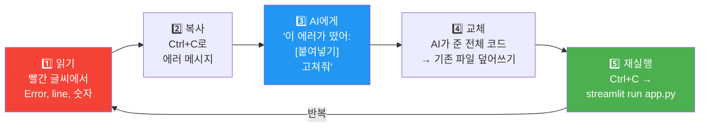

> **이 5단계를 반복하면 대부분의 에러가 해결된다.**
> 프로 개발자도 같은 과정을 하루에 수십 번 반복한다.

---

# 부록 I. 수업 전 준비 체크리스트 (교사용)

### 1주 전

```
☐ 컴퓨터실 예약 확인
☐ 컴퓨터 대수 확인 (팀당 1대 이상)
☐ 인터넷 연결 확인
☐ Python 설치 확인 (모든 PC에서 python --version 실행)
☐ Streamlit 설치 확인 (모든 PC에서 streamlit hello 실행)
☐ AI 접속 확인 (Claude 또는 ChatGPT에 접속 가능한지)
☐ 프로젝터/화면 공유 장비 확인
```

### 전날

```
☐ 1일차 자료 출력 (팀별 1부)
☐ 10가지 프로젝트 아이디어 요약 출력 (팀별 1부)
☐ 역할 배분표 출력 (팀별 1부)
☐ 회고 양식 출력 (팀별 3장 — 2,3,4일차용)
☐ 발표 대본 템플릿 출력 (팀별 1부)
☐ 투표 용지 준비 (선택)
☐ 시상 준비 (선택)
```

### 수업 당일 (시작 30분 전)

```
☐ 컴퓨터 부팅 확인
☐ Python/Streamlit 동작 확인 (1대만 테스트)
☐ AI 사이트 접속 확인
☐ 프로젝터 연결 확인
☐ 선생님 컴퓨터에서 데모 앱 미리 실행해보기
☐ 자료 배포 준비
```

### 수업 중 비상 계획

| 상황 | 대응 |
|---|---|
| Python이 안 깔려 있음 | 수업 중 설치 (15분 추가 소요). 최악의 경우 선생님 PC에서 대리 실행 |
| 인터넷이 끊김 | AI 없이 진행: 선생님이 미리 준비한 코드 템플릿 배포. 학생은 텍스트/콘텐츠 준비에 집중 |
| 학생 PC 고장 | 팀원 PC에서 같이 작업. 고장 PC 학생은 기획/콘텐츠 역할 |
| 발표 프로젝터 고장 | 선생님 노트북을 들고 다니며 보여주기. 또는 화면 캡처로 대체 |

---

# 부록 J. 프로젝트 선택 가이드 — 팀 성향별 추천

팀의 성향에 따라 적합한 프로젝트가 다르다.

### 팀 성향 진단 (1분)

```
우리 팀에 해당하는 것을 골라보자:

A. 이야기 만들기를 좋아한다 → 스토리형
B. 숫자와 통계가 재미있다 → 데이터형  
C. 테스트/퀴즈를 좋아한다 → 인터랙티브형
D. 실용적인 도구를 좋아한다 → 유틸리티형
E. 환경/사회 이슈에 관심있다 → 사회참여형
```

### 성향별 추천 프로젝트

| 성향 | 1순위 | 2순위 | 특징 |
|---|---|---|---|
| A 스토리형 | ① 방탈출 | ⑥ AI 튜터 | 텍스트 콘텐츠가 핵심, 분기 구조 |
| B 데이터형 | ② 설문 | ⑩ 환경 대시보드 | 차트+통계 중심, 대시보드 |
| C 인터랙티브형 | ③ 취향 테스트 | ⑦ 플레이리스트 | 질문→결과, 사용자 참여도 높음 |
| D 유틸리티형 | ⑤ 공부 타이머 | ⑧ 용돈 가계부 | 실생활 문제 해결, 실용적 |
| E 사회참여형 | ④ 급식 별점 | ⑩ 환경 대시보드 | 학교/사회 이슈, 데이터 기반 |

### 난이도별 분류

| 난이도 | 프로젝트 | 이유 |
|---|---|---|
| 쉬움 | ④ 급식 별점, ⑨ 시간표 | 화면 구조가 단순, 데이터가 적음 |
| 보통 | ③ 취향 테스트, ⑤ 타이머, ⑦ 플레이리스트, ⑧ 가계부 | 상태 관리 필요, 적당한 복잡도 |
| 어려움 | ① 방탈출, ② 설문, ⑥ AI 튜터, ⑩ 환경 대시보드 | 분기 구조/데이터 분석/API 연동 |

> 처음 바이브 코딩하는 팀이면 **쉬움**에서 시작하는 걸 추천한다.
> "일단 완성하는 경험"이 제일 중요하다.

---

# 부록 K. requirements.txt — 프로젝트 배포 시 필요

Streamlit Cloud에 배포할 때 app.py와 함께 이 파일이 필요하다.

### 기본 (모든 프로젝트 공통)

```
streamlit
pandas
```

### 차트를 많이 쓰는 프로젝트 (② 설문, ④ 급식, ⑤ 타이머, ⑧ 가계부, ⑩ 환경)

```
streamlit
pandas
matplotlib
```

### AI 튜터 프로젝트 (⑥) — API 연결할 경우

```
streamlit
pandas
openai
```

> 학생에게 requirements.txt를 직접 만들게 할 필요 없다.
> "이 내용을 requirements.txt 파일로 만들어줘"라고 AI에게 요청하면 된다.

---

# 부록 L. 바이브 코딩 프롬프트 작성 공식 — 학생용 카드

수업 중 학생 책상에 놓아둘 수 있는 프롬프트 작성 가이드.

```
┌─────────────────────────────────────────────────────────────┐
│                                                             │
│  ✨ 바이브 코딩 프롬프트 공식 ✨                              │
│                                                             │
│  [도구] + [뭘 만들지] + [화면 구성] + [데이터] + [동작]      │
│                                                             │
│  예시:                                                      │
│  "Streamlit으로 / 급식 별점 앱을 만들어줘 /                  │
│   메뉴 리스트, 슬라이더, 제출 버튼이 있고 /                  │
│   session_state에 저장하고 /                                │
│   제출하면 아래에 테이블로 보여줘"                            │
│                                                             │
│  ─────────────────────────────────────────────────────────  │
│                                                             │
│  🔧 잘 안 될 때:                                             │
│                                                             │
│  1. 에러 메시지를 복사해서 AI에게 보여줘                      │
│  2. "전체 코드를 다시 보여줘"라고 요청해                      │
│  3. 한 번에 하나만 고쳐달라고 해                              │
│  4. 그래도 안 되면 → 다른 AI에게도 물어봐                     │
│                                                             │
│  ─────────────────────────────────────────────────────────  │
│                                                             │
│  🎯 좋은 프롬프트 vs 나쁜 프롬프트:                           │
│                                                             │
│  ❌ "앱 만들어줘"                                            │
│  ❌ "예쁘게 해줘"                                            │
│  ✅ "st.columns(3)으로 카드 3개를 나란히 배치해줘"            │
│  ✅ "제출 버튼 누르면 session_state에 저장하고                │
│      아래에 dataframe으로 보여줘"                             │
│                                                             │
│  핵심: 구체적으로 말할수록 AI가 정확하게 만든다               │
│                                                             │
└─────────────────────────────────────────────────────────────┘
```

---

# 부록 M. 수업 일정표 — 4일 전체 타임라인

```
┌──────────┬──────────────────────────┬─────────────────────────┐
│   일차   │     1교시 (50분)          │     2교시 (50분)         │
├──────────┼──────────────────────────┼─────────────────────────┤
│          │ AI 시대 공부법           │ 프로젝트 선택            │
│  1일차   │ · OECD/WEF 역량         │ · 10개 아이디어 소개     │
│          │ · BG vs AG 마인드셋     │ · 팀 토론 → 선택         │
│          │ · 바이브 코딩 소개       │ · 한 줄 기획서 작성      │
│          │ · 라이브 데모            │ · 역할 분담              │
│          │                          │ · 화면 흐름도            │
├──────────┼──────────────────────────┼─────────────────────────┤
│          │ 환경 세팅                │ 핵심 기능 구현           │
│  2일차   │ · Python + Streamlit    │ · 프로젝트별 핵심 1개    │
│          │ · 첫 실행 확인          │ · 바이브 코딩 반복       │
│          │ · 첫 화면 바이브 코딩    │ · 에러 → AI에게 질문     │
│          │   (프롬프트 → 실행      │ · 팀 회고 (10분)         │
│          │    → 수정 반복)          │                         │
├──────────┼──────────────────────────┼─────────────────────────┤
│          │ 나머지 화면 구현         │ 데이터 연결 + 합치기     │
│  3일차   │ · 2~3번째 화면          │ · 입력→저장→표시 완성    │
│          │ · 탭/단계 전환          │ · 팀원 코드 통합         │
│          │ · 차트/대시보드          │ · End-to-End 테스트      │
│          │                          │ · 팀 회고 (10분)         │
│          │                          │ · 내일 발표 준비 안내    │
├──────────┼──────────────────────────┼─────────────────────────┤
│          │ UI 다듬기 + 테스트       │ 팀 발표 + 마무리         │
│  4일차   │ · 이모지, 색상, 여백    │ · 팀당 3분 시연          │
│          │ · 에러 처리             │ · 2분 Q&A               │
│          │ · 리허설 1회            │ · 투표 & 시상 (선택)     │
│          │                          │ · 전체 회고              │
│          │                          │ · 다음 단계 안내         │
└──────────┴──────────────────────────┴─────────────────────────┘
```

---

# 부록 N. 팀 활동지 양식 모음

수업에서 사용할 수 있는 활동지. 인쇄해서 팀별로 나눠줄 수 있다.

---

### 활동지 1: 한 줄 기획서 (1일차)

```
┌─────────────────────────────────────────────────────┐
│  한 줄 기획서                                        │
│                                                     │
│  팀명: _________________  날짜: ___________         │
│                                                     │
│  프로젝트: _____________________________________    │
│                                                     │
│  [누가] _____________ 가/이                         │
│  [무엇을] ______________________________ 할 수 있는  │
│  [왜] _________________________________ 때문에 필요한 │
│  앱을 만든다.                                        │
│                                                     │
│  핵심 기능 3가지:                                    │
│  1. ____________________________________________     │
│  2. ____________________________________________     │
│  3. ____________________________________________     │
│                                                     │
│  역할:                                               │
│  PM: ________  기획: ________  화면: ________       │
│  데이터: ________  발표: ________                    │
│                                                     │
└─────────────────────────────────────────────────────┘
```

### 활동지 2: 화면 흐름도 (1일차)

```
┌─────────────────────────────────────────────────────┐
│  화면 흐름도                                         │
│                                                     │
│  팀명: _________________                             │
│                                                     │
│  ┌──────────┐    ┌──────────┐    ┌──────────┐       │
│  │  화면 1   │ →  │  화면 2   │ →  │  화면 3   │      │
│  │          │    │          │    │          │       │
│  │          │    │          │    │          │       │
│  │          │    │          │    │          │       │
│  │          │    │          │    │          │       │
│  │          │    │          │    │          │       │
│  └──────────┘    └──────────┘    └──────────┘       │
│                                                     │
│  화면 1 이름: _______________                        │
│  · 있는 것: _______________________________________  │
│  · 누르면: _______________________________________   │
│                                                     │
│  화면 2 이름: _______________                        │
│  · 있는 것: _______________________________________  │
│  · 누르면: _______________________________________   │
│                                                     │
│  화면 3 이름: _______________                        │
│  · 있는 것: _______________________________________  │
│  · 누르면: _______________________________________   │
│                                                     │
└─────────────────────────────────────────────────────┘
```

### 활동지 3: 일일 회고 (2~4일차)

```
┌─────────────────────────────────────────────────────┐
│  ___일차 팀 회고                                     │
│                                                     │
│  팀명: _________________  날짜: ___________         │
│                                                     │
│  ✅ 오늘 된 것 (구체적으로):                          │
│  1. ____________________________________________     │
│  2. ____________________________________________     │
│  3. ____________________________________________     │
│                                                     │
│  ❌ 안 된 것 + 이유:                                 │
│  1. ____________________________________________     │
│     이유: ______________________________________     │
│  2. ____________________________________________     │
│     이유: ______________________________________     │
│                                                     │
│  📋 다음 시간에 할 것:                                │
│  누가: ________ → 할 것: _______________________    │
│  누가: ________ → 할 것: _______________________    │
│  누가: ________ → 할 것: _______________________    │
│                                                     │
│  💬 오늘 가장 인상 깊었던 순간:                       │
│  _________________________________________________  │
│                                                     │
└─────────────────────────────────────────────────────┘
```

### 활동지 4: 발표 준비 (4일차)

```
┌─────────────────────────────────────────────────────┐
│  발표 준비 시트                                      │
│                                                     │
│  팀명: _________________                             │
│  프로젝트: _______________                           │
│  발표자: _________________                           │
│                                                     │
│  [1분] 기획 의도:                                    │
│  · 이 앱은 ___________ 를 위한 앱입니다.             │
│  · 왜 만들었냐면 ________________________________    │
│  · 핵심 기능은 ________________________________      │
│                                                     │
│  [1분 30초] 시연 순서:                               │
│  장면 1: ________________________________________    │
│  장면 2: ________________________________________    │
│  장면 3: ________________________________________    │
│                                                     │
│  [30초] 배운 것:                                     │
│  · 가장 어려웠던 것: ___________________________     │
│  · 해결 방법: ___________________________________    │
│  · 이 경험에서 배운 것: _________________________    │
│                                                     │
│  예상 질문 & 답변:                                   │
│  Q: _____________________________________________    │
│  A: _____________________________________________    │
│                                                     │
└─────────────────────────────────────────────────────┘
```

### 활동지 5: 청중 피드백 (4일차 발표 시)

```
┌─────────────────────────────────────────────────────┐
│  청중 피드백                                         │
│                                                     │
│  내 이름: _____________ 팀: __________              │
│                                                     │
│  [발표 팀 1] 팀명: ___________                      │
│  · 가장 좋은 점: ________________________________    │
│  · 추가하면 좋을 기능: ___________________________   │
│  · 궁금한 점: ___________________________________    │
│                                                     │
│  [발표 팀 2] 팀명: ___________                      │
│  · 가장 좋은 점: ________________________________    │
│  · 추가하면 좋을 기능: ___________________________   │
│  · 궁금한 점: ___________________________________    │
│                                                     │
│  [발표 팀 3] 팀명: ___________                      │
│  · 가장 좋은 점: ________________________________    │
│  · 추가하면 좋을 기능: ___________________________   │
│  · 궁금한 점: ___________________________________    │
│                                                     │
│  🏆 투표:                                            │
│  가장 쓰고 싶은 앱: _________ 팀                     │
│  가장 예쁜 앱: _________ 팀                          │
│  가장 창의적인 앱: _________ 팀                      │
│                                                     │
└─────────────────────────────────────────────────────┘
```

---

> **이 문서는 2~4일차 수업의 모든 것을 담고 있다.**
> 1일차 문서(AI시대_공부법, 프로젝트_선택)와 함께 사용한다.
> 프로젝트별 상세 스펙은 `프론트엔드_개발의_한계와_아이디어_10선.md`를 참고한다.
