# 2일차 — 공부 타이머를 바이브 코딩으로 만들자 (완성본)

> **대상** : 중학교 1~2학년 5명  
> **시간** : 2시간 (1교시 50분 + 2교시 50분)  
> **도구** : VSCode + Python(Flask) + HTML + Claude Code (선생님만)  
> **목표** : 환경 셋팅부터 실행까지 직접 해보고, "개발 → 테스트 → 디버깅" 사이클을 체험한다  
> **운영 방식** : 선생님이 AI로 코드 생성 → 학생들에게 공유 → 학생들이 VSCode에 붙여넣고 실행/테스트

---

## 수업 운영 원칙

```
┌────────────────────────────────────────────────────────┐
│                                                        │
│   선생님 = AI로 코드를 만드는 사람 (프롬프트 시연)      │
│   학생   = 코드를 받아서 실행하고 테스트하는 사람        │
│                                                        │
│   학생이 "이거 바꾸고 싶어요!" → 프롬프트로 설명        │
│   → 선생님이 AI에게 전달 → 새 코드 공유 → 다시 테스트   │
│                                                        │
└────────────────────────────────────────────────────────┘
```

| 역할 | 하는 일 | 도구 |
|---|---|---|
| 선생님 | AI에게 프롬프트 입력, 코드 생성, 화면 공유 | Claude Code |
| 학생 | 코드를 VSCode에 붙여넣기, 실행, 테스트, 수정 요청 | VSCode + 브라우저 |

---

## 수업 전체 흐름

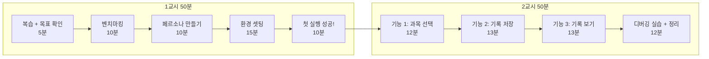

| 교시 | 시간 | 활동 | 핵심 |
|:---:|:---:|---|---|
| 1교시 | 5분 | 지난 시간 복습 + 오늘 목표 | "오늘은 직접 만들어본다!" |
| 1교시 | 10분 | 벤치마킹 (기존 타이머 앱 구경) | "잘 만든 앱은 뭐가 다르지?" |
| 1교시 | 10분 | 페르소나 만들기 | "누가 이 앱을 쓸까?" |
| 1교시 | 15분 | 환경 셋팅 (VSCode + Python + Flask) | "내 컴퓨터에서 돌려보자!" |
| 1교시 | 10분 | 첫 타이머 코드 실행 | "내가 만든 게 진짜 돌아간다!" |
| 2교시 | 12분 | 기능 추가 1: 과목 선택 | 개발 → 테스트 사이클 1회차 |
| 2교시 | 13분 | 기능 추가 2: 기록 저장 | 개발 → 테스트 사이클 2회차 |
| 2교시 | 13분 | 기능 추가 3: 기록 보기 | 개발 → 테스트 사이클 3회차 |
| 2교시 | 12분 | 디버깅 실습 + 오늘 정리 | "에러는 당연하다!" |

---

# 1교시 — 준비하고, 셋팅하고, 첫 실행!

---

## STEP 0. 지난 시간 복습 + 오늘 목표 (5분)

### 지난 시간에 한 것

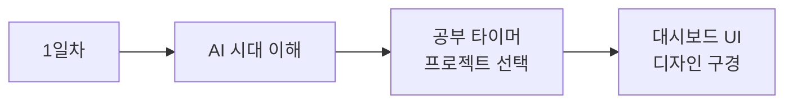

> 지난 시간에 공부 타이머 프로젝트를 정하고, 완성된 대시보드가 어떻게 생겼는지 봤다.
> 오늘은 **진짜로 만들어본다!**

### 오늘의 목표

```
┌──────────────────────────────────────────────────┐
│                                                  │
│   오늘의 목표:                                   │
│                                                  │
│   1. 내 컴퓨터에 개발 환경을 셋팅한다            │
│   2. 공부 타이머 기본 화면을 실행한다             │
│   3. 기능을 3개 추가한다 (과목, 기록, 통계)       │
│   4. "개발 → 테스트 → 디버깅" 사이클을 배운다     │
│                                                  │
└──────────────────────────────────────────────────┘
```

### 오늘의 개발 사이클

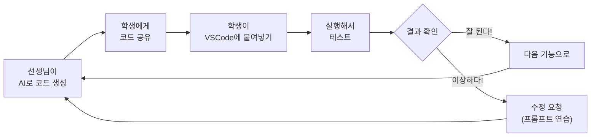

---

## STEP 1. 벤치마킹 — 잘 만든 앱 구경하기 (10분)

### 벤치마킹이 뭔데?

**벤치마킹** = 다른 사람이 잘 만든 것을 **구경하고 배우는 것**

요리사가 새 메뉴를 만들기 전에 맛집을 가보는 것과 같다.

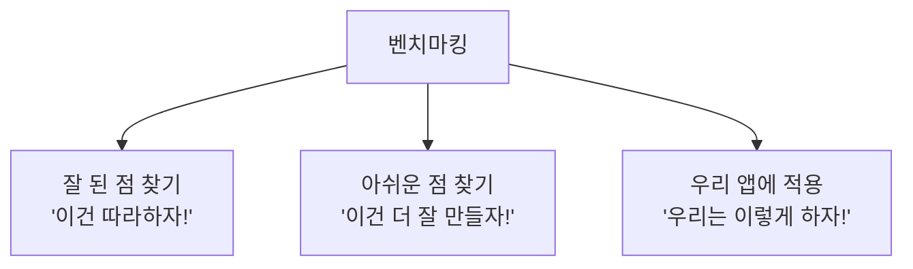

### 공부 타이머 앱 벤치마킹

선생님이 화면에 보여주는 앱들을 같이 보자.

| 앱 | 잘한 점 | 아쉬운 점 | 우리가 배울 것 |
|---|---|---|---|
| 뽀모도로 타이머 | 25분/5분 자동 반복 | 과목 구분이 없다 | 우리는 과목별로 만들자 |
| Forest (집중앱) | 나무가 자라서 재밌다 | 기록 확인이 불편 | 우리는 기록을 바로 보여주자 |
| 열품타 (열정품은타이머) | 순공시간 측정 | 디자인이 복잡 | 우리는 심플하게 만들자 |

### 벤치마킹 실습 (3분)

종이에 적어보자:

| 질문 | 내 생각 |
|---|---|
| 내가 본 타이머 앱 중 제일 좋았던 것은? | _________________ |
| 그 앱에서 가장 좋았던 기능은? | _________________ |
| 우리 타이머에 꼭 넣고 싶은 기능은? | _________________ |

---

## STEP 2. 페르소나 만들기 — 누가 이 앱을 쓸까? (10분)

### 페르소나가 뭔데?

**페르소나** = 우리 앱을 쓸 **가상의 사용자 캐릭터**

게임 캐릭터를 만들듯이, 우리 앱을 쓸 사람의 캐릭터를 만드는 것이다.

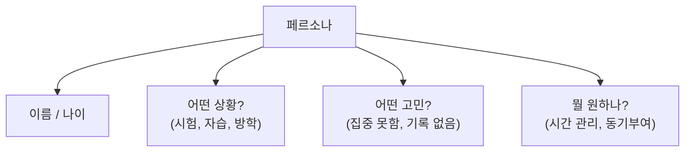

### 왜 페르소나가 필요한가?

| 페르소나 없이 | 페르소나 있으면 |
|---|---|
| "누가 쓸지 모르겠는데..." | "민수가 시험 기간에 쓸 거야" |
| "기능을 뭘 넣지?" | "민수는 과목별 시간이 필요해" |
| "디자인을 어떻게 하지?" | "민수는 심플한 게 좋대" |

### 우리의 페르소나

```
┌──────────────────────────────────────────────────┐
│  페르소나: 김민수 (중학교 2학년)                  │
├──────────────────────────────────────────────────┤
│  상황: 시험 2주 전, 자습 시간에 공부 중           │
│  고민: 공부한 것 같은데 시간이 얼마나 지났는지 모름 │
│  원하는 것:                                      │
│    - 과목별로 공부 시간을 재고 싶다               │
│    - 오늘 얼마나 공부했는지 한눈에 보고 싶다       │
│    - 쉬는 시간도 알려줬으면 좋겠다                │
│  성격: 심플한 걸 좋아함, 복잡하면 안 씀           │
└──────────────────────────────────────────────────┘
```

### 페르소나 → 기능 목록

페르소나의 고민이 곧 **만들어야 할 기능**이 된다:

| 민수의 고민 | 우리가 만들 기능 | 우선순위 |
|---|---|:---:|
| "시간이 얼마나 갔지?" | 카운트다운 타이머 | 필수 |
| "과목별로 재고 싶다" | 과목 선택 드롭다운 | 필수 |
| "오늘 얼마나 했지?" | 공부 기록 저장 + 표시 | 필수 |
| "쉬는 시간 알려줘" | 타이머 종료 알림 | 필수 |
| "심플하게!" | 깔끔한 디자인 | 필수 |

### 직접 페르소나 만들어보기 (5분)

종이에 적어보자:

| 항목 | 내가 만든 페르소나 |
|---|---|
| 이름 / 학년 | _________________ |
| 어떤 상황? | _________________ |
| 어떤 고민? | _________________ |
| 뭘 원하나? (3가지) | 1. _________________ |
| | 2. _________________ |
| | 3. _________________ |

---

## STEP 3. 환경 셋팅 — 내 컴퓨터에서 돌려보자! (15분)

### 필요한 도구 3가지

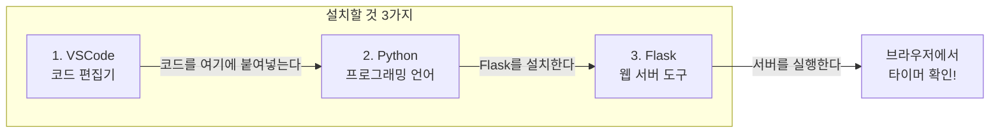

### 비유로 이해하기

| 도구 | 비유 | 역할 |
|---|---|---|
| VSCode | 공책 | 코드를 보고, 붙여넣고, 수정하는 곳 |
| Python | 연필 | 코드를 실행하는 언어 |
| Flask | 배달 오토바이 | 만든 화면을 브라우저에 전달 |
| 브라우저 | TV 화면 | 결과를 눈으로 확인 |

---

### 셋팅 Step 1 : VSCode 설치 (5분)

| 순서 | 할 일 | 상세 |
|:---:|---|---|
| 1 | 선생님이 화면에 보여주는 주소 입력 | `code.visualstudio.com` |
| 2 | 파란색 Download 버튼 클릭 | Windows / Mac 자동 선택됨 |
| 3 | 다운로드된 파일 실행 | "다음 → 다음 → 설치" |
| 4 | VSCode 실행 확인 | 검은 화면이 뜨면 성공! |

> 이미 설치되어 있으면 건너뛴다.

### 셋팅 Step 2 : Python 설치 (5분)

| 순서 | 할 일 | 주의사항 |
|:---:|---|---|
| 1 | 선생님이 보여주는 주소 입력 | `python.org/downloads` |
| 2 | 노란색 Download 버튼 클릭 | |
| 3 | 설치할 때 **"Add to PATH" 체크!** | 이거 안 하면 안 됨! |
| 4 | "다음 → 다음 → 설치" | |
| 5 | 터미널에서 확인 | `python --version` 입력 |

```
┌───────────────────────────────────────────────────┐
│                                                   │
│   중요! 설치할 때 맨 아래에 있는                    │
│   ☑ Add Python to PATH                           │
│   이거 반드시 체크하세요!                           │
│                                                   │
│   안 하면 python 명령어가 안 됩니다                 │
│                                                   │
└───────────────────────────────────────────────────┘
```

### 셋팅 Step 3 : 프로젝트 폴더 + Flask 설치 (5분)

**VSCode에서 터미널 열기:**

| 순서 | 할 일 |
|:---:|---|
| 1 | VSCode 상단 메뉴 → 터미널 → 새 터미널 |
| 2 | 또는 단축키: `` Ctrl + ` `` (백틱) |

**터미널에 하나씩 입력:**

```bash
mkdir study-timer
cd study-timer
pip install flask
```

> Mac에서 안 되면: `pip3 install flask`
> 그래도 안 되면: `python -m pip install flask`

**설치 확인:**

```bash
python -c "import flask; print(flask.__version__)"
```

> `3.1.1` 같은 숫자가 나오면 성공!

### requirements.txt로 관리하기

프로젝트에 필요한 라이브러리를 파일로 관리하면, 다른 컴퓨터에서도 쉽게 설치할 수 있다.

**requirements.txt 파일 내용:**

```
flask==3.1.1
```

이 파일이 있으면 나중에 이 명령어 하나로 전부 설치 가능:

```bash
pip install -r requirements.txt
```

| 왜 requirements.txt를 쓰나? | 설명 |
|---|---|
| 다른 컴퓨터에서 작업할 때 | 파일 하나로 같은 환경 만들기 |
| 친구에게 프로젝트 줄 때 | "이거 실행하면 돼" |
| 나중에 기억 안 날 때 | "뭘 설치했더라?" 파일 보면 됨 |

### 셋팅 완료 체크리스트

| 번호 | 확인 항목 | 완료 |
|:---:|---|:---:|
| 1 | VSCode가 열린다 | [ ] |
| 2 | 터미널에서 `python --version` 하면 숫자가 나온다 | [ ] |
| 3 | `study-timer` 폴더를 만들었다 | [ ] |
| 4 | `pip install flask` 가 성공했다 | [ ] |

---

## STEP 4. 첫 타이머 실행! (10분)

### 수업 운영 방식 설명

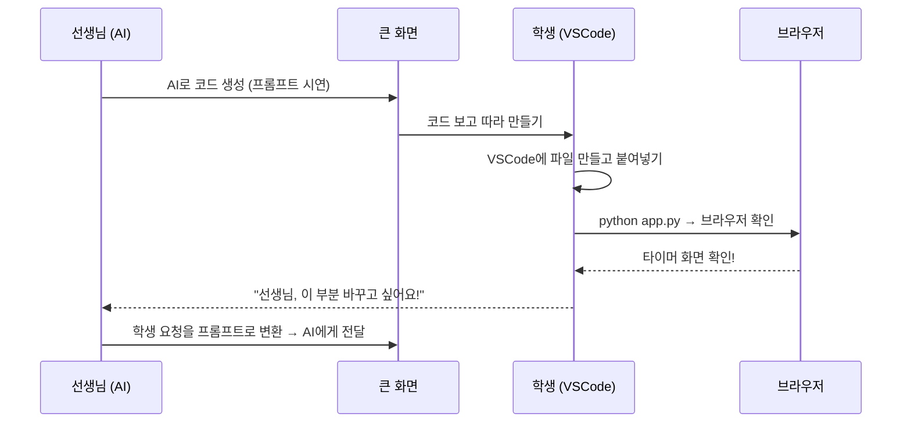

### 선생님이 AI에게 보낼 첫 번째 프롬프트

> 이 프롬프트를 학생들에게 보여주면서 "이렇게 말하면 AI가 코드를 만들어준다"고 설명한다.

```
공부 타이머 웹앱을 만들어줘.

기술 스택:
- 백엔드: Python Flask
- 프론트엔드: HTML + CSS + JavaScript
- app.py 파일 1개와 templates/index.html 파일 1개로 구성

기능:
1. 25분 카운트다운 타이머 (분:초 형식)
2. 시작, 일시정지, 리셋 버튼 3개
3. 타이머가 0이 되면 "수고했어! 쉬는 시간!" 메시지 표시

디자인:
- 화면 가운데 정렬
- 타이머 숫자는 크게 (80px)
- 시작 버튼은 초록색, 일시정지는 노란색, 리셋은 빨간색
- 배경은 어두운 색 (#1a1a2e)
- 둥근 버튼 (border-radius: 12px)
```

### 프롬프트 분석 — 왜 이렇게 쓰나?

| 프롬프트 부분 | 역할 |
|---|---|
| "공부 타이머 웹앱을 만들어줘" | 전체 목표를 알려준다 |
| "기술 스택: Flask + HTML" | 어떤 기술로 만들지 정해준다 |
| "app.py 1개 + index.html 1개" | 파일을 심플하게 제한 |
| "기능: 1, 2, 3" | 정확히 뭘 만들지 알려준다 |
| "디자인: 가운데, 80px, 초록색" | 보이는 모습까지 구체적으로 |

### 학생들이 할 일 — 파일 만들고 붙여넣기

**파일 구조:**

```
study-timer/
├── app.py                  ← Python 서버
├── requirements.txt        ← 라이브러리 목록
└── templates/
    └── index.html          ← 타이머 화면
```

| 순서 | 학생이 할 일 |
|:---:|---|
| 1 | VSCode에서 `study-timer` 폴더 열기 (파일 → 폴더 열기) |
| 2 | `app.py` 파일 새로 만들기 |
| 3 | 선생님이 보여주는 코드 복사해서 붙여넣기 |
| 4 | `templates` 폴더 만들기 |
| 5 | `templates/index.html` 파일 만들기 |
| 6 | 선생님이 보여주는 HTML 코드 붙여넣기 |

### app.py 코드 이해하기

```python
from flask import Flask, render_template

app = Flask(__name__)

@app.route('/')
def home():
    return render_template('index.html')

if __name__ == '__main__':
    app.run(debug=True)
```

| 줄 | 코드 | 뜻 |
|:---:|---|---|
| 1 | `from flask import Flask` | Flask 도구 가져오기 |
| 3 | `app = Flask(__name__)` | 웹 서버 하나 만들기 |
| 5 | `@app.route('/')` | 누가 메인 주소로 오면 |
| 6~7 | `def home(): return ...` | index.html을 보여준다 |
| 9~10 | `app.run(debug=True)` | 서버를 켠다 |

> 코드를 외울 필요 없다. **어떤 역할인지만** 이해하면 된다.

### 실행하기!

```bash
python app.py
```

터미널에 이런 메시지가 뜨면 성공:

```
 * Running on http://127.0.0.1:5000
```

| 순서 | 할 일 |
|:---:|---|
| 1 | 브라우저를 연다 (Chrome 또는 Edge) |
| 2 | 주소창에 `http://127.0.0.1:5000` 입력 |
| 3 | Enter! |
| 4 | 타이머 화면이 보이면 성공! |

```
┌──────────────────────────────────────────────────┐
│                                                  │
│   축하합니다! 첫 번째 웹앱을 실행했습니다!         │
│                                                  │
│   지금 내 컴퓨터가 "서버"가 된 것이다.            │
│   브라우저는 서버에게 "화면 보여줘"라고 요청하고,   │
│   Flask가 HTML 파일을 전달해준 것이다.            │
│                                                  │
└──────────────────────────────────────────────────┘
```

### 1교시 완료 체크리스트

| 번호 | 확인 | 완료 |
|:---:|---|:---:|
| 1 | 벤치마킹으로 좋은 타이머 앱의 특징을 알았다 | [ ] |
| 2 | 페르소나를 만들었다 | [ ] |
| 3 | VSCode + Python + Flask 설치 완료 | [ ] |
| 4 | 첫 타이머가 브라우저에 떴다! | [ ] |

---

# 2교시 — 기능 추가하고 디버깅하기

---

## 핵심: 개발 → 테스트 → 디버깅 사이클

2교시에는 이 사이클을 **3번 반복**한다.

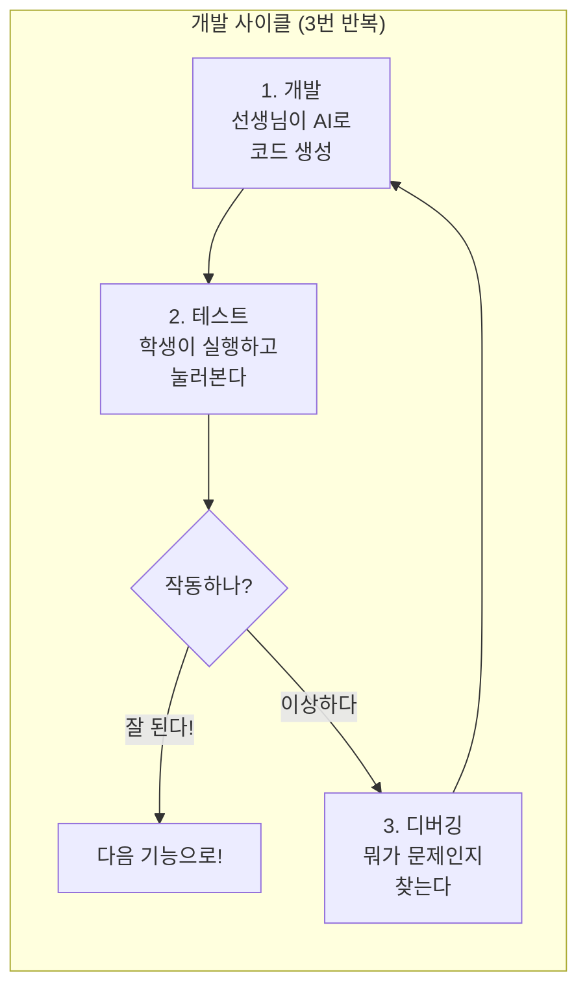

| 사이클 | 추가할 기능 | 테스트할 것 |
|:---:|---|---|
| 1회차 | 과목 선택 | 과목을 바꿔도 되나? |
| 2회차 | 공부 기록 저장 | 타이머 끝나면 저장되나? |
| 3회차 | 오늘의 기록 보기 | 기록이 화면에 나오나? |

---

## 사이클 1회차 : 과목 선택 추가 (12분)

### 개발 — 선생님이 AI에게 요청

> 선생님이 프롬프트를 큰 화면에 보여주면서 입력한다. 학생들은 프롬프트를 관찰한다.

**프롬프트:**

```
타이머 위에 과목 선택 기능을 추가해줘.

- 드롭다운 (select)으로 과목을 고를 수 있게
- 과목 목록: 수학, 영어, 국어, 과학, 사회
- 선택한 과목이 타이머 위에 크게 표시
- 과목마다 색깔을 다르게
  - 수학: 파랑, 영어: 주황, 국어: 초록, 과학: 노랑, 사회: 분홍
```

**프롬프트 포인트 설명:**

| 요소 | 왜 이렇게 썼나 |
|---|---|
| "드롭다운 (select)" | 구체적인 UI 방식을 지정 |
| "과목 목록: 5개" | 정확한 데이터를 알려줌 |
| "과목마다 색깔을 다르게" | 시각적 구분까지 요청 |

### 테스트 — 학생이 확인

AI가 만들어준 코드를 받아서 기존 파일에 덮어씌운다.

| 순서 | 학생이 할 일 |
|:---:|---|
| 1 | 선생님이 공유한 새 코드를 VSCode에 붙여넣기 |
| 2 | 터미널에서 서버 끄기: `Ctrl + C` |
| 3 | 다시 실행: `python app.py` |
| 4 | 브라우저에서 새로고침: `Ctrl + Shift + R` |

**테스트 체크리스트:**

| 확인 항목 | 결과 |
|---|---|
| 드롭다운이 보이나? | [ ] 예 / [ ] 아니오 |
| 과목이 5개 다 있나? | [ ] 예 / [ ] 아니오 |
| 과목을 바꾸면 색이 바뀌나? | [ ] 예 / [ ] 아니오 |
| 타이머 시작/정지가 여전히 되나? | [ ] 예 / [ ] 아니오 |

### 수정 요청 연습

> 학생이 바꾸고 싶은 것을 **말로 설명**한다. 선생님이 프롬프트로 바꿔서 AI에게 전달한다.

| 학생이 말한 것 | 선생님이 변환한 프롬프트 |
|---|---|
| "글씨가 너무 작아요" | "과목 이름 글자 크기를 30px로 키워줘" |
| "색이 마음에 안 들어요" | "수학 색을 #4CAF50으로 바꿔줘" |
| "다른 과목도 넣고 싶어요" | "과목 목록에 '한문', '기술'을 추가해줘" |

```
┌──────────────────────────────────────────────────┐
│                                                  │
│   프롬프트 연습 팁:                               │
│                                                  │
│   나쁜 예: "이상해, 다시 해"                      │
│   좋은 예: "과목 선택하면 위에 과목 이름이 표시     │
│            되게 해줘, 글자 크기는 30px로"          │
│                                                  │
│   구체적으로 말할수록 → AI가 정확하게 만든다       │
│                                                  │
└──────────────────────────────────────────────────┘
```

---

## 사이클 2회차 : 공부 기록 저장 (13분)

### 개발 — 선생님이 AI에게 요청

**프롬프트:**

```
타이머가 끝나면 공부 기록을 자동으로 저장해줘.

저장할 데이터:
- 과목 이름
- 공부한 시간 (분)
- 날짜와 시각

기술적 요구사항:
- Flask에 POST /save 라우트 추가
- 데이터는 records.json 파일에 저장
- 타이머가 0이 되면 JavaScript에서 자동으로 /save에 데이터 전송
- 저장 성공하면 "기록 저장됨!" 메시지 표시
```

**데이터 흐름 설명:**

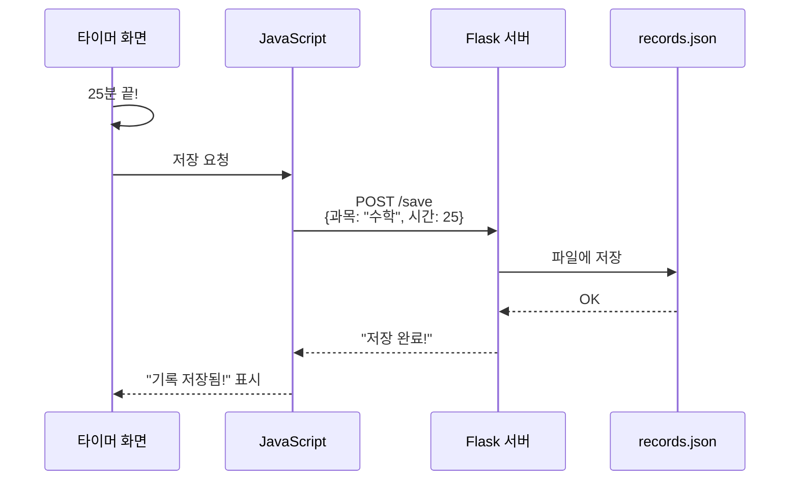

### 테스트 — 학생이 확인

| 순서 | 학생이 할 일 |
|:---:|---|
| 1 | 새 코드를 VSCode에 붙여넣기 (app.py + index.html 모두) |
| 2 | 서버 재시작: `Ctrl + C` → `python app.py` |
| 3 | 브라우저 새로고침 |
| 4 | 타이머를 짧게 테스트 (시작 버튼 누르고 끝날 때까지 기다리기) |

> 테스트 팁: 25분은 너무 기니까, 선생님에게 "타이머를 10초로 바꿔주세요"라고 요청하자!

**테스트 체크리스트:**

| 확인 항목 | 결과 |
|---|---|
| 타이머가 0이 되면 메시지가 뜨나? | [ ] 예 / [ ] 아니오 |
| "기록 저장됨!" 이 표시되나? | [ ] 예 / [ ] 아니오 |
| records.json 파일이 생겼나? | [ ] 예 / [ ] 아니오 |

**records.json 확인하기:**

VSCode에서 `records.json` 파일을 열어보면 이런 내용이 있어야 한다:

```json
[
  {
    "subject": "수학",
    "minutes": 25,
    "date": "2026-07-23 14:30:00"
  }
]
```

> 파일에 데이터가 있으면 성공!

---

## 사이클 3회차 : 오늘의 기록 보기 (13분)

### 개발 — 선생님이 AI에게 요청

**프롬프트:**

```
타이머 아래에 "오늘의 공부 기록" 영역을 추가해줘.

표시할 내용:
- 과목별 공부 시간을 가로 막대 그래프로 표시
- 총 공부 시간 합계 표시
- 페이지를 열 때 Flask의 GET /records에서 오늘 데이터를 가져와서 표시

디자인:
- 타이머 아래쪽에 위치
- 막대 그래프는 과목 색깔과 동일
- "오늘의 기록"이라는 제목 표시
```

### 테스트 — 학생이 확인

| 순서 | 학생이 할 일 |
|:---:|---|
| 1 | 새 코드 붙여넣기 → 서버 재시작 → 새로고침 |
| 2 | 타이머를 한 번 돌려서 기록을 쌓는다 |
| 3 | 다른 과목으로 바꿔서 한 번 더 돌린다 |
| 4 | 기록 영역에 2개의 막대가 나오는지 확인 |

**테스트 체크리스트:**

| 확인 항목 | 결과 |
|---|---|
| "오늘의 기록" 영역이 보이나? | [ ] 예 / [ ] 아니오 |
| 막대 그래프가 나오나? | [ ] 예 / [ ] 아니오 |
| 과목별 색깔이 구분되나? | [ ] 예 / [ ] 아니오 |
| 총 시간 합계가 맞나? | [ ] 예 / [ ] 아니오 |

### 수정 요청 연습

학생들이 바꾸고 싶은 것을 종이에 적어보자:

```
나는 _____________ 을/를 바꾸고 싶다.
구체적으로: ___________________________
```

예시:

| 학생 | 요청 | 프롬프트로 변환 |
|---|---|---|
| A | "막대 두께를 더 두껍게" | "막대 그래프 높이를 30px로 키워줘" |
| B | "과목 옆에 시간도 써줘" | "막대 오른쪽에 '25분' 같은 숫자 표시해줘" |
| C | "기록 지우는 버튼" | "기록 전체 삭제 버튼을 추가해줘" |

---

## STEP 5. 디버깅 실습 + 오늘 정리 (12분)

### 디버깅이란?

```
┌──────────────────────────────────────────────────┐
│                                                  │
│   에러가 나는 건 실패가 아니다.                    │
│   고치는 게 실력이다.                             │
│                                                  │
│   프로 개발자의 하루:                             │
│   코드 짜기 30% + 에러 고치기 70%                 │
│                                                  │
└──────────────────────────────────────────────────┘
```

### 에러 3종류와 대처법

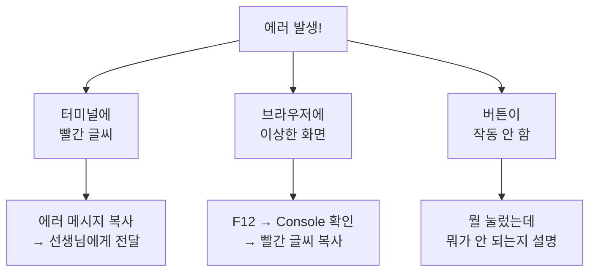

| 에러 종류 | 어디서 보이나 | 어떻게 하나 |
|---|---|---|
| 서버 에러 | 터미널 (빨간 글씨) | 에러 메시지를 선생님에게 보여주기 |
| 화면 에러 | 브라우저 (깨진 화면) | F12 → Console에서 빨간 글씨 찾기 |
| 기능 에러 | 버튼이 작동 안 함 | "A를 했는데 B가 안 돼요" 설명하기 |

### 디버깅 실습 — 일부러 에러 내보기 (5분)

아래 중 1개를 골라서 해보자:

**실습 A : 서버 에러**

| 순서 | 할 일 |
|:---:|---|
| 1 | app.py 1번째 줄 `from flask import Flask`를 지운다 |
| 2 | `python app.py` 실행 |
| 3 | 에러 메시지를 읽어본다 → `ModuleNotFoundError` |
| 4 | 지운 줄을 다시 넣는다 (Ctrl + Z로 되돌리기) |
| 5 | 다시 실행해서 되는지 확인 |

**실습 B : 화면 에러**

| 순서 | 할 일 |
|:---:|---|
| 1 | index.html에서 `</div>` 하나를 지운다 |
| 2 | 브라우저 새로고침 → 화면이 깨진다 |
| 3 | Ctrl + Z로 되돌린다 |
| 4 | 새로고침 → 원래대로 돌아오는지 확인 |

### 디버깅 3단계 정리

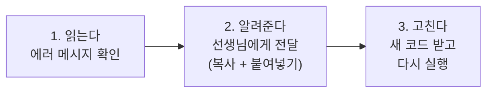

---

### 오늘 한 일 총정리

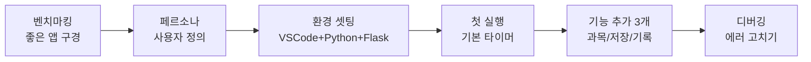

| 단계 | 한 일 | 배운 것 |
|---|---|---|
| 벤치마킹 | 기존 타이머 앱 분석 | 좋은 앱에서 아이디어를 얻는다 |
| 페르소나 | 사용자 캐릭터 만들기 | "누가 쓸까"를 먼저 정해야 한다 |
| 환경 셋팅 | VSCode + Python + Flask | 도구를 준비하는 과정 |
| 개발 사이클 | 3번의 개발→테스트→디버깅 | 한 번에 하나씩, 만들고 바로 확인! |
| 디버깅 | 에러 만들고 고치기 | 에러는 당연하다. 고치는 게 실력이다 |

### 핵심 3가지

```
┌──────────────────────────────────────────────────┐
│                                                  │
│   1. 페르소나 = 만들기 전에 "누구를 위한 건지"     │
│      정하면 기능이 자연스럽게 나온다               │
│                                                  │
│   2. 개발 사이클 = 개발 → 테스트 → 디버깅을        │
│      반복하면 앱이 점점 완성된다                   │
│                                                  │
│   3. 프롬프트 = 구체적으로 말할수록                │
│      AI가 정확하게 만들어준다                      │
│                                                  │
└──────────────────────────────────────────────────┘
```

---

# 부록

---

## 부록 A : 자주 나오는 문제 해결

| 문제 | 해결 |
|---|---|
| `python`이 안 된다 | `python3`으로 시도 (Mac) |
| `pip install flask` 에러 | `pip3 install flask` 또는 `python -m pip install flask` |
| 브라우저에 "연결할 수 없음" | 서버가 켜져 있는지 터미널 확인 |
| 코드 수정했는데 안 바뀜 | `Ctrl + Shift + R` (강력 새로고침) |
| 서버 끄는 법 | 터미널에서 `Ctrl + C` |
| 주소가 뭐지? | `http://127.0.0.1:5000` (https 아님!) |

## 부록 B : 프롬프트 작성 공식

```
좋은 프롬프트 = 무엇을 + 어떻게 + 제약 조건

예시:
"카운트다운 타이머를 만들어줘"       ← 무엇을
"시작/정지/리셋 버튼이 있고"        ← 어떻게
"Flask + HTML로, 파일 2개로 구성"   ← 제약 조건
```

| 상황 | 프롬프트 예시 |
|---|---|
| 처음 만들 때 | "[기능]을 Flask + HTML로 만들어줘. app.py와 index.html로 구성" |
| 기능 추가할 때 | "[기존 기능]에 [새 기능]을 추가해줘. 위치는 [어디에]" |
| 디자인 수정 | "[대상]의 [색/크기/위치]를 [구체적 값]으로 바꿔줘" |
| 에러 고칠 때 | "이 에러 고쳐줘: [에러 메시지 전체 복사]" |

## 부록 C : 추가 기능 아이디어

시간이 남으면 선생님에게 요청해보자!

| 난이도 | 기능 | 프롬프트 예시 |
|---|---|---|
| 쉬움 | 타이머 끝나면 소리 | "타이머가 0이 되면 알림 소리 재생해줘" |
| 쉬움 | 시간 선택 | "5분, 15분, 25분, 50분 중에 고르게 해줘" |
| 보통 | 뽀모도로 모드 | "25분 공부 + 5분 휴식 자동 반복" |
| 보통 | 목표 시간 | "오늘 목표 3시간, 달성률 보여줘" |
| 어려움 | 주간 통계 | "이번 주 요일별 막대 그래프" |

---

> **다음 시간 예고** : 오늘 만든 타이머를 더 발전시키고, 대시보드 화면도 연결해봅니다!
