# 2일차 — 공부 타이머 프론트엔드 실습

> **대상** : 중학교 1~2학년 5명  
> **시간** : 2시간 (1교시 50분 + 2교시 50분)  
> **도구** : VSCode + Python(Flask) + HTML/CSS/JS + Claude Code (선생님만)  
> **목표** : 페르소나 → 벤치마킹 → 유저 시나리오를 정의하고, 더미 데이터로 프론트엔드를 완성한다  
> **운영 방식** : 선생님이 AI로 코드 생성 → 학생들에게 공유 → 학생들이 VSCode에 붙여넣고 실행/테스트  
> **이번 시간 핵심** : 프론트엔드만 진행. 실제 백엔드 연동 없이 더미 데이터(dummy data)로 화면을 만든다.

---

## 수업 운영 원칙

```
┌────────────────────────────────────────────────────────┐
│                                                        │
│   선생님 = AI로 코드를 만드는 사람 (프롬프트 시연)      │
│   학생   = 코드를 받아서 실행하고 테스트하는 사람        │
│                                                        │
│   학생이 "이거 바꾸고 싶어요!" → 프롬프트로 설명        │
│   → 선생님이 AI에게 전달 → 새 코드 공유 → 다시 테스트   │
│                                                        │
└────────────────────────────────────────────────────────┘
```

| 역할 | 하는 일 | 도구 |
|---|---|---|
| 선생님 | AI에게 프롬프트 입력, 코드 생성, 화면 공유 | Claude Code |
| 학생 | 코드를 VSCode에 붙여넣기, 실행, 테스트, 수정 요청 | VSCode + 브라우저 |

---

## 수업 전체 흐름

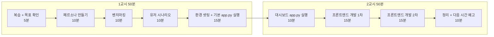

| 교시 | 시간 | 활동 | 핵심 |
|:---:|:---:|---|---|
| 1교시 | 5분 | 지난 시간 복습 + 오늘 목표 | "오늘은 화면을 직접 만든다!" |
| 1교시 | 10분 | 페르소나 만들기 | "누가 이 앱을 쓸까?" |
| 1교시 | 10분 | 벤치마킹 (기존 타이머 앱 구경) | "잘 만든 앱은 뭐가 다르지?" |
| 1교시 | 10분 | 유저 시나리오 작성 | "사용자가 어떤 순서로 쓸까?" |
| 1교시 | 15분 | 환경 셋팅 + 기본 app.py 실행 | "내 컴퓨터에서 서버를 돌려보자!" |
| 2교시 | 10분 | 대시보드 app.py 실행 | "완성된 대시보드를 내 서버로 띄우자!" |
| 2교시 | 15분 | 프론트엔드 개발 1차 (과목 선택 + 타이머) | 개발 → 테스트 사이클 1회차 |
| 2교시 | 15분 | 프론트엔드 개발 2차 (기록 표시 + 통계) | 개발 → 테스트 사이클 2회차 |
| 2교시 | 10분 | 오늘 정리 + 다음 시간 예고 | 다음 시간: 백엔드 개발! |

---

# 1교시 — 기획하고, 셋팅하고, 첫 실행!

---

## STEP 0. 지난 시간 복습 + 오늘 목표 (5분)

### 지난 시간에 한 것

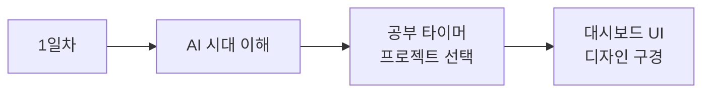

> 지난 시간에 공부 타이머 프로젝트를 정하고, 완성된 대시보드가 어떻게 생겼는지 봤다.
> 오늘은 **화면(프론트엔드)을 직접 만들어본다!**

### 오늘의 목표

```
┌──────────────────────────────────────────────────┐
│                                                  │
│   오늘의 목표:                                   │
│                                                  │
│   1. 페르소나 → 벤치마킹 → 유저 시나리오를 정한다  │
│   2. 개발 환경을 셋팅하고 기본 서버를 실행한다     │
│   3. 더미 데이터로 프론트엔드 화면을 완성한다       │
│   4. "개발 → 테스트" 사이클을 반복 체험한다        │
│                                                  │
│   ⚠ 오늘은 프론트엔드(화면)만 만든다!              │
│   ⚠ 진짜 데이터 저장은 다음 시간에!                │
│                                                  │
└──────────────────────────────────────────────────┘
```

### 프론트엔드 vs 백엔드 — 뭐가 다를까?

| 구분 | 프론트엔드 (오늘) | 백엔드 (다음 시간) |
|---|---|---|
| 비유 | 식당의 인테리어, 메뉴판 | 식당의 주방, 냉장고 |
| 역할 | 사용자가 보고 누르는 화면 | 데이터를 저장하고 처리하는 서버 |
| 기술 | HTML + CSS + JavaScript | Python (Flask) + 데이터베이스 |
| 오늘 방식 | **더미 데이터**로 화면만 만든다 | 다음 시간에 진짜 데이터 연결 |

```
┌──────────────────────────────────────────────────┐
│                                                  │
│   더미 데이터(dummy data)란?                      │
│                                                  │
│   진짜 데이터가 아니라 화면을 테스트하기 위해       │
│   미리 만들어 놓은 가짜 데이터.                    │
│                                                  │
│   예시:                                          │
│   "수학 25분, 영어 30분" ← 진짜 공부한 게 아니라   │
│   화면이 잘 보이는지 확인하려고 넣은 데이터         │
│                                                  │
└──────────────────────────────────────────────────┘
```

---

## STEP 1. 페르소나 만들기 — 누가 이 앱을 쓸까? (10분)

### 페르소나가 뭔데?

**페르소나** = 우리 앱을 쓸 **가상의 사용자 캐릭터**

게임 캐릭터를 만들듯이, 우리 앱을 쓸 사람의 캐릭터를 만드는 것이다.

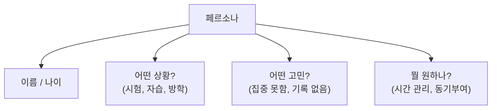

### 왜 페르소나를 가장 먼저 하나?

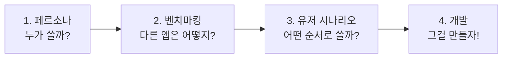

> **사용자를 먼저 정해야** 뭘 만들지 알 수 있다.
> 페르소나가 없으면 "뭘 만들지?" 고민만 하다가 시간이 끝난다.

### 우리의 페르소나

```
┌──────────────────────────────────────────────────┐
│  페르소나: 김민수 (중학교 2학년)                  │
├──────────────────────────────────────────────────┤
│  상황: 시험 2주 전, 자습 시간에 공부 중           │
│  고민: 공부한 것 같은데 시간이 얼마나 지났는지 모름 │
│  원하는 것:                                      │
│    - 과목별로 공부 시간을 재고 싶다               │
│    - 오늘 얼마나 공부했는지 한눈에 보고 싶다       │
│    - 쉬는 시간도 알려줬으면 좋겠다                │
│  성격: 심플한 걸 좋아함, 복잡하면 안 씀           │
└──────────────────────────────────────────────────┘
```

### 직접 페르소나 만들어보기 (5분)

종이에 적어보자:

| 항목 | 내가 만든 페르소나 |
|---|---|
| 이름 / 학년 | _________________ |
| 어떤 상황? | _________________ |
| 어떤 고민? | _________________ |
| 뭘 원하나? (3가지) | 1. _________________ |
| | 2. _________________ |
| | 3. _________________ |

---

## STEP 2. 벤치마킹 — 잘 만든 앱 구경하기 (10분)

### 벤치마킹이 뭔데?

**벤치마킹** = 다른 사람이 잘 만든 것을 **구경하고 배우는 것**

요리사가 새 메뉴를 만들기 전에 맛집을 가보는 것과 같다.

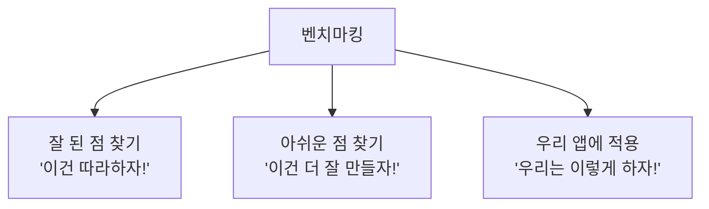

### 공부 타이머 앱 벤치마킹

선생님이 화면에 보여주는 앱들을 같이 보자.

| 앱 | 잘한 점 | 아쉬운 점 | 우리가 배울 것 |
|---|---|---|---|
| 뽀모도로 타이머 | 25분/5분 자동 반복 | 과목 구분이 없다 | 우리는 과목별로 만들자 |
| Forest (집중앱) | 나무가 자라서 재밌다 | 기록 확인이 불편 | 우리는 기록을 바로 보여주자 |
| 열품타 (열정품은타이머) | 순공시간 측정 | 디자인이 복잡 | 우리는 심플하게 만들자 |

### 벤치마킹 실습 (3분)

종이에 적어보자:

| 질문 | 내 생각 |
|---|---|
| 내가 본 타이머 앱 중 제일 좋았던 것은? | _________________ |
| 그 앱에서 가장 좋았던 기능은? | _________________ |
| 우리 타이머에 꼭 넣고 싶은 기능은? | _________________ |

---

## STEP 3. 유저 시나리오 — 사용자가 어떻게 쓸까? (10분)

### 유저 시나리오가 뭔데?

**유저 시나리오** = 사용자가 앱을 **실제로 쓰는 순서**를 미리 상상해보는 것

드라마 대본처럼, "김민수가 앱을 열면 → 이걸 하고 → 저걸 하고..." 를 적는 것이다.

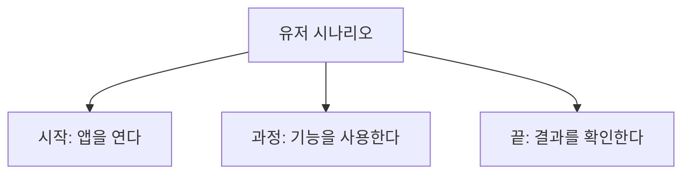

### 왜 유저 시나리오가 필요한가?

| 시나리오 없이 | 시나리오 있으면 |
|---|---|
| "일단 만들자!" → 뭐부터 만들지? | "민수가 처음에 과목을 고른다" → 드롭다운부터 만들자 |
| 만들고 보니 순서가 이상하다 | 사용 순서대로 만드니까 자연스럽다 |
| 어떤 화면이 필요한지 모르겠다 | 시나리오 한 단계 = 화면 하나 |

### 김민수의 유저 시나리오

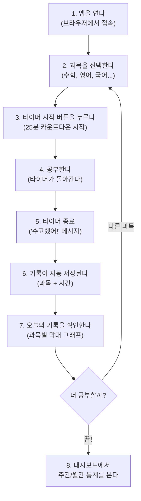

### 시나리오 → 만들 화면 정리

| 시나리오 단계 | 필요한 화면/기능 | 오늘 만들까? |
|---|---|:---:|
| 1~3. 앱 열기 + 과목 선택 + 시작 | 타이머 화면 + 과목 드롭다운 | O (더미) |
| 4~5. 타이머 동작 + 종료 | 카운트다운 + 완료 메시지 | O |
| 6. 기록 저장 | 저장 완료 메시지 표시 | O (더미) |
| 7. 오늘 기록 확인 | 과목별 막대 그래프 | O (더미) |
| 8. 대시보드 통계 | 주간/월간 통계 화면 | O (이미 있음!) |

> "더미"라고 적힌 것 = 화면은 보이지만 진짜 저장/계산은 안 됨. 다음 시간에 백엔드를 연결하면 진짜로 동작한다!

### 직접 유저 시나리오 만들어보기 (5분)

종이에 적어보자 — 내 페르소나가 앱을 쓰는 순서:

| 순서 | 뭘 하나? |
|---|---|
| 1. 앱을 연다 | → |
| 2. | → |
| 3. | → |
| 4. | → |
| 5. | → |

---

## STEP 4. 환경 셋팅 + 기본 app.py 실행 (15분)

### 필요한 도구 3가지

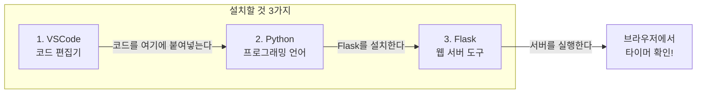

### 비유로 이해하기

| 도구 | 비유 | 역할 |
|---|---|---|
| VSCode | 공책 | 코드를 보고, 붙여넣고, 수정하는 곳 |
| Python | 연필 | 코드를 실행하는 언어 |
| Flask | 배달 오토바이 | 만든 화면을 브라우저에 전달 |
| 브라우저 | TV 화면 | 결과를 눈으로 확인 |

---

### 셋팅 Step 1 : VSCode 설치 (3분)

| 순서 | 할 일 | 상세 |
|:---:|---|---|
| 1 | 선생님이 화면에 보여주는 주소 입력 | `code.visualstudio.com` |
| 2 | 파란색 Download 버튼 클릭 | Windows / Mac 자동 선택됨 |
| 3 | 다운로드된 파일 실행 | "다음 → 다음 → 설치" |
| 4 | VSCode 실행 확인 | 검은 화면이 뜨면 성공! |

> 이미 설치되어 있으면 건너뛴다.

### 셋팅 Step 2 : Python 설치 (3분)

| 순서 | 할 일 | 주의사항 |
|:---:|---|---|
| 1 | 선생님이 보여주는 주소 입력 | `python.org/downloads` |
| 2 | 노란색 Download 버튼 클릭 | |
| 3 | 설치할 때 **"Add to PATH" 체크!** | 이거 안 하면 안 됨! |
| 4 | "다음 → 다음 → 설치" | |
| 5 | 터미널에서 확인 | `python --version` 입력 |

```
┌───────────────────────────────────────────────────┐
│                                                   │
│   중요! 설치할 때 맨 아래에 있는                    │
│   ☑ Add Python to PATH                           │
│   이거 반드시 체크하세요!                           │
│                                                   │
│   안 하면 python 명령어가 안 됩니다                 │
│                                                   │
└───────────────────────────────────────────────────┘
```

### 셋팅 Step 3 : 프로젝트 폴더 + Flask 설치 (4분)

**VSCode에서 터미널 열기:**

| 순서 | 할 일 |
|:---:|---|
| 1 | VSCode 상단 메뉴 → 터미널 → 새 터미널 |
| 2 | 또는 단축키: `` Ctrl + ` `` (백틱) |

**터미널에 하나씩 입력:**

```bash
mkdir study-timer
cd study-timer
pip install flask
```

> Mac에서 안 되면: `pip3 install flask`
> 그래도 안 되면: `python -m pip install flask`

**설치 확인:**

```bash
python -c "import flask; print(flask.__version__)"
```

> `3.1.1` 같은 숫자가 나오면 성공!

### 셋팅 Step 4 : 기본 app.py 만들고 실행! (5분)

#### 파일 구조

```
study-timer/
├── app.py                  ← Python 서버 (기본)
├── requirements.txt        ← 라이브러리 목록
└── templates/
    └── index.html          ← 타이머 화면
```

#### app.py — 기본 서버 코드

> 선생님이 AI로 생성한 코드를 큰 화면에 보여준다. 학생들은 VSCode에 붙여넣는다.

```python
from flask import Flask, render_template

app = Flask(__name__)

@app.route('/')
def home():
    return render_template('index.html')

if __name__ == '__main__':
    app.run(debug=True)
```

| 줄 | 코드 | 뜻 |
|:---:|---|---|
| 1 | `from flask import Flask` | Flask 도구 가져오기 |
| 3 | `app = Flask(__name__)` | 웹 서버 하나 만들기 |
| 5 | `@app.route('/')` | 누가 메인 주소로 오면 |
| 6~7 | `def home(): return ...` | index.html을 보여준다 |
| 9~10 | `app.run(debug=True)` | 서버를 켠다 |

> 코드를 외울 필요 없다. **어떤 역할인지만** 이해하면 된다.

#### templates/index.html — 기본 타이머 화면

```html
<!DOCTYPE html>
<html lang="ko">
<head>
<meta charset="UTF-8">
<meta name="viewport" content="width=device-width, initial-scale=1.0">
<title>공부 타이머</title>
<style>
* { margin: 0; padding: 0; box-sizing: border-box; }
body {
    font-family: system-ui, -apple-system, sans-serif;
    background: #1a1a2e;
    color: #ffffff;
    display: flex;
    justify-content: center;
    align-items: center;
    min-height: 100vh;
}
.container {
    text-align: center;
    padding: 40px;
}
h1 {
    font-size: 1.5rem;
    margin-bottom: 40px;
    color: #e0e0e0;
}
.timer-display {
    font-size: 80px;
    font-weight: 700;
    margin-bottom: 40px;
    font-variant-numeric: tabular-nums;
}
.buttons {
    display: flex;
    gap: 16px;
    justify-content: center;
}
.btn {
    padding: 14px 32px;
    border: none;
    border-radius: 12px;
    font-size: 1rem;
    font-weight: 600;
    cursor: pointer;
    transition: opacity 0.2s;
    color: #fff;
    font-family: inherit;
}
.btn:hover { opacity: 0.85; }
.btn-start { background: #4CAF50; }
.btn-pause { background: #FFC107; color: #333; }
.btn-reset { background: #f44336; }
.message {
    margin-top: 30px;
    font-size: 1.2rem;
    min-height: 1.5em;
    color: #FFC107;
}
</style>
</head>
<body>

<div class="container">
    <h1>공부 타이머</h1>
    <div class="timer-display" id="timer">25:00</div>
    <div class="buttons">
        <button class="btn btn-start" onclick="startTimer()">시작</button>
        <button class="btn btn-pause" onclick="pauseTimer()">일시정지</button>
        <button class="btn btn-reset" onclick="resetTimer()">리셋</button>
    </div>
    <div class="message" id="message"></div>
</div>

<script>
let totalSeconds = 25 * 60;
let remainingSeconds = totalSeconds;
let interval = null;
let running = false;

function updateDisplay() {
    const min = Math.floor(remainingSeconds / 60);
    const sec = remainingSeconds % 60;
    document.getElementById('timer').textContent =
        String(min).padStart(2, '0') + ':' + String(sec).padStart(2, '0');
}

function startTimer() {
    if (running) return;
    running = true;
    document.getElementById('message').textContent = '';
    interval = setInterval(() => {
        remainingSeconds--;
        updateDisplay();
        if (remainingSeconds <= 0) {
            clearInterval(interval);
            running = false;
            document.getElementById('message').textContent =
                '수고했어! 쉬는 시간!';
        }
    }, 1000);
}

function pauseTimer() {
    clearInterval(interval);
    running = false;
}

function resetTimer() {
    clearInterval(interval);
    running = false;
    remainingSeconds = totalSeconds;
    updateDisplay();
    document.getElementById('message').textContent = '';
}
</script>

</body>
</html>
```

#### 실행하기!

```bash
python app.py
```

터미널에 이런 메시지가 뜨면 성공:

```
 * Running on http://127.0.0.1:5000
```

| 순서 | 할 일 |
|:---:|---|
| 1 | 브라우저를 연다 (Chrome 또는 Edge) |
| 2 | 주소창에 `http://127.0.0.1:5000` 입력 |
| 3 | Enter! |
| 4 | 타이머 화면이 보이면 성공! |

#### 테스트 체크리스트

| 확인 항목 | 결과 |
|---|---|
| 타이머 화면이 보이나? | [ ] 예 / [ ] 아니오 |
| 시작 버튼을 누르면 숫자가 줄어드나? | [ ] 예 / [ ] 아니오 |
| 일시정지 버튼이 작동하나? | [ ] 예 / [ ] 아니오 |
| 리셋 버튼이 작동하나? | [ ] 예 / [ ] 아니오 |

```
┌──────────────────────────────────────────────────┐
│                                                  │
│   축하합니다! 첫 번째 웹앱을 실행했습니다!         │
│                                                  │
│   지금 내 컴퓨터가 "서버"가 된 것이다.            │
│   브라우저는 서버에게 "화면 보여줘"라고 요청하고,   │
│   Flask가 HTML 파일을 전달해준 것이다.            │
│                                                  │
└──────────────────────────────────────────────────┘
```

### 1교시 완료 체크리스트

| 번호 | 확인 | 완료 |
|:---:|---|:---:|
| 1 | 페르소나를 만들었다 | [ ] |
| 2 | 벤치마킹으로 좋은 타이머 앱의 특징을 알았다 | [ ] |
| 3 | 유저 시나리오를 작성했다 | [ ] |
| 4 | VSCode + Python + Flask 설치 완료 | [ ] |
| 5 | 기본 타이머가 브라우저에 떴다! | [ ] |

---

# 2교시 — 프론트엔드 개발 (더미 데이터)

---

## 핵심: 개발 → 테스트 사이클

2교시에는 이 사이클을 **2번 반복**한다.

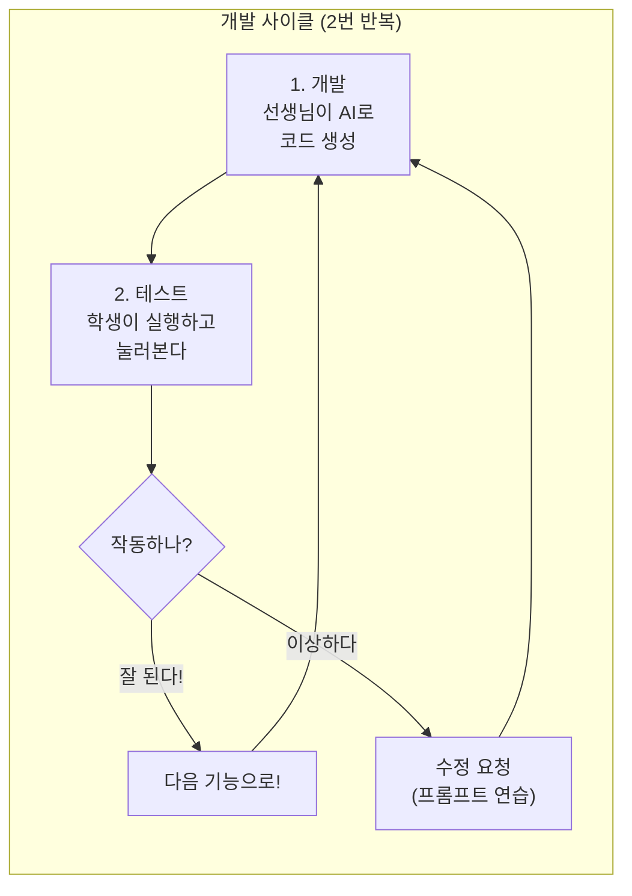

| 사이클 | 추가할 기능 | 더미 데이터 |
|:---:|---|---|
| 0회차 (시작) | 대시보드 app.py 실행 | 이미 HTML에 포함 |
| 1회차 | 과목 선택 + 타이머 개선 | 과목 5개 고정 |
| 2회차 | 오늘의 기록 표시 + 통계 | 미리 만든 기록 데이터 |

---

## STEP 5. 대시보드 app.py 실행 (10분)

### 두 번째 app.py — 대시보드 서버

지난 시간에 만든 대시보드 HTML을 Flask 서버로 띄워보자.

#### app_dashboard.py 코드

```python
from flask import Flask, send_file

app = Flask(__name__)

@app.route('/')
def dashboard():
    return send_file('study-timer-dashboard.html')

if __name__ == '__main__':
    app.run(debug=True, port=5001)
```

| 포인트 | 설명 |
|---|---|
| `send_file(...)` | HTML 파일을 그대로 브라우저에 보내준다 |
| `port=5001` | 기본 타이머(5000)와 포트를 다르게 한다 |

#### 실행하기

```bash
python app_dashboard.py
```

> 기본 타이머 서버를 끄지 않아도 된다! **포트 번호**가 다르기 때문.

| 앱 | 주소 | 포트 |
|---|---|---|
| 기본 타이머 | `http://127.0.0.1:5000` | 5000 |
| 대시보드 | `http://127.0.0.1:5001` | 5001 |

#### 테스트 체크리스트

| 확인 항목 | 결과 |
|---|---|
| 대시보드 화면이 보이나? | [ ] 예 / [ ] 아니오 |
| 주간/월간 탭이 전환되나? | [ ] 예 / [ ] 아니오 |
| 과목별/독서 탭이 보이나? | [ ] 예 / [ ] 아니오 |
| 그래프와 차트가 나오나? | [ ] 예 / [ ] 아니오 |

```
┌──────────────────────────────────────────────────┐
│                                                  │
│   지금 보이는 대시보드의 데이터는 전부 "더미"다.   │
│   진짜 공부 기록이 아니라, 화면을 확인하기 위해     │
│   미리 넣어둔 가짜 데이터.                        │
│                                                  │
│   다음 시간에 백엔드를 만들면,                     │
│   진짜 타이머 기록이 이 대시보드에 나온다!          │
│                                                  │
└──────────────────────────────────────────────────┘
```

### 두 서버 구조 이해하기

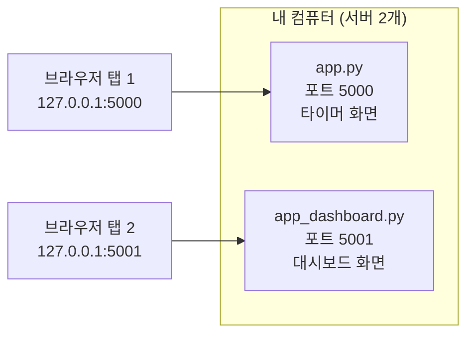

---

## 사이클 1회차 : 과목 선택 + 타이머 개선 (15분)

### 개발 — 선생님이 AI에게 요청

> 선생님이 프롬프트를 큰 화면에 보여주면서 입력한다. 학생들은 프롬프트를 관찰한다.

**프롬프트:**

```
기존 타이머에 다음 기능을 추가해줘.

1. 과목 선택:
   - 드롭다운(select)으로 과목 선택
   - 과목 목록: 수학, 영어, 국어, 과학, 사회
   - 선택한 과목이 타이머 위에 크게 표시
   - 과목마다 색깔을 다르게
     (수학: 파랑, 영어: 주황, 국어: 초록, 과학: 노랑, 사회: 분홍)

2. 시간 선택:
   - 5분, 15분, 25분, 50분 중에 고르게 해줘
   - 버튼 형태로 선택

3. 타이머 종료 시:
   - "수고했어! 쉬는 시간!" 메시지 표시
   - "기록 저장됨!" 메시지도 함께 표시 (실제 저장은 안 해도 됨, 메시지만)

프론트엔드만 구현. 더미 데이터 사용. 백엔드 연동 없음.
```

**프롬프트 포인트 설명:**

| 요소 | 왜 이렇게 썼나 |
|---|---|
| "드롭다운 (select)" | 구체적인 UI 방식을 지정 |
| "과목 목록: 5개" | 정확한 데이터를 알려줌 |
| "과목마다 색깔을 다르게" | 시각적 구분까지 요청 |
| "프론트엔드만 구현" | 범위를 명확히 제한 |

### 테스트 — 학생이 확인

AI가 만들어준 코드를 받아서 기존 파일에 덮어씌운다.

| 순서 | 학생이 할 일 |
|:---:|---|
| 1 | 선생님이 공유한 새 코드를 VSCode에 붙여넣기 (index.html) |
| 2 | 터미널에서 서버 끄기: `Ctrl + C` |
| 3 | 다시 실행: `python app.py` |
| 4 | 브라우저에서 강력 새로고침: `Ctrl + Shift + R` |

**테스트 체크리스트:**

| 확인 항목 | 결과 |
|---|---|
| 드롭다운이 보이나? | [ ] 예 / [ ] 아니오 |
| 과목이 5개 다 있나? | [ ] 예 / [ ] 아니오 |
| 과목을 바꾸면 색이 바뀌나? | [ ] 예 / [ ] 아니오 |
| 시간 선택 버튼이 보이나? | [ ] 예 / [ ] 아니오 |
| 타이머 시작/정지가 여전히 되나? | [ ] 예 / [ ] 아니오 |

### 수정 요청 연습

> 학생이 바꾸고 싶은 것을 **말로 설명**한다. 선생님이 프롬프트로 바꿔서 AI에게 전달한다.

| 학생이 말한 것 | 선생님이 변환한 프롬프트 |
|---|---|
| "글씨가 너무 작아요" | "과목 이름 글자 크기를 30px로 키워줘" |
| "색이 마음에 안 들어요" | "수학 색을 #4CAF50으로 바꿔줘" |
| "다른 과목도 넣고 싶어요" | "과목 목록에 '한문', '기술'을 추가해줘" |

```
┌──────────────────────────────────────────────────┐
│                                                  │
│   프롬프트 연습 팁:                               │
│                                                  │
│   나쁜 예: "이상해, 다시 해"                      │
│   좋은 예: "과목 선택하면 위에 과목 이름이 표시     │
│            되게 해줘, 글자 크기는 30px로"          │
│                                                  │
│   구체적으로 말할수록 → AI가 정확하게 만든다       │
│                                                  │
└──────────────────────────────────────────────────┘
```

---

## 사이클 2회차 : 오늘의 기록 표시 + 통계 (15분)

### 개발 — 선생님이 AI에게 요청

**프롬프트:**

```
타이머 아래에 "오늘의 공부 기록" 영역을 추가해줘.

더미 데이터로 표시할 내용:
- 오늘 공부한 과목별 시간을 가로 막대 그래프로 표시
- 더미 데이터 예시:
  수학 45분, 영어 30분, 국어 25분, 과학 15분
- 총 공부 시간 합계 표시
- "오늘의 기록"이라는 제목 표시

타이머가 끝나면:
- 더미로 기록이 추가되는 것처럼 막대 그래프가 업데이트
- 실제 서버 저장은 하지 않음 (JavaScript 변수에만 저장)

디자인:
- 타이머 아래쪽에 위치
- 막대 그래프는 과목 색깔과 동일
- 심플하고 깔끔하게
```

### 더미 데이터의 역할 설명

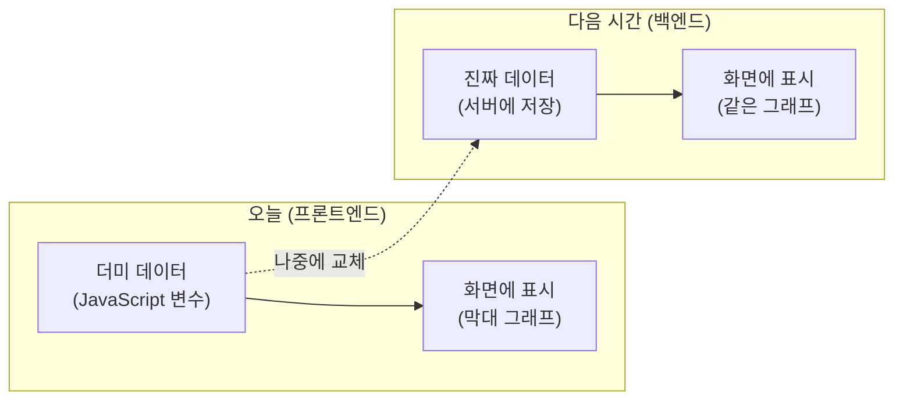

> 오늘은 JavaScript 변수에 가짜 데이터를 넣어두고, 다음 시간에 Flask 서버에서 진짜 데이터를 가져오도록 바꾼다.

### 테스트 — 학생이 확인

| 순서 | 학생이 할 일 |
|:---:|---|
| 1 | 새 코드 붙여넣기 → 서버 재시작 → 새로고침 |
| 2 | "오늘의 기록" 영역이 보이는지 확인 |
| 3 | 타이머를 한 번 돌려본다 (짧은 시간으로) |
| 4 | 기록이 업데이트되는지 확인 |

**테스트 체크리스트:**

| 확인 항목 | 결과 |
|---|---|
| "오늘의 기록" 영역이 보이나? | [ ] 예 / [ ] 아니오 |
| 막대 그래프가 나오나? | [ ] 예 / [ ] 아니오 |
| 과목별 색깔이 구분되나? | [ ] 예 / [ ] 아니오 |
| 총 시간 합계가 보이나? | [ ] 예 / [ ] 아니오 |
| 타이머 끝나면 기록이 추가되나? | [ ] 예 / [ ] 아니오 |

### 수정 요청 연습

학생들이 바꾸고 싶은 것을 종이에 적어보자:

```
나는 _____________ 을/를 바꾸고 싶다.
구체적으로: ___________________________
```

예시:

| 학생 | 요청 | 프롬프트로 변환 |
|---|---|---|
| A | "막대 두께를 더 두껍게" | "막대 그래프 높이를 30px로 키워줘" |
| B | "과목 옆에 시간도 써줘" | "막대 오른쪽에 '25분' 같은 숫자 표시해줘" |
| C | "기록 지우는 버튼" | "기록 전체 삭제 버튼을 추가해줘" |

---

## STEP 6. 오늘 정리 + 다음 시간 예고 (10분)

### 오늘 한 일 총정리

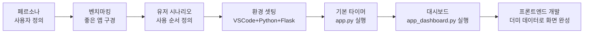

| 단계 | 한 일 | 배운 것 |
|---|---|---|
| 페르소나 | 사용자 캐릭터 만들기 | "누가 쓸까"를 먼저 정해야 한다 |
| 벤치마킹 | 기존 타이머 앱 분석 | 좋은 앱에서 아이디어를 얻는다 |
| 유저 시나리오 | 사용 순서 정하기 | 사용자 입장에서 순서를 정해야 자연스럽다 |
| 환경 셋팅 | VSCode + Python + Flask | 도구를 준비하는 과정 |
| 개발 사이클 | 2번의 개발→테스트 | 한 번에 하나씩, 만들고 바로 확인! |

### 오늘의 핵심 3가지

```
┌──────────────────────────────────────────────────┐
│                                                  │
│   1. 순서가 중요하다                              │
│      페르소나 → 벤치마킹 → 유저 시나리오 → 개발    │
│      "누구를 위해, 뭘, 어떤 순서로" 정하고 만든다   │
│                                                  │
│   2. 프론트엔드 = 화면, 백엔드 = 서버              │
│      오늘은 화면만 만들었다 (더미 데이터)           │
│      다음 시간에 서버를 연결하면 진짜로 동작한다     │
│                                                  │
│   3. 프롬프트 = 구체적으로 말할수록                │
│      AI가 정확하게 만들어준다                      │
│                                                  │
└──────────────────────────────────────────────────┘
```

### 현재 우리 앱의 상태

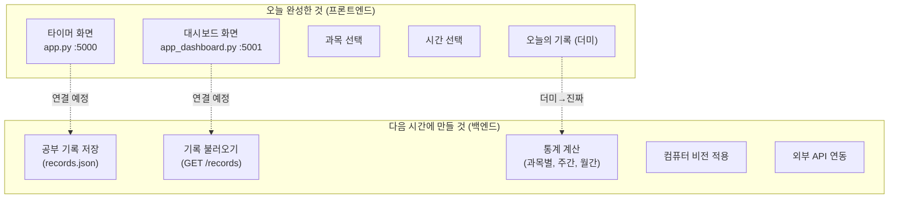

---

### 다음 시간 예고 — 백엔드 개발!

```
┌──────────────────────────────────────────────────┐
│                                                  │
│   다음 시간 예고: 백엔드 개발                     │
│                                                  │
│   오늘 만든 화면에 "진짜 기능"을 연결한다!         │
│                                                  │
│   1. 데이터 저장 & 불러오기                       │
│      - 공부 기록을 파일/DB에 저장                 │
│      - 저장된 기록을 대시보드에 표시               │
│                                                  │
│   2. 컴퓨터 비전                                  │
│      - 카메라로 공부 자세 확인                     │
│      - 집중도 자동 측정                           │
│                                                  │
│   3. 내부 통계 & 자료 데이터 반영                  │
│      - 과목별, 주간, 월간 통계 계산               │
│      - 대시보드에 진짜 데이터 연결                 │
│                                                  │
│   4. API 적용 테스트                              │
│      - 외부 서비스 연동                           │
│      - 알림, 데이터 동기화 등                     │
│                                                  │
│   오늘 만든 프론트엔드가 있어야                    │
│   다음 시간에 백엔드를 붙일 수 있다.               │
│   그래서 오늘 열심히 화면을 만든 것!               │
│                                                  │
└──────────────────────────────────────────────────┘
```

---

# 부록

---

## 부록 A : 파일 구조 정리

```
study-timer/
├── app.py                       ← 기본 타이머 서버 (포트 5000)
├── app_dashboard.py             ← 대시보드 서버 (포트 5001)
├── requirements.txt             ← 라이브러리 목록
├── study-timer-dashboard.html   ← 대시보드 HTML (1일차에 만든 것)
└── templates/
    └── index.html               ← 타이머 화면 (오늘 만든 것)
```

## 부록 B : 자주 나오는 문제 해결

| 문제 | 해결 |
|---|---|
| `python`이 안 된다 | `python3`으로 시도 (Mac) |
| `pip install flask` 에러 | `pip3 install flask` 또는 `python -m pip install flask` |
| 브라우저에 "연결할 수 없음" | 서버가 켜져 있는지 터미널 확인 |
| 코드 수정했는데 안 바뀜 | `Ctrl + Shift + R` (강력 새로고침) |
| 서버 끄는 법 | 터미널에서 `Ctrl + C` |
| 주소가 뭐지? | 기본: `http://127.0.0.1:5000` / 대시보드: `http://127.0.0.1:5001` |
| 포트가 이미 사용 중이라는 에러 | 이전 서버를 `Ctrl + C`로 끈 후 다시 실행 |

## 부록 C : 프롬프트 작성 공식

```
좋은 프롬프트 = 무엇을 + 어떻게 + 제약 조건

예시:
"카운트다운 타이머를 만들어줘"       ← 무엇을
"시작/정지/리셋 버튼이 있고"        ← 어떻게
"Flask + HTML로, 파일 2개로 구성"   ← 제약 조건
"프론트엔드만, 더미 데이터 사용"     ← 범위 제한
```

| 상황 | 프롬프트 예시 |
|---|---|
| 처음 만들 때 | "[기능]을 Flask + HTML로 만들어줘. app.py와 index.html로 구성" |
| 기능 추가할 때 | "[기존 기능]에 [새 기능]을 추가해줘. 위치는 [어디에]" |
| 디자인 수정 | "[대상]의 [색/크기/위치]를 [구체적 값]으로 바꿔줘" |
| 에러 고칠 때 | "이 에러 고쳐줘: [에러 메시지 전체 복사]" |
| 범위 제한 | "프론트엔드만 구현. 더미 데이터 사용. 백엔드 연동 없음." |

## 부록 D : 더미 데이터 예시

타이머 화면에서 사용하는 더미 데이터 구조:

```javascript
// JavaScript에서 사용하는 더미 데이터
const dummyRecords = [
    { subject: "수학",  minutes: 45, date: "2026-07-23 09:30" },
    { subject: "영어",  minutes: 30, date: "2026-07-23 10:15" },
    { subject: "국어",  minutes: 25, date: "2026-07-23 11:00" },
    { subject: "과학",  minutes: 15, date: "2026-07-23 13:30" }
];
```

> 다음 시간에 이 더미 데이터를 Flask 서버의 진짜 데이터로 교체한다!

---

> **다음 시간 예고** : 백엔드 개발 — 데이터 저장, 컴퓨터 비전, 내부 통계 반영, API 적용 테스트!
