# 2일차 — 바이브 코딩에서 AI 오케스트라까지

> **대상** : 중학교 2학년  
> **시간** : 이론 강의 자료 (1교시 도입부 + 수업 전 읽기 자료)  
> **목표** : 바이브 코딩의 원리를 이해하고, 주요 도구와 실제 사례를 배우고, 코딩을 넘어 영상·이미지·광고·사업까지 확장되는 AI 시대의 1인 창작자 방법론을 익힌 뒤, Flask + HTML로 직접 웹앱을 만든다

---

## 이 수업의 스토리라인

중학생 **민수**가 "나 혼자서도 뭔가 만들 수 있을까?"라는 질문에서 출발한다.

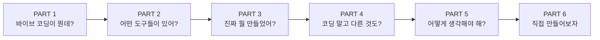

---

# PART 1. 바이브 코딩이란 무엇인가

---

## 민수의 첫 번째 질문

> 민수는 유튜브를 보다가 생각했다.
> "이 사람은 혼자서 앱도 만들고, 영상도 찍고, 광고도 하고, 돈도 번다고?
> 나는 코딩도 못하는데... 이런 건 천재만 하는 거 아닐까?"
>
> 그런데 댓글에 이런 글이 있었다.
> **"저 코딩 1도 몰랐는데, AI로 3일 만에 앱 만들어서 출시했어요."**

---

## 바이브 코딩의 탄생

2025년 2월, 테슬라와 OpenAI의 공동 창업자인 **안드레이 카파시(Andrej Karpathy)**가 이런 말을 했다:

> "나는 요즘 새로운 종류의 코딩을 하고 있다. **바이브 코딩(Vibe Coding)**이라고 부른다.
> AI에게 말로 설명하고, 코드는 AI가 쓴다. 나는 결과만 보고 '좋아' 또는 '이 부분 고쳐줘'라고 한다."

### 핵심 정의

**바이브 코딩 = 원하는 것을 말로 설명하면, AI가 코드를 만들어주는 방식**

코드 문법을 외울 필요가 없다. 대신 **"무엇을 만들고 싶은지 정확하게 설명하는 능력"**이 핵심이다.

---

## 전통적 코딩 vs 바이브 코딩

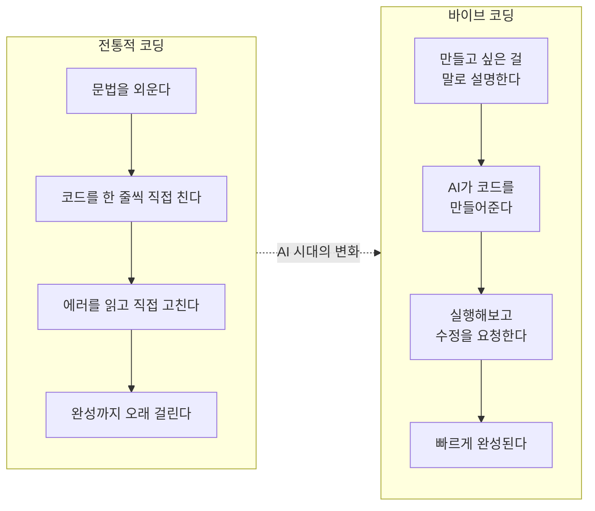

| 비교 항목 | 전통적 코딩 | 바이브 코딩 |
|---|---|---|
| 코드를 누가 쓰나? | 사람이 직접 타이핑 | AI가 대신 작성 |
| 문법을 외워야 하나? | 반드시 외워야 함 | 몰라도 됨 |
| 필요한 능력 | 프로그래밍 언어 문법 | 원하는 것을 설명하는 능력 |
| 에러가 나면? | 코드를 읽고 직접 수정 | AI에게 에러를 알려주고 수정 요청 |
| 걸리는 시간 | 며칠~몇 주 | 몇 시간~하루 |
| 비유 | 외국어를 배워서 직접 말하기 | 통역사에게 한국어로 설명하기 |

---

## 왜 바이브 코딩을 배워야 할까?

| 이유 | 설명 | 예시 |
|---|---|---|
| **미래 직업** | 2030년까지 직업의 60%가 AI와 협업 필요 | 디자이너도 AI로 프로토타입 제작 |
| **아이디어 실현** | 머릿속 아이디어를 즉시 앱으로 | "급식 별점 앱 만들고 싶다" → 당일 완성 |
| **문제 해결력** | "뭘 만들지"를 정의하는 게 핵심 능력 | 코드를 외우는 것보다 중요 |
| **진입 장벽 제거** | 코딩 경험 0이어도 시작 가능 | 이 수업에서 증명할 것! |

---

## 바이브 코딩의 5단계 방법론

이 5단계는 코딩뿐만 아니라, 영상/디자인/마케팅에도 **똑같이** 적용된다.

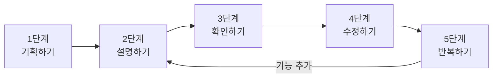

| 단계 | 하는 일 | 누가 하나 | 비유 |
|---|---|---|---|
| 1. 기획하기 | 뭘 만들지 정한다 | 사람 | 건축 설계도 그리기 |
| 2. 설명하기 | AI에게 원하는 것을 말한다 | 사람 → AI | 건축가에게 주문하기 |
| 3. 확인하기 | 결과를 실행해서 본다 | 사람 | 완성된 집 둘러보기 |
| 4. 수정하기 | 마음에 안 드는 부분을 고친다 | 사람 → AI | "이 벽 색깔 바꿔주세요" |
| 5. 반복하기 | 2~4를 반복해서 완성도를 높인다 | 사람 + AI | 인테리어 하나씩 추가 |

---

## 좋은 프롬프트 vs 나쁜 프롬프트

### 프롬프트 작성 공식

> **좋은 프롬프트 = 무엇을 + 어떻게 + 제약 조건**

| 요소 | 역할 | 예시 |
|---|---|---|
| **무엇을** | 만들고 싶은 것의 전체 그림 | "25분 카운트다운 타이머를 만들어줘" |
| **어떻게** | 구체적인 동작이나 기능 | "시작/정지/리셋 버튼이 있고" |
| **제약 조건** | 기술, 디자인, 구조 제한 | "Flask + HTML로, 파일 2개로 구성해줘" |

### 비교 표

| 구분 | 나쁜 프롬프트 | 좋은 프롬프트 |
|---|---|---|
| 기능 설명 | "타이머 만들어" | "25분 카운트다운 타이머를 만들어줘. 시작, 일시정지, 리셋 버튼이 있어야 해" |
| 디자인 | "이쁘게 해줘" | "배경은 연한 파란색, 버튼은 둥근 모서리, 타이머 글자는 60px 크기로 해줘" |
| 수정 요청 | "이상해, 다시 해" | "시작 버튼을 눌렀는데 타이머가 안 움직여. 콘솔에 에러가 나와" |
| 기능 추가 | "다 추가해줘" | "타이머 위에 과목을 선택하는 드롭다운을 추가해줘. 수학, 영어, 국어 3개" |

### 프롬프트 발전 단계

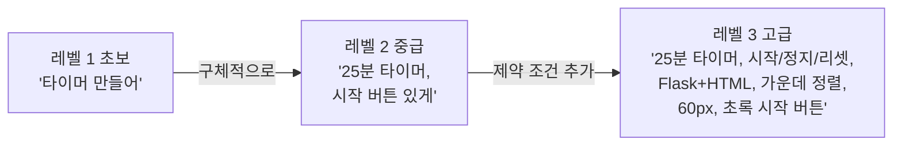

| 레벨 | AI의 반응 |
|---|---|
| 초보 | 기본적인 타이머 (원하는 것과 다를 수 있음) |
| 중급 | 꽤 괜찮은 타이머 |
| 고급 | 거의 완벽한 타이머! |

---

# PART 2. 바이브 코딩 도구 & 플랫폼 총정리

---

## 민수가 발견한 새로운 세계

> 민수는 Claude Code로 첫 앱을 만든 뒤 검색을 해봤다.
> "바이브 코딩 도구"를 치니까, 세상에는 수십 가지 AI 코딩 도구가 있었다.
> 각각 강점이 다르고, 쓰는 방식도 달랐다.
> "이런 게 이렇게 많아?"

---

## 바이브 코딩 도구의 3가지 유형

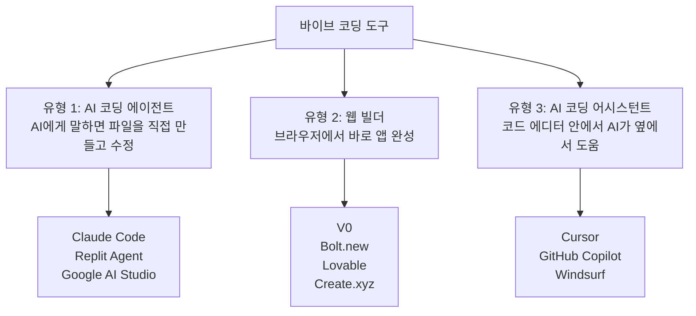

| 유형 | 특징 | 대표 도구 | 누구에게 적합? |
|---|---|---|---|
| **AI 코딩 에이전트** | AI에게 말하면 파일을 직접 만들고 수정 | Claude Code, Replit Agent | 처음 시작하는 사람 |
| **웹 빌더** | 브라우저에서 바로 앱이 완성됨 | V0, Bolt.new, Lovable, Create.xyz | 빠르게 프로토타입 만들고 싶은 사람 |
| **코딩 어시스턴트** | 기존 코드 에디터에서 AI가 옆에서 도움 | Cursor, GitHub Copilot, Windsurf | 코딩 경험이 조금 있는 사람 |

---

## 주요 바이브 코딩 도구 8선

### 1. Claude Code (Anthropic)

| 항목 | 내용 |
|---|---|
| **만든 회사** | Anthropic (미국, Claude AI를 만든 회사) |
| **사용 방식** | 터미널에서 대화하듯 설명 → AI가 파일 생성/수정 |
| **강점** | 복잡한 프로젝트도 전체 구조를 이해하고 만들어줌. 에러 자동 수정 |
| **적합한 작업** | Flask 웹앱, Python 프로젝트, 데이터 분석 |
| **특징** | 코드를 만들 뿐 아니라 "왜 이렇게 만들었는지" 설명도 해줌 |

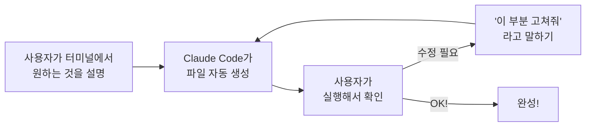

### 2. V0 (Vercel)

| 항목 | 내용 |
|---|---|
| **만든 회사** | Vercel (미국, Next.js를 만든 회사) |
| **사용 방식** | 웹사이트(v0.dev)에서 원하는 UI를 말로 설명 |
| **강점** | 디자인이 뛰어난 웹 화면을 즉시 생성. 실시간 미리보기 |
| **적합한 작업** | 랜딩 페이지, 대시보드, 웹앱 UI, 관리자 화면 |
| **특징** | 클릭 한 번으로 실제 웹사이트로 배포 가능 |

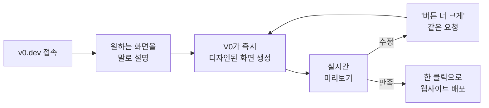

### 3. Bolt.new (StackBlitz)

| 항목 | 내용 |
|---|---|
| **만든 회사** | StackBlitz (미국) |
| **사용 방식** | bolt.new에서 프롬프트 입력 → 전체 앱이 브라우저에서 바로 실행 |
| **강점** | 설치 없이 브라우저만으로 풀스택 웹앱 완성 |
| **적합한 작업** | 빠른 프로토타입, 전체 웹앱, 해커톤 |
| **특징** | 코드 에디터 + 미리보기 + AI가 한 화면에. 바로 인터넷 배포 |

### 4. Lovable (구 GPT Engineer)

| 항목 | 내용 |
|---|---|
| **만든 회사** | Lovable (스웨덴 스타트업) |
| **사용 방식** | lovable.dev에서 앱을 말로 설명 → 전체 앱 자동 생성 |
| **강점** | 데이터베이스 연동까지 자동. 로그인, 결제 같은 복잡한 기능도 한 번에 |
| **적합한 작업** | 회원가입이 있는 서비스, 데이터를 저장하는 앱 |
| **특징** | GitHub 연동, 실제 서비스로 배포 가능 |

### 5. Cursor

| 항목 | 내용 |
|---|---|
| **만든 회사** | Anysphere (미국 스타트업) |
| **사용 방식** | VS Code와 비슷한 코드 에디터에 AI가 내장 |
| **강점** | 기존 프로젝트의 코드를 이해하고 수정. 프로 개발자들이 가장 많이 사용 |
| **적합한 작업** | 기존 프로젝트 수정, 대규모 코드베이스 |
| **특징** | 파일 전체를 읽고 맥락을 이해한 뒤 수정 |

### 6. Replit Agent

| 항목 | 내용 |
|---|---|
| **만든 회사** | Replit (미국, 온라인 코딩 플랫폼) |
| **사용 방식** | 브라우저에서 AI에게 앱 설명 → 코드 생성 + 실행 + 배포까지 한 번에 |
| **강점** | 설치할 것이 아무것도 없음. 브라우저만 있으면 됨 |
| **적합한 작업** | 학습용 프로젝트, 빠른 프로토타입, 팀 프로젝트 |
| **특징** | 학생에게 최적. 무료 사용 가능 |

### 7. Google AI Studio (Gemini)

| 항목 | 내용 |
|---|---|
| **만든 회사** | Google |
| **사용 방식** | Google AI Studio 웹사이트에서 Gemini AI에게 코드 생성 요청 |
| **강점** | Google 생태계(Firebase, Cloud)와 연동. 매우 긴 코드도 한 번에 생성 |
| **적합한 작업** | Google 서비스 연동 앱, Android 앱, 데이터 분석 |
| **특징** | 무료 사용 가능. 아주 큰 프로젝트도 이해 |

### 8. Create.xyz

| 항목 | 내용 |
|---|---|
| **만든 회사** | Create Labs (미국 스타트업) |
| **사용 방식** | 웹사이트에서 원하는 앱을 말로 설명 → 즉시 앱 생성 |
| **강점** | AI 기능(이미지 생성, 텍스트 분석 등)을 앱 안에 쉽게 추가 |
| **적합한 작업** | AI 기능이 포함된 앱, 이미지 생성 앱, 챗봇 |
| **특징** | "AI 앱 안에 AI를 넣는" 독특한 방식 |

---

### 도구 비교 한눈에 보기

| 도구 | 유형 | 설치? | 난이도 | 가장 잘하는 것 | 무료? |
|---|---|---|---|---|---|
| **Claude Code** | 에이전트 | 터미널 | 쉬움 | 전체 프로젝트 생성 + 설명 | 유료 |
| **V0** | 웹 빌더 | 없음 | 매우 쉬움 | 예쁜 웹 UI 디자인 | 체험 무료 |
| **Bolt.new** | 웹 빌더 | 없음 | 쉬움 | 즉시 실행되는 전체 앱 | 체험 무료 |
| **Lovable** | 웹 빌더 | 없음 | 쉬움 | DB 연동 앱 | 체험 무료 |
| **Cursor** | 어시스턴트 | 앱 설치 | 보통 | 기존 코드 수정/확장 | 체험 무료 |
| **Replit Agent** | 에이전트 | 없음 | 매우 쉬움 | 학습용, 브라우저만으로 | 무료 가능 |
| **Google AI Studio** | 에이전트 | 없음 | 쉬움 | Google 연동, 긴 코드 | 무료 |
| **Create.xyz** | 웹 빌더 | 없음 | 매우 쉬움 | AI 기능 포함 앱 | 체험 무료 |

---

## 코딩 이외의 AI 창작 도구

바이브 코딩의 방법론(기획→설명→확인→수정→반복)은 코딩 이외의 모든 AI 창작에도 동일하게 작동한다.

### 이미지/디자인 AI

| 도구 | 만든 회사 | 하는 일 | 프롬프트 예시 |
|---|---|---|---|
| **Midjourney** | Midjourney Inc. | 텍스트 → 고품질 이미지 | "카페 느낌의 앱 로고, 미니멀, 파스텔 톤" |
| **DALL-E 3** | OpenAI | 텍스트 → 이미지 (ChatGPT 내장) | "공부하는 학생 일러스트, 밝은 배경" |
| **Canva AI** | Canva | 템플릿 기반 디자인 + AI 자동 생성 | "인스타 홍보 포스터, 공부 앱 소개" |
| **Adobe Firefly** | Adobe | 포토샵 안에서 AI 이미지 편집 | "이 사진 배경을 도서관으로 바꿔줘" |

### 영상/동영상 AI

| 도구 | 만든 회사 | 하는 일 | 프롬프트 예시 |
|---|---|---|---|
| **Runway Gen-3** | Runway | 텍스트/이미지 → 영상 생성 | "학생이 노트북 앞에서 공부하는 5초 영상" |
| **Sora** | OpenAI | 텍스트 → 고품질 영상 생성 | "교실에서 학생들이 토론하는 장면" |
| **Kling AI** | Kuaishou (중국) | 텍스트/이미지 → 영상 | "타이머가 돌아가는 스마트폰 클로즈업" |
| **CapCut AI** | ByteDance | AI 자동 편집, 자막, 효과 | 영상 업로드 → 자동 자막 + 효과 + BGM |
| **HeyGen** | HeyGen | AI 아바타가 대본을 읽어주는 영상 | 대본 입력 → AI 인물이 말하는 영상 |
| **Vrew** | Voyager X (한국) | AI 자막 + 편집 도구 | 영상 → 자동 자막 → 편집 |

### 음악/사운드 AI

| 도구 | 만든 회사 | 하는 일 | 프롬프트 예시 |
|---|---|---|---|
| **Suno** | Suno Inc. | 텍스트 → 보컬 포함 완성 곡 | "밝은 팝, 공부 응원 가사, 30초" |
| **Udio** | Udio | 텍스트 → 다양한 장르 음악 | "lo-fi 힙합 배경음악, 잔잔한, 2분" |
| **ElevenLabs** | ElevenLabs | 텍스트 → 자연스러운 AI 음성 | "친근한 남성 목소리로 앱 소개 나레이션" |

### 글쓰기/프레젠테이션 AI

| 도구 | 만든 회사 | 하는 일 | 프롬프트 예시 |
|---|---|---|---|
| **Claude** | Anthropic | 글쓰기, 분석, 기획, 코드 설명 | "10대 타겟 앱 소개 블로그 글 써줘" |
| **Gamma** | Gamma Tech | 텍스트 → 프레젠테이션 자동 생성 | "공부 앱 투자 발표 PPT 만들어줘" |
| **Notion AI** | Notion | 문서 작성 + 요약 + 브레인스토밍 | "이 회의록을 액션 아이템 중심으로 정리" |

---

# PART 3. 진짜 이걸로 뭘 만들었어? — 실제 사례 12선

---

## 민수의 놀라움

> "그래, 도구가 있는 건 알겠어. 근데 진짜로 이걸로 뭔가 만든 사람이 있어?"
>
> 민수가 찾아보니, 코딩을 모르는 사람들이 AI로 만든 것들이 쏟아지고 있었다.
> 앱, 영상, 음악, 광고, 심지어 월 수천만 원을 버는 사업까지.

---

### 사례 1: PhotoAI.com — 1인 개발자의 월 매출 1억 원

| 항목 | 내용 |
|---|---|
| **만든 사람** | 피터 레벨스 (Pieter Levels, 네덜란드 1인 개발자) |
| **뭘 만들었나** | AI가 사진을 변환해주는 서비스 (증명사진, 프로필 사진, 배경 변경) |
| **사용한 도구** | AI 코딩 + Stable Diffusion + 직접 배포 |
| **코딩 경험** | 독학 개발자 (정식 컴퓨터공학 전공 아님) |
| **결과** | 월 매출 $80,000+ (약 1억 원). 직원 0명, 혼자 운영 |
| **배울 점** | "완벽하지 않아도 빨리 출시하고, 피드백으로 개선한다" |

---

### 사례 2: Bolt.new로 만든 교육용 퀴즈 앱

| 항목 | 내용 |
|---|---|
| **만든 사람** | 미국 초등학교 교사 |
| **뭘 만들었나** | 학생들이 수학 문제를 풀면 점수가 올라가는 퀴즈 앱 |
| **사용한 도구** | Bolt.new (브라우저에서 바로 제작) |
| **코딩 경험** | 전혀 없음 |
| **결과** | 30분 만에 완성. 학생 120명이 매일 사용. 학교 교육박람회 발표 |
| **배울 점** | "코딩을 몰라도 내 분야의 문제를 아는 사람이 가장 좋은 앱을 만든다" |

---

### 사례 3: V0로 만든 스타트업 랜딩 페이지

| 항목 | 내용 |
|---|---|
| **만든 사람** | 대학생 창업팀 (한국, 3명) |
| **뭘 만들었나** | 중고 교과서 거래 플랫폼의 랜딩 페이지 |
| **사용한 도구** | V0 (Vercel) → 디자인 생성 → 바로 배포 |
| **코딩 경험** | 팀원 중 1명이 HTML 약간 |
| **결과** | 2시간 만에 전문적인 랜딩 페이지 완성. 해당 주 회원가입 200명 |
| **배울 점** | "첫인상이 중요하다. AI로 전문적인 디자인을 누구나 만들 수 있다" |

---

### 사례 4: Suno로 만든 유튜브 BGM 채널

| 항목 | 내용 |
|---|---|
| **만든 사람** | 한국 고등학생 (음악 경험 없음) |
| **뭘 만들었나** | "공부할 때 듣는 lo-fi 음악" 유튜브 채널. AI 음악을 매일 업로드 |
| **사용한 도구** | Suno (음악 생성) + Midjourney (썸네일) + CapCut (영상 편집) |
| **코딩 경험** | 없음 (코딩 불필요) |
| **결과** | 6개월 만에 구독자 8,000명. 유튜브 광고 수익 월 30만 원 |
| **배울 점** | "만드는 능력보다 '어떤 콘텐츠를 만들지' 기획하는 능력이 중요하다" |

---

### 사례 5: Lovable로 만든 네일샵 예약 시스템

| 항목 | 내용 |
|---|---|
| **만든 사람** | 네일샵 사장님 (40대, 코딩 경험 없음) |
| **뭘 만들었나** | 고객이 날짜/시간/디자인을 선택하고 예약하는 웹앱 |
| **사용한 도구** | Lovable (전체 앱 생성) + Supabase (데이터베이스 자동 연동) |
| **코딩 경험** | 전혀 없음 |
| **결과** | 전화 예약 70% 감소. 노쇼 30% 감소 (예약 확인 문자 자동 발송) |
| **배울 점** | "가장 좋은 앱은 자기 문제를 아는 사람이 만든다" |

---

### 사례 6: Runway + Sora로 만든 제품 광고 영상

| 항목 | 내용 |
|---|---|
| **만든 사람** | 소규모 화장품 브랜드 (직원 3명) |
| **뭘 만들었나** | 15초 인스타그램 릴스 광고 영상 3편 |
| **사용한 도구** | Runway Gen-3 (영상) + Suno (BGM) + CapCut (편집) + Claude (대본) |
| **코딩 경험** | 없음 (코딩 불필요) |
| **결과** | 영상 제작 비용 90% 절감 (편당 300만원 → 3만원). 릴스 조회수 평균 5만 |
| **배울 점** | "예전에는 광고 영상 하나에 수백만 원. 이제는 AI로 하루 만에" |

---

### 사례 7: Claude로 쓴 블로그 + 전자책

| 항목 | 내용 |
|---|---|
| **만든 사람** | 프리랜서 마케터 (30대) |
| **뭘 만들었나** | "1인 사업가를 위한 AI 마케팅 가이드" 블로그 + 전자책 |
| **사용한 도구** | Claude (글쓰기) + Midjourney (표지) + Gamma (프레젠테이션) |
| **코딩 경험** | 없음 (코딩 불필요) |
| **결과** | 블로그 월 방문자 15,000명. 전자책 500부 판매 (약 500만원 매출) |
| **배울 점** | "글쓰기, 출판, 교육 콘텐츠에도 바이브 코딩 방식이 통한다" |

---

### 사례 8: Cursor로 만든 Chrome 확장 프로그램

| 항목 | 내용 |
|---|---|
| **만든 사람** | 대학생 (경영학과, 코딩 수업 1개 수강) |
| **뭘 만들었나** | 유튜브 영상을 요약해주는 Chrome 확장 프로그램 |
| **사용한 도구** | Cursor (코드 작성) + Claude API (요약 기능) |
| **코딩 경험** | HTML/CSS 기초만 |
| **결과** | Chrome 웹스토어 출시. 주간 사용자 3,000명 |
| **배울 점** | "브라우저 확장 프로그램도 바이브 코딩으로 만들 수 있다" |

---

### 사례 9: HeyGen + Claude로 만든 교육 영상 시리즈

| 항목 | 내용 |
|---|---|
| **만든 사람** | 학원 강사 (영어·수학 과외) |
| **뭘 만들었나** | AI 아바타가 수학 개념을 설명하는 5분짜리 교육 영상 20편 |
| **사용한 도구** | Claude (대본) + HeyGen (AI 아바타 영상) + Canva (자료 화면) |
| **코딩 경험** | 없음 (코딩 불필요) |
| **결과** | 유튜브 구독자 2,000명. 과외 문의 주 5건 이상 유입 |
| **배울 점** | "얼굴을 안 보여줘도, 촬영 장비 없어도 교육 영상을 만들 수 있다" |

---

### 사례 10: Midjourney + Canva로 만든 굿즈 브랜드

| 항목 | 내용 |
|---|---|
| **만든 사람** | 고등학생 (미술 동아리) |
| **뭘 만들었나** | AI 캐릭터 일러스트 → 스티커, 폰케이스, 에코백에 프린트하여 판매 |
| **사용한 도구** | Midjourney (캐릭터 생성) + Canva (굿즈 디자인) + 스마트스토어 (판매) |
| **코딩 경험** | 없음 (코딩 불필요) |
| **결과** | 스마트스토어 월 매출 80만원. 학교 축제에서 완판 |
| **배울 점** | "AI가 만든 이미지로 실물 상품을 만들어 판매할 수 있다" |

---

### 사례 11: Replit Agent로 만든 교실 좌석 배치 앱

| 항목 | 내용 |
|---|---|
| **만든 사람** | 중학생 3명 (팀 프로젝트) |
| **뭘 만들었나** | 버튼 누르면 교실 좌석을 랜덤 배치해주는 웹앱 |
| **사용한 도구** | Replit Agent (브라우저에서 바로 제작 + 배포) |
| **코딩 경험** | 스크래치 경험만 (텍스트 코딩 경험 없음) |
| **결과** | 담임 선생님이 매주 사용. 다른 반 선생님 5명도 사용 시작 |
| **배울 점** | "사용자가 가까이에 있으면 피드백도 빠르고, 개선도 빠르다" |

---

### 사례 12: Create.xyz로 만든 AI 그림일기 앱

| 항목 | 내용 |
|---|---|
| **만든 사람** | 초등학교 교사 |
| **뭘 만들었나** | 아이가 오늘 있었던 일을 말하면 AI가 그림일기 그림을 그려주는 앱 |
| **사용한 도구** | Create.xyz (앱 생성 + AI 이미지 기능 내장) |
| **코딩 경험** | 전혀 없음 |
| **결과** | 학부모 만족도 4.8/5. 지역 교육청 우수 사례 발표 |
| **배울 점** | "AI 기능이 포함된 앱도 코딩 없이 만들 수 있다" |

---

## 12개 사례에서 발견하는 공통 패턴

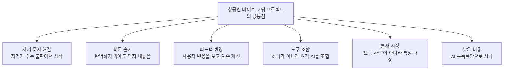

| 패턴 | 설명 | 해당 사례 |
|---|---|---|
| **자기 문제 해결** | 자기가 겪는 불편함에서 시작 | 네일샵 예약, 교실 좌석, 공부 음악 |
| **빠른 출시** | 완벽하지 않아도 먼저 내놓음 | PhotoAI, 퀴즈 앱, Chrome 확장 |
| **피드백 반영** | 사용자 반응을 보고 계속 개선 | 교실 좌석 앱, 교육 영상 |
| **도구 조합** | 하나의 AI가 아니라 여러 AI를 조합 | 광고 영상 (Runway+Suno+Claude+CapCut) |
| **틈새 시장** | "모든 사람"이 아니라 특정 대상에 집중 | 수학 교육, 네일샵, 1인 사업가 |
| **낮은 비용** | AI 구독료만으로 시작 | 전 사례 공통 (초기 투자 월 5만원 이하) |

> **핵심 메시지:** 이 사람들의 공통점은 "코딩을 잘한다"가 아니다. **"어떤 문제를 풀지 명확히 알고 있었다"**는 것이다.

---

# PART 4. 코딩을 넘어서 — AI 오케스트라와 1인 사업가

---

## 전환점: 만드는 것과 알리는 것은 다르다

> 민수의 공부 타이머 앱은 완성됐지만, 아무도 안 쓴다.
> "앱을 만드는 건 시작일 뿐이구나. 사람들에게 **알려야** 하고, **보여줘야** 하고, **매력적으로** 만들어야 해."
>
> 그때 민수는 깨달았다 — 바이브 코딩의 5단계는 코딩에만 쓸 수 있는 게 아니라, **모든 AI 창작에 통하는 공식**이라는 것을.

---

## 바이브 코딩 방법론의 확장

| 영역 | 전통 방식 | 바이브 코딩 방식 (AI) | 시간 절감 |
|---|---|---|---|
| **앱 개발** | 개발자 고용, 몇 주~몇 달 | Claude Code/Bolt.new로 하루 만에 | 90% |
| **로고/디자인** | 디자이너에게 의뢰, 50~300만원 | Midjourney에 설명, 5분 만에 | 95% |
| **영상 제작** | 촬영팀 + 편집자, 편당 300만원 | Runway+CapCut, 1시간 만에 | 90% |
| **음악/BGM** | 작곡가 의뢰, 50만원 | Suno에 설명, 30초 만에 | 99% |
| **카피라이팅** | 카피라이터, 건당 10만원 | Claude에 설명, 1분 만에 | 95% |
| **프레젠테이션** | PPT 직접 제작, 하루 | Gamma에 내용 입력, 5분 만에 | 90% |

---

## 1인 AI 오케스트라란?

오케스트라에서 지휘자는 악기를 직접 연주하지 않는다. 대신 **어떤 악기가 언제, 어떻게 연주할지**를 결정한다.

AI 오케스트라의 지휘자도 마찬가지다 — 코드를 직접 쓰지 않고, **어떤 AI가 언제, 무엇을 만들지**를 결정한다.

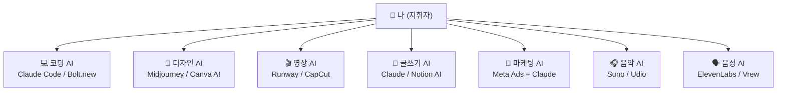

### 전통 팀 vs AI 오케스트라

| 역할 | 전통 (사람 고용) | AI 오케스트라 (1인) | 비용 절감 |
|---|---|---|---|
| 개발자 | 월 400만원 | Claude Code 구독 | ~95% |
| 디자이너 | 월 300만원 | Midjourney 구독 | ~97% |
| 영상 편집자 | 건당 30만원 | Runway + CapCut | ~90% |
| 카피라이터 | 건당 10만원 | Claude | ~95% |
| 마케팅 매니저 | 월 350만원 | AI + 본인 판단 | ~80% |
| 음악 제작 | 건당 50만원 | Suno | ~99% |

---

## 실전 예시: 유튜브 쇼츠 하나를 AI 오케스트라로 만드는 과정

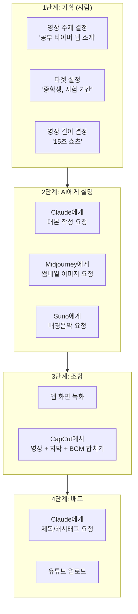

| 순서 | 작업 | AI 도구 | 소요 시간 |
|:---:|---|---|---|
| 1 | 대본 작성 | Claude | 2분 |
| 2 | 썸네일 제작 | Midjourney + Canva | 5분 |
| 3 | 배경음악 | Suno | 1분 |
| 4 | 영상 제작 | Runway + CapCut | 20분 |
| 5 | 제목/해시태그 | Claude | 2분 |
| | **총 소요 시간** | | **약 30분** |

기존 방식이었다면? 영상 기획사 의뢰 → **2주 + 300만원.**

---

## 실전 예시: 인스타그램 광고 제작

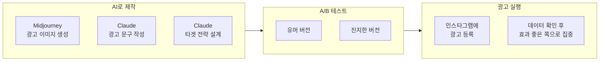

---

## 실전 예시: 브랜드 아이덴티티 만들기

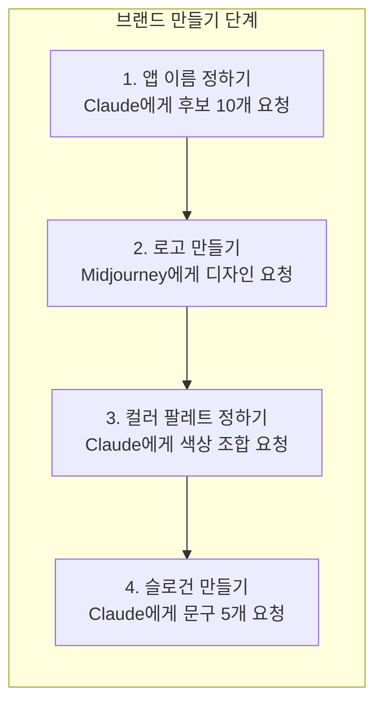

| 브랜드 요소 | AI 도구 | 프롬프트 예시 |
|---|---|---|
| **로고** | Midjourney | "미니멀 공부 타이머 로고, 둥근 시계 모티프, 파란+초록, 플랫 스타일" |
| **컬러 팔레트** | Claude | "학생 공부 앱에 적합한 컬러 팔레트 3종. 집중과 안정감을 주는 색상" |
| **앱 이름** | Claude | "공부 타이머 앱 이름 후보 10개. 한글, 기억하기 쉬운, 10대가 좋아할 만한" |
| **슬로건** | Claude | "앱 슬로건 5개. 짧고 동기부여, Z세대 말투" |

---

## AI 오케스트라의 7개 파트 상세 가이드

오케스트라가 바이올린, 첼로, 플루트, 드럼 등 파트로 나뉘듯이, AI 오케스트라도 **7개 파트**로 구성된다. 각 파트가 무엇을 하는지, 어떤 AI가 담당하는지, 그리고 **어떤 프롬프트를 써야 하는지** 구체적으로 알아보자.

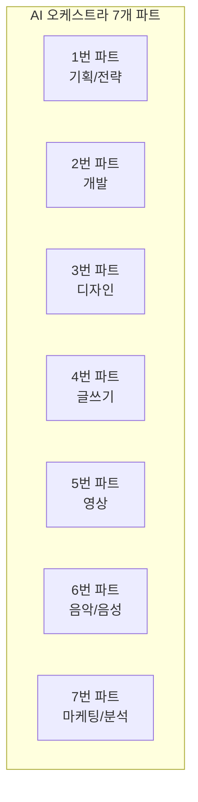

### 파트 1: 기획/전략 — 두뇌 역할

| 항목 | 내용 |
|---|---|
| **담당 AI** | Claude, ChatGPT, Gemini |
| **하는 일** | 아이디어 브레인스토밍, 시장 분석, 사업 계획, 경쟁 분석, 사용자 페르소나, 수익 모델 설계 |
| **일하는 방식** | 질문을 던지면 → 체계적인 분석과 전략을 돌려준다 |

| 작업 | 프롬프트 예시 | 기대 결과 |
|---|---|---|
| 아이디어 검증 | "공부 타이머 앱의 시장 규모, 경쟁 앱 5개, 차별화 전략을 분석해줘" | 시장 분석 보고서 |
| 사업 계획 | "중학생 대상 공부 타이머 앱의 3개월 사업 계획서를 작성해줘" | 단계별 실행 계획 |
| 수익 모델 | "무료 앱에서 수익을 내는 방법 5가지를 비교해줘" | 수익 모델 비교표 |
| 사용자 조사 | "시험 기간 중학생의 공부 습관과 불편함 20가지를 리서치해줘" | 타겟 인사이트 |

### 파트 2: 개발 — 심장 역할

| 항목 | 내용 |
|---|---|
| **담당 AI** | Claude Code, Bolt.new, Lovable, Cursor, Replit Agent, V0 |
| **하는 일** | 웹앱 제작, 모바일 앱, Chrome 확장, API 연동, 데이터베이스 |
| **일하는 방식** | 원하는 기능을 설명하면 → 작동하는 앱을 만들어준다 |

| 작업 | 프롬프트 예시 | 기대 결과 |
|---|---|---|
| 웹앱 만들기 | "25분 타이머, 과목 선택, 기록 저장 기능이 있는 웹앱을 Flask+HTML로 만들어줘" | 작동하는 웹앱 |
| 기능 추가 | "기존 타이머에 다크 모드 토글 버튼을 추가해줘" | 업데이트된 앱 |
| 버그 수정 | "시작 버튼을 눌러도 타이머가 안 움직여. 이 에러 메시지가 나와" | 수정된 앱 |
| 배포 | "이 앱을 인터넷에 올려서 누구나 접속할 수 있게 해줘" | 라이브 URL |

### 파트 3: 디자인 — 얼굴 역할

| 항목 | 내용 |
|---|---|
| **담당 AI** | Midjourney, DALL-E 3, Canva AI, Adobe Firefly, Ideogram |
| **하는 일** | 로고, 아이콘, 배너, 썸네일, 소셜 미디어 이미지, UI 목업, 굿즈 디자인 |
| **일하는 방식** | 원하는 이미지를 설명하면 → 고품질 이미지를 생성해준다 |

| 작업 | 프롬프트 예시 | 기대 결과 |
|---|---|---|
| 앱 로고 | "둥근 시계 모티프, 파란+초록 그라데이션, 플랫 디자인, 미니멀" | 로고 이미지 4장 |
| 유튜브 썸네일 | "놀란 표정의 학생 일러스트, 텍스트 공간 있게, 밝은 노란 배경" | 썸네일 이미지 |
| 인스타 카드뉴스 | "공부 습관 팁 5가지 카드뉴스, 슬라이드 5장, 파스텔 톤" | 카드뉴스 세트 |
| 앱 스크린샷 목업 | "아이폰 화면에 타이머 앱이 떠있는 목업, 45도 각도" | 스토어용 스크린샷 |

### 파트 4: 글쓰기 — 목소리 역할

| 항목 | 내용 |
|---|---|
| **담당 AI** | Claude, ChatGPT, Notion AI, Jasper |
| **하는 일** | 블로그 글, 소셜 미디어 글, 앱 소개 문구, 이메일, 보도 자료, 가이드 문서 |
| **일하는 방식** | 주제와 톤을 설명하면 → 완성된 글을 작성해준다 |

| 작업 | 프롬프트 예시 | 기대 결과 |
|---|---|---|
| 블로그 글 | "중학생이 AI로 앱을 만든 후기, 2000자, 친근한 말투" | 블로그 포스트 |
| 인스타 캡션 | "공부 타이머 앱 소개 인스타 글, 이모지 포함, 해시태그 10개" | 인스타 글 + 해시태그 |
| 앱 소개 문구 | "앱스토어에 올릴 공부 타이머 앱 설명, 핵심 기능 3줄, 다운로드 유도" | 스토어 설명 |
| 이메일 | "선생님에게 앱 소개하는 이메일, 정중하지만 간결하게" | 비즈니스 이메일 |

### 파트 5: 영상 — 눈 역할

| 항목 | 내용 |
|---|---|
| **담당 AI** | Runway Gen-3, Sora, Kling AI, CapCut AI, HeyGen, Vrew |
| **하는 일** | 제품 소개 영상, 유튜브 쇼츠, 인스타 릴스, 교육 영상, 광고, 데모 영상 |
| **일하는 방식** | 장면을 설명하면 → 영상을 생성하고, 편집 도구로 완성한다 |

| 작업 | 프롬프트 예시 | 기대 결과 |
|---|---|---|
| AI 생성 영상 | "학생이 공부하다가 스마트폰 타이머를 확인하는 3초 영상" | AI 영상 클립 |
| AI 아바타 | "친근한 10대 캐릭터가 앱 사용법을 설명하는 영상" (HeyGen) | 아바타 설명 영상 |
| 자동 편집 | 녹화한 영상 업로드 → 자동 자막 + BGM + 효과 (CapCut) | 편집 완료 영상 |
| 데모 영상 | 앱 화면 녹화 + 자막 + 배경음악 + 나레이션 조합 | 앱 데모 |

### 파트 6: 음악/음성 — 귀 역할

| 항목 | 내용 |
|---|---|
| **담당 AI** | Suno, Udio, ElevenLabs, Vrew |
| **하는 일** | 배경음악, 징글(짧은 효과음악), 나레이션, 팟캐스트, 앱 내 음성 안내 |
| **일하는 방식** | 분위기와 장르를 설명하면 → 완성된 음악이나 음성을 만들어준다 |

| 작업 | 프롬프트 예시 | 기대 결과 |
|---|---|---|
| BGM | "잔잔한 lo-fi 힙합, 공부 집중용, 2분, 가사 없이" (Suno) | 배경음악 파일 |
| 앱 징글 | "밝고 짧은 완료 효과음, 3초, 게임 느낌" (Suno) | 효과음 |
| 나레이션 | "친근한 여성 목소리, 앱 사용법 안내, 한국어" (ElevenLabs) | AI 음성 파일 |
| 앱 테마곡 | "신나는 팝, '공부 시작!' 느낌, 가사 포함, 30초" (Suno) | 테마 음악 |

### 파트 7: 마케팅/분석 — 다리 역할

| 항목 | 내용 |
|---|---|
| **담당 AI** | Claude + Google Analytics + Meta Ads + Google Trends |
| **하는 일** | 마케팅 전략, SNS 운영, 광고 제작, 데이터 분석, SEO, 사용자 피드백 분석 |
| **일하는 방식** | 데이터나 목표를 설명하면 → 전략과 실행 방안을 제안해준다 |

| 작업 | 프롬프트 예시 | 기대 결과 |
|---|---|---|
| 마케팅 전략 | "예산 월 5만원으로 중학생에게 공부 타이머 앱을 알리는 마케팅 전략" | 채널별 전략 |
| 해시태그 전략 | "공부 타이머 앱 인스타 해시태그 전략, 대·중·소 규모 해시태그 조합" | 해시태그 세트 |
| 피드백 분석 | "이 사용자 리뷰 20개를 분석해서 가장 많이 요청하는 기능 3개를 뽑아줘" | 우선순위 기능 목록 |
| 성장 분석 | "주간 사용자 데이터를 보고 성장 패턴과 개선점을 분석해줘" | 성장 분석 보고서 |

---

## AI 오케스트라 실전: 민수의 1인 사업 시뮬레이션

> 민수가 공부 타이머 앱을 만들고 실제로 사업화하는 과정을 **7개 파트의 협업**으로 재현해보자.

### Week 1: 기획 + 제작

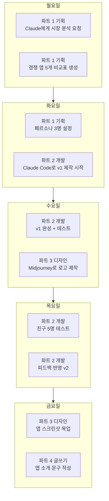

### Week 2: 콘텐츠 제작

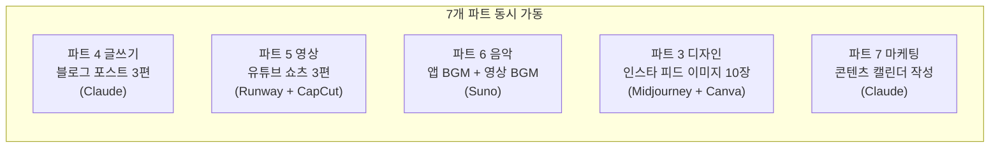

| 요일 | 활동 | 담당 파트 | AI 도구 | 소요 시간 |
|---|---|---|---|---|
| 월 | 블로그 포스트 "AI로 앱 만들기 후기" | 파트 4 글쓰기 | Claude | 30분 |
| 화 | 유튜브 쇼츠 촬영 + 편집 | 파트 5 영상 | CapCut + Suno | 1시간 |
| 수 | 인스타 카드뉴스 "공부법 5가지" | 파트 3 디자인 + 파트 4 글쓰기 | Canva + Claude | 40분 |
| 목 | 앱 데모 영상 제작 | 파트 5 영상 + 파트 6 음악 | CapCut + Suno | 1시간 |
| 금 | 다음 주 콘텐츠 기획 | 파트 1 기획 + 파트 7 마케팅 | Claude | 20분 |

### Week 3~4: 마케팅 + 성장

| 주차 | 핵심 활동 | 담당 파트 | 목표 |
|---|---|---|---|
| 3주차 전반 | 인스타 광고 집행 (일 5,000원) | 파트 7 마케팅 | 앱 페이지 방문 500회 |
| 3주차 후반 | A/B 테스트 분석 + 광고 최적화 | 파트 7 마케팅 | 클릭률 3% 달성 |
| 4주차 전반 | 사용자 피드백 분석 → v3 업데이트 | 파트 2 개발 + 파트 1 기획 | 핵심 불만 3개 해결 |
| 4주차 후반 | 성과 보고서 + 피칭 자료 | 파트 1 기획 + 파트 3 디자인 | 투자/발표 준비 |

---

## AI 오케스트라: 하루 일과 시뮬레이션

> 민수가 AI 오케스트라를 완전히 익힌 뒤, 어떤 하루를 보내는지 보자.

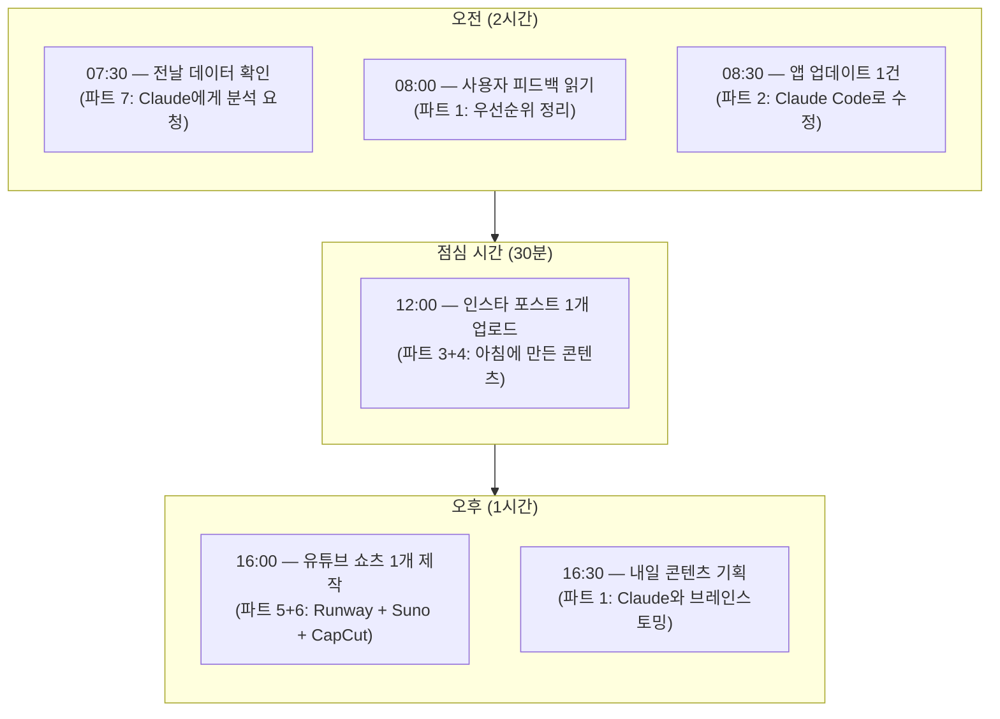

| 시간 | 작업 | 파트 | AI 도구 | 소요 |
|---|---|---|---|---|
| 07:30 | 어제 앱 사용 데이터 분석 | 파트 7 | Claude | 15분 |
| 08:00 | 사용자 피드백 정리 + 우선순위 | 파트 1 | Claude | 15분 |
| 08:30 | 가장 많이 요청된 기능 1개 추가 | 파트 2 | Claude Code | 30분 |
| 09:00 | 업데이트 내용 블로그 글 | 파트 4 | Claude | 15분 |
| 12:00 | 인스타 포스트 업로드 | 파트 3+4 | Canva + Claude | 10분 |
| 16:00 | 유튜브 쇼츠 제작 | 파트 5+6 | CapCut + Suno | 40분 |
| 16:30 | 내일 계획 + 콘텐츠 아이디어 | 파트 1 | Claude | 15분 |
| | **총 작업 시간** | | | **약 2시간 20분** |

> **핵심 포인트:** AI 오케스트라를 활용하면, 학교 다니면서도 **하루 2~3시간**으로 앱 + 콘텐츠 + 마케팅을 전부 운영할 수 있다.

---

## 오케스트라 지휘의 3가지 레벨

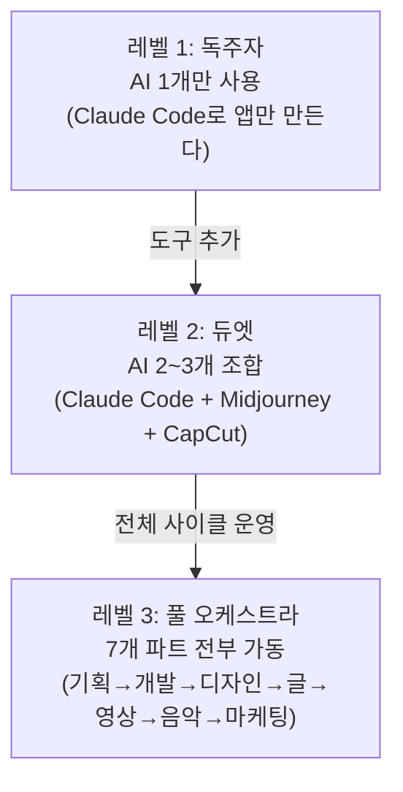

| 레벨 | 사용 AI 수 | 할 수 있는 일 | 결과물 |
|---|---|---|---|
| **레벨 1: 독주자** | 1~2개 | 앱 하나 만들기 | 작동하는 앱 (사용자 0명) |
| **레벨 2: 듀엣** | 3~4개 | 앱 + 디자인 + 영상 | 보여줄 수 있는 프로젝트 |
| **레벨 3: 풀 오케스트라** | 5개 이상 | 앱 + 브랜딩 + 콘텐츠 + 마케팅 + 수익화 | 실제 사업 |

> **오늘 이 수업에서 여러분은 레벨 1을 시작한다.** 하지만 이 수업이 끝나면, 레벨 2~3으로 나아갈 준비가 될 것이다.

---

## AI 오케스트라 vs 전통 스타트업: 구체적 비교

| 단계 | 전통 스타트업 | AI 오케스트라 (1인) |
|---|---|---|
| **팀 구성** | 3~5명 공동창업, 인건비 월 1,500만원+ | 나 혼자 + AI 구독료 월 5~10만원 |
| **아이디어 → 프로토타입** | 2~4주 (기획 회의 + 디자인 + 개발) | 1~3일 (AI에게 설명 → 바로 제작) |
| **디자인** | 디자이너 채용, 작업 의뢰 1~2주 | Midjourney에 5분 설명 → 즉시 생성 |
| **영상 광고** | 촬영팀 섭외, 편당 200~500만원 | Runway + CapCut, 편당 30분 + 3만원 |
| **마케팅** | 마케팅 매니저 채용, 월 300만원+ | Claude로 전략 + 일 5,000원 광고 |
| **피드백 → 수정** | 회의 → 작업 배분 → 1~2주 | "이 부분 고쳐줘" → 10분 |
| **수익화까지** | 6개월~1년 | 1~3개월 |
| **실패 비용** | 수천만원 손실 | 구독료 몇 만원 |

> **결론:** AI 오케스트라의 가장 큰 장점은 **"실패해도 괜찮다"**는 것이다. 비용이 거의 0원이니까, 10개를 시도해서 1개가 성공하면 된다. 전통 방식에서는 1번 실패하면 끝이었다.

---

## 실전 예시: 전자책 출판 프로젝트 (풀 오케스트라)

민수가 "중학생을 위한 공부법 전자책"을 AI 오케스트라로 만드는 전체 과정:

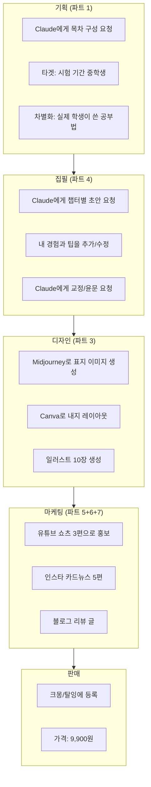

| 단계 | 소요 시간 | 비용 | 사용한 AI 파트 |
|---|---|---|---|
| 기획 (목차, 타겟, 차별화) | 1시간 | 0원 | 파트 1 |
| 집필 (5챕터, 15,000자) | 3시간 | 0원 | 파트 4 |
| 디자인 (표지 + 내지 + 일러스트) | 2시간 | 1만원 | 파트 3 |
| 마케팅 (영상 3편 + 카드뉴스 5편) | 3시간 | 1만원 | 파트 5+6+7 |
| 등록 + 판매 시작 | 30분 | 0원 | - |
| **총합** | **약 10시간** | **약 2만원** | **7개 파트 전부** |

> 전통 방식이었다면? 작가 + 디자이너 + 마케터 = **200만원 + 2개월.** AI 오케스트라로는 **2만원 + 주말 이틀.**

---

## 실전 예시: 온라인 강의 제작 (풀 오케스트라)

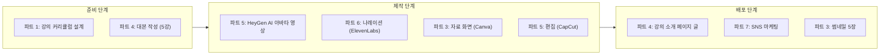

| 비교 | 전통 온라인 강의 | AI 오케스트라 |
|---|---|---|
| 영상 촬영 | 카메라 + 조명 + 마이크 (50만원+) | HeyGen AI 아바타 (월 3만원) |
| 대본 작성 | 직접 집필 (3~5일) | Claude에 설명 (3시간) |
| 자료 제작 | PPT 디자인 (1~2일) | Canva + Gamma (2시간) |
| 편집 | 전문 편집자 (건당 10~30만원) | CapCut 자동 편집 (1시간) |
| 총 비용 | 200~500만원 | 약 5만원 |

---

# PART 5. 아이디어를 사업으로 — 구체적 방법

---

## 왜 "상업용"으로 생각해야 하는가

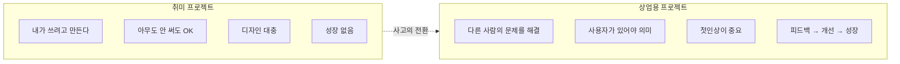

### 상업적 사고가 중요한 세 가지 이유

| 이유 | 설명 |
|---|---|
| **1. 더 잘 만들게 된다** | "누군가 돈을 내고 쓸 앱"이라 생각하면 자연스럽게 사용자 경험, 디자인, 안정성을 고민하게 된다 |
| **2. 미래 역량을 키운다** | AI 시대 핵심 능력은 "코드를 잘 쓰는 것"이 아니라 "문제를 발견하고 해결하는 것" |
| **3. 시작 비용이 거의 0원** | AI + 노트북만 있으면 사업을 시작할 수 있는 시대 |

### 사업 시작 비용의 변화

| 시대 | 필요한 것 | 기간 | 비용 |
|---|---|---|---|
| 2010년 | 개발팀 + 디자이너 + 서버 + 사무실 | 6개월~1년 | 5,000만원+ |
| 2020년 | 노코드 도구 + 프리랜서 | 1~3개월 | 500만원 |
| **2025년** | **AI + 노트북 + 아이디어** | **1일~1주** | **월 5만원** |

---

## 아이디어 발전의 4단계

```mermaid
graph TD
    S1["1단계: 씨앗<br/>'이런 거 있으면 좋겠다'"]
    S2["2단계: 검증<br/>'나만 그런 건가?'"]
    S3["3단계: 벤치마킹<br/>'다른 사람은 어떻게 풀었지?'"]
    S4["4단계: 차별화<br/>'내 것만의 무기는 뭐지?'"]

    S1 -->|"불편 발견"| S2
    S2 -->|"수요 확인"| S3
    S3 -->|"경쟁 분석"| S4
    S4 -->|"제작 시작!"| DONE["바이브 코딩으로<br/>만들기 시작"]
```

### 1단계: 씨앗 — 불편을 발견하는 구체적 방법

| 방법 | 구체적으로 | 예시 |
|---|---|---|
| **불편 일기** | 하루에 3가지씩 불편한 점 적기 | "급식 메뉴를 매번 학교 홈페이지에서 찾아야 해" |
| **주변 관찰** | 친구, 부모님, 선생님이 불편해하는 것 관찰 | "엄마가 장보기 목록을 매번 종이에 써" |
| **커뮤니티 검색** | "~불편해", "~있었으면" 검색 | 에브리타임, 블라인드에서 불편 글 검색 |
| **AI에게 물어보기** | Claude에게 "중학생이 일상에서 겪는 불편 20가지 알려줘" | AI가 아이디어 목록을 생성해줌 |

### 2단계: 검증 — "나만 그런 건가?" 확인하는 방법

```mermaid
graph LR
    V1["Google Trends에서<br/>검색량 확인"] --> V2["커뮤니티에서<br/>같은 불편 찾기"]
    V2 --> V3["친구 20명에게<br/>설문 조사"]
    V3 --> V4["Claude에게<br/>시장 분석 요청"]
    V4 --> RESULT["수요가 있다!<br/>→ 3단계로"]
```

| 검증 방법 | 도구 | 구체적 행동 |
|---|---|---|
| **검색량 확인** | Google Trends, 네이버 키워드 도구 | "공부 타이머" 월 검색량 12,000건 → 수요 있음 |
| **커뮤니티 조사** | 에브리타임, 디시인사이드, 레딧 | 같은 불편을 호소하는 글 찾기 |
| **설문 조사** | Google Forms + 카카오톡 공유 | 친구 20명에게 "이런 앱 쓸 의향 있어?" 물어보기 |
| **AI 분석** | Claude | "공부 타이머 앱 시장 규모와 수요를 분석해줘" |

### 3단계: 벤치마킹 — 경쟁자에게서 배우기

> 벤치마킹은 "베끼기"가 아니다. **다른 사람의 해결책에서 배우고, 내 것에 적용**하는 것이다.

| 경쟁 앱 | 강점 | 약점 | 내가 가져갈 것 | 내가 다르게 할 것 |
|---|---|---|---|---|
| Forest | 나무 키우기 동기부여 | 과목별 기록 없음 | 게이미피케이션 아이디어 | 과목별 통계 추가 |
| Todoist | 할 일 관리 체계적 | 타이머 기능 없음 | 깔끔한 UI 참고 | 타이머 + 할 일 통합 |
| Focus To-Do | 뽀모도로 + 할 일 | 학생 맞춤 아님 | 뽀모도로 구조 | 시험 일정 연동 |

### 4단계: 차별화 — 내 것만의 무기 찾기

차별화 포인트를 찾는 3가지 질문:

| 질문 | 민수의 대답 | 이것이 차별화가 되는 이유 |
|---|---|---|
| "기존 앱에 없는 게 뭐지?" | 과목별 통계 + 친구 경쟁 | 기존 타이머 앱은 범용. 학생 전용은 없음 |
| "내가 가장 잘 아는 게 뭐지?" | 중학생의 공부 패턴 | 내가 직접 사용자이기 때문에 진짜 니즈를 앎 |
| "누구를 위한 건지 딱 정하면?" | 시험 기간 중학생 | 좁힐수록 기능이 명확, 마케팅이 쉬워짐 |

---

## 페르소나 설정: "누구를 위한 건가?"

> "모든 사람을 위한 앱"은 아무도 안 쓴다. **딱 한 명의 구체적인 사용자**를 정하면, 오히려 더 많은 사람이 쓴다.

```mermaid
graph TB
    APP["공부 타이머 앱"]
    APP --> P1["페르소나 A<br/>김민수, 중학생<br/>집중이 안 됨, SNS 중독"]
    APP --> P2["페르소나 B<br/>이서연, 고등학생<br/>계획은 세우지만 못 지킴"]
    APP --> P3["페르소나 C<br/>박준호, 공시생 24세<br/>하루 10시간 공부 필요"]

    P1 --> F1["핵심 기능: 친구 경쟁, SNS 차단<br/>디자인: 귀여운, 캐릭터"]
    P2 --> F2["핵심 기능: 과목별 기록, 깔끔 UI<br/>디자인: 미니멀"]
    P3 --> F3["핵심 기능: 주간/월간 통계<br/>디자인: 기능적, 대시보드"]
```

같은 "공부 타이머"지만, 페르소나에 따라 기능 우선순위가 완전히 달라진다:

| 기능 | 민수 (중학생) | 서연 (고등학생) | 준호 (공시생) |
|---|---|---|---|
| 기본 타이머 | 핵심 | 핵심 | 핵심 |
| 과목별 기록 | 있으면 좋음 | 핵심 | 핵심 |
| 친구 경쟁 | 핵심 | 핵심 | 불필요 |
| 주간/월간 통계 | 불필요 | 있으면 좋음 | 핵심 |
| SNS 차단 | 핵심 | 있으면 좋음 | 불필요 |
| 디자인 스타일 | 귀여운, 캐릭터 | 깔끔, 미니멀 | 기능적, 대시보드 |

---

## 반복적 사고: 생각을 계속 업데이트하라

### 반복적 사고 사이클

```mermaid
graph LR
    A["💡 아이디어"] --> B["🔧 제작<br/>(AI에게 설명)"]
    B --> C["💬 피드백<br/>(사용자에게 보여줌)"]
    C --> D["🔍 분석<br/>(뭐가 문제인지 파악)"]
    D --> E["🔄 개선<br/>(AI에게 수정 요청)"]
    E --> B
```

### 버전별 발전 예시

| 버전 | 바꾼 것 | 이유 (피드백) | 결과 |
|---|---|---|---|
| v1 | 기본 타이머 완성 | 첫 출발 | 작동은 하지만 아무도 안 씀 |
| v2 | 다크 모드 추가 | "밤에 눈이 아파" | 밤 시간 사용률 2배 증가 |
| v3 | 과목 버튼으로 변경 | "드롭다운이 불편해" | 과목 선택 속도 50% 빨라짐 |
| v4 | 친구 경쟁 기능 | "같이 공부하고 싶어" | 일일 활성 사용자 3배 증가 |
| v5 | 주간 리포트 | 데이터 분석 — 주말 사용률 낮음 | 주말 사용률 40% 증가 |

> AI 덕분에 수정 비용이 거의 0에 가깝다. **"이 부분 이렇게 바꿔줘"** 한마디면 된다.

---

## 민수의 30일 타임라인

```mermaid
graph LR
    subgraph W1["1주차"]
        D1["Day 1~3<br/>발견+검증"]
        D2["Day 4~5<br/>첫 제작"]
    end
    subgraph W2["2주차"]
        D3["Day 6~10<br/>피드백+개선"]
    end
    subgraph W3["3주차"]
        D4["Day 11~15<br/>브랜딩"]
        D5["Day 16~20<br/>콘텐츠"]
    end
    subgraph W4["4주차"]
        D6["Day 21~25<br/>마케팅"]
        D7["Day 26~30<br/>성장"]
    end
    W1 --> W2 --> W3 --> W4
```

| 기간 | 단계 | 한 일 | 사용한 AI |
|---|---|---|---|
| Day 1~3 | **발견** | 불편 발견, 유사 앱 조사, 페르소나 설정 | Claude |
| Day 4~5 | **첫 제작** | Claude Code로 공부 타이머 v1 완성 | Claude Code |
| Day 6~10 | **개선** | 친구 10명 테스트, 피드백, v2→v3 개선 | Claude Code |
| Day 11~15 | **브랜딩** | 앱 이름 결정, 로고, 컬러 팔레트 | Midjourney, Claude |
| Day 16~20 | **콘텐츠** | 유튜브 쇼츠 3개, 인스타 피드 5개, 블로그 2개 | Runway, Suno, CapCut, Claude |
| Day 21~25 | **마케팅** | 인스타 광고 (일 5,000원), A/B 테스트 | Meta Ads, Claude |
| Day 26~30 | **성장** | 사용자 50명 달성, 수익 모델 고민, 피칭 자료 | Claude, Gamma |

---

## 지휘자의 마인드셋 5원칙

| 원칙 | 설명 |
|---|---|
| **1. 문제부터 시작하라** | "이 기술로 뭘 만들지?"가 아니라 **"이 문제를 어떻게 풀지?"**가 먼저다 |
| **2. 완벽보다 시작이 먼저다** | 50%짜리를 내놓고, 나머지 50%는 피드백으로 채워라 |
| **3. 계속 물어봐라** | 사용자에게, AI에게, 경쟁 제품에게 끊임없이 질문하라 |
| **4. AI의 한계를 알아라** | AI는 도구일 뿐, 판단은 사람의 몫이다. 항상 검증하고 수정하라 |
| **5. 나만의 이야기를 만들어라** | AI는 누구나 쓴다. 차별화는 "어떤 문제를 풀고 싶으냐"에서 나온다 |

### AI 시대에 살아남는 능력

| 사라질 능력 | 살아남는 능력 |
|---|---|
| 코드 문법 암기 | 문제 정의 능력 |
| 포토샵 도구 조작 | 심미적 판단력 |
| 영상 편집 기술 | 스토리텔링 능력 |
| 단순 번역 | 문화적 맥락 이해 |
| 데이터 수집 | 데이터에서 인사이트 도출 |
| 반복적 글쓰기 | 독창적 관점과 경험 |

---

# PART 6. 이제 직접 만들어보자 — Flask 서버와 HTML의 동작 원리

---

## 민수가 만든 타이머의 비밀

> "와, 진짜 돌아간다!" 시작 버튼을 누르자 타이머가 돌아가기 시작했다.
> 하지만 민수는 궁금했다.
> "근데... 이게 어떻게 돌아가는 거지?"

이 장에서는 Flask 서버의 동작 원리를 **식당 비유**로 설명한다. 코드는 AI가 만들어주지만, **원리를 이해하면 AI에게 더 정확하게 설명할 수 있다.**

---

## 웹앱의 구조: 3개의 층

```mermaid
graph TB
    subgraph 클라이언트["1층: 클라이언트 (손님)"]
        C1["웹 브라우저<br/>사용자가 보는 화면<br/>타이머, 버튼, 기록"]
    end

    subgraph 서버["2층: 서버 (주방장)"]
        S1["Flask (Python)<br/>요청을 받아 처리하고<br/>HTML을 전달"]
    end

    subgraph 데이터["3층: 데이터 (냉장고)"]
        D1["records.json<br/>공부 기록이<br/>영구 저장되는 곳"]
    end

    클라이언트 -->|"HTTP 요청<br/>(주문서)"| 서버
    서버 -->|"HTTP 응답<br/>(완성 요리)"| 클라이언트
    서버 <-->|"읽기/쓰기"| 데이터
```

| 구성 요소 | 식당 비유 | 실제 역할 | 우리 프로젝트에서 |
|---|---|---|---|
| **브라우저** | 손님 | 화면 표시, 사용자 입력 받기 | 타이머 화면, 버튼 클릭 |
| **Flask 서버** | 주방장 | 요청 처리, 데이터 가공, 응답 전달 | HTML 전달, 기록 저장/불러오기 |
| **records.json** | 냉장고 | 데이터 영구 저장 | 과목, 시간, 날짜 저장 |
| **HTTP** | 주문서 | 브라우저와 서버 사이 대화 규칙 | GET /, POST /save, GET /records |

---

## Flask란 정확히 무엇인가?

**Flask**는 Python으로 웹 서버를 만드는 프레임워크(도구 모음)다.

| 비교 | Flask (마이크로) | Django (풀스택) |
|---|---|---|
| 규모 | 필요한 것만 가볍게 | 기능이 매우 많다 |
| 시작 파일 | 파일 2~3개 | 파일 10개 이상 |
| 난이도 | 배우기 쉽다 | 배우는 데 오래 걸린다 |
| 적합한 프로젝트 | 작은~중간 | 대형 프로젝트 |

> **왜 Flask를 선택하나?** 파일 하나로 서버를 시작할 수 있다. 복잡한 설정 없이 **아이디어 → 실행**까지 가장 빠르다.

---

## Flask 서버 동작 알고리즘

### 서버 시작 알고리즘

```mermaid
graph TD
    A["python app.py 실행"] --> B["Python이 app.py 파일을 읽는다"]
    B --> C["Flask 앱 객체를 생성한다<br/>(주방장을 고용)"]
    C --> D["라우트 규칙을 등록한다<br/>('/ 주소로 오면 이 함수 실행해')"]
    D --> E["서버가 127.0.0.1:5000에서<br/>대기 상태로 진입"]
    E --> F["손님(브라우저)이 올 때까지<br/>계속 대기..."]
```

### 요청-응답 사이클 (홈페이지를 열 때)

```mermaid
sequenceDiagram
    participant B as 브라우저 (손님)
    participant F as Flask 서버 (주방장)
    participant H as templates/index.html
    participant D as records.json (냉장고)

    B->>F: ① GET / "홈페이지 보여줘"
    F->>F: ② 라우트 규칙에서 일치하는 함수 찾기
    F->>H: ③ templates 폴더에서 index.html 읽기
    H-->>F: ④ 파일 내용 전달
    F-->>B: ⑤ HTML을 브라우저에 전달
    Note over B: ⑥ 화면에 타이머가 나타난다!

    Note over B: ── 25분 공부 완료 ──

    B->>F: ⑦ POST /save "수학 25분 저장해줘"
    F->>D: ⑧ records.json에 데이터 저장
    D-->>F: ⑨ 저장 완료
    F-->>B: ⑩ "저장 완료!" 응답
```

| 단계 | 무슨 일이 일어나나 | 식당 비유 |
|:---:|---|---|
| ① | 브라우저가 주소를 입력하면 요청을 보낸다 | 손님이 주문한다 |
| ②~③ | Flask가 규칙을 찾고 HTML 파일을 읽는다 | 주방장이 레시피를 찾고 재료를 꺼낸다 |
| ④~⑤ | 완성된 HTML을 브라우저에 보낸다 | 요리를 접시에 담아 내준다 |
| ⑥ | 브라우저가 화면을 그린다 | 손님이 음식을 먹기 시작한다 |
| ⑦~⑩ | 공부 기록을 서버에 저장 | 식사 후 포인트를 적립한다 |

---

## 127.0.0.1:5000 — 이 숫자는 뭘까?

| 부분 | 의미 | 비유 |
|---|---|---|
| **127.0.0.1** | 내 컴퓨터 자체를 가리키는 주소 (localhost) | 우리 집 주소 |
| **:** | 주소와 포트를 구분하는 기호 | 동(棟) 표시 |
| **5000** | Flask가 사용하는 포트 번호 | 5000호 (방 번호) |

**"내 컴퓨터의 5000번 방에서 Flask 서버가 손님을 기다리고 있다"**는 뜻이다.

---

## app.py의 구조 이해 (코드 없이)

```mermaid
graph TB
    subgraph APPPY["app.py가 하는 일"]
        direction TB
        R1["라우트 1: GET /<br/>→ 메인 화면(index.html)을 보여준다"]
        R2["라우트 2: POST /save<br/>→ 브라우저가 보낸 공부 기록을 받아서<br/>records.json에 저장한다"]
        R3["라우트 3: GET /records<br/>→ records.json에서 기록을 읽어서<br/>브라우저에 전달한다"]
    end
```

| app.py의 핵심 구성 | 역할 | 식당 비유 |
|---|---|---|
| **Flask 앱 만들기** | 서버 객체 생성 | 주방을 연다 |
| **라우트 등록** | "이 주소로 오면 이것을 해라" 규칙 | 메뉴판에 요리를 등록 |
| **HTML 전달** | templates 폴더에서 파일을 찾아 브라우저에 보냄 | 레시피대로 요리해서 접시에 담기 |
| **데이터 받기** | 브라우저가 보낸 정보를 읽기 | 주문서 내용 확인 |
| **데이터 저장** | JSON 파일에 기록 쓰기 | 냉장고에 재료 보관 |
| **자동 재시작** | 코드 수정 시 서버가 자동으로 다시 시작 | 레시피 바꾸면 바로 적용 |

---

## GET vs POST — 두 가지 주문 방식

```mermaid
graph LR
    subgraph GET["GET 요청"]
        G1["'정보를 가져와라'"]
        G2["서버 → 브라우저 방향"]
        G3["주소창에 URL 입력 = GET"]
    end
    subgraph POST["POST 요청"]
        P1["'정보를 보내라'"]
        P2["브라우저 → 서버 방향"]
        P3["데이터를 서버에 전달"]
    end
```

| 비교 | GET 요청 | POST 요청 |
|---|---|---|
| 뜻 | "정보를 **가져와라**" | "정보를 **보내라**" |
| 데이터 방향 | 서버 → 브라우저 (읽기) | 브라우저 → 서버 (쓰기) |
| 언제 발생? | 주소창에 URL 입력 | 타이머 끝나서 기록 저장할 때 |
| 우리 앱 예시 | 홈페이지 보기, 기록 불러오기 | 공부 기록 저장하기 |
| 식당 비유 | 메뉴판 달라고 하기 | 주문서 제출하기 |

---

## 타이머 동작 알고리즘

타이머의 카운트다운은 Flask가 아니라 **JavaScript**가 담당한다. 브라우저 안에서 돌아가는 프로그램이다.

### 카운트다운 동작 흐름

```mermaid
graph TD
    START["사용자가 '시작' 버튼 클릭"]
    START --> SET["1초마다 반복 실행을 예약한다"]
    SET --> LOOP["매 1초마다..."]
    LOOP --> SUB["남은 시간에서 1초를 뺀다"]
    SUB --> CALC["남은 시간을 분:초로 계산한다<br/>예: 1500초 → 25:00<br/>1499초 → 24:59"]
    CALC --> UPDATE["화면의 타이머 숫자를 업데이트한다"]
    UPDATE --> CHECK{"남은 시간이<br/>0인가?"}
    CHECK -->|"아니오"| LOOP
    CHECK -->|"예"| STOP["반복 실행을 멈춘다"]
    STOP --> MSG["'수고했어!' 메시지 표시"]
    MSG --> SAVE["서버에 기록 저장 요청<br/>(POST /save)"]
```

### 각 버튼의 동작

```mermaid
graph LR
    subgraph 시작["▶ 시작 버튼"]
        S1["1초마다 반복 실행을 시작"]
    end
    subgraph 일시정지["⏸ 일시정지 버튼"]
        P1["반복 실행을 멈춤<br/>(남은 시간은 유지)"]
    end
    subgraph 리셋["🔄 리셋 버튼"]
        R1["반복 실행을 멈춤<br/>+ 남은 시간을 25:00으로 되돌림"]
    end
```

---

## 데이터 저장 전체 알고리즘

25분 타이머가 끝나는 순간부터 기록이 저장되기까지:

```mermaid
graph TD
    A["타이머가 00:00에 도달"] --> B["JavaScript가 저장할 데이터를 준비<br/>과목: 수학, 시간: 25분"]
    B --> C["Flask 서버에 POST 요청 전송<br/>'이 데이터를 저장해줘'"]
    C --> D["Flask가 데이터를 받는다"]
    D --> E["records.json 파일에서<br/>기존 기록을 읽는다"]
    E --> F["새 기록에 날짜를 추가하고<br/>목록 끝에 덧붙인다"]
    F --> G["업데이트된 기록을<br/>records.json에 다시 저장"]
    G --> H["'저장 완료!' 응답을<br/>브라우저에 전달"]
    H --> I["화면에 '저장 완료!' 표시"]
```

---

## 왜 Flask + HTML 조합인가?

### HTML만으로는 할 수 없는 것

| 기능 | HTML+CSS+JS만 | Flask + HTML | 이유 |
|---|:---:|:---:|---|
| 타이머 보여주기 | O | O | 화면 표시는 HTML/JS 역할 |
| 버튼 클릭 반응 | O | O | JavaScript가 처리 |
| 공부 기록 저장 | X* | O | 서버 없이는 파일에 쓸 수 없다 |
| 다음 접속 시 기록 유지 | X* | O | 서버가 데이터를 영구 보관 |
| 여러 기기에서 접속 | X | O | 서버는 네트워크로 접근 가능 |
| 통계/분석 계산 | 제한적 | O | Python의 데이터 처리 능력 |
| 사용자 구분 (로그인) | X | O | 서버가 세션 관리 |

*브라우저에 임시 저장은 가능하지만, 브라우저를 바꾸거나 캐시를 지우면 사라진다.

### Flask + HTML을 선택한 이유

| 이유 | 설명 |
|---|---|
| **배움의 효율성** | 파일 2개로 서버와 화면의 전체 구조를 이해할 수 있다 |
| **데이터 저장** | 공부 기록을 영구 저장하고 다음에도 볼 수 있다 |
| **확장 가능** | 로그인, 데이터베이스, 실시간 기능으로 확장 가능 |
| **실제 서비스 구조** | 네이버, 유튜브도 같은 "서버 + 클라이언트" 구조 |
| **바이브 코딩 궁합** | 구조가 직관적이라 AI에게 수정 요청하기 쉽다 |
| **무료 + 가볍다** | 설치가 간단하고 학교 컴퓨터에서도 동작 |

---

## 폴더 구조

```mermaid
graph TB
    subgraph 프로젝트["study-timer 폴더"]
        APP["app.py<br/>Flask 서버 코드"]
        REC["records.json<br/>공부 기록 데이터<br/>(앱 실행 후 자동 생성)"]
        subgraph TEMP["templates 폴더"]
            IDX["index.html<br/>타이머 화면"]
        end
        subgraph STAT["static 폴더 (선택)"]
            CSS["style.css"]
            IMG["logo.png"]
        end
    end
```

| 폴더/파일 | 역할 | 중요도 |
|---|---|---|
| **app.py** | Flask 서버 코드. 여기서 `python app.py` 실행 | 필수 |
| **templates/** | HTML 파일 저장 폴더. Flask는 **이 폴더에서만** HTML을 찾는다 | 필수 |
| **static/** | CSS, JS, 이미지 등 파일 (우리는 HTML 안에 넣어서 생략) | 선택 |
| **records.json** | 공부 기록 데이터. 앱 실행 후 자동 생성 | 자동 생성 |

> **자주 나는 실수:** `templates` 폴더 이름을 `template` (s 빠짐)으로 쓰면 Flask가 파일을 못 찾는다!

---

## 각 언어의 역할 정리

```mermaid
graph TB
    subgraph 비유["식당에 비유하면..."]
        direction LR
        FLASK["Flask (Python)<br/>= 주방장<br/>주문을 받고 요리를 내준다"]
        HTML["HTML + CSS<br/>= 접시 + 데코<br/>음식이 담기는 모양"]
        JS["JavaScript<br/>= 서빙 로봇<br/>접시 위에서 움직이는 것"]
    end
```

| 언어 | 역할 | 실행 장소 | 이 프로젝트에서 |
|---|---|---|---|
| **Python (Flask)** | 서버 = 배달부 | 내 컴퓨터 (서버) | HTML 전달, 기록 저장/불러오기 |
| **HTML** | 화면 뼈대 | 브라우저 | 타이머 숫자, 버튼, 기록 영역 |
| **CSS** | 화면 디자인 | 브라우저 | 색깔, 크기, 위치, 둥근 모서리 |
| **JavaScript** | 화면 움직임 | 브라우저 | 1초마다 숫자 줄이기, 서버 통신 |

> **민수의 깨달음:**
> "Flask는 **배달부**, HTML은 **상품**, JavaScript는 상품 안에서 **움직이는 부분**, records.json은 **창고**구나."
>
> 코드를 한 줄도 직접 쓰지 않았지만, 앱이 어떻게 돌아가는지 이해하니까 AI에게 "서버 쪽을 고쳐줘" 또는 "타이머 로직을 바꿔줘"라고 **정확하게** 말할 수 있게 됐다.

---

# 마무리 — 민수의 대답

> 민수의 처음 질문은 이것이었다. "나 혼자서도 뭔가 만들 수 있을까?"
>
> 대답: **"AI와 함께라면, 할 수 있다."**
>
> 코드를 직접 쓸 필요 없다. 영상을 직접 찍을 필요 없다. 디자인을 직접 할 필요 없다.
> 대신, **무엇을 만들고 싶은지** 명확하게 정의하고, **AI에게 설명**하고, **결과를 확인**하고, **수정을 요청**하고, **반복**하면 된다.
>
> 바이브 코딩의 5단계. 그게 전부다.

### 핵심 공식

> **기획 → 설명 → 확인 → 수정 → 반복**
>
> 이 공식은 코딩에도, 영상에도, 디자인에도, 음악에도, 사업에도 통한다.
> 도구만 바뀔 뿐, 방법은 같다.
>
> "코딩을 잘하는 사람"이 아니라 **"설명을 잘하는 사람"**이 만드는 시대.
> "혼자서 다 할 수 있는 사람"이 아니라 **"AI를 잘 지휘하는 사람"**이 이기는 시대.
