# 프론트엔드만으로 할 수 있는 것의 최대치 & 아이디어 10선

> **문서 성격** : 용역 개발 기획서 수준의 구체적 명세. 각 아이디어별로 "왜 만드는가 → 누구를 위한가 → 어떻게 만드는가 → 어떤 단계로 나누는가 → 사업화까지의 경로"를 빠짐없이 서술한다.

---

## 1. 프론트엔드만으로 가능한 영역 — 완전 정리

---

### 1-1. 프론트 vs 서버 판단 기준

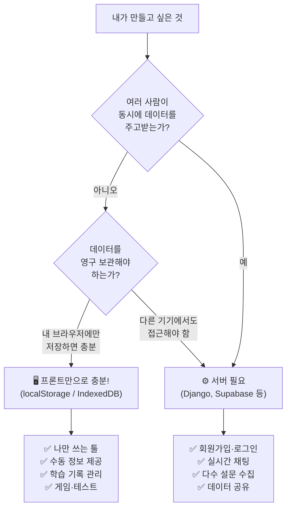

---

### 1-2. 프론트엔드만으로 "최대"로 할 수 있는 것

```mermaid
graph TD
    subgraph FRONTEND["🖥️ 프론트엔드만 (서버 없음)"]
        direction TB
        A["📦 데이터 저장"]
        A1["localStorage — 5MB, 키-값 저장"]
        A2["IndexedDB — 수백MB, 구조화 DB"]
        A3["JSON 파일 — 정적 콘텐츠 제공"]
        
        B["⚡ 기능"]
        B1["입력 → 계산 → 결과 출력"]
        B2["조건 분기 (퀴즈·테스트)"]
        B3["타이머·카운터"]
        B4["차트·그래프 시각화"]
        B5["오프라인 동작 (PWA)"]
        
        C["📋 콘텐츠 제공 방식"]
        C1["템플릿 기반 렌더링"]
        C2["JSON 파일로 콘텐츠 교체"]
        C3["마크다운 문서 불러오기"]
    end
```

#### 상세 설명 : 프론트엔드 저장소 3단계

| 저장 방식 | 용량 | 특성 | 적합한 용도 |
|---|---|---|---|
| **localStorage** | ~5MB | 문자열 키-값 쌍, 동기적, 단순 | 설정값, 진행 상태, 점수, 최근 결과 |
| **IndexedDB** | 수백MB~수GB | 비동기, 인덱스 검색, 트랜잭션 지원 | 대량 기록(일별 데이터), 이미지 캐싱, 오프라인 앱 |
| **JSON 파일 (정적)** | 무제한 (호스팅만 하면) | 읽기 전용, fetch로 불러옴 | 콘텐츠 데이터 (단어장, 퀴즈 문항, 메뉴 목록) |

#### 상세 설명 : "서버 없이" 할 수 있는 기능 범위

```
✅ 가능한 것 (프론트만으로)
├── 입력받기 → 계산 → 결과 보여주기 (모든 로직)
├── 조건 분기 (A를 선택하면 B 화면으로)
├── 타이머, 카운트다운, 스톱워치
├── 차트·그래프 시각화 (Chart.js, Streamlit 차트)
├── 애니메이션, 전환 효과
├── 내 브라우저 안에서 데이터 저장·불러오기
├── JSON 파일로 콘텐츠를 수동 교체 (링고팡 방식)
├── PWA (Progressive Web App) — 설치형 + 오프라인 동작
├── 카메라·마이크 접근 (웹 API)
├── 위치 정보 접근 (Geolocation API)
└── 공개 API 호출 (날씨, 뉴스 등 — API Key 노출 주의)

❌ 불가능한 것 (서버가 필요)
├── 다른 사용자의 데이터를 받아서 합치기
├── A가 입력한 것을 B가 실시간으로 보기
├── 로그인·인증·권한 관리
├── 이메일·푸시 알림 보내기
├── 결제 처리
├── 데이터를 기기 간 동기화
└── 대용량 파일 업로드·관리
```

---

### 1-3. 링고팡 방식 — 프론트엔드에서 서버까지, 3단계 성장 모델

> **링고팡** (https://www.lingopang.com/about) : 4세~초등 3-4학년 대상 한글·영어 학습 앱. 8단계 게임 시스템(플래시카드 → 타이핑 → 자모 조합 → 쓰기 → 문장 만들기 → 퀴즈 등)으로 2,700+ 단어를 다루며, 핵심 철학은 **"내 언어로 만들면 더 오래 남아요"** — 능동적 창작이 학습 효과를 높인다.

링고팡은 처음부터 완성된 서비스가 아니라, **3단계에 걸쳐 진화하는 구조**로 설계되었다. 이 성장 경로가 프론트엔드 프로젝트의 교과서적 확장 모델이다.

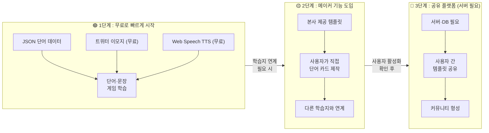

---

#### 1단계 : JSON + 무료 리소스로 시작 (서버 0원)

처음 의도는 **돈을 들이지 않고 빠르게 만드는 것**이었다.

```
[콘텐츠]   →  JSON 파일에 단어·문장 데이터
[이미지]   →  트위터 이모지 (Twemoji, 오픈소스 무료)
[음성]     →  Web Speech API TTS (브라우저 내장, 무료)
[저장]     →  localStorage (서버 불필요)
```

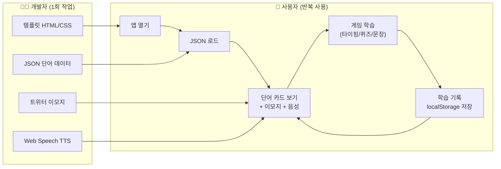

> **이 단계의 강점** : 서버 0원, 외부 API 0원. JSON만 바꾸면 새로운 단어장이 된다. 개발과 콘텐츠가 완전히 분리되어, 비개발자도 JSON만 편집하면 새 학습 콘텐츠를 만들 수 있다.

**이 패턴으로 만들 수 있는 것들:**
- 단어장 (영단어, 한자, 일본어...)
- 플래시카드 (개념 정리)
- 퀴즈 앱 (JSON에 문제·답 추가)
- 레시피 모음
- 명언/격언 매일 1개
- 취향 테스트 (질문·결과만 바꿈)

---

#### 2단계 : 메이커 기능 도입 — 사용자가 콘텐츠를 만든다 (현재 단계)

다른 학습지·교재와 연계하기 위해 **메이커(Maker) 방식**을 채택했다. 사용자가 직접 단어 카드를 만들고, 그것이 게임 학습으로 연결되는 구조.

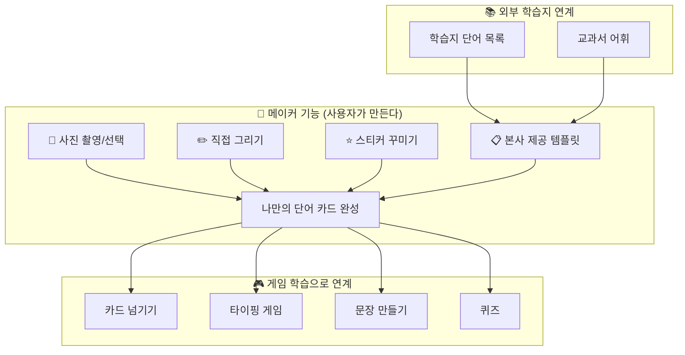

> **현재 상태** : 사용자 간 공유 기능은 아직 없다. 본사에서 자체 제작한 템플릿을 제공하는 단계. "내 언어로 만들면 더 오래 남아요" — 직접 만든 카드로 학습하면 기억에 더 오래 남는다.

---

#### 3단계 : 템플릿 공유 플랫폼 (미래 — 서버 필요)

사용자가 활성화되면, 만든 템플릿을 **서로 공유**할 수 있게 한다. **이 순간 서버가 필요**해진다.

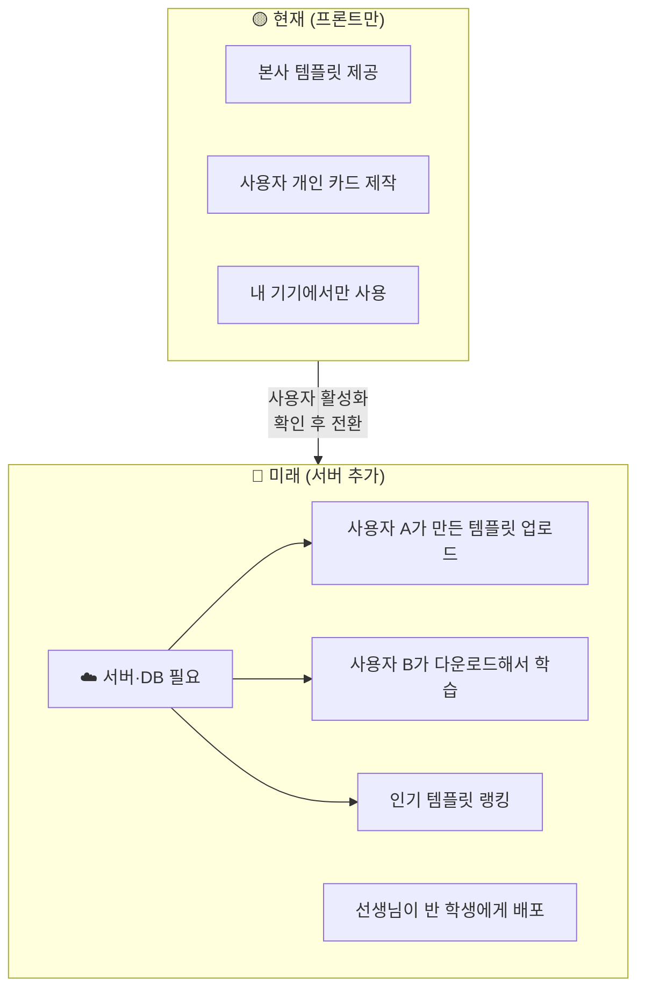

> **서버가 필요한 이유** : "나만 쓰고, 내 기기에서만 보면" 프론트만으로 충분하지만, "내가 만든 템플릿을 다른 사람이 쓸 수 있게" 하려면 중앙 저장소(서버)가 반드시 필요하다.

---

#### 링고팡 3단계 모델이 주는 교훈

```
1단계 : 무료 리소스(JSON + 이모지 + TTS)로 빠르게 만들고 검증한다
2단계 : 사용자가 콘텐츠를 만드는 메이커 기능으로 가치를 확장한다
3단계 : 사용자 간 공유가 필요해지는 그 시점에 서버를 도입한다
```

| 단계 | 서버 | 핵심 가치 | 비용 |
|---|---|---|---|
| **1단계** — JSON + 이모지 + TTS | 불필요 | 빠른 제작, 무료 시작 | 0원 |
| **2단계** — 메이커 + 본사 템플릿 | 불필요 | 사용자 참여, 학습 효과 극대화 | 0원 |
| **3단계** — 템플릿 공유 플랫폼 | **필요** | 커뮤니티, 네트워크 효과 | 서버 비용 발생 |

> **핵심 전략** : 처음부터 서버를 구축하지 않는다. 프론트만으로 시작해서 사용자가 실제로 활성화되는지 확인한 후, 그때 서버를 도입한다. 이것이 **린(Lean) 방식의 제품 개발**이다.

---

### 1-4. 그렇다면 왜 서버를 고민해야 하는가?

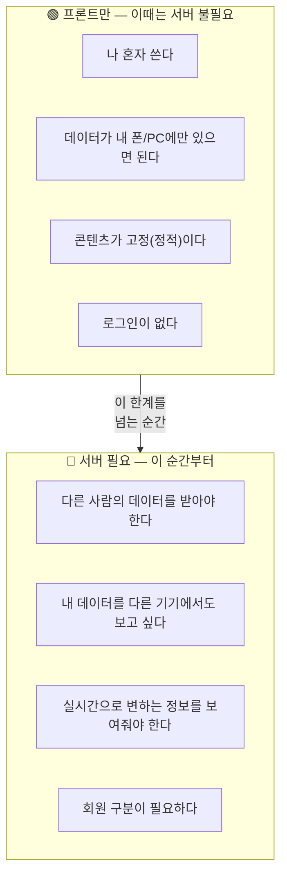

#### 구체적 시나리오로 이해하기

| 상황 | 판단 | 이유 |
|---|---|---|
| "나만 공부 기록 볼래" | 프론트만 | 내 브라우저 localStorage면 충분 |
| "친구랑 공부 시간 비교하고 싶어" | 서버 필요 | 친구의 데이터를 모아야 함 |
| "매일 급식 메뉴 보여주는 앱" | 프론트만 | JSON에 메뉴 데이터 넣으면 됨 |
| "전교생이 급식 별점 매기는 앱" | 서버 필요 | 여러 사람의 별점을 수집·합산 |
| "나만의 할 일 목록" | 프론트만 | localStorage에 저장 |
| "반 친구랑 공유하는 할 일 목록" | 서버 필요 | 여러 명이 같은 목록 수정 |

**한 줄 정리** :
> "**나만 쓰고, 내 기기에서만 보면 되면** → 프론트만. **남의 데이터를 받거나, 어디서든 접근**해야 하면 → 서버."

---

### 1-5. 프론트엔드만으로 서비스를 만들 때의 개발 프로세스

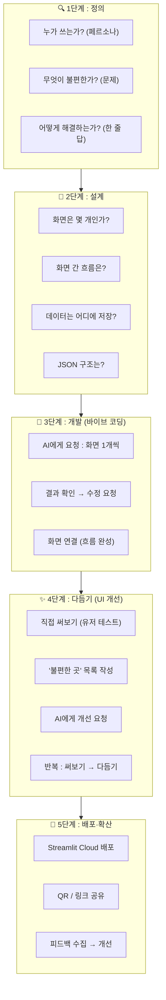

---

## 2. 10가지 아이디어 — 용역 개발 수준 상세 명세

---

### 아이디어 ① : 감정 방탈출 게임

---

#### 1. 무엇을 해결하는가? (Problem Statement)

> 중학생의 스트레스·감정을 "놀이"로 표현하고 해소할 창구가 없다. 틱톡·릴스 같은 수동적 소비만 하다가 지루함을 느끼고, "나도 뭔가 만들고 싶다"는 욕구가 있지만 출구가 없다. 3분 안에 몰입하고, 끝나면 "결과를 공유하고 싶은" 짧고 인터랙티브한 놀이가 필요하다.

#### 2. 주요 고객 (페르소나)

| 항목 | 내용 |
|---|---|
| 이름 | 지민 (중2, 14세) |
| 행동 패턴 | 시험 전 스트레스 → 틱톡·릴스로 도피 → 금방 지루함 → 새로운 자극 탐색 |
| 니즈 | 짧고(3분) 몰입감 있는 인터랙티브 놀이 |
| 터치포인트 | 쉬는 시간, 등하교 버스, 잠들기 전 |
| 디바이스 | 스마트폰 (90%), 학교 태블릿 (10%) |
| 결정 요인 | "친구가 공유한 결과를 보고 나도 해봄" — 사회적 증거 |

#### 3. 구현 방식 (주요 알고리즘)

**핵심 알고리즘 : 유한 상태 머신 (Finite State Machine)**

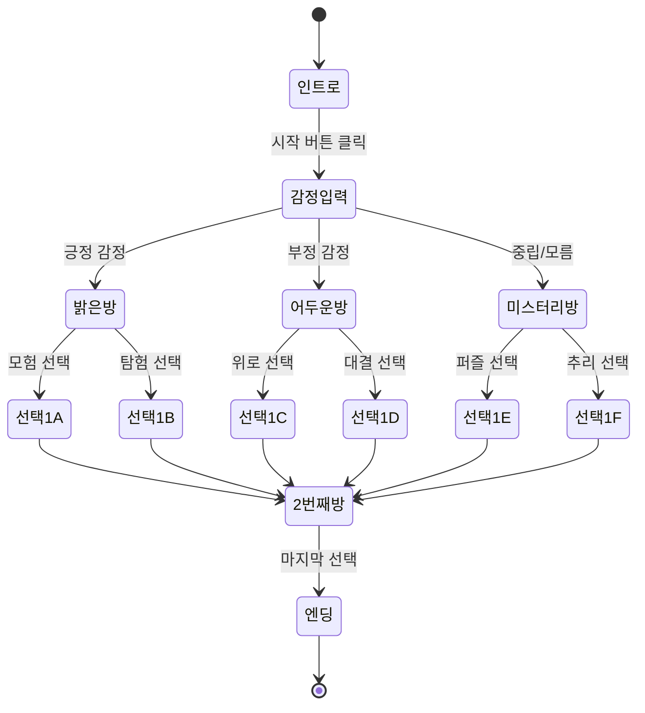

**데이터 구조 (JSON)**

```json
{
  "rooms": [
    {
      "id": "intro",
      "text": "어두운 복도 끝에 세 개의 문이 있습니다...",
      "emotion_trigger": true,
      "next": {
        "positive": "room_bright",
        "negative": "room_dark",
        "neutral": "room_mystery"
      }
    },
    {
      "id": "room_bright",
      "text": "따뜻한 빛이 쏟아지는 방입니다...",
      "choices": [
        {"label": "빛을 따라간다", "next": "room_bright_2a", "score": {"adventurer": 2}},
        {"label": "벽에 있는 지도를 살펴본다", "next": "room_bright_2b", "score": {"thinker": 2}}
      ]
    }
  ],
  "endings": [
    {
      "type": "adventurer",
      "title": "용감한 탐험가",
      "description": "당신은 두려움 없이 새로운 길을 선택하는 사람입니다.",
      "emoji": "🦁"
    }
  ]
}
```

**Streamlit 핵심 코드 구조**

```python
# session_state로 현재 방·이력 관리
if 'current_room' not in st.session_state:
    st.session_state.current_room = 'intro'
    st.session_state.history = []
    st.session_state.scores = {}
    st.session_state.start_time = time.time()

# 현재 방 렌더링
room = get_room(st.session_state.current_room)
st.markdown(f"## {room['text']}")

# 선택지 표시
for choice in room['choices']:
    if st.button(choice['label']):
        # 점수 누적
        for key, val in choice['score'].items():
            st.session_state.scores[key] = st.session_state.scores.get(key, 0) + val
        # 다음 방으로 이동
        st.session_state.current_room = choice['next']
        st.session_state.history.append(choice['label'])
        st.rerun()
```

#### 4. 유저 시나리오 (상세)

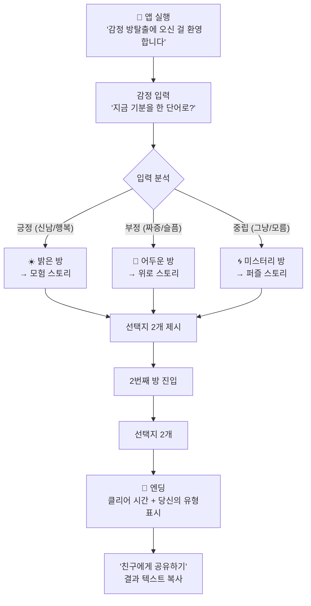

#### 5. 화면 구성 (와이어프레임)

```
┌─────────────────────────────────┐
│  [화면 1] 인트로                 │
│                                  │
│   🚪 감정 방탈출                 │
│                                  │
│   "어두운 복도 끝에              │
│    세 개의 문이 있습니다."       │
│                                  │
│   지금 기분을 한 단어로:         │
│   ┌──────────────────────┐      │
│   │ [입력칸]              │      │
│   └──────────────────────┘      │
│                                  │
│   [ 입장하기 ]                   │
│                                  │
└─────────────────────────────────┘

┌─────────────────────────────────┐
│  [화면 2] 방 안                  │
│                                  │
│   ☀️ 밝은 방                     │
│                                  │
│   "따뜻한 빛이 쏟아지는          │
│    방에 들어왔습니다.            │
│    앞에 두 갈래 길이 보입니다."  │
│                                  │
│   ┌──────────────────────┐      │
│   │ 🅰️ 빛을 따라간다     │      │
│   └──────────────────────┘      │
│   ┌──────────────────────┐      │
│   │ 🅱️ 벽의 지도를 본다  │      │
│   └──────────────────────┘      │
│                                  │
│   ━━━━━━━━ 2/3 ━━━━━━━━        │
│   (진행률 바)                    │
│                                  │
└─────────────────────────────────┘

┌─────────────────────────────────┐
│  [화면 3] 엔딩                   │
│                                  │
│   🎉 탈출 성공!                  │
│                                  │
│   당신의 유형 : 🦁 용감한 탐험가  │
│                                  │
│   "두려움 없이 새로운 길을       │
│    선택하는 당신, 멋져요!"       │
│                                  │
│   클리어 시간 : 2분 34초         │
│   선택 이력 : 빛을 따라감 →      │
│              열쇠를 집었다        │
│                                  │
│   [ 🔄 다시 하기 ]               │
│   [ 📤 친구에게 공유 ]           │
│                                  │
└─────────────────────────────────┘
```

#### 6. 개발 단계 (용역 일정)

```mermaid
gantt
    title 감정 방탈출 게임 — 개발 단계
    dateFormat  X
    axisFormat %s시간

    section 1단계 기획
    스토리 분기도 작성        :a1, 0, 2
    JSON 데이터 구조 설계     :a2, 0, 1
    화면 와이어프레임         :a3, 1, 2

    section 2단계 핵심 개발
    인트로 화면 + 감정 입력   :b1, 2, 3
    방 이동 로직 (상태머신)   :b2, 3, 5
    선택지 UI + 점수 계산     :b3, 3, 5
    엔딩 화면 + 유형 판정     :b4, 5, 6

    section 3단계 콘텐츠
    스토리 텍스트 작성        :c1, 4, 6
    유형 설명문 작성          :c2, 5, 6

    section 4단계 완성
    UI 다듬기 + 반응형        :d1, 6, 7
    테스트 + 버그 수정        :d2, 7, 8
    배포                      :d3, 8, 8
```

| 단계 | 산출물 | 소요 시간 | 바이브 코딩 프롬프트 |
|---|---|---|---|
| 1단계 | 분기도 + JSON 구조 | 1시간 | "방탈출 게임의 스토리 분기를 JSON으로 설계해줘. 방 3개, 각 방에 선택지 2개" |
| 2단계 | 작동하는 프로토타입 | 3시간 | "Streamlit으로 방탈출 게임 만들어줘. session_state로 현재 방 관리, 선택하면 다음 방으로 이동" |
| 3단계 | 콘텐츠 입력 완료 | 1시간 | "이 JSON에 들어갈 스토리를 써줘. 중학생이 좋아할 판타지 톤으로" |
| 4단계 | 배포 완료 | 1시간 | "UI를 예쁘게 다듬어줘. 이모지 추가, 진행률 바, 모바일에서 잘 보이게" |

#### 7. 이상적인 유저 획득 시나리오 → 사업화

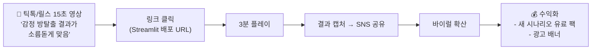

**사업화 단계 상세:**

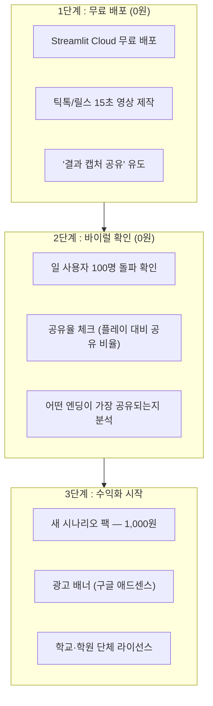

---

### 아이디어 ② : 우리 학교 설문 리서치 툴

---

#### 1. 무엇을 해결하는가? (Problem Statement)

> 학급 회의·동아리에서 의견을 모을 때 **구글 폼은 딱딱하고 복잡**하다. 설정만 하다가 시간 다 가고, 결과도 스프레드시트를 열어야 해서 "실시간으로 결과를 보면서 토론"하기 어렵다. 중학생 반장이 **5분 안에 설문을 만들고, 결과를 바로 예쁘게 보여주는 도구**가 필요하다.

#### 2. 주요 고객 (페르소나)

| 항목 | 내용 |
|---|---|
| 이름 | 수빈 (중2, 반장) |
| 행동 패턴 | 반 회의 전 → 구글 폼 만들기 시도 → 너무 복잡 → 그냥 손들기 투표로 대체 |
| 니즈 | 5분 안에 설문 만들고, 결과를 바로 보여주고 싶다 |
| 터치포인트 | 반 회의 전날, 학교 행사 기획 |
| Pain Point | "결과를 이쁘게 보여주고 싶은데 엑셀은 모르겠고..." |
| 결정 요인 | "친구가 만든 설문에 QR로 바로 참여해봤는데 너무 간편했어" |

#### 3. 구현 방식 (주요 알고리즘)

**핵심 알고리즘 : CRUD + 실시간 집계**

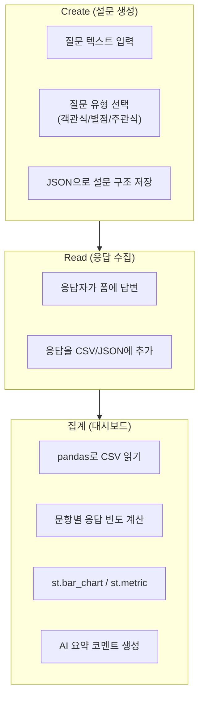

**데이터 구조**

```json
// survey_config.json (설문 구조)
{
  "title": "우리 반 급식 만족도 조사",
  "created_by": "수빈",
  "questions": [
    {
      "id": "q1",
      "type": "radio",
      "text": "이번 주 급식에 만족하나요?",
      "options": ["매우 만족", "만족", "보통", "불만족", "매우 불만족"]
    },
    {
      "id": "q2",
      "type": "slider",
      "text": "급식 맛을 1~10점으로 평가해주세요",
      "min": 1,
      "max": 10
    },
    {
      "id": "q3",
      "type": "text",
      "text": "개선했으면 하는 점이 있다면?"
    }
  ]
}
```

```csv
// responses.csv (응답 데이터)
timestamp,q1,q2,q3
2024-03-15 12:30,만족,7,양이 좀 더 많으면 좋겠어요
2024-03-15 12:31,보통,5,국이 짜요
2024-03-15 12:32,매우 만족,9,오늘 치킨 최고!
```

#### 4. 유저 시나리오 (상세)

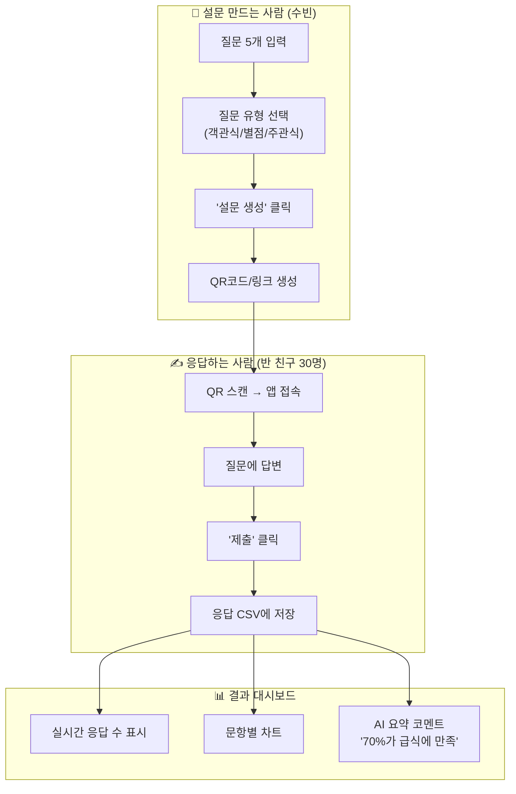

#### 5. 화면 구성 (와이어프레임)

```
┌─────────────────────────────────┐
│  [화면 1] 설문 만들기            │
│                                  │
│   📋 새 설문 만들기              │
│                                  │
│   제목: [우리 반 급식 만족도]    │
│                                  │
│   질문 1:                        │
│   [이번 주 급식에 만족하나요?]   │
│   유형: (●) 객관식  ○ 별점      │
│   선택지: 매우 만족 / 만족 / ... │
│                                  │
│   [ + 질문 추가 ]                │
│                                  │
│   [ 🚀 설문 생성하기 ]           │
│                                  │
└─────────────────────────────────┘

┌─────────────────────────────────┐
│  [화면 2] 응답하기               │
│                                  │
│   📝 우리 반 급식 만족도 조사    │
│                                  │
│   Q1. 이번 주 급식에 만족하나요? │
│   ○ 매우 만족                    │
│   ● 만족                         │
│   ○ 보통                         │
│                                  │
│   Q2. 맛 점수 (1~10)            │
│   ━━━━━━●━━━━ 7                 │
│                                  │
│   Q3. 개선할 점?                 │
│   ┌──────────────────────┐      │
│   │ 양이 좀 더 많으면... │      │
│   └──────────────────────┘      │
│                                  │
│   [ 제출하기 ✓ ]                 │
│                                  │
└─────────────────────────────────┘

┌─────────────────────────────────┐
│  [화면 3] 결과 대시보드          │
│                                  │
│   📊 실시간 결과 (응답 27명)     │
│                                  │
│   Q1. 급식 만족도                │
│   매우만족 ████████ 30%          │
│   만족     ████████████ 44%      │
│   보통     ████ 15%              │
│   불만족   ██ 7%                 │
│   매우불만 █ 4%                  │
│                                  │
│   Q2. 평균 점수 : 7.2 / 10      │
│                                  │
│   🤖 AI 요약:                    │
│   "74%가 만족 이상으로 응답.     │
│    주요 개선 요청: 양 증가"      │
│                                  │
└─────────────────────────────────┘
```

#### 6. 개발 단계 (용역 일정)

| 단계 | 산출물 | 소요 시간 | 바이브 코딩 프롬프트 |
|---|---|---|---|
| 1단계 | 설문 구조 설계 | 30분 | "설문 조사 앱의 JSON 데이터 구조를 설계해줘. 질문 유형은 객관식, 별점(슬라이더), 주관식 3가지" |
| 2단계 | 설문 생성 화면 | 1시간 | "Streamlit으로 설문 만들기 화면 만들어줘. 질문 추가/삭제, 유형 선택, JSON으로 저장" |
| 3단계 | 응답 화면 | 1시간 | "JSON에서 설문 구조를 읽어서 응답 폼을 자동 생성하고, 제출하면 CSV에 저장하는 화면" |
| 4단계 | 결과 대시보드 | 1.5시간 | "CSV 응답을 읽어서 문항별 차트, 평균값, 응답 수를 보여주는 대시보드" |
| 5단계 | AI 요약 | 30분 | "대시보드에 AI 요약 코멘트 추가. 결과를 한 문장으로 정리" |
| 6단계 | 배포 | 30분 | "Streamlit Cloud에 배포하고 QR코드 생성" |

#### 7. 서버 필요 판단 — 이 프로젝트의 특수성

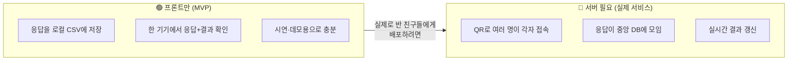

> **수업 내에서는 프론트만 버전**으로 시연. "실제 서비스로 확장하면 서버가 왜 필요한지" 체감하게 해준다.

#### 8. 이상적인 유저 획득 시나리오 → 사업화

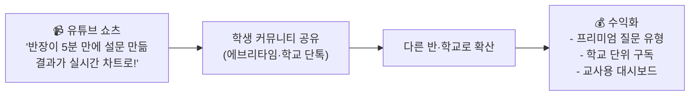

---

### 아이디어 ③ : 취향 추천 테스트 (MBTI 스타일)

---

#### 1. 무엇을 해결하는가? (Problem Statement)

> "오늘 뭐 볼까?" "무슨 노래 들을까?" — **선택 피로.** 콘텐츠는 넘치는데 내 취향을 정확히 모르겠다. MBTI·성격 테스트는 좋아하지만, 그 결과가 실제로 **나에게 맞는 콘텐츠 추천**으로 이어지면 더 좋겠다. + 친구와 결과 비교하는 재미.

#### 2. 주요 고객 (페르소나)

| 항목 | 내용 |
|---|---|
| 이름 | 하은 (중2, K-pop 덕후) |
| 행동 패턴 | 새 콘텐츠 탐색 → 추천 알고리즘 의존 → "다 비슷함" 피로 → MBTI·테스트류 콘텐츠 좋아함 |
| 니즈 | 간단한 질문으로 "나한테 딱 맞는 것" 추천받기 + 친구와 결과 비교 재미 |
| 터치포인트 | 카톡 그룹채팅, 인스타 스토리 |
| 사용 시간 | 2~3분 (그 이상이면 이탈) |
| 공유 동기 | "나 이 유형이래ㅋㅋ 너도 해봐" — 정체성 표현 |

#### 3. 구현 방식 (주요 알고리즘)

**핵심 알고리즘 : 가중 점수 합산 + 유형 매칭**

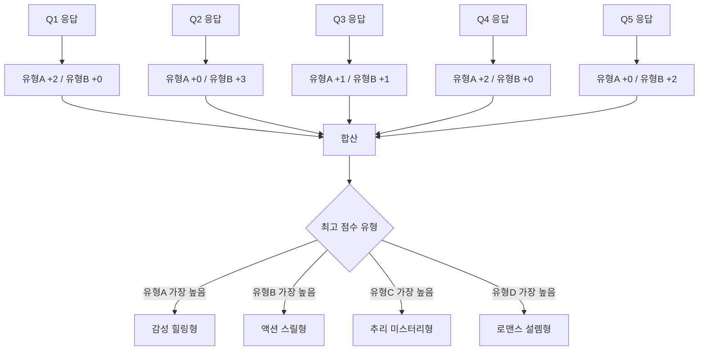

**데이터 구조 (JSON)**

```json
{
  "meta": {
    "title": "나의 웹툰 취향 유형은?",
    "description": "5개 질문에 답하면 딱 맞는 웹툰을 추천해드려요!",
    "total_questions": 5
  },
  "questions": [
    {
      "id": "q1",
      "text": "주말 오후, 이상적인 시간 보내기는?",
      "choices": [
        {"label": "따뜻한 카페에서 음악 듣기", "scores": {"healing": 3, "romance": 1}},
        {"label": "롤러코스터 타기", "scores": {"action": 3, "mystery": 1}},
        {"label": "추리소설 읽기", "scores": {"mystery": 3, "healing": 1}},
        {"label": "친구랑 수다 떨기", "scores": {"romance": 3, "action": 1}}
      ]
    }
  ],
  "types": [
    {
      "id": "healing",
      "name": "감성 힐링형",
      "emoji": "🌿",
      "description": "당신은 잔잔하고 따뜻한 이야기에 끌리는 사람이에요.",
      "recommendations": [
        {"title": "나 혼자만 레벨업", "reason": "성장 서사가 잔잔하게 감동을 줘요"},
        {"title": "여신강림", "reason": "따뜻한 로맨스 + 자존감 이야기"},
        {"title": "마음의 소리", "reason": "웃기면서도 위로가 되는 일상"}
      ]
    }
  ]
}
```

#### 4. 유저 시나리오 (상세)

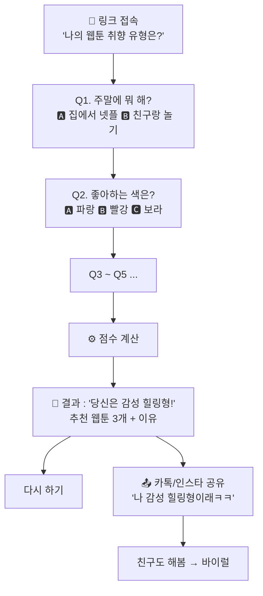

**바이럴 루프 상세 :**

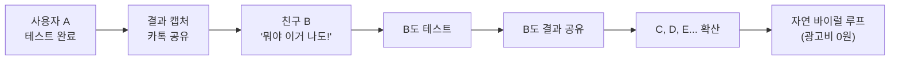

#### 5. 화면 구성 (와이어프레임)

```
┌─────────────────────────────────┐
│  [화면 1] 시작                   │
│                                  │
│   🎨 나의 웹툰 취향 유형은?     │
│                                  │
│   5개 질문에 답하면              │
│   딱 맞는 웹툰을 추천해드려요!  │
│                                  │
│   🕐 소요 시간 : 약 2분         │
│   👥 지금까지 1,234명 참여       │
│                                  │
│   [ 시작하기 ▶ ]                 │
│                                  │
└─────────────────────────────────┘

┌─────────────────────────────────┐
│  [화면 2] 질문 (단계별)          │
│                                  │
│   Q1 / 5                         │
│   ━━━━●━━━━━━━━━━ 20%           │
│                                  │
│   주말 오후, 이상적인            │
│   시간 보내기는?                 │
│                                  │
│   ┌────────────────────────┐    │
│   │ 🌿 따뜻한 카페에서     │    │
│   │    음악 듣기            │    │
│   └────────────────────────┘    │
│   ┌────────────────────────┐    │
│   │ 🎢 롤러코스터 타기     │    │
│   └────────────────────────┘    │
│   ┌────────────────────────┐    │
│   │ 🔍 추리소설 읽기       │    │
│   └────────────────────────┘    │
│   ┌────────────────────────┐    │
│   │ 💬 친구랑 수다         │    │
│   └────────────────────────┘    │
│                                  │
└─────────────────────────────────┘

┌─────────────────────────────────┐
│  [화면 3] 결과                   │
│                                  │
│   🌿 당신은 감성 힐링형!        │
│                                  │
│   "잔잔하고 따뜻한 이야기에     │
│    끌리는 당신, 마음이           │
│    따뜻한 사람이에요."          │
│                                  │
│   📚 추천 웹툰:                  │
│   ┌────────────────────────┐    │
│   │ 1. 나 혼자만 레벨업    │    │
│   │    "성장 서사가 감동"   │    │
│   │ 2. 여신강림            │    │
│   │    "따뜻한 로맨스"     │    │
│   │ 3. 마음의 소리         │    │
│   │    "웃기면서 위로"     │    │
│   └────────────────────────┘    │
│                                  │
│   [ 🔄 다시 하기 ]               │
│   [ 📤 결과 공유하기 ]           │
│                                  │
└─────────────────────────────────┘
```

#### 6. 개발 단계

| 단계 | 산출물 | 소요 시간 | 바이브 코딩 프롬프트 |
|---|---|---|---|
| 1단계 | 질문·유형·추천 데이터 설계 | 1시간 | "취향 테스트 JSON 구조를 만들어줘. 질문 5개, 유형 4개, 각 유형에 추천 3개" |
| 2단계 | 질문 화면 (단계별 진행) | 1시간 | "Streamlit으로 퀴즈 형식 화면. 한 문제씩 보여주고, 진행률 바, 선택하면 다음 문제로" |
| 3단계 | 점수 계산 + 결과 화면 | 1시간 | "선택지별 점수 합산해서 유형 판정, 결과 카드 형태로 유형 이름 + 설명 + 추천 목록 표시" |
| 4단계 | 공유 기능 + UI 다듬기 | 30분 | "결과를 텍스트로 복사하는 공유 버튼 추가. 이모지·색상으로 결과 카드 꾸미기" |
| 5단계 | 배포 | 30분 | 배포 + SNS 공유 영상 촬영 |

#### 7. 이상적인 유저 획득 시나리오 → 사업화

```mermaid
flowchart LR
    A["🎬 인스타 릴스<br> 결과 카드 캡처 공유<br> '대박 찐이야'"] --> B["링크 타고 접속"]
    B --> C["테스트 완료 → 또 공유"]
    C --> D["자연 바이럴 루프"]
    D --> E["💰 수익화<br> - 웹툰 플랫폼 제휴 링크<br> - 새 테스트 팩 판매<br> - 광고 삽입"]
```

**수익 모델 구체화:**

| 수익원 | 설명 | 예상 단가 |
|---|---|---|
| 제휴 링크 | 추천 웹툰 링크 클릭 시 웹툰 플랫폼으로 → CPA 수익 | 클릭당 50~200원 |
| 새 테스트 팩 | "K-pop 아이돌 유형", "영화 취향", "공부 스타일" 등 | 팩당 1,000원 |
| 광고 | 결과 페이지 하단 배너 | CPM 1,000~3,000원 |
| B2B | 웹툰 플랫폼이 "신작 홍보용 테스트" 의뢰 | 건당 50~200만원 |

---

### 아이디어 ④ : 급식 별점 & 리뷰판

---

#### 1. 무엇을 해결하는가?

> 매일 먹는 급식인데 **기록도, 피드백 채널도 없다.** "오늘 급식 쩐다/별로" 한마디 톡방에 남기면 끝. 지난달 최고 메뉴가 뭐였는지, 금요일 급식이 왜 항상 맛있는지, 데이터로 볼 수 없다. 학생 입장에서 급식에 "목소리를 낼 수 있는 공식 채널"이 있으면 좋겠다.

#### 2. 주요 고객 (페르소나)

| 항목 | 내용 |
|---|---|
| 이름 | 준호 (중2, 먹방 유튜브 시청자) |
| 행동 패턴 | 급식 먹기 → "오늘 급식 쩐다/별로" 톡방에 한마디 → 끝 (기록 안 남음) |
| 니즈 | 급식 별점 매기기 + "이번 달 1등 메뉴" 랭킹 보기 |
| 터치포인트 | 점심시간 직후, 급식표 나오는 날 |
| 디바이스 | 스마트폰 (점심시간 후 바로 접속) |
| 동기부여 | "내가 매긴 별점이 랭킹에 반영된다" — 참여감 |

#### 3. 구현 방식 (주요 알고리즘)

**핵심 알고리즘 : 평균 계산 + 랭킹 정렬 + 시계열 추이**

```mermaid
flowchart TD
    INPUT["별점 입력<br> (메뉴명, 점수 1~5)"] --> STORE["localStorage에 저장<br> {date, menu, score, comment}"]
    STORE --> CALC["메뉴별 평균 계산"]
    CALC --> RANK["내림차순 정렬 → TOP5"]
    CALC --> TREND["날짜별 평균 → 꺾은선 차트"]
    CALC --> WORST["오름차순 정렬 → WORST3"]
```

**데이터 구조**

```json
// menu_data.json (이번 주 급식 메뉴 — 관리자가 매주 업데이트)
{
  "2024-03-18": ["비빔밥", "된장국", "깍두기", "요구르트"],
  "2024-03-19": ["김치볶음밥", "미역국", "만두", "우유"],
  "2024-03-20": ["치킨", "콘샐러드", "떡볶이", "주스"]
}

// ratings (localStorage에 저장)
[
  {"date": "2024-03-18", "menu": "비빔밥", "score": 4, "comment": "맛있었어"},
  {"date": "2024-03-19", "menu": "김치볶음밥", "score": 3, "comment": "좀 짜"},
  {"date": "2024-03-20", "menu": "치킨", "score": 5, "comment": "최고!!!!"}
]
```

#### 4. 유저 시나리오

```mermaid
flowchart TD
    START["🍽️ 점심 먹고 앱 접속"] --> TODAY["오늘 메뉴 자동 표시<br> '김치볶음밥 / 미역국 / 요구르트'"]
    TODAY --> RATE["⭐ 별점 (1~5점)<br> + 한 줄 코멘트"]
    RATE --> SUBMIT["'평가 완료!'"]
    SUBMIT --> DASH["📊 대시보드 전환"]
    
    subgraph DASH_DETAIL["대시보드"]
        RANK["🏆 이달의 메뉴 TOP5"]
        WORST["💀 최악의 메뉴 TOP3"]
        TREND["📈 요일별 만족도 추이"]
    end
    
    DASH --> RANK
    DASH --> WORST
    DASH --> TREND
```

#### 5. 개발 단계

| 단계 | 산출물 | 소요 시간 | 바이브 코딩 프롬프트 |
|---|---|---|---|
| 1단계 | 메뉴 JSON + 평가 구조 | 30분 | "급식 메뉴 JSON과 평가 데이터 구조 설계해줘" |
| 2단계 | 오늘 메뉴 표시 + 별점 입력 | 1시간 | "Streamlit으로 오늘 날짜 메뉴 자동 표시, 별점 슬라이더, 코멘트 입력, 저장 버튼" |
| 3단계 | 대시보드 (TOP/WORST/추이) | 1.5시간 | "저장된 평가 데이터로 메뉴별 평균 랭킹 TOP5, WORST3, 날짜별 추이 차트 만들어줘" |
| 4단계 | UI 다듬기 + 배포 | 1시간 | "이모지, 색상, 모바일 최적화, 배포" |

#### 6. 이상적인 유저 획득 시나리오 → 사업화

```mermaid
flowchart LR
    A["📱 급식표 올라오는 날<br> 학교 단톡에 링크 공유<br> '급식 별점 매기자'"] --> B["반 친구 참여"]
    B --> C["결과 재미있음 → 다른 반 확산"]
    C --> D["학교 전체 → 다른 학교"]
    D --> E["💰 수익화<br> - 학교 단위 데이터 리포트<br> - 급식업체 피드백 서비스<br> - 광고"]
```

**사업화 시나리오 상세:**

```mermaid
flowchart TD
    subgraph MVP["MVP (프론트만, 0원)"]
        M1["내 평가만 기록 (localStorage)"]
        M2["개인 대시보드"]
    end
    
    subgraph GROWTH["성장 (서버 추가)"]
        G1["반 전체 평가 수집"]
        G2["실시간 랭킹 공개"]
        G3["학교 전체 확대"]
    end
    
    subgraph BIZ["사업화"]
        B1["급식업체에 피드백 리포트 판매"]
        B2["교육청에 데이터 대시보드 제공"]
        B3["다른 학교 확장 (SaaS)"]
    end
    
    MVP --> GROWTH --> BIZ
```

---

### 아이디어 ⑤ : 공부 타이머 & 집중 기록기

---

#### 1. 무엇을 해결하는가?

> "오늘 공부 많이 했다"는 **느낌만** 있고 실제 기록이 없다. 폰을 중간에 만져서 실제 집중 시간은 2시간인데 "4시간 공부했다"고 착각한다. 과목별로 얼마나 했는지, 어떤 요일에 집중이 잘 되는지, **데이터로 자기 패턴을 보고 싶다.**

#### 2. 주요 고객 (페르소나)

| 항목 | 내용 |
|---|---|
| 이름 | 서연 (중2, 상위권 목표) |
| 행동 패턴 | 공부 시작 → 폰 만짐 → 다시 시작 → "오늘 몇 시간 했지?" 모름 |
| 니즈 | 과목별 공부 시간 자동 기록 + 일주일 패턴 시각화 |
| 터치포인트 | 저녁 자습 시작할 때, 일요일 주간 회고 |
| 동기부여 | "연속 공부 일수" 스트릭, 주간 차트의 성장 |

#### 3. 구현 방식 (주요 알고리즘)

**핵심 알고리즘 : 타이머 + 누적 합산 + 날짜별 기록**

```mermaid
flowchart TD
    START["시작 버튼 클릭"] --> RUNNING["타이머 작동 중<br> (경과 시간 표시)"]
    RUNNING --> STOP{"정지?"}
    STOP -->|아니오| RUNNING
    STOP -->|예| SAVE["기록 저장<br> {과목, 시간, 날짜}"]
    SAVE --> ACCUMULATE["오늘 총 시간 누적"]
    ACCUMULATE --> DAILY["일별 데이터 배열에 추가"]
    DAILY --> WEEKLY["주간 차트 렌더링"]
```

**데이터 구조 (localStorage)**

```json
{
  "settings": {
    "pomodoro_minutes": 25,
    "break_minutes": 5,
    "subjects": ["수학", "영어", "과학", "국어", "사회"]
  },
  "records": [
    {"date": "2024-03-18", "subject": "수학", "minutes": 50},
    {"date": "2024-03-18", "subject": "영어", "minutes": 25},
    {"date": "2024-03-19", "subject": "수학", "minutes": 75},
    {"date": "2024-03-19", "subject": "과학", "minutes": 25}
  ],
  "streaks": {
    "current": 5,
    "best": 12
  }
}
```

#### 4. 유저 시나리오

```mermaid
flowchart TD
    START["📖 앱 실행"] --> SELECT["과목 선택<br> (수학/영어/과학...)"]
    SELECT --> TIMER["⏱️ 타이머 시작<br> 25분 뽀모도로"]
    TIMER --> RING["🔔 25분 완료!<br> '휴식할까요?'"]
    RING --> REST["5분 휴식"]
    REST --> AGAIN{"계속?"}
    AGAIN -->|예| TIMER
    AGAIN -->|아니오| SAVE["📊 오늘 기록 저장<br> localStorage"]
    SAVE --> WEEKLY["주간 리포트<br> 과목별 시간 차트<br> AI 코멘트 : '수학 비중 40%'"]
```

#### 5. 화면 구성

```
┌─────────────────────────────────┐
│  [화면 1] 타이머                 │
│                                  │
│   📖 수학 공부 중                │
│                                  │
│          23:45                    │
│       (남은 시간)                │
│                                  │
│   ━━━━━━━━━━━━━━━● 94%          │
│                                  │
│   [ ⏸️ 일시정지 ]  [ ⏹️ 종료 ]  │
│                                  │
│   오늘 총 공부: 1시간 25분       │
│   🔥 연속 5일째!                 │
│                                  │
└─────────────────────────────────┘

┌─────────────────────────────────┐
│  [화면 2] 주간 리포트            │
│                                  │
│   📊 이번 주 공부 기록           │
│                                  │
│   월 ████████ 2h                 │
│   화 ████████████ 3h             │
│   수 ██████ 1.5h                 │
│   목 ████████████████ 4h         │
│   금 ████ 1h                     │
│   토 ████████████████████ 5h     │
│   일 ████████ 2h                 │
│                                  │
│   과목 비율:                     │
│   수학 40% / 영어 30% /          │
│   과학 20% / 국어 10%            │
│                                  │
│   🤖 AI 코멘트:                  │
│   "목·토에 집중력이 높아요!      │
│    수학 비중이 가장 크네요."     │
│                                  │
└─────────────────────────────────┘
```

#### 6. 개발 단계

| 단계 | 산출물 | 소요 시간 | 바이브 코딩 프롬프트 |
|---|---|---|---|
| 1단계 | 타이머 핵심 기능 | 1시간 | "Streamlit으로 뽀모도로 타이머 만들어줘. 25분 카운트다운, 시작/정지/리셋 버튼, 과목 선택" |
| 2단계 | 기록 저장 + 누적 | 1시간 | "타이머 완료하면 과목·시간·날짜를 JSON으로 저장. 오늘 총 시간 표시" |
| 3단계 | 주간 차트 + 과목 비율 | 1시간 | "7일간 기록을 요일별 바 차트, 과목별 파이 차트로 시각화" |
| 4단계 | 스트릭 + AI 코멘트 + 배포 | 1시간 | "연속 공부 일수 스트릭 표시, AI가 주간 패턴 코멘트 생성" |

#### 7. 이상적인 유저 획득 시나리오 → 사업화

```mermaid
flowchart LR
    A["🎬 유튜브<br> '중학생 공부 루틴 앱<br> 직접 만들어봄'"] --> B["공부 유튜버·인스타 협업"]
    B --> C["학생 다운로드"]
    C --> D["매일 사용 → 습관 형성"]
    D --> E["💰 수익화<br> - 프리미엄 통계 기능<br> - 스터디 그룹 (서버)<br> - 학원 B2B"]
```

---

### 아이디어 ⑥ : AI 과목 튜터 챗봇

---

#### 1. 무엇을 해결하는가?

> 모르는 문제를 물어볼 곳이 마땅치 않다. 선생님은 바쁘고, 부모님은 모르고, 인터넷 검색은 산만하고 광고 투성이. **"이 문제 어떻게 풀어?" 한마디면 단계별로 알려주는 친절한 1:1 튜터**가 있으면 좋겠다.

#### 2. 주요 고객 (페르소나)

| 항목 | 내용 |
|---|---|
| 이름 | 민재 (중2, 수학 약간 약함) |
| 행동 패턴 | 문제 모름 → 네이버 검색 → 광고·불필요 정보 → 포기 → 답지 확인 |
| 니즈 | "이 문제 어떻게 풀어?" 물으면 단계별로 알려주는 친절한 튜터 |
| 터치포인트 | 숙제할 때, 시험 전 복습 |
| 사용 패턴 | 한 번에 2~3문제 질문, 이해되면 떠남 |

#### 3. 구현 방식 (주요 알고리즘)

**핵심 : AI API 호출 + 시스템 프롬프트 설정 + 대화 이력 관리**

```mermaid
flowchart TD
    subgraph 사용자측["사용자"]
        INPUT["질문 입력<br> '일차방정식 3x+5=14<br> 어떻게 풀어?'"]
    end
    
    subgraph 시스템["시스템"]
        SYSTEM_PROMPT["시스템 프롬프트<br> '중2 수준으로 설명,<br> 단계별로 나눠서,<br> 격려하면서'"]
        HISTORY["대화 이력<br> (이전 질문·답변)"]
        API["AI API 호출"]
    end
    
    subgraph 출력["출력"]
        RESPONSE["단계별 풀이<br> 1단계: 양변에서 5를 빼요<br> 2단계: 3x = 9<br> 3단계: x = 3"]
        QUIZ["확인 퀴즈<br> '비슷한 문제: 2x+3=11'"]
    end
    
    INPUT --> API
    SYSTEM_PROMPT --> API
    HISTORY --> API
    API --> RESPONSE
    RESPONSE --> QUIZ
```

**시스템 프롬프트 설계:**

```
당신은 중학교 2학년 수학 선생님입니다.
규칙:
1. 항상 단계별로 설명하세요 (1단계, 2단계...)
2. 중학교 2학년이 아는 용어만 사용하세요
3. 각 단계 후에 "여기까지 이해됐어?" 확인하세요
4. 틀려도 격려하세요 ("아깝다! 거의 다 됐어!")
5. 정답 후에 비슷한 문제 1개를 추가로 제시하세요
6. 답을 바로 알려주지 말고, 힌트로 유도하세요
```

#### 4. 유저 시나리오

```mermaid
flowchart TD
    START["📱 앱 접속<br> '수학 튜터' 선택"] --> ASK["'일차방정식에서<br> x를 어떻게 구해?'"]
    ASK --> AI["🤖 AI 답변 생성<br> '1단계: 양변에서...<br> 2단계: x를 한쪽으로...'"]
    AI --> FOLLOW{"이해됐어?"}
    FOLLOW -->|"아직 모르겠어"| DETAIL["더 쉽게 설명 요청<br> → 예시 문제 추가"]
    FOLLOW -->|"이해됐어!"| QUIZ["📝 확인 퀴즈 1문제"]
    QUIZ --> CORRECT{"정답?"}
    CORRECT -->|맞음| PRAISE["🎉 '완벽해!' + 다음 개념"]
    CORRECT -->|틀림| HINT["💡 힌트 제공 → 재시도"]
```

#### 5. 개발 단계

| 단계 | 산출물 | 소요 시간 | 바이브 코딩 프롬프트 |
|---|---|---|---|
| 1단계 | 기본 챗 UI | 1시간 | "Streamlit으로 채팅 UI 만들어줘. st.chat_message, st.text_input, 대화 이력 표시" |
| 2단계 | AI API 연결 | 1시간 | "OpenAI API 연결해서 사용자 질문에 답변 생성. 시스템 프롬프트로 '중2 수학 튜터' 역할 설정" |
| 3단계 | 과목 선택 + 퀴즈 기능 | 1시간 | "과목 선택 메뉴(수학/영어/과학), 답변 후 확인 퀴즈 1문제 자동 출제" |
| 4단계 | UI 다듬기 + 배포 | 1시간 | "채팅 버블 스타일링, 로딩 애니메이션, 모바일 최적화" |

#### 6. 이상적인 유저 획득 시나리오 → 사업화

```mermaid
flowchart LR
    A["🎬 유튜브 숏츠<br> 'AI한테 수학 물어봤더니<br> 선생님보다 친절함'"] --> B["학생 접속"]
    B --> C["문제 해결 → 신뢰"]
    C --> D["매일 사용"]
    D --> E["💰 수익화<br> - 과목별 전문 봇 유료화<br> - 문제 풀이 횟수 제한 프리미엄<br> - 학원 화이트라벨"]
```

---

### 아이디어 ⑦ : 나만의 플레이리스트 무드 추천기

---

#### 1. 무엇을 해결하는가?

> "기분에 맞는 노래" 찾기가 귀찮다. 스포티파이 알고리즘은 과거 청취 기반이지 **"지금 이 순간의 기분"**을 반영하지 못한다. "비 오는 날 센치한 기분"이라고 입력하면 딱 맞는 5곡을 추천해주는 게 필요하다.

#### 2. 주요 고객 (페르소나)

| 항목 | 내용 |
|---|---|
| 이름 | 예린 (중2, 이어폰 항상 착용) |
| 행동 패턴 | 기분 따라 음악 취향 변함 → 플리 만들기 귀찮 → 아무거나 듣다가 스킵 반복 |
| 니즈 | "지금 이 기분"에 맞는 플레이리스트를 바로 추천받기 |
| 터치포인트 | 등하교, 잠들기 전, 비 오는 날 |

#### 3. 구현 방식 (주요 알고리즘)

**핵심 : 무드 태그 매핑 + 가중 랜덤 추출**

```mermaid
flowchart TD
    INPUT["기분 선택<br> 😊 신남"] --> MOOD_MAP["무드 매핑<br> '신남' → [에너지, 댄스, 밝은]"]
    MOOD_MAP --> FILTER["JSON 곡 목록에서<br> 태그 일치하는 곡 필터"]
    FILTER --> WEIGHT{"좋아요 기록 있음?"}
    WEIGHT -->|있음| WEIGHTED["좋아요한 아티스트<br> 가중치 2배"]
    WEIGHT -->|없음| RANDOM["동일 가중치"]
    WEIGHTED --> SELECT["5곡 랜덤 추출"]
    RANDOM --> SELECT
    SELECT --> DISPLAY["추천 리스트 표시<br> 곡명 + 아티스트 + 유튜브 링크"]
```

**데이터 구조 (JSON)**

```json
{
  "moods": {
    "신남": ["energy", "dance", "bright"],
    "센치": ["acoustic", "indie", "rainy"],
    "잔잔": ["lo-fi", "piano", "calm"],
    "에너지": ["hiphop", "edm", "workout"]
  },
  "songs": [
    {
      "title": "Dynamite",
      "artist": "BTS",
      "tags": ["energy", "dance", "bright"],
      "youtube": "https://youtu.be/...",
      "reason": "들으면 자동으로 몸이 움직여요!"
    },
    {
      "title": "밤편지",
      "artist": "아이유",
      "tags": ["acoustic", "calm", "rainy"],
      "youtube": "https://youtu.be/...",
      "reason": "비 오는 밤에 딱인 노래"
    }
  ]
}
```

#### 4. 유저 시나리오

```mermaid
flowchart TD
    START["🎵 앱 접속"] --> MOOD["기분 선택<br> 😊 신남 / 😢 센치 / 😴 잔잔 / 🔥 에너지"]
    MOOD --> FILTER["장르 필터 (선택)<br> K-pop / 팝 / 인디 / OST"]
    FILTER --> LIST["🎧 추천 플레이리스트 5곡<br> 곡명 + 아티스트 + 추천 이유"]
    LIST --> PLAY["▶️ 유튜브 링크 클릭<br> → 바로 듣기"]
    LIST --> LIKE["❤️ 좋아요 누르기<br> → localStorage 저장"]
    LIKE --> BETTER["다음 추천에 반영<br> '좋아요 많은 무드 우선'"]
```

#### 5. 개발 단계

| 단계 | 산출물 | 소요 시간 | 바이브 코딩 프롬프트 |
|---|---|---|---|
| 1단계 | 곡 데이터 JSON 구축 | 1시간 | "기분별 추천 노래 JSON 만들어줘. 무드 4가지, 각 무드 10곡, 유튜브 링크 포함" |
| 2단계 | 무드 선택 + 추천 화면 | 1시간 | "Streamlit으로 무드 4개 버튼, 클릭하면 5곡 추천 카드 형태로 표시" |
| 3단계 | 좋아요 + 개인화 | 1시간 | "좋아요 버튼 추가, localStorage에 저장, 다음 추천에 가중치 반영" |
| 4단계 | UI + 배포 | 30분 | "감성적인 UI, 배경색 무드별로 변경, 모바일 최적화" |

#### 6. 이상적인 유저 획득 시나리오 → 사업화

```mermaid
flowchart LR
    A["📸 인스타 스토리<br> '비 오는 날 추천받은 플리<br> 분위기 미침'"] --> B["링크 공유"]
    B --> C["친구 사용"]
    C --> D["매일 등교길 루틴"]
    D --> E["💰 수익화<br> - 음원 플랫폼 제휴<br> - 프리미엄 무드 팩<br> - 아티스트 프로모션 광고"]
```

---

### 아이디어 ⑧ : 용돈 가계부 & 소비 분석

---

#### 1. 무엇을 해결하는가?

> 용돈이 어디 갔는지 모른다. **월말에 항상 "왜 다 썼지?"** 반복. 본인의 소비 패턴을 데이터로 보면 스스로 절약 동기가 생기는데, 기존 가계부 앱은 어른용이라 복잡하고 중학생 카테고리(편의점, 문구, 간식, 교통)에 맞지 않다.

#### 2. 주요 고객 (페르소나)

| 항목 | 내용 |
|---|---|
| 이름 | 도현 (중2, 편의점 자주 감) |
| 행동 패턴 | 용돈 받음 → 편의점·문구 → 어느새 0원 → "아 또..." |
| 니즈 | 간단 지출 입력 → "어디에 가장 많이 썼는지" 자동 정리 |
| 터치포인트 | 뭔가 살 때, 용돈 받는 날, 월말 |

#### 3. 구현 방식 (주요 알고리즘)

**핵심 : 카테고리별 합산 + 비율 계산 + 예산 잔액 추적**

```mermaid
flowchart TD
    BUDGET["월 용돈 설정<br> 50,000원"] --> ADD["지출 입력<br> 금액 + 카테고리"]
    ADD --> STORE["localStorage 저장"]
    STORE --> CALC["카테고리별 합산"]
    CALC --> REMAIN["잔액 = 용돈 - 총지출"]
    CALC --> RATIO["카테고리 비율 계산"]
    RATIO --> PIE["파이 차트 렌더링"]
    REMAIN --> ALERT{"잔액 < 20%?"}
    ALERT -->|예| WARN["⚠️ '이번 달 80% 사용!'"]
    ALERT -->|아니오| OK["✅ 정상"]
```

#### 4. 유저 시나리오

```mermaid
flowchart TD
    START["💰 앱 접속"] --> BUDGET["이번 달 용돈 입력<br> '50,000원'"]
    BUDGET --> ADD["지출 추가<br> 금액 + 카테고리<br> (편의점/문구/교통/기타)"]
    ADD --> REMAIN["남은 금액 실시간 표시<br> '32,000원 남음'"]
    REMAIN --> ADD
    
    REMAIN --> REPORT["📊 월간 리포트"]
    subgraph REPORT_DETAIL["리포트 내용"]
        PIE["🥧 카테고리 비율<br> 편의점 45% / 문구 30%..."]
        COMMENT["🤖 AI 코멘트<br> '편의점 지출이 평균보다<br> 높아요. 음료 줄여볼까요?'"]
        COMPARE["📈 지난달 vs 이번달"]
    end
    REPORT --> PIE
    REPORT --> COMMENT
    REPORT --> COMPARE
```

#### 5. 개발 단계

| 단계 | 산출물 | 소요 시간 | 바이브 코딩 프롬프트 |
|---|---|---|---|
| 1단계 | 예산 설정 + 지출 입력 | 1시간 | "Streamlit으로 용돈 가계부. 월 예산 입력, 지출 추가(금액·카테고리·메모), 잔액 표시" |
| 2단계 | 카테고리 차트 | 1시간 | "지출 데이터를 카테고리별 파이 차트, 일별 바 차트로 시각화" |
| 3단계 | 월간 비교 + AI 코멘트 | 1시간 | "지난달과 비교 차트, AI가 소비 패턴 코멘트 생성" |
| 4단계 | 알림 + 배포 | 30분 | "80% 이상 사용 시 경고 표시, UI 다듬기, 배포" |

#### 6. 이상적인 유저 획득 시나리오 → 사업화

```mermaid
flowchart LR
    A["🎬 유튜브<br> '중학생 용돈 관리 앱<br> 한 달 써봤더니 2만원 아낌'"] --> B["학생 사이 입소문"]
    B --> C["부모님도 관심<br> '좋은 습관'"]
    C --> D["가족 공유 버전 (서버)"]
    D --> E["💰 수익화<br> - 프리미엄 분석 기능<br> - 용돈 금융교육 콘텐츠<br> - 핀테크 제휴"]
```

---

### 아이디어 ⑨ : 우리 반 시간표 & 준비물 알리미

---

#### 1. 무엇을 해결하는가?

> **"내일 뭐 가져가야 하지?"** 매번 단톡방을 뒤져보는 게 귀찮다. 시간표 변경 공지를 놓치면 필기구/준비물을 빠뜨리고 혼난다. 한 곳에서 "내일 시간표 + 준비물"을 확인할 수 있으면 좋겠다.

#### 2. 주요 고객 (페르소나)

| 항목 | 내용 |
|---|---|
| 이름 | 유진 (중2, 준비물 자주 빠뜨림) |
| 행동 패턴 | 단톡방 안 읽음 → 아침에 급하게 확인 → 준비물 까먹음 → 혼남 |
| 니즈 | "내일 준비물" 한눈에 보기 |
| 터치포인트 | 전날 밤 가방 쌀 때, 아침 등교 전 |

#### 3. 구현 방식 (주요 알고리즘)

**핵심 : 요일 기반 필터링 + 준비물 매핑 + 체크리스트**

```mermaid
flowchart TD
    TODAY["오늘 날짜 확인<br> → 요일 추출"] --> SCHEDULE["해당 요일<br> 시간표 JSON 조회"]
    SCHEDULE --> PREP["과목별 준비물 매핑"]
    PREP --> DISPLAY["시간표 + 준비물<br> 체크리스트 표시"]
    DISPLAY --> CHECK["사용자 체크<br> ☑️ 체육복<br> ☑️ 미술 물감"]
    CHECK --> SAVE["체크 상태<br> localStorage 저장"]
```

**데이터 구조 (JSON)**

```json
{
  "class": "2학년 3반",
  "schedule": {
    "월": ["수학", "영어", "과학", "체육", "국어", "사회"],
    "화": ["국어", "수학", "영어", "미술", "미술", "과학"],
    "수": ["영어", "사회", "수학", "음악", "체육", "국어"],
    "목": ["과학", "국어", "사회", "수학", "영어", "기술"],
    "금": ["체육", "수학", "국어", "영어", "과학", "창체"]
  },
  "supplies": {
    "체육": ["체육복", "실내화"],
    "미술": ["물감", "붓", "스케치북"],
    "음악": ["리코더"],
    "기술": ["USB"],
    "수학": [],
    "영어": [],
    "국어": [],
    "과학": ["실험복(실험 있는 날)"],
    "사회": []
  },
  "changes": [
    {"date": "2024-03-22", "period": 5, "from": "수학", "to": "영어", "reason": "수학 선생님 출장"}
  ]
}
```

#### 4. 유저 시나리오

```mermaid
flowchart TD
    START["📱 앱 접속<br> (밤 10시, 내일 준비)"] --> TOMORROW["자동으로 '내일' 시간표 표시<br> 1교시: 수학 / 2교시: 체육..."]
    TOMORROW --> PREP["📋 준비물 하이라이트<br> 🔴 체육복 / 🔴 미술 물감"]
    PREP --> CHECK["☑️ 체크리스트<br> 하나씩 '챙김' 표시"]
    CHECK --> DONE["✅ '다 챙겼어요!' 완료"]
    
    START --> CHANGE["⚠️ 시간표 변경 알림<br> '금요일 5교시 수학→영어 변경'"]
    CHANGE --> CONFIRM["확인"]
```

#### 5. 개발 단계

| 단계 | 산출물 | 소요 시간 | 바이브 코딩 프롬프트 |
|---|---|---|---|
| 1단계 | 시간표 JSON + 표시 화면 | 1시간 | "Streamlit으로 요일별 시간표 표시. 오늘/내일 자동 선택, 교시별 과목 표" |
| 2단계 | 준비물 매핑 + 체크리스트 | 1시간 | "과목별 준비물 자동 표시, 체크박스로 '챙김' 표시, 상태 저장" |
| 3단계 | 변경 알림 + 관리 기능 | 1시간 | "시간표 변경 데이터 표시, 관리자 모드에서 변경 입력" |
| 4단계 | UI + 배포 | 30분 | "모바일 최적화, 준비물 강조 색상, 배포" |

#### 6. 이상적인 유저 획득 시나리오 → 사업화

```mermaid
flowchart LR
    A["📢 반 단톡방에 공유<br> '시간표 앱 만들었어<br> 준비물도 나옴'"] --> B["반 전체 사용"]
    B --> C["다른 반도 원함<br> → 관리자 기능 추가"]
    C --> D["학교 단위 도입"]
    D --> E["💰 수익화<br> - 학교 SaaS<br> - 학부모 알림 기능<br> - 교사 관리 대시보드"]
```

---

### 아이디어 ⑩ : 환경·기후 데이터 대시보드

---

#### 1. 무엇을 해결하는가?

> 기후변화·미세먼지를 뉴스에서 보지만 **"내 동네 데이터"로 실감할 수 없다.** "지구 온도가 1.5도 올랐다"보다 **"우리 동네가 10년 전보다 여름이 2주 길어졌다"**라는 게 훨씬 와닿는다. 이런 데이터를 예쁘게 시각화해서 수행평가·발표에도 쓸 수 있으면 좋겠다.

#### 2. 주요 고객 (페르소나)

| 항목 | 내용 |
|---|---|
| 이름 | 시우 (중2, 과학 좋아함, 환경 관심) |
| 행동 패턴 | 뉴스 봄 → "심각하다는데 실감 안 남" → 숫자로 보고 싶음 |
| 니즈 | 우리 동네 기온·미세먼지를 차트로 보면서 변화를 느끼기 |
| 터치포인트 | 과학 수행평가, 환경 동아리, 발표 자료 |
| 보조 사용자 | 교사 (수업 자료로 활용) |

#### 3. 구현 방식 (주요 알고리즘)

**핵심 : CSV 파싱 + 시계열 시각화 + 비교 분석**

```mermaid
flowchart TD
    CSV["공공데이터 CSV 로드<br> (기상청 10년 기온 데이터)"] --> PARSE["pandas로 파싱<br> 날짜, 지역, 기온, 미세먼지"]
    PARSE --> FILTER["지역·기간 필터링"]
    FILTER --> CHART["시계열 차트<br> (연도별 평균 기온 추이)"]
    FILTER --> COMPARE["두 지역 비교<br> (서울 vs 제주)"]
    CHART --> AI_COMMENT["AI 해석 코멘트<br> '10년간 1.2도 상승'"]
    COMPARE --> AI_COMMENT
    AI_COMMENT --> EXPORT["리포트 다운로드<br> (발표용 PDF/이미지)"]
```

**데이터 소스 (공공데이터):**

```csv
// temperature_seoul.csv (기상청 공개 데이터)
year,month,avg_temp,max_temp,min_temp,pm25
2015,1,-2.3,3.1,-7.2,45
2015,2,0.5,5.8,-4.1,52
2015,3,7.2,13.1,1.8,61
...
2024,12,1.1,6.2,-3.5,38
```

#### 4. 유저 시나리오

```mermaid
flowchart TD
    START["🌍 앱 접속"] --> REGION["지역 선택<br> 서울 / 부산 / 대전..."]
    REGION --> DATA["데이터 항목 선택<br> 기온 / 미세먼지 / 강수량"]
    DATA --> CHART["📈 10년간 추이 차트<br> 꺾은선 그래프"]
    CHART --> COMPARE["🔀 두 지역 비교<br> 서울 vs 제주"]
    CHART --> AI_COMMENT["🤖 AI 해석<br> '서울 평균 기온 10년간<br> 1.2도 상승'"]
    AI_COMMENT --> EXPORT["📄 리포트 다운로드<br> (발표 자료용)"]
```

#### 5. 개발 단계

| 단계 | 산출물 | 소요 시간 | 바이브 코딩 프롬프트 |
|---|---|---|---|
| 1단계 | 공공데이터 CSV 확보 + 전처리 | 1시간 | "기상청 공개 데이터로 서울 10년간 월별 기온 CSV 만들어줘" |
| 2단계 | 지역 선택 + 차트 표시 | 1.5시간 | "Streamlit으로 지역 드롭다운, 선택하면 10년 기온 추이 꺾은선 차트 표시" |
| 3단계 | 두 지역 비교 + AI 코멘트 | 1시간 | "두 지역 동시 비교 차트, AI가 차이점 해석 코멘트 생성" |
| 4단계 | 리포트 다운로드 + 배포 | 30분 | "차트를 이미지로 저장·다운로드 기능, 배포" |

#### 6. 이상적인 유저 획득 시나리오 → 사업화

```mermaid
flowchart LR
    A["📹 유튜브<br> '우리 동네 10년간<br> 기온 변화 시각화해봄'"] --> B["환경 관심 학생 유입"]
    B --> C["수행평가·발표에 활용"]
    C --> D["교사·학교에서 도입"]
    D --> E["💰 수익화<br> - ESG 기업 대시보드<br> - 교육용 라이선스<br> - 공공기관 납품"]
```

**사업화 확장 경로:**

```mermaid
flowchart TD
    subgraph STUDENT["🎓 학생 단계"]
        ST1["수행평가 자료 활용"]
        ST2["환경 동아리 발표"]
    end
    
    subgraph SCHOOL["🏫 학교 단계"]
        SC1["과학 수업 보조 자료"]
        SC2["환경 교육 프로그램 연계"]
    end
    
    subgraph BIZ["💼 사업 단계"]
        BZ1["ESG 보고서 시각화 서비스"]
        BZ2["교육청 환경 교육 플랫폼"]
        BZ3["지자체 환경 대시보드"]
    end
    
    STUDENT --> SCHOOL --> BIZ
```

---

## 3. 종합 비교표

| # | 아이디어 | 서버 필요 | 핵심 알고리즘 | 수익화 방향 | 난이도 | 바이럴 가능성 |
|---|---|---|---|---|---|---|
| ① | 감정 방탈출 | ❌ | 상태머신 + 분기 | 시나리오 유료 팩 | ★★☆ | ★★★ |
| ② | 설문 리서치 | ⭕ | CRUD + 집계 | 학교 SaaS | ★★★ | ★★☆ |
| ③ | 취향 추천 테스트 | ❌ | 가중 점수 합산 | 제휴 링크 | ★★☆ | ★★★ |
| ④ | 급식 별점 | ⭕ | 평균 + 랭킹 | 급식업체 B2B | ★★☆ | ★★★ |
| ⑤ | 공부 타이머 | ❌ | 타이머 + 누적 | 프리미엄 통계 | ★★☆ | ★★☆ |
| ⑥ | AI 과목 튜터 | ❌* | AI API 호출 | 과목별 유료화 | ★★★ | ★★☆ |
| ⑦ | 플레이리스트 추천 | ❌ | 무드 매핑 + 랜덤 | 음원 제휴 | ★☆☆ | ★★★ |
| ⑧ | 용돈 가계부 | ❌ | 카테고리 합산 + 비율 | 핀테크 제휴 | ★★☆ | ★☆☆ |
| ⑨ | 시간표 알리미 | ⭕ | 날짜 필터링 | 학교 SaaS | ★☆☆ | ★★☆ |
| ⑩ | 환경 대시보드 | ❌ | CSV 파싱 + 시각화 | 교육 라이선스 | ★★☆ | ★☆☆ |

> *⑥ AI 튜터는 AI API 사용 시 API Key가 필요하므로, 엄밀히는 API 서버를 경유하지만 "내 서버를 직접 운영"하는 것은 아님.

---

## 4. 개발 난이도별 추천 순서

### 처음 만들어보는 학생 (입문)

```mermaid
flowchart LR
    A["⑦ 플레이리스트 추천<br> (JSON 매핑만)"] --> B["⑨ 시간표 알리미<br> (요일 필터링)"]
    B --> C["③ 취향 테스트<br> (점수 합산)"]
```

### 조금 익숙한 학생 (중급)

```mermaid
flowchart LR
    A["① 방탈출 게임<br> (상태 머신)"] --> B["⑤ 공부 타이머<br> (타이머 로직)"]
    B --> C["⑧ 용돈 가계부<br> (CRUD)"]
```

### 도전적인 학생 (심화)

```mermaid
flowchart LR
    A["⑥ AI 튜터<br> (API 호출)"] --> B["② 설문 리서치<br> (서버 연결)"]
    B --> C["⑩ 환경 대시보드<br> (데이터 분석)"]
```

---

## 5. 각 아이디어의 "AI에게 요청하는 방법" — 바이브 코딩 프롬프트 가이드

### 좋은 프롬프트 vs 나쁜 프롬프트

| 나쁜 프롬프트 (결과가 이상함) | 좋은 프롬프트 (원하는 대로 나옴) |
|---|---|
| "방탈출 게임 만들어줘" | "Streamlit으로 방탈출 게임을 만들어줘. session_state로 현재 방을 관리하고, 방마다 선택지 2개를 st.button으로 보여줘. 선택하면 다음 방으로 이동하고, 마지막 방에서는 유형 결과를 보여줘." |
| "타이머 앱 만들어줘" | "Streamlit으로 뽀모도로 타이머를 만들어줘. 25분 카운트다운, 시작/정지/리셋 버튼, 과목 선택 드롭다운. 완료하면 과목·시간·날짜를 JSON으로 localStorage에 저장해줘." |
| "퀴즈 앱" | "Streamlit으로 취향 테스트 앱을 만들어줘. 질문 5개를 하나씩 보여주고(st.radio), 각 선택지에 유형별 점수가 있어. 5개 다 답하면 점수 합산해서 가장 높은 유형의 결과 카드를 보여줘." |

### 프롬프트 작성 공식

```
[도구] + [무엇을] + [핵심 기능 나열] + [데이터 저장 방식] + [화면 흐름]
```

**예시:**

```
"Streamlit으로"          ← 도구
"급식 별점 앱을 만들어줘" ← 무엇을
"오늘 메뉴를 JSON에서 불러와 표시하고,"  ← 핵심 기능 1
"1~5점 별점 슬라이더와 코멘트 입력 폼,"   ← 핵심 기능 2
"제출하면 localStorage에 저장,"            ← 데이터 저장
"대시보드 탭에서 메뉴별 평균 랭킹 차트"   ← 화면 흐름
```

---

## 6. 프론트엔드만 vs 서버 — 최종 판단 매트릭스

```mermaid
flowchart TD
    Q1{"나만 쓰는가?"} -->|예| Q2{"내 기기에만<br> 있으면 되는가?"}
    Q1 -->|"아니오<br> (여럿이 씀)"| SERVER_NEEDED["⚙️ 서버 필요"]
    
    Q2 -->|예| FRONT_OK["🟢 프론트만 OK!"]
    Q2 -->|"아니오<br> (여러 기기)"| SERVER_NEEDED
    
    FRONT_OK --> TOOLS["사용할 도구"]
    subgraph TOOLS_DETAIL["프론트만 도구 세트"]
        T1["Streamlit (Python 기반 웹 UI)"]
        T2["localStorage (브라우저 저장)"]
        T3["JSON (정적 콘텐츠)"]
        T4["IndexedDB (대용량 로컬 DB)"]
    end
    
    SERVER_NEEDED --> SERVER_TOOLS["추가 필요한 도구"]
    subgraph SERVER_DETAIL["서버 도구 세트"]
        S1["Django / FastAPI (백엔드)"]
        S2["PostgreSQL / Supabase (DB)"]
        S3["Streamlit Cloud (배포)"]
        S4["인증 (로그인·회원가입)"]
    end
    
    TOOLS --> TOOLS_DETAIL
    SERVER_NEEDED --> SERVER_DETAIL
```

---

## 7. 사업화 공통 프레임워크 — 아이디어에서 수익까지

모든 아이디어에 공통으로 적용되는 사업화 단계:

```mermaid
flowchart TD
    subgraph STEP1["🌱 1단계 : 만들기 (0원, 1~2주)"]
        S1A["아이디어 정의"]
        S1B["MVP 개발 (핵심 기능만)"]
        S1C["배포 (Streamlit Cloud)"]
    end
    
    subgraph STEP2["📢 2단계 : 알리기 (0원, 2~4주)"]
        S2A["15초 릴스/숏츠 촬영"]
        S2B["학교 단톡·커뮤니티 공유"]
        S2C["친구 10명에게 직접 보여주기"]
    end
    
    subgraph STEP3["📈 3단계 : 성장 확인 (0원)"]
        S3A["일 사용자 수 체크"]
        S3B["재방문율 확인"]
        S3C["공유율 확인"]
    end
    
    subgraph STEP4["💰 4단계 : 수익화"]
        S4A["프리미엄 기능 유료화"]
        S4B["광고 배너"]
        S4C["제휴 링크"]
        S4D["B2B (학교·학원·기업 납품)"]
    end
    
    STEP1 --> STEP2 --> STEP3 --> STEP4
```

### 수익화 모델별 예상 수익

| 수익 모델 | 설명 | 예상 수익 (월) | 난이도 |
|---|---|---|---|
| 광고 배너 | 구글 애드센스, 결과 페이지 하단 | DAU 100명 → ~3만원 | 쉬움 |
| 프리미엄 기능 | 추가 콘텐츠·통계 유료화 | 유료 전환 5% × 1,000원 | 보통 |
| 제휴 링크 | 추천 콘텐츠 클릭 시 CPA 수익 | 클릭 50건/일 × 100원 | 쉬움 |
| B2B 납품 | 학교·학원에 커스텀 버전 판매 | 건당 50~200만원 | 어려움 |
| 유튜브 제작기 | "이 앱 만드는 과정" 영상 수익 | 조회수 기반 | 보통 |

---

## 8. 핵심 메시지 정리 (OT에서 학생에게 전달)

```
┌──────────────────────────────────────────────────────────────┐
│                                                                │
│   1. 프론트만으로도 "진짜 서비스"를 만들 수 있다.             │
│      나만 쓰는 툴이면 서버는 필요 없다.                       │
│      링고팡도 서버 없이 만들어진 서비스다.                    │
│                                                                │
│   2. 서버가 필요한 순간은 "남의 데이터를 받을 때"뿐이다.     │
│      먼저 프론트만으로 아이디어를 검증하고,                   │
│      사람들이 쓰기 시작하면 그때 서버를 붙여라.              │
│                                                                │
│   3. AI 시대에 진짜 중요한 것:                                │
│      ❌ if/else 문법 암기                                     │
│      ⭕ "무엇을, 왜, 어떤 흐름으로" 만들지 정의하는 것       │
│      ⭕ 만든 것을 써보고 "어디가 불편한지" 다듬는 것         │
│      ⭕ AI에게 정확히 설명하는 프롬프트 능력                  │
│                                                                │
│   4. 너는 코더가 아니라 메이커(Maker)다.                      │
│      코드는 AI가 쓴다. 사람은 기획·설계·경험을 만든다.       │
│                                                                │
│   5. 여기서 배운 것으로 바로 사업화할 수 있다.                │
│      틱톡 15초 영상 하나면 첫 사용자가 온다.                 │
│      사용자가 오면 수익화는 자연스럽게 따라온다.             │
│                                                                │
└──────────────────────────────────────────────────────────────┘
```

---

## 9. 부록 : 개발 환경 세팅 가이드 (수업 전 준비)

### 필요한 것

| 도구 | 용도 | 설치 방법 |
|---|---|---|
| Python 3.10+ | 프로그래밍 언어 | python.org 에서 다운로드 |
| Streamlit | 웹 UI 프레임워크 | `pip install streamlit` |
| VS Code | 코드 편집기 | code.visualstudio.com |
| Claude / ChatGPT | AI 코딩 도우미 | 브라우저에서 접속 |
| Git | 버전 관리 | git-scm.com |
| GitHub 계정 | 코드 저장·배포 | github.com |

### 첫 Streamlit 앱 실행까지 (5분)

```bash
# 1. 폴더 만들기
mkdir my_project
cd my_project

# 2. 가상환경 (선택)
python -m venv venv
source venv/bin/activate  # Mac/Linux
# venv\Scripts\activate   # Windows

# 3. Streamlit 설치
pip install streamlit

# 4. 첫 앱 작성
echo 'import streamlit as st
st.title("Hello World!")
st.write("나의 첫 Streamlit 앱!")' > app.py

# 5. 실행
streamlit run app.py
```

→ 브라우저에서 `localhost:8501` 자동 열림. **끝.**

---

## 10. 용어 정리 (중학생 눈높이)

| 용어 | 쉬운 설명 |
|---|---|
| **프론트엔드** | 사용자가 보는 화면. 버튼, 입력칸, 차트 등 "보이는 것" 전부. |
| **백엔드(서버)** | 화면 뒤에서 데이터를 저장하고 계산하는 컴퓨터. 로그인·공유 같은 "보이지 않는 처리". |
| **localStorage** | 내 브라우저 안에 있는 작은 저장소. 브라우저를 닫아도 데이터가 남아있음. 5MB까지. |
| **IndexedDB** | localStorage의 업그레이드 버전. 훨씬 많은 데이터를 구조적으로 저장할 수 있음. |
| **JSON** | 데이터를 정리하는 형식. `{"이름": "지민", "나이": 14}` 이런 식. |
| **API** | 프로그램끼리 대화하는 방법. "날씨 알려줘" → "오늘 서울 25도야" 같은 요청·응답. |
| **배포** | 만든 앱을 인터넷에 올려서 다른 사람도 쓸 수 있게 하는 것. |
| **상태 머신** | "지금 어디에 있는가?"를 관리하는 방식. 게임에서 "1번 방 → 2번 방" 이동 같은 것. |
| **CRUD** | Create(만들기), Read(읽기), Update(수정), Delete(삭제). 데이터 다루는 4가지 동작. |
| **MVP** | 최소 기능 제품. "핵심 기능만 먼저 만들어서 검증하자"는 뜻. |
| **바이럴** | 사용자가 자발적으로 공유해서 퍼지는 것. 광고비 0원인데 사람이 몰리는 상태. |
| **SaaS** | 소프트웨어를 구독형으로 파는 것. 넷플릭스처럼 매월 돈을 내고 쓰는 서비스. |
| **바이브 코딩** | AI에게 원하는 것을 설명해서 코드를 만드는 개발 방식. 문법을 몰라도 가능. |
| **PWA** | 웹사이트인데 앱처럼 설치·오프라인 사용이 가능한 것. |

---

## 11. 용역 개발 관점 — 실제 고려사항 체크리스트

### 11-1. 프로젝트 킥오프 전 확인해야 할 것

용역을 맡든, 팀 프로젝트를 하든, 개발 시작 전에 반드시 답해야 할 질문들:

```mermaid
flowchart TD
    subgraph 기획확인["✅ 기획 확인"]
        Q1["1. 이 서비스는 누구를 위한 것인가?"]
        Q2["2. 사용자가 가장 먼저 하는 행동은?"]
        Q3["3. 핵심 기능 1가지만 남긴다면?"]
        Q4["4. 성공 기준은? (숫자로)"]
    end
    
    subgraph 기술확인["✅ 기술 확인"]
        T1["5. 서버가 필요한가? (프론트만 가능?)"]
        T2["6. 데이터는 어디에 저장하는가?"]
        T3["7. 외부 API가 필요한가?"]
        T4["8. 배포 환경은?"]
    end
    
    subgraph 일정확인["✅ 일정 확인"]
        S1["9. 전체 소요 시간은?"]
        S2["10. 단계별 마일스톤은?"]
        S3["11. 테스트 방법은?"]
        S4["12. 유지보수 계획은?"]
    end
    
    기획확인 --> 기술확인 --> 일정확인
```

### 11-2. 각 아이디어의 용역 견적 시뮬레이션

실제 용역으로 맡길 경우의 비용/기간 추정:

| 아이디어 | 1인 개발 기간 | 용역 견적 (추정) | 바이브 코딩 시 단축률 |
|---|---|---|---|
| ① 감정 방탈출 | 1주 | 100~200만원 | 70% 단축 (2일) |
| ② 설문 리서치 | 2주 | 200~400만원 | 60% 단축 (5일) |
| ③ 취향 추천 테스트 | 1주 | 100~200만원 | 70% 단축 (2일) |
| ④ 급식 별점 | 1.5주 | 150~300만원 | 65% 단축 (3일) |
| ⑤ 공부 타이머 | 1주 | 100~200만원 | 70% 단축 (2일) |
| ⑥ AI 과목 튜터 | 2주 | 300~500만원 | 50% 단축 (7일) |
| ⑦ 플레이리스트 추천 | 3일 | 50~100만원 | 80% 단축 (1일) |
| ⑧ 용돈 가계부 | 1주 | 100~200만원 | 70% 단축 (2일) |
| ⑨ 시간표 알리미 | 1주 | 100~250만원 | 65% 단축 (3일) |
| ⑩ 환경 대시보드 | 1.5주 | 150~300만원 | 60% 단축 (4일) |

> **핵심 메시지** : AI(바이브 코딩)를 쓰면 100~500만원짜리 용역을 학생이 직접, 2~7일 만에 만들 수 있다. 이것이 이 수업의 실질적 가치다.

### 11-3. 실제 개발 시 흔한 실수와 대응

| 흔한 실수 | 왜 문제인가 | 해결 방법 |
|---|---|---|
| 처음부터 모든 기능을 넣으려 함 | 완성이 안 되고 지침 | MVP로 핵심 1가지만 먼저 완성 |
| 화면 디자인부터 시작 | 기능이 안 맞아서 다시 만듦 | 기능 흐름(프로세스)부터 설계 |
| JSON 구조를 대충 만듦 | 나중에 데이터 꼬임 | 처음에 5분 투자해서 구조 확정 |
| 테스트 안 하고 배포 | 사용자가 에러 마주침 | 매 단계마다 직접 써보기 |
| 혼자 다 하려 함 | 시간 부족, 번아웃 | 팀 역할 분배, AI 적극 활용 |

### 11-4. 배포 후 운영 — 서비스는 "만들면 끝"이 아니다

```mermaid
flowchart TD
    LAUNCH["🚀 배포 완료"] --> MONITOR["📊 모니터링<br> 사용자 수, 에러, 피드백"]
    MONITOR --> FEEDBACK["💬 피드백 수집<br> '이거 불편해요' / '이 기능 추가해주세요'"]
    FEEDBACK --> PRIORITY["⚖️ 우선순위 정하기<br> 급한 것 vs 중요한 것"]
    PRIORITY --> UPDATE["🔄 업데이트<br> 버그 수정 / 기능 추가"]
    UPDATE --> MONITOR
    
    MONITOR --> GROWTH{"성장하고 있나?"}
    GROWTH -->|예| EXPAND["확장 고려<br> 서버 추가, 새 기능, 수익화"]
    GROWTH -->|아니오| PIVOT["방향 전환<br> 타겟 변경, 기능 축소, 피벗"]
```

---

## 12. 프로젝트별 확장 로드맵 — "Streamlit → 진짜 서비스"

### 12-1. 기술 스택 확장 경로

```mermaid
flowchart LR
    subgraph LEVEL1["Level 1 : 수업 중 완성"]
        L1["Python + Streamlit<br> + localStorage<br> + JSON 정적 데이터"]
    end
    
    subgraph LEVEL2["Level 2 : 방학 프로젝트"]
        L2["+ Streamlit Cloud 배포<br> + CSV/SQLite DB<br> + AI API 연동"]
    end
    
    subgraph LEVEL3["Level 3 : 동아리/대회"]
        L3["+ Django/FastAPI 서버<br> + PostgreSQL<br> + 사용자 인증<br> + 도메인 연결"]
    end
    
    subgraph LEVEL4["Level 4 : 실제 사업"]
        L4["+ React/Next.js 프론트<br> + AWS/GCP 클라우드<br> + 결제 연동<br> + 마케팅 자동화"]
    end
    
    LEVEL1 --> LEVEL2 --> LEVEL3 --> LEVEL4
```

### 12-2. 각 아이디어별 확장 시 추가되는 것

| 아이디어 | Level 2 추가사항 | Level 3 추가사항 |
|---|---|---|
| ① 방탈출 | 새 시나리오 팩 5개, 결과 통계 | 사용자 기록 DB, 랭킹 시스템 |
| ② 설문 | QR 배포, 실시간 대시보드 | 다수 설문 관리, 교사 계정 |
| ③ 취향 테스트 | 테스트 3종류, 공유 카드 이미지 | 테스트 에디터, 통계 분석 |
| ④ 급식 별점 | 전교생 데이터 수집, AI 요약 | 학교별 페이지, 영양사 계정 |
| ⑤ 공부 타이머 | 주간/월간 리포트, 알림 | 스터디 그룹, 친구 비교 |
| ⑥ AI 튜터 | 과목 3개 이상, 학습 이력 | 개인 맞춤 커리큘럼, 오답 노트 |
| ⑦ 플레이리스트 | 곡 데이터 100곡+, 개인화 | 음원 플랫폼 연동, 플리 공유 |
| ⑧ 가계부 | 카테고리 자동 분류, 리포트 PDF | 가족 공유, 금융 연동 |
| ⑨ 시간표 | 변경 알림(웹 푸시), 관리자 페이지 | 학교 단위 관리, API 연동 |
| ⑩ 환경 대시보드 | 도시 10개+, 실시간 데이터 | 공공 API 실시간 연동, 리포트 자동화 |

---

## 13. "왜 이 수업을 들어야 하는가" — 학부모·학생에게 전달할 가치

### 학생에게

```
┌─────────────────────────────────────────────────────────────┐
│  이 수업을 마치면 당신은:                                    │
│                                                              │
│  1. 아이디어를 '생각'에서 '실물'로 바꿀 수 있는 사람이 된다  │
│  2. AI를 도구로 쓸 줄 아는 사람이 된다 (코드 암기 X)        │
│  3. 팀으로 하나의 프로젝트를 완성한 경험을 갖게 된다        │
│  4. 포트폴리오 1개를 손에 쥐고 수업을 나간다                │
│  5. "나도 서비스를 만들 수 있다"는 자신감을 얻는다          │
│                                                              │
│  코딩을 배우는 게 아니라, 만드는 사람이 되는 과정이다.      │
└─────────────────────────────────────────────────────────────┘
```

### 학부모에게

```
┌─────────────────────────────────────────────────────────────┐
│  이 수업이 다른 코딩 수업과 다른 점:                         │
│                                                              │
│  ❌ 기존 코딩 수업: 문법 암기 → 실습 문제 풀기 → 끝        │
│     (재미없음, 실생활 연결 X, AI에게 대체될 스킬)           │
│                                                              │
│  ⭕ 이 수업: 문제 정의 → AI와 함께 만들기 → 실제 배포      │
│     (재미있음, 포트폴리오, AI 시대 핵심 역량)               │
│                                                              │
│  아이가 배우는 것:                                           │
│  - 기획력 (무엇을 만들지 정의하는 능력)                     │
│  - AI 활용 능력 (AI에게 정확히 설명하는 프롬프트)           │
│  - UI 감각 (사용자 경험을 다듬는 능력)                      │
│  - 협업 (팀으로 프로젝트를 완성하는 경험)                   │
│  - 사업 감각 (만든 것을 어떻게 퍼뜨리고 수익화하는지)      │
│                                                              │
│  이 모든 것이 대입 포트폴리오, 진로 탐색에 직접 연결됩니다. │
└─────────────────────────────────────────────────────────────┘
```

---

## 14. 수업 후 다음 단계 — 혼자서도 계속할 수 있도록

### 수업 4회가 끝난 후 학생이 할 수 있는 것

```mermaid
flowchart TD
    END["수업 4회 완료<br> (팀 프로젝트 1개 완성)"] --> OPTION1["🔁 같은 프로젝트 확장<br> Level 2로 기능 추가"]
    END --> OPTION2["🆕 새 아이디어로 혼자 도전<br> 이 문서의 10개 중 하나"]
    END --> OPTION3["🏆 대회 출전<br> 청소년 앱 개발 대회"]
    END --> OPTION4["📹 유튜브 제작기 영상<br> '중학생이 만든 앱' 시리즈"]
    
    OPTION1 --> PORTFOLIO["📁 포트폴리오 축적"]
    OPTION2 --> PORTFOLIO
    OPTION3 --> PORTFOLIO
    OPTION4 --> PORTFOLIO
    
    PORTFOLIO --> FUTURE["🎓 입시·진로에 활용<br> 자기소개서 소재<br> 전공 탐색 근거"]
```

### 추천 대회·활동

| 대회/활동 | 대상 | 특징 |
|---|---|---|
| 청소년 앱 개발 대회 | 중·고등학생 | 실제 작동하는 앱 제출 |
| SW 창작 대회 (교육부) | 전국 중학생 | 아이디어+구현 심사 |
| 해커톤 (주니어) | 중·고등학생 | 1~2일 집중 개발 |
| 동아리 발표회 | 교내 | 부담 적고 경험 축적 |
| GitHub 오픈소스 기여 | 누구나 | 글로벌 포트폴리오 |

---

## 15. 최종 한 줄 요약

> **"프론트만으로도 진짜 서비스를 만들 수 있고, AI가 코드를 써주는 시대에 인간의 진짜 무기는 기획·설계·경험을 다듬는 감각이다. 이 수업에서 그 감각의 첫 번째 경험을 만든다."**
